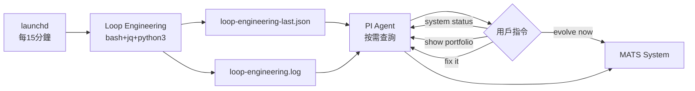

# {MATS} — Multi Agent Trading System

> **作者**: YC Wong
> **版本**: 2.0.41-dev (HL 簽名修復 + xyz DEX 資產索引偏移 + SL/TP 方向修正 + 槓桿設定 + 幽靈倉位清理 + UI 真實倉位過濾 + 價格格式 + 本地 SL 觸發修正 + Regime-aware 方向信號 + Planck-Chaos Resonance 模組 + 幽靈平倉修復 + Paper/Real 分離 + S/R-based SL/TP + Pro algo firm SL/TP + 提早平倉修復 + openedAt 同步 + on-chain dedup + HL SL/TP close detection + 最小 SL/TP 間距限制 + Stale real position cleanup + Real trade 持久化 + Consensus 方向性修正 + 學習衰減機制 + MAX_POSITION_PCT 移除 + Evolution signalThreshold 確定性強制 + Planck-Chaos 簡化)  
> **核心哲學**: 資本保存為絕對第一優先，但必須在安全前提下持續創造盈利  
> **總代碼量**: ~18,600+ 行 TypeScript（嚴格模式，零類型錯誤，`noPropertyAccessFromIndexSignature`） + React UI (pantha_mats design system)

---

## 📑 目錄

1. [概述](#概述)
2. [三層架構](#三層架構)
3. [專案結構](#專案結構)
4. [八智能體系統](#八智能體系統)
5. [HACP 高速認知協議](#hacp-高速認知協議)
6. [倉位大小自動 Clamp](#55-倉位大小自動-clamp)
7. [風險管理引擎](#風險管理引擎)
8. [Paper Trading 模擬層](#paper-trading-模擬層)
9. [LLM 抽象層](#llm-抽象層)
10. [數據管道](#數據管道)
11. [自我演化系統](#自我演化系統)
12. [P0 — 真實成本建模](#p0--真實成本建模transaction-cost-model)
13. [P0 — 執行品質追蹤](#p0--執行品質追蹤execution-tracker)
14. [P0 — 相關性風險預算](#p0--相關性風險預算correlation-budget)
15. [P0 — SNR 支撐阻力區間檢測](#p0--snr-支撐阻力區間檢測supportresistance-zones)
16. [P0 — EM 進化系統 — 雙層 Expectation-Maximization](#p0--em-進化系統expectation-maximization-for-cognitive-trading)
17. [P0 — RBC Engine (Range-Based Clustering)](#p0--rbc-enginerange-based-clustering)
18. [P0 — Trade Pattern Classifier](#p0--trade-pattern-classifier)
19. [🛡️ P0 — TP/SL 三層安全架構](#🛡️-p0--tpsl-三層安全架構v207)
20. [🧮 v2.0.10 Math Audit — 數學計算修正](#v2010-math-audit--數學計算修正)
21. [可觀測性](#可觀測性)
22. [配置與環境變數](#配置與環境變數)
23. [PI Agent 命令](#pi-agent-命令)
24. [啟動指南](#啟動指南)
25. [技術棧](#技術棧)
26. [附錄 B：已知錯誤與陷阱記錄](#附錄-b已知錯誤與陷阱記錄known-bugs--pitfalls)
27. [B.8 Per-Symbol Consensus 被 hasPosition 永遠 false 阻擋](#b8-per-symbol-consensus-被-hasposition-永遠-false-阻擋v208-修復)
28. [B.9 RBC Box Saturation — 所有 dimensions overlap → 永久 NO_EDGE](#b9-rbc-box-saturation--所有-dimensions-overlap--永久-no_edgev209-修復)
29. [B.10 Exploration 槓桿違規 — 10x 觸發 maxLeverage 硬約束](#b10-exploration-槓桿違規--10x-觸發-maxleverage-硬約束v209-修復)
30. [B.11 合成資產 S/R 檢測 — HL candleSnapshot 500 error](#b11-合成資產-sr-檢測--hl-candlesnapshot-500-errorv209-修復)
31. [B.12 參考文獻](#b12-參考文獻related-documentation)
32. [B.13 Math Audit — 13 個數學/邏輯錯誤](#b13-math-audit--13-個數學邏輯錯誤v2010-修復)
33. [B.14 LLM 超時風暴 — HL WS 重連後 Agent think() 卡死 120s](#b14-llm-超時風暴--hl-ws-重連後-agent-think-卡死-120sv2012-修復)
34. [B.15 Risk Auditor 震盪市偵測 + Regime-aware TP/SL](#b15-risk-auditor-震盪市偵測--regime-aware-tpslv2013v2014-修復)
35. [B.16 Evolution Enhancement — Directional Mutation + Agent Evolution + Regime-aware Strategy](#b16-evolution-enhancement--directional-mutation--agent-evolution--regime-aware-strategyv2015-修復)
36. [B.17 HL WS User-Level Subscriptions + Real-Trade Portfolio Sync](#b17-hl-ws-user-level-subscriptions--real-trade-portfolio-syncv2016-修復)
37. [B.18 Real-Trade 真實 Balance/Equity 顯示](#b18-real-trade-真實-balanceequity-顯示v2017-修復)
38. [B.19 Notional-Based 雙邊 Fee 扣除（槓桿感知）](#b19-notional-based-雙邊-fee-扣除槓桿感知v2018-修復)
39. [B.20 Unrealized PnL 含 entry fee + Real-trade Positions/Fills 同步 HL](#b20-unrealized-pnl-含-entry-fee--real-trade-positionsfills-同步-hlv2019-修復)
40. [B.21 TradingView TP/SL live update + Ollama concurrency + slot leak protection](#b21-tradingview-tpsl-live-update--ollama-concurrency--slot-leak-protectionv2020-修復)
41. [B.22 Market Agent chart 只顯示當前持倉 marker](#b22-market-agent-chart-只顯示當前持倉-markerv2021-修復)
42. [B.23 Fitness Breakdown — adaptability + consistency 永遠 100%](#b23-fitness-breakdown--adaptability--consistency-永遠-100v2022-修復)
43. [B.24 dailyPnl 永不重置 + Math.abs 令賺錢觸發 daily loss limit](#b24-dailypnl-永不重置--mathabs-令賺錢觸發-daily-loss-limitv2023-修復)
44. [B.25 SL/TP 平倉後 Total PnL 滯後一個 cycle](#b25-sltp-平倉後-total-pnl-滯後一個-cyclev2024-修復)
45. [B.26 SL/TP 平倉後即時學習 + 虧損冷卻期 + LLM 檢討恢復](#b26-sltp-平倉後即時學習--虧損冷卻期--llm-檢討恢復v2025v2026-修復)
46. [B.27 豐富冷卻期 LLM 檢討上下文 + Risk Auditor 改用 deepseek-v4-flash](#b27-v2027-豐富冷卻期-llm-檢討上下文--risk-auditor-改用-deepseek-v4-flash)
47. [B.28 LLM 形態標籤 + 勝率追蹤](#b28-v2028-llm-形態標籤--勝率追蹤pattern-tag-tracker)
48. [B.29 Legacy Position Management — 跨 trade mode 切換嘅持倉管理](#b29-v2029-legacy-position-management--跨-trade-mode-切換嘅持倉管理)
49. [B.30 手動平倉按鈕 + closeReason 追蹤 + Real-mode 每個 Cycle 同步](#b30-v2030-手動平倉按鈕--closereason-追蹤--real-mode-每個-cycle-同步)
50. [B.31 多 DEX 餘額同步 + 交易所倉位匯入 + getRecentFills 修復](#b31-v2031-多-dex-餘額同步--交易所倉位匯入--getrecentfills-修復)
51. [B.32 HL 簽名修復 + xyz DEX 資產索引 + SL/TP 方向 + 槓桿 + 幽靈倉位](#b32-v2032-hl-簽名修復--xyz-dex-資產索引--sltp-方向--槓桿--幽靈倉位)
52. [B.33 Regime-aware 方向信號 + Planck-Chaos Resonance 模組](#b33-v2033-regime-aware-方向信號--planck-chaos-resonance-模組)
53. [B.34 幽靈平倉修復 + Paper/Real 分離 + S/R-based SL/TP + Pro algo firm SL/TP](#b34-v2034-幽靈平倉修復--paperreal-分離--sr-based-sltp--pro-algo-firm-sltp)
54. [B.35 HL SL/TP Close Detection — 交易記錄追蹤 + ML 學習](#b35-v2035-hl-sltp-close-detection--交易記錄追蹤--ml-學習)
55. [B.36 最小 SL/TP 間距限制 — 防止過度收窄](#b36-v2036-最小-sltp-間距限制--防止過度收窄)
56. [B.37 Stale Real Position Cleanup — Paper mode 孤兒倉位清理](#b37-v2037-stale-real-position-cleanup--paper-mode-孤兒倉位清理)
57. [B.38 Real Trade 持久化 — 重啟後保留交易記錄](#b38-v2038-real-trade-持久化--重啟後保留交易記錄)
58. [B.39 Consensus 方向性修正 — Math.abs() bug](#b39-v2039-consensus-方向性修正--mathabs-bug)
59. [B.40 學習衰減機制 — Agent Outcomes + Pattern Classifier](#b40-v2040-學習衰減機制--agent-outcomes--pattern-classifier)
60. [B.41 MAX_POSITION_PCT 移除 + Evolution signalThreshold 強制 + Planck-Chaos 簡化](#b41-v2041-max_position_pct-移除--evolution-signalthreshold-強制--planck-chaos-簡化)

---

## 概述

**MATS**（Multi Agent Trading System）是一個具備自我演化能力的多智能體量化交易系統。它以 **Hyper-Accelerated Cognition Protocol (HACP)**——一種結構化多 LLM 辯論協議——為核心決策引擎，在 **Binance + Hyperliquid (9 perp DEXs)** 市場上進行機構級 Paper Trading 模擬。

### 核心設計原則

| 原則 | 說明 |
|:-----|:-----|
| **資本保存第一** | 所有決策以生存為前提，利潤為次要目標 |
| **自我演化** | 策略自動評估、淘汰、突變、進化 |
| **多智能體共識** | 7+ 智能體（含 Skeptics 跨 Agent 邏輯審查）+ 結構化辯論 |
| **風險審計否決權** | 獨立風險審計員擁有絕對否決權 |
| **優雅降級** | 任何錯誤預設 HOLD，永遠不倒 |
| **生產級標準** | 完整型別、結構化日誌、優雅關閉、指數退避重連 |

---

## 三層架構

```
┌──────────────────────────────────────────────────────────────┐
│                                                              │
│   Layer 1: 戰略層 (PI Agent + SKILL.md)                      │
│   ┌────────────────────────────────────────────────────────┐ │
│   │ • 啟動 / 停止系統                                       │ │
│   │ • 績效審查 & 參數調整                                   │ │
│   │ • 人工干預入口                                          │ │
│   │ • 長期演化方向設定                                       │ │
│   └────────────────────────────────────────────────────────┘ │
│                           │                                   │
│                           ▼                                   │
│   Layer 2: 認知層 (TypeScript + Ollama)                      │
│   ┌────────────────────────────────────────────────────────┐ │
│   │ • HACP 高速認知協議（多模型平行推理）                    │ │
│   │ • 9 智能體系統（5 sub-agents + On-Chain + News +        │ │
│   │   Risk + Skeptics）+ Meta-Agent 仲裁                    │ │
│   │ • 結構化辯論 & 加權投票共識                              │ │
│   │ • Meta-Evolution 自我演化                                │ │
│   │ • Position Reconciliation (Skeptics)                     │ │
│   │ • 僅在關鍵決策點觸發 LLM                                 │ │
│   └────────────────────────────────────────────────────────┘ │
│                           │                                   │
│                           ▼                                   │
│   Layer 3: 執行層 (TypeScript Runtime)                        │
│   ┌────────────────────────────────────────────────────────┐ │
│   │ • Binance Mainnet WebSocket 即時數據流 (24/7)           │ │
│   │ • Hyperliquid REST (9 perp DEXs, allDexsAssetCtxs)     │ │
│   │ • 風險引擎（毫秒級，無需 LLM）                           │ │
│   │ • Paper Trading 模擬引擎 (槓桿感知 P&L)                 │ │
│   │ • Real Trading Manager (exchange 下單 + 本地 mirror)    │ │
│   │ • 倉位追蹤 & 止損止盈（每個 price update 自動檢查）    │ │
│   │ • Position Reconciliation (偵測 exchange 已平倉 → 同步)│ │
│   │ • Per-Position Profit-Take（>=2 agents vote + PnL>+0.5%）│ │
│   │ • 數據管道 & 持久化                                      │ │
│   │ • 可觀測性 & 健康檢查                                    │ │
│   └────────────────────────────────────────────────────────┘ │
│                                                              │
└──────────────────────────────────────────────────────────────┘
```

---

## 專案結構

```
/Users/y.c./Downloads/amacrf/
│
├── .env                          # API Keys & 環境變數
├── package.json                  # 依賴 & 腳本
├── tsconfig.json                 # 嚴格 TypeScript 配置 (noPropertyAccessFromIndexSignature)
├── SKILL.md                      # PI Agent 操作手冊
│
├── src/
│   ├── index.ts                  # 🚀 主入口點 (~2031 行)
│   │   ├── MATSSystem 類       # 系統生命週期管理
│   │   ├── 決策循環排程          # 定時觸發 HACP 週期
│   │   ├── 價格輪詢 (REST)       # 30s 間隔，HLRateLimiter 保護
│   │   ├── Position Reconciliation # 偵測人手平倉
│   │   ├── 心跳監控              # 30s 狀態輸出
│   │   └── main() 引導函數       # 啟動 & 保持活躍
│   │
│   ├── config/
│   │   └── index.ts              # 配置管理 (113 行)
│   │       ├── Zod schema 驗證   # 所有環境變數驗證
│   │       ├── 類型安全配置對象  # 不可變 config 物件
│   │       └── 預設值 & 邊界     # 所有參數的合理預設
│   │
│   ├── types/
│   │   └── index.ts              # 領域類型定義 (~749 行, v1.9.3 AgentOutcome + Skeptics + 多交易對)
│   │       ├── MarketData        # Ticker, Kline, OrderBook
│   │       ├── Agent Types       # Identity, Thought, Status
│   │       ├── HACP Types        # Consensus, Debate, Vote
│   │       ├── Trading Types     # Order, Position, Portfolio
│   │       ├── Risk Types        # Limits, Assessment, Concerns
│   │       ├── Evolution Types   # Memory, Strategy, Fitness
│   │       ├── CycleProgress     # 即時進度追蹤
│   │       ├── PositionAdjustment # 動態 TP/SL 調整
│   │       ├── RealTradingConfig  # 真實交易引擎介面
│   │       └── RealTradingEngine  # 真實交易引擎抽象
│   │
│   ├── llm/
│   │   ├── provider.ts           # LLM 抽象介面 (57 行)
│   │   │   ├── LLMMessage        # System/User/Assistant
│   │   │   ├── LLMRequest        # 通用請求格式
│   │   │   ├── LLMResponse       # 通用響應格式
│   │   │   └── LLMProvider       # 抽象介面
│   │   │
│   │   ├── ollama-provider.ts    # Ollama 實現 (v2.0.12 — circuit breaker + slot timeout + v2.0.20 concurrency 4 + slot leak protection)
│   │   │   ├── 本地 API          # /api/chat
│   │   │   ├── 溫度模型映射      # 自動選擇最佳模型
│   │   │   ├── 超時控制          # AbortController
│   │   │   └── Token 用量追蹤    # eval_count
│   │   │
│   │   └── index.ts              # Provider 工廠 (65 行)
│   │       ├── 自動檢測          # Ollama → Error
│   │       ├── 供應商選擇        # preferred provider
│   │       └── 單例管理          # 全域 active provider
│   │
│   ├── data/
│   │   └── binance-websocket.ts  # Binance 數據管道 (~400 行)
│   │
│   ├── hyperliquid-websocket.ts # HL WebSocket (v2.0.16 — user-level subscriptions: clearinghouseState + userFills)
│   ├── multi-exchange-ws.ts    # Multi-Exchange 統一層 (NEW v2.0.0, ~250 行)
│   │       ├── BinanceWebSocketManager
│   │       │   ├── USDⓈ-M Futures WS  # fstream.binance.com
│   │       │   ├── markPrice@1s       # Perp mark price (每秒更新)
│   │       │   ├── depth20@100ms      # Top 20 order book
│   │       │   ├── 自動重連           # 指數退避 (1s → 60s)
│   │       │   ├── 回調系統           # Price + Connection + Depth
│   │       │   └── getOrderBookImbalance() # 訂單簿不平衡度
│   │       │
│   │       └── MarketStateAggregator
│   │           ├── 波動率計算         # 滑動窗口標準差
│   │           ├── 趨勢檢測           # bullish/bearish/sideways
│   │           ├── 制度分類           # 10 種市場制度
│   │           ├── 價格歷史           # 100 tick 緩衝區
│   │           └── orderBookImbalance # 即時訂單簿不平衡
│   │
│   ├── analysis/
│   │   ├── sigmoid-ga.ts         # Sigmoid·GA 情緒感知引擎 (v2.0.10 — blend weight 歸一化)
│   │   │   ├── sigmoid()         # sigmoid 函數
│   │   │   ├── computeSentiment() # 從原始訊號計算情緒分數
│   │   │   └── SigmoidGA class   # GA 演化引擎
│   │   │
│   │   ├── support-resistance.ts # P0: SNR 支撐阻力區間檢測 (v2.0.10 — recency 加權 + volume 縮放)
│   │   │   ├── getSRZones()      # 主入口：async，取 candle + 計算 zones
│   │   │   ├── detectPivots()    # rolling window pivot high/low 檢測
│   │   │   ├── clusterPivots()   # 鄰近 pivot 合併成 zone
│   │   │   ├── findRoundNumberZones() # 心理整數位檢測
│   │   │   ├── setHLFetchFn()    # 外部注入 rate-limited HL fetch
│   │   │   └── clearSRCache()    # 清除快取（測試/手動）
│   │   │
│   │   ├── sentiment-engine.ts   # 情緒引擎 (v2.0.0)
│   │   │   ├── PriceBuffer       # 20 tick 價格緩衝
│   │   │   ├── VolumeBuffer      # 10 tick 成交量緩衝
│   │   │   ├── SentimentEngine   # compute() → formatForAgentContext()
│   │   │   └── GA 整合
│   │   │
│   │   └── planck-chaos.ts        # Planck-Chaos Resonance 模組 (v2.0.33)
│   │       ├── PlanckChaosEngine  # feedPrice() → analyze()
│   │       ├── estimateLyapunov() # Lyapunov 指數 (最近鄰發散法)
│   │       ├── detectResonances() # 自相關共振頻率檢測
│   │       ├── predictAmplitudeWindows() # 擴散模型 √(2Dt) 振幅預測
│   │       ├── classifyChaosRegime() # ordered / edge_of_chaos / chaotic
│   │       └── deriveDirectionBias() # 週期相位 → 方向偏置
│   │
│   ├── agents/
│   │   ├── base-agent.ts         # 基礎 Agent 類 (~417 行, v1.9.3 多交易對決策)
│   │   ├── agents.ts             # 六個子智能體 (~1306 行, v1.9.3)
│   │   │   ├── Fractal Momentum Sentinel (multi-symbol)
│   │   │   ├── On-Chain Whisperer (multi-symbol on-chain + macro)
│   │   │   ├── RBC & Sentiment Analyst (multi-symbol + Fear & Greed + RBC)
│   │   │   ├── News Reporter (multi-symbol RSS + API)
│   │   │   ├── Independent Risk Auditor (per-position veto)
│   │   │   └── Skeptics (logic auditor, cross-references agents + track records)
│   │   ├── meta-agent.ts         # 元智能體 (80 行, v1.9.3 多交易對仲裁)
│   │   └── agent-models.ts       # Per-agent model config (126 行)
│   │
│   ├── market-agent/
│   │   └── index.ts              # Market Agent (~879 行)
│   │       ├── autoSelectTopPair # 每次 HACP 週期前自動選 pair
│   │       ├── fetchBinanceTopPairs  # /api/v3/ticker/24hr (USDT, 無穩定幣)
│   │       ├── fetchHyperliquidTopPairs # allPerpMetas + perpCategories + metaAndAssetCtxs (DEX 0) + candleSnapshot (DEX 1-8)
│   │       │   ├── DEX 0 (230 crypto perps): dayNtlVlm = USD notional volume
│   │       │   ├── DEX 1-8 (186 assets): candleSnapshot v × price = USD notional
│   │       │   ├── Background scan: 20 tokens/200ms rate limiter, 5 concurrent
│   │       │   ├── 5m volume: top 5 pairs via candleSnapshot 5m interval
│   │       │   ├── candleSnapshot requires FULL coin name (e.g. "xyz:META" not "META")
│   │       │   └── HL API is case-sensitive — preserve original case for colon-prefixed symbols
│   │       ├── filterHyperliquidPairs # perpCategories 分類過濾 (crypto/indices/stocks/commodities/FX)
│   │       ├── fetchPriceForSymbol # Binance REST / HL metaAndAssetCtxs / l2Book + candleSnapshot
│   │       ├── setExchange/setTradeMode/setHyperliquidAssetType
│   │       ├── getLastFetchTime       # 供 SystemGuard 數據新鮮度檢查
│   │       └── getMarketDescription # 注入 Agent 上下文
│   │
│   ├── system-guard/
│   │   ├── types.ts              # GuardResult, GuardReport, GuardParams
│   │   └── index.ts              # SystemGuard (~497 行) — 5 層系統級保護
│   │       ├── Guard A: Economic Calendar (FOMC/NFP 黑名單)
│   │       ├── Guard B: Drawdown Circuit Breaker (5/7/10/15% 閾值)
│   │       ├── Guard C: Data Freshness Scoring (WS+REST 滯後偵測)
│   │       ├── Guard D: Agent Track Record (session 勝率 <30% 預警)
│   │       └── Guard E: Liquidity Check (order book depth vs 倉位大小)
│   │
│   ├── cognition/
│   │   └── hacp.ts               # HACP 認知協議 (v2.0.12 — deadline race + tiered timeout)
│   │       ├── Phase 1-5         # 平行思考 → Skeptics審查 → Meta仲裁 → 辯論 → 共識 → 否決 → 倉位調整
│   │       ├── Phase 1.5         # Skeptics 邏輯審查 (跨 Agent 交叉對比)
│   │       ├── Phase 1.75        # Meta-Agent 在 Skeptics 之後思考 (接收審查結果)
│   │       ├── Progress callback # 即時進度推送
│   │       └── adjustPositions() # Meta-Agent 動態 TP/SL 調整
│   │
│   ├── risk/
│   │   ├── engine.ts             # 風險管理引擎 (201 行)
│   │   └── correlation-budget.ts # P0: 相關性風險預算 (v2.0.10 — equity-based budget, 150% threshold)
│   │       ├── 交易評估          # 6 種風險關注點
│   │       ├── 倉位計算          # 波動率調整固定比例
│   │       ├── 止損驗證          # 多空方向驗證
│   │       ├── 風險評分          # 0-1 綜合評分
│   │       └── 倉位調整          # 自動減倉建議
│   │
│   ├── trading/
│   │   ├── cost-model.ts         # P0: HL 交易成本模型 (taker fee 0.04%, funding rate)
│   │   ├── execution-tracker.ts  # P0: 執行品質追蹤 (slippage, fees)
│   │   ├── portfolio.ts          # 投資組合追蹤 (~548 行, v1.9.4)
│   │   │   ├── 餘額 & 權益       # balance + unrealized PnL (槓桿感知)
│   │   │   ├── 倉位管理          # 開倉/更新/平倉 (槓桿放大 P&L)
│   │   │   ├── 回撤追蹤          # 峰值權益 vs 當前權益
│   │   │   ├── 止損止盈          # 自動觸發檢查
│   │   │   ├── 日虧損限制        # 每日重置
│   │   │   ├── recalculateEquity() # equity = balance + unrealizedPnl + lockedMargin
│   │   │   ├── softUpdatePosition() # 不觸發 SL/TP 的價格更新（用於 exchange sync）
│   │   │   ├── reconcilePositions() # 比對外部持倉，自動清理已平倉但本地未同步的 mirror
│   │   │   └── adjustPosition()  # Meta-Agent 動態 TP/SL 調整
│   │   │
│   │   ├── paper-engine.ts       # Paper Trading 引擎 (~300 行, v1.9.4)
│   │   │   ├── 訂單生命週期      # pending → filled/rejected
│   │   │   ├── 成交模擬          # 市價單即時成交（槓桿傳遞至 portfolio）
│   │   │   ├── 風險閘門          # 交易前風險檢查（含 cumulative margin 20% 限制，基於 margin 而非 notional）
│   │   │   ├── 倉位調整          # 風險評估後自動調倉
│   │   │   └── 投資組合摘要      # 格式化輸出
│   │   │
│   │   ├── decision-utils.ts     # 決策正規化 (v1.9.4)
│   │   │   ├── normalizeDecision() # 保留 leverage 欄位 (clamp 1-10x)
│   │   │   ├── normalizePerSymbolDecision() # 保留每個 symbol 的 leverage
│   │   │   └── MAX_POSITION_PCT = 0.20
│   │   │
│   │   ├── real-trading-manager.ts # 真實交易管理器 (v2.0.16 — post-trade sync + SL/TP renew)
│   │   │   ├── executeDecision()  # 下單到 exchange + mirror 到 paper engine
│   │   │   ├── syncExchangePositions() # 定期同步 exchange 持倉到本地
│   │   │   ├── getOpenPositionSymbols() # 取得 exchange 上真正 open 的 symbols
│   │   │   └── getBalance()/getPositions()/getMarkPrice() # exchange API 封裝
│   │   │
│   │   ├── binance-real-engine.ts # Binance 真實交易引擎 (位置風險 API)
│   │   ├── hyperliquid-real-engine.ts # Hyperliquid 真實交易引擎 (~730 行, clearinghouse API, EIP-712 secp256k1 signing)
│   │   │   ├── @noble/curves/secp256k1.js import (需加 .js 副檔名)
│   │   │   ├── @noble/hashes/sha3.js (同上，moduleResolution: bundler)
│   │   │   ├── secp256k1.sign() type cast (runtime Signature object vs TS Uint8Array)
│   │   │   ├── getBalance() returns ExchangeAccountInfo {free, locked, total, unrealizedPnl, marginUsed}
│   │   │   └── 全部 index signature 使用 bracket notation (o['a'], not o.a)
│   │   └── portfolio.ts          # (合併如上)
│   │
│   ├── evolution/
│   │   ├── cycle-summary.ts     # 🧬 第一層 EM — Cycle Summary Chain (v2.0.2)
│   │   ├── rbc-clustering.ts   # 🧬 RBC Engine — Range-Based Clustering (v2.0.11, 8 dims, 分層衰減 + 時間加權 centroid)
│   │   │   ├── RBCEngine class       # Growing hyperrectangles per symbol
│   │   │   ├── feedTrade()           # Expand win/loss boxes (never contract)
│   │   │   ├── query()               # Edge score → favorable/unfavorable/no_edge
│   │   │   ├── getAllModelStats()    # Per-symbol discriminative dims
│   │   │   ├── getDimDetails()       # Per-dimension ranges for UI visualizer
│   │   │   ├── getPendingStats()     # Samples needed before query
│   │   │   ├── formatForAgentContext() # → agent context injection
│   │   │   └── save()/load()         # Persistence (atomic write)
│   │   │
│   │   ├── trade-pattern-classifier.ts # 🧬 Trade Pattern Classifier (v2.0.5 — FR Acceleration + Wilson Score)
│   │   │   ├── snapshotContext()       # Trade open → 記錄 entry context
│   │   │   ├── backfillOutcome()       # Trade close → 補上 exit context
│   │   │   ├── queryEntry()            # 冇持倉 → 查 entry pattern win rate
│   │   │   ├── queryPosition()         # 有持倉 → 查 transition win rate
│   │   │   ├── formatEntryContext()    # → agent context injection
│   │   │   └── formatPositionContext() # → agent context injection
│   │   │
│   │   ├── agent-outcomes.ts     # 🧬 Per-Agent Outcome Tracking (v1.9.3)
│   │   │   ├── 記錄每個 Agent 對每個 Symbol 的 recommendation
│   │   │   ├── 平倉時 backfill win/loss outcome
│   │   │   ├── getContextSummary() → Agent context 注入 track record
│   │   │   ├── getAgentPerformance() → Agent+Symbol+Regime 效能查詢
│   │   │   └── getAllAgentWinRates() → SystemGuard Agent Track 輸入
│   │   │
│   │   ├── agent-evolution.ts    # 🧬 Agent Evolution Engine (v2.0.15) — 動態投票權重
│   │   │   ├── registerBaseWeight() → 註冊 agent 硬編碼 base weight
│   │   │   ├── getDynamicWeight(role, regime) → regime-aware 動態權重
│   │   │   ├── updateWeights(regime) → 根據 win rate + EMA 更新 multiplier
│   │   │   └── getWeightSummary() → API/UI 權重摘要
│   │   │
│   │   ├── index.ts              # 演化系統 (v2.0.15 — directional mutation + regime-aware strategy)
│   │   │   ├── AgentOutcomeTracker 整合
│   │   │   ├── AgentEvolutionEngine 整合 (v2.0.15 動態權重)
│   │   │   ├── getContextForAgent() 輸出 per-agent 歷史 track record
│   │   │   ├── DualMemory (short/long term with consolidation)
│   │   │   ├── SurvivalFitnessCalculator (capital preservation 35%, store breakdown)
│   │   │   ├── EvolutionaryPressureEngine (directional mutate v2.0.15, auto-retire <0.2, getBestStrategyForRegime)
│   │   │   └── EvolutionOrchestrator (整合 + persistState)
│   │   │
│   │   ├── trade-history.ts       # 📊 Trade History Ledger (v1.9.4)
│   │   │   ├── Append-only ledger  # 每個 cycle 記錄一條 entry
│   │   │   ├── updateLastExit()    # 修改上一個 cycle 的 exit (非自己!)
│   │   │   ├── 模擬 PnL 計算       # HOLD 時自動模擬買/賣結果
│   │   │   ├── computePerformance() # 使用 realisedPnl 優先, simulatedPnl 備用
│   │   │   └── getSummary()        # Agent 可參考的近期表現摘要
│   │   │
│   │   └── persistence.ts         # 💾 永續儲存層 (~561 行, v2.0.1 lockedWrite)
│   │       ├── saveEvolution()     # TradeHistory + Memory + Strategies
│   │       ├── loadEvolution()     # 啟動時自動恢復
│   │       ├── savePortfolio()     # Balance + Equity + Positions
│   │       ├── loadPortfolio()     # 啟動時自動恢復
│   │       ├── saveDebateHistory() # Consensus + DebateRounds + Thoughts
│   │       └── loadDebateHistory() # 啟動時自動恢復
│   │
│   ├── backtest/
│   │   └── index.ts               # 📜 歷史回測引擎 (v2.0.10 — annualized regime slope + 命名修正)
│   │       ├── fetchHistoricalData() # Binance klines API
│   │       ├── detectRegime()        # 規則型制度檢測 (interval-aware)
│   │       ├── 真 HACP 決策          # 使用獨立 HACPEngine + 5 agents
│   │       ├── 每步 HACP 即時演化    # 每個 HACP run 後 mutate strategy
│   │       ├── 暫停/繼續/停止        # pause() / resume() / stop()
│   │       ├── 逆向回測              # reverse mode (newest → oldest)
│   │       ├── 1yr/5m 支援           # 最短 1yr, 最細 5m interval
│   │       ├── 機構級指標計算        # Sharpe/Sortino/Calmar from equity curve
│   │       └── getBacktestSummary()  # Agent 上下文注入
│   │
│   ├── observability/
│   │   └── logger.ts             # 結構化日誌 (78 行)
│   │       ├── Winston 整合      # 控制台 + 文件
│   │       ├── 上下文注入        # agent, phase, symbol
│   │       ├── 開發格式          # 彩色人類可讀
│   │       ├── 生產格式          # JSON 機器可讀
│   │       └── 文件輪轉          # 10MB/50MB 限制
│
├── data/
│   └── evolution/                # 💾 永續儲存目錄 (NEW)
│       ├── evolution-state.json   # TradeHistory + Memory + Strategies
│       ├── portfolio-state.json   # Balance + Equity + Positions
│       └── debate-history.json    # Consensus + DebateRounds
│
├── scripts/
│   ├── loop-engineering.sh       # 每 15 分鐘自我維護掃描 (bash + jq + python3, 零 LLM 成本)
│   ├── loop-engineering-deep.sh  # 深度交易系統分析 (bash + jq, 被 loop-engineering.sh 調用)
│   ├── loop-engineering-memory.md # 📖 永續記憶 (已知錯誤 + 常見陷阱 + checklist)
│   ├── backfill-patterns.mjs       # 🛠 一次性工具: import 歷史 portfolio trades → pattern DB
│   └── backfill-patterns.mjs     # 一次性工具: 將 portfolio-state.json 嘅 meaningful trades import 入 pattern DB
│
├── logs/                         # 運行日誌 + loop-engineering.log（auto rotate @ 5MB）
│
└── tests/                        # 測試目錄（預留）
```

---

## 八智能體系統

### Agent 角色矩陣

| # | Agent | 溫度 | 權重 | 槓桿 | 角色描述 |
|:-:|:------|:----:|:----:|:----:|:---------|
| 1 | **Market Agent** | — | — | — | 自動從 Binance/Hyperliquid 選取最高 24h 交易量 pair。支援 9 個 Hyperliquid DEX，416 個資產，按類別過濾（Indices/Stocks/Commodities/FX）。HACP 週期前執行，阻塞其餘 Agent 直到選定。|
| 2 | **Fractal Momentum Sentinel** | 0.85 | 0.25 | 2-5x | 碎形數學家轉量化交易員。多時間框架自相似模式檢測。趨勢加速早期信號。極端逆向，中間趨勢追隨。 |
| 3 | **On-Chain Whisperer** | 0.50 | 0.25 | 2-4x | 類別感知鏈上分析師 (v1.9.3, multi-symbol)。Crypto 資產: BTC mempool(算力/手續費), ETH CoinGecko, 所有代幣 CoinGecko 交易所流量/供應量。TradFi 資產: DXY代理, FX匯率, 商品現貨, COT持倉, 網絡搜索回退。未知代幣自動搜索區塊鏈資源管理器。5分鐘緩存。每個 cycle 為所有持倉一次性 fetch on-chain 數據。|
| 4 | **RBC & Sentiment Analyst** | 0.25 | 0.25 | 2-8x | RBC (Range-Based Clustering) 專家 + **恐慌指數 (F&G)**。RBC 係 growing hyperrectangle 從價格行為學習 win/loss 範圍。🟢 FAVORABLE → 增加信心。🔴 UNFAVORABLE → 強烈反對入場。0-25 Extreme Fear→BEARISH, 75-100 Extreme Greed→BULLISH。每個持倉獨立評估。|
| 5 | **News Reporter** | 0.40 | 0.20 | 1-3x | 多源類別感知新聞分析師 (v1.9.3, multi-symbol)。Crypto: NewsData.io + CoinDesk RSS + The Block RSS + Google News (監管+宏觀+地緣政治)。TradFi: NewsData.io + Google News RSS (宏觀→世界→行業) + CNBC RSS + Bing RSS。5層回退鏈。每個 cycle 為所有持倉一次性 fetch 新聞。無新聞時自動NEUTRAL。|
| 6 | **Independent Risk Auditor** | 0.10 | 0.25 | — | 🚨 **最終守門人。絕對否決權。** 逐倉風險審計 (v1.9.3)。每個持倉獨立評估風險，可個別建議平倉。🆕 v2.0.13: 近期 10 個 trade 模式分析，偵測震盪市並動態調整 TP/SL。|
| 7 | **Skeptics** | 0.30 | 0.00 | — | 🤔 **邏輯審計員 (v1.9.3)。** Phase 1.5 執行，在 Meta-Agent 思考前質疑 5 個 sub-agent 的決策。檢查數據一致性、跨 Agent 交叉對比、**參考每個 Agent 的歷史 track record (AgentOutcomeTracker)**。有無計算遺漏。default 模型: deepseek-v4-flash:cloud。不干預 Meta-Agent 和 Market Agent。|
| 8 | **Meta-Agent** | 0.45 | 0.35 | 2-10x | 戰略協調者。HACP 辯論主席。**在 Skeptics 審查後思考**，接收審查結果。根據風險/信心設定槓桿，動態調整 TP/SL。 |

### Agent System Prompt 強化（v2.0.2）

所有 sub-agent 的 system prompt 已加入兩個新 section：

**`=== PATTERN DATA ===`**
- 如果 context 包含 `=== TRADE PATTERN INSIGHTS ===` 或 `=== POSITION PATTERN INSIGHTS ===`，agents 必須優先參考歷史 win rate
- Pattern data 高於 first-principles reasoning
- 例如：*"Low_vol sideways entries have 13% win rate → strong bias against HOLD"*

**`=== CONCISE REASONING ===`**
- 用 round number（`~1.5% range` 而非 `1.52% 24h band`）
- 每個 assessment 最多 3 句
- 如果 unanimous HOLD expected → 直接 short HOLD

| Agent | Prompt 強化重點 |
|:------|:----------------|
| Fractal Momentum | 「Use historical win rate as PRIMARY reference」 |
| On-Chain Whisperer | 「Do NOT override clear historical data with speculative reasoning」 |
| RBC & Sentiment Analyst | 「RBC is PRIMARY factor; Fear & Greed confirms/denies」 |
| News Reporter | 「News is TACTICAL; pattern data is STRATEGIC」 |
| Meta-Agent | 「Pattern data is MOST IMPORTANT signal — override sub-agents」 |

### Agent 思考輸出範例（強化後）

```
Fractal Momentum Sentinel
72%
ASSESS: Range ~$65K-$66K compression, no fractal break → HOLD.
Pattern: Low_vol sideways entries 13% win rate historically.

On-Chain Whisperer
55%
ASSESS: Fees 2/1/1, flows balanced, no whale divergence → HOLD.
Pattern: Balanced flows in low_vol → 80% continuation, no edge.

→ 2/2 HOLD unanimous → skip attack/synthesis → direct consensus ✅
```

### Agent 否決條件（Risk Auditor）

Risk Auditor 專注於**災難性風險預防**，不再審查倉位大小和槓桿（由 Market Agent UI slider 控制）：

| 條件 | 說明 |
|:-----|:-----|
| 冇 set Stop Loss | 裸倉 = 災難性風險 |
| 制度 = 混沌 | 市場處於不可預測狀態 |
| 冇可用價格數據 | 無法估值，唔可以交易 |
| 單一持倉 unrealized loss > 5% | 虧損過大，強制平倉 |
| 回撤 > 15% | 平所有倉位 |
| 日虧損 > 4% | 停止當日交易 |
| 倉位 > 20% | 超過絕對硬上限（`MAX_POSITION_PCT`，與 `normalizeDecision()` 一致） |

**唔再審查：**
- 倉位大小（由 Market Agent 控制）
- 槓桿倍數（由 Market Agent 控制）
- 止損虧損 > 2%（由 Market Agent 決定風險承受度）

### 🆕 v2.0.13–v2.0.14: Risk Auditor 近期交易模式分析（震盪市偵測 + Regime-aware TP/SL）

**問題**: Risk Auditor 之前只睇當前 decision + 持倉狀態，唔知最近 10 個 trade 嘅方向 + 盈虧。震盪市（whipsaw）時系統會瘋狂買上買落，每個都俾止損打出去，但 Risk Auditor 冇察覺呢個 pattern，繼續批准新入場 → 持續蝕錢。

**解決方案**: `TradeHistory.getRecentTradeAnalysis(10)` 分析最近 10 個 trade，注入 Risk Auditor + Meta-Agent 嘅 context：

```
=== RECENT TRADE PATTERN (last 10) ===
Directional trades: 7 | Wins: 2 | Losses: 5 | Win rate: 29%
Net PnL: -3.42% | Avg win: +0.85% | Avg loss: -0.91%
Direction reversals: 5 (83% reversal rate) | Current loss streak: 3
⚠️ CHOPPY/WHIPSAW MARKET DETECTED: frequent buy→sell→buy reversals with net losses.
  → Trend-following entries are getting stopped out repeatedly. Consider:
  1. AVOIDING new entries until direction stabilises (HOLD)
  2. NARROWING TP/SL to range edges + REDUCING position size
  3. If entry is unavoidable, use mean-reversion (fade at S/R extremes)
```

**震盪市偵測 heuristic**:
- `directionalTrades ≥ 3` + `reversalRate ≥ 50%` + `netPnl < 0` + `losses ≥ 2` → `isChoppy = true`
- `reversalRate` = 連續方向性 trade 之間嘅方向反轉次數 / (directionalTrades - 1)

**🆕 v2.0.14 Regime-aware TP/SL 策略**（修正 v2.0.13 嘅錯誤策略）:

> **v2.0.13 錯誤**: 震盪市加闊 TP/SL（SL 2%→3-4%, TP 5%→6-8%）——呢個會增加單筆風險，而且震盪市價格唔會行得遠，加闊 TP 永遠唔觸發。
> **v2.0.14 修正**: 採用機構級做法（ATR/range-based，參考 Investopedia Chandelier Exit + Range-Bound Trading）——震盪市**收窄** TP/SL 到 range 邊界 + **減細**倉位；趨勢市先**加闊** TP 讓利潤奔跑。

| 偵測到 | 新入場 | 現有持倉 TP/SL | 倉位大小 |
|:-------|:-------|:--------------|:---------|
| ⚠️ Choppy | 強烈考慮 VETO（除非 mean-reversion 依據） | **收窄** TP 到 range 對面邊（mean-reversion target），**收窄** SL 到 range 外側（突破即止損） | **硬編碼 50% cut**（HACP 自動應用，唔靠 LLM）；loss streak ≥3 可再減到 25% |
| ✅ Trending (win ≥ 60%) | 批准符合近期贏面方向 | **加闊** TP 讓利潤奔跑，用 ATR-based SL 避免過早止損 | 唔使減 |
| 🟡 Mixed / 數據不足 | 正常謹慎 | 標準 per-position risk rules | 唔使調整 |

**點解震盪市收窄而唔係加闊**（機構級邏輯）:
1. **收窄 TP**: 震盪市價格喺 range 內來回，TP 應該設喺 range 嘅另一邊（mean-reversion target），加闊 TP 只會令 TP 永遠唔觸發
2. **收窄 SL**: SL 放喺 range 邊界外側——如果價格突破 range，即係 regime 轉變，應該即時止損而唔係俾更大虧損
3. **硬編碼 50% 倉位 cut**: 震盪市勝率低，固定減半倉位降低每筆虧損。呢個係 HACP 硬編碼規則（唔靠 LLM 自由決定），確保每次偵測到 choppy 都一定減半。Paper engine 會將最終 notional floor 到 Hyperliquid $10 最少下注金額，所以 50% cut 永遠唔會產生唔可以交易嘅微細單。

**TP/SL/Size 調整流程**:
1. HACP `riskAuditorAudit` 硬編碼：如果 `analysis.isChoppy` → `positionSizePct × 0.5`（除非 LLM 建議更細）
2. Risk Auditor LLM 返回 `adjustedStopLossPct` / `adjustedTakeProfitPct` / `adjustedPositionSizePct`（可再減，但唔可以超過硬上限）
3. HACP 接收並寫入 `finalConsensus.decision.stopLossPct` / `takeProfitPct` / `positionSizePct`
4. `positionSizePct` clamp 到 `[0, MAX_POSITION_PCT]`
5. Paper engine `executeOrder` 將 notional floor 到 `HL_MIN_NOTIONAL_USD = 10`（Hyperliquid 最少下注金額）
6. 執行層用新 SL/TP/size 開倉

**Meta-Agent position adjustment 都 regime-aware**:
- `adjustPositions()` 注入 `getRecentTradeAnalysis(10).summary`
- 震盪市: 收窄 TP 到 range 對面邊，收窄 SL 到 range 外側
- 趨勢市: 加闊 TP 讓利潤奔跑，用 ATR-based SL

**整合點**:
- `index.ts`: `hacpEngine.setTradeHistory(this.evolution.tradeHistory)` 注入
- `hacp.ts` `riskAuditorAudit`: 注入 analysis + 接收 `adjustedStopLossPct`/`adjustedTakeProfitPct`/`adjustedPositionSizePct`
- `hacp.ts` `adjustPositions`: Meta-Agent position adjustment 注入 analysis + regime-aware 指引
- `agents.ts` `IndependentRiskAuditor.getSystemPrompt()`: 教導 regime-aware 策略 + TP/SL/size 調整輸出格式

---

### 🆕 Multi-Symbol 架構 (v2.0.6 — Per-Symbol Consensus)

每個 Agent 在單一 HACP cycle 中同時評估 **所有交易對**：

```
輸入: 市場上下文 + Sigmoid·GA 情緒分數 + 投資組合摘要 + 持倉列表
                                            │
                    ┌───────────────────────┴───────────────────────┐
                    │               每個 Agent 輸出:                  │
                    │         MultiSymbolDecision                    │
                    └───────────────────────┬───────────────────────┘
                                            │
          ┌─────────────────────────────────┼─────────────────────────────────┐
          │                                 │                                 │
          ▼                                 ▼                                 ▼
┌───────────────────┐       ┌─────────────────────────┐       ┌─────────────────────┐
│   marketTicker    │       │   positions[0]           │       │   positions[N]       │
│   (當前選中 ticker)│       │   (持倉 #1)              │       │   (持倉 #N)          │
├───────────────────┤       ├─────────────────────────┤       ├─────────────────────┤
│ action: buy/sell  │       │ action: hold/close       │       │ action: hold/close   │
│   /hold           │       │ closePosition: bool      │       │ closePosition: bool  │
│ positionSizePct   │       │ closeUrgency             │       │ closeUrgency         │
│ leverage          │       │ suggestedStopLoss        │       │ suggestedStopLoss    │
│ rationale         │       │ suggestedTakeProfit      │       │ suggestedTakeProfit  │
└───────────────────┘       │ rationale                │       │ rationale            │
                            └─────────────────────────┘       └─────────────────────┘
                                            │
                                            ▼
                              ┌─────────────────────────┐
                              │  HACP buildConsensus()   │
                              │  🆕 v2.0.6               │
                              │                          │
                              │  從每個 agent 嘅          │
                              │  multiSymbolDecision      │
                              │  提取 per-symbol 決定     │
                              │  跨 agent 計算 majority   │
                              └────────────┬────────────┘
                                            │
                                            ▼
                              ┌─────────────────────────┐
                              │  ConsensusResult         │
                              │  ├─ decision (market)    │
                              │  └─ perSymbolConsensus[] │
                              │     ├─ { symbol: spcx,   │
                              │     │   action: buy,     │
                              │     │   hasPosition: false│ ← ⚠️ ALWAYS false
                              │     ├─ { symbol: btc,    │
                              │     │   action: close,   │
                              │     │   hasPosition: false│ ← ⚠️ ALWAYS false
                              │     │   closePosition: true}│
                              │     └─ ...               │
                              │                          │
                              │  🐛 FIX v2.0.8:          │
                              │  index.ts 唔再 check     │
                              │  psc.hasPosition，改為   │
                              │  portfolio.getPosition() │
                              └─────────────────────────┘
```

#### Agent 決策範圍

| Agent | 市場 Ticker | 持倉 #1 (BTCUSDT) | 持倉 #2 (xyz:GOLD) | 持倉 #N |
|:------|:-----------:|:-----------------:|:------------------:|:-------:|
| Fractal Momentum | 碎形趨勢判斷 | SL/TP調整/平倉 | SL/TP調整/平倉 | ... |
| On-Chain Whisperer | 鏈上/宏觀判斷 | 持倉方向驗證 | 持倉方向驗證 | ... |
| RBC & Sentiment Analyst | 制度+FnG判斷 | 制度驗證持倉 | 制度驗證持倉 | ... |
| News Reporter | 新聞情緒判斷 | 新聞驗證持倉 | 新聞驗證持倉 | ... |
| Risk Auditor | 風險否決 | 逐倉風險審計 | 逐倉風險審計 | ... |
| **Skeptics** | **邏輯審計 (Phase 1.5)** | **跨 Agent 交叉對比** | **跨 Agent 交叉對比** | **...** |
| **Meta-Agent** | **最終仲裁 (Phase 1.75)** | **逐倉仲裁** | **逐倉仲裁** | **...** |

### 🟢 On-Chain Whisperer — 類別感知數據管道 (v1.9.2, multi-symbol)

```
資產符號 + 市場上下文
    │
    ▼
┌──────────────────────────────────────────────────────┐
│ detectAssetCategory()                                 │
│ • KNOWN_CRYPTO 映射表 (BTC, ETH, SOL, XRP, ADA ...) │
│ • 冒號前綴檢測 (xyz: → TradFi, flx: → TradFi)      │
│ • 市場上下文 "Asset Filter:" 字串                    │
│ • 已知 TradFi 符號啟發式 (SP500, NVDA, XAU, EUR...) │
└──────────────────┬───────────────────────────────────┘
                   │
        ┌──────────┴──────────┐
        ▼                      ▼
  ┌─────────────┐     ┌──────────────────┐
  │   CRYPTO    │     │ TradFi (Indices/  │
  │             │     │ Stocks/Commodities│
  │             │     │ /FX/preIPO)       │
  └──────┬──────┘     └────────┬─────────┘
         │                     │
         ▼                     ▼
┌─────────────────┐  ┌────────────────────────┐
│ BTC: mempool    │  │ Indices: DXY proxy     │
│   • /hashrate   │  │   (inverse EUR/USD)    │
│   • /block      │  │   + web search COT     │
│   • /fees       │  │                        │
│                 │  │ Stocks: web search     │
│ ETH: CoinGecko  │  │   ETF flows & inst.   │
│   • price/vol   │  │                        │
│   • mcap/supply │  │ Commodities:          │
│                 │  │   CoinGecko XAU/XAG    │
│ ALL crypto:     │  │   + web search oil     │
│ CoinGecko       │  │                        │
│   • exchange    │  │ FX: exchangerate-api   │
│     flow proxy  │  │   12 major pairs       │
│   • ATH/supply  │  │                        │
│   • CEX tickers │  │ preIPO: web search     │
│                 │  │                        │
│ Unknown token:  │  │ Fallback: web search   │
│ web search 🔍   │  │   (DDG HTML)           │
└─────────────────┘  └────────────────────────┘
         │                     │
         └──────────┬──────────┘
                    ▼
         ┌──────────────────┐
         │ 5-min cache      │
         │ key: symbol│cat  │
         └──────────────────┘
```

#### 已驗證數據來源

| 類別 | 來源 | 端點 | 狀態 |
|:-----|:-----|:------|:----:|
| **BTC** | mempool.space | `/api/v1/mining/hashrate/1w` (922 EH/s) ✅ | ✅ |
| | | `/api/blocks/tip/height` (952,059) ✅ | |
| | | `/api/v1/fees/recommended` (fast=1 sat/vB) ✅ | |
| **ETH** | CoinGecko | `coins/ethereum` ($1,984, $17B vol) ✅ | ✅ 取代死掉的 Etherscan free tier |
| **SOL/XRP/ALL** | CoinGecko | `coins/{id}?tickers=true` (100+ tickers) ✅ | ✅ |
| **DXY Proxy** | exchangerate-api | `/v4/latest/USD` (EUR inverse, 1.1628) ✅ | ✅ |
| **FX Rates** | exchangerate-api | 12 主要貨幣對 ✅ | ✅ |
| **Gold/Silver** | CoinGecko | `the-gold-token`, `silver-token` ✅ + web search fallback | ✅ 取代死掉的 metals.live |
| **未知代幣** | DuckDuckGo HTML | `html.duckduckgo.com/html/` + User-Agent | ✅ 10 筆結果 |
| **Web Search** | Google News RSS | `news.google.com/rss/search?q=...` | ✅ 最終回退 |

---

### 📰 News Reporter — 多源新聞策略 (v1.9.2, multi-symbol)

```
資產符號 + 市場上下文
    │
    ▼
┌──────────────────────────────────────────────────────┐
│ detectNewsCategory()                                  │
│ • 冒號前綴 + 資產過濾器上下文 + 已知符號列表          │
│ • 分類: crypto / tradfi_indices / stocks /            │
│         commodities / fx / other / unknown            │
└──────────────────┬───────────────────────────────────┘
                   │
        ┌──────────┴──────────┐
        ▼                      ▼
  ┌─────────────┐     ┌──────────────────┐
  │   CRYPTO    │     │     TRADFI       │
  └──────┬──────┘     └────────┬─────────┘
         │                     │
         ▼                     ▼
┌──────────────────┐  ┌────────────────────────────┐
│ TIER 0: API      │  │ TIER 0: NewsData.io API    │
│ NewsData.io      │  │ ① ticker-specific query    │
│ /api/1/crypto   │  │ ② category-level query      │
│         │        │  │ ③ no-keyword catch-all      │
│         ▼        │  │              │              │
│ TIER 1: RSS     │  │              ▼              │
│ CoinDesk RSS  ✅│  │ TIER 1: Google News RSS     │
│ The Block RSS ✅│  │ (100+ 篇文章/查詢)           │
│         │        │  │ ① 宏觀: Fed/CPI/GDP/利率   │
│         ▼        │  │ ② 世界: 關稅/地緣政治/風險 │
│ TIER 2: Google  │  │ ③ 行業: 科技AI/能源/醫療   │
│ News RSS        │  │              │              │
│ ① 監管/政治    │  │              ▼              │
│ ② 宏觀經濟    │  │ TIER 2: RSS supplements      │
│ ③ 地緣政治    │  │ CNBC RSS ✅                  │
│         │        │  │ Bing News RSS ✅            │
│         ▼        │  │              │              │
│ TIER 3: 搜索    │  │              ▼              │
│ web_search 🔍   │  │ TIER 3: 搜索回退            │
│         │        │  │ web_search (DDG HTML +     │
│         ▼        │  │  Google News RSS fallback)  │
│ ⚠️ 無新聞?     │  │              │              │
│ → NEUTRAL/HOLD  │  │              ▼              │
│   confidence 0.1 │  │ ⚠️ 無新聞? → NEUTRAL/HOLD  │
└──────────────────┘  └────────────────────────────┘
```

#### 新聞來源矩陣

| 來源 | 類型 | API Key | Crypto | TradFi | 穩定性 |
|:-----|:-----|:-------:|:------:|:------:|:------:|
| NewsData.io `/api/1/crypto` | REST | ✅ | ✅ (10 篇) | ❌ | ✅ |
| NewsData.io `/api/1/news` | REST | ✅ | ❌ | ✅ (3+ 篇) | ✅ |
| Google News RSS | RSS/XML | 免鑰匙 | ✅ (100+ 篇) | ✅ (100+ 篇) | ✅ |
| CNBC RSS | RSS/XML | 免鑰匙 | ❌ | ✅ (4 篇) | ✅ |
| CoinDesk RSS | RSS/XML | 免鑰匙 | ✅ (3+ 篇) | ❌ | ✅ |
| The Block RSS | RSS/XML | 免鑰匙 | ✅ (4 篇) | ❌ | ✅ |
| Bing News RSS | RSS/XML | 免鑰匙 | ✅ | ✅ (13 篇) | ✅ |
| DDG HTML Search | HTML scrape | 免鑰匙 | ✅ (10 結果) | ✅ | ✅ (with UA) |

#### 每類別查詢策略

| 類別 | 宏觀查詢 | 世界查詢 | 行業查詢 |
|:-----|:---------|:---------|:---------|
| **Crypto** | 利率/通脹/貨幣政策 | SEC監管/ETF/地緣政治 | DeFi/L2/挖礦 |
| **Indices** | Fed利率/FOMC/CPI/NFP | 關稅/中美/能源 | 科技AI/能源/金融/醫療 |
| **Stocks** | 利率/經濟數據/行業輪動 | 貿易政策/風險情緒 | 科技AI/零售/工業 |
| **Commodities** | 美元指數/利率/供應鏈 | OPEC/關稅/天氣 | 貴金屬/能源轉型/工業金屬 |
| **FX** | Fed/ECB/BOJ利差/通脹 | 避險/貿易順差/去美元化 | EURUSD/JPY/GBP |
| **Other** | 全球市場/經濟展望 | 地緣政治/貿易政策 | 跨資產關聯 |

#### 無新聞處理

```
所有來源返回空或不可用
    → Agent 收到 "[No News] No X news found."
    → AI 被指示: 保持 NEUTRAL, confidence 0.1-0.3
    → 絕不憑空創造信號
```

---

## 🔗 A2A 協議 — Agent 間通信

### 目標

傳統 Agent 辯論使用完整句子，造成 Token 浪費。**A2A (Agent-to-Agent) 協議** 使用精簡的**關鍵字 + 形容詞 + 數據**格式，將 Token 使用量減少 **60-70%**，同時保持語義清晰。

### 核心概念

| 格式 | 用途 | 例子 | Tokens |
|:-----|:-----|:-----|:------:|
| `OBS:` | 觀察信號 | `OBS: HMM_TRANSITION P=0.76, ARCH_vol=1.8%` | 12 |
| `ASSESS:` | 評估判斷 | `ASSESS: regime trending_bull conf=0.82` | 8 |
| `PROP:` | 提案行動 | `PROP: BUY 5% immediate \| vol_normalized` | 10 |
| `CONCERN:` | 風險警告 | `CONCERN: earning_vol 🟡 adds_noise_to_fractal` | 10 |
| `AGR/DIS:` | 同意/反對 | `DIS: PARTIAL regime_timing \| HMM_unreliable_here` | 10 |

**總辯論成本：50-80 tokens/round**（vs 200+ 自然語言）

### A2A 關鍵詞集合

| 類別 | 關鍵詞 |
|:-----|:------|
| **制度** | `HMM_STATE`, `HMM_TRANSITION`, `PERSISTENCE`, `TRENDING`, `RANGING`, `CHAOTIC` |
| **波動** | `ARCH_VOL`, `VOL_FORECAST`, `VOL_SPIKE`, `EARNING_VOL`, `IV_SPIKE`, `DECAY` |
| **動能** | `MOMENTUM`, `EXHAUSTION`, `FRACTAL`, `ACCELERATION`, `BREAKOUT` |
| **數據** | `ORDERBOOK`, `VOLUME`, `WHALE`, `IMBALANCE`, `FLOW` |
| **風險** | `POSITION`, `VETO`, `CORRELATION`, `DRAWDOWN`, `CONCERN` |

### 代理特定信號格式

#### RBC & Sentiment Analyst (RBC + Fear & Greed)

```
ASSESS: RBC FAVORABLE for BUY (edge=67%), F&G=32 Fear → cautious bullish
OBS: RBC winBox contains current conditions for 7/9 dims
PROP: BUY 5% patient | RBC_favorable_but_F&G_cautious
```

#### Fractal Momentum Sentinel (Earning Vol)

```
OBS: MOMENTUM breakout +3.2% | EARNING_VOL spike IV+22%, beta=0.34
PROP: BUY 4.5% immediate | momentum_strong but reduce_size_for_vol_uncertainty
```

### 文件位置

| 文件 | 內容 |
|:-----|:-----|
| `src/cognition/A2A-PROTOCOL.md` | 完整規範 + 示例 |
| `src/cognition/a2a-utils.ts` | 解析/格式化工具函數 |
| `docs/A2A-INTEGRATION-GUIDE.md` | 集成指南 + 代碼示例 |
| `src/types/index.ts` | A2A 類型定義 (`A2ASignal`, `A2AMessageType`) |

---

## HACP 高速認知協議

### 完整決策流程

```
┌─────────────────────────────────────────────────────────────────┐
│                    HACP Decision Cycle                          │
│                    (每 300 秒觸發一次)                            │
└─────────────────────────────────────────────────────────────────┘
                              │
                              ▼
┌─────────────────────────────────────────────────────────────────┐
│  PHASE 0: MARKET AGENT AUTO-SELECT + RECONCILIATION              │
│                                                                 │
│  • MarketAgent.autoSelectTopPair()                              │
│  • Fetches top 30 volume pairs from Binance or Hyperliquid      │
│  • Picks #1 by 24h volume                                       │
│  • Blocks HACP cycle until symbol is selected                   │
│  • On config change (exchange/asset type): force re-fetch       │
│  • ── Position Reconciliation ──                                │
│  • Real mode: sync exchange positions to local portfolio        │
│  • Paper mode: ground truth = activeSymbol                      │
│  • reconcilePositions(): close local mirrors not on exchange    │
│  • Detects manually-closed positions across sessions            │
└─────────────────────────────────────────────────────────────────┘
                              │
                              ▼
┌─────────────────────────────────────────────────────────────────┐
│  PHASE 1: PARALLEL THINKING (60s deadline race per agent)       │
│                                                                 │
│  ┌──────────┐  ┌──────────┐  ┌──────────┐  ┌──────────┐       │
│  │ Fractal  │  │ OnChain  │  │ RBC      │  │ Risk     │       │
│  │ T=0.85   │  │ T=0.50   │  │ T=0.25   │  │ T=0.10   │       │
│  │ Fast     │  │ Default  │  │ Default  │  │ Default  │       │
│  └────┬─────┘  └────┬─────┘  └────┬─────┘  └────┬─────┘       │
│       │              │              │              │             │
│       └──────────────┴──────────────┴──────────────┘             │
│                          │                                       │
│                     Promise.all                                  │
│                          │                                       │
│              所有 Agent 思路收集完成                               │
│              • 每個返回: MultiSymbolDecision                      │
│              • 包含 marketTicker + positions[]                    │
└─────────────────────────────────────────────────────────────────┘
                              │
                              ▼
┌─────────────────────────────────────────────────────────────────┐
│  PHASE 1.5: SKEPTICS LOGIC AUDIT (NEW v1.9.3)                   │
│                                                                 │
│  • Skeptics 審查 5 個 sub-agent 的決策                           │
│  • 檢查: 數據一致性、跨 Agent 交叉對比、有無計算遺漏              │
│  • 結果: approved → 繼續 / modified → 覆蓋原決策                 │
│  • 不審查 Meta-Agent 和 Market Agent                             │
│  • Default 模型: deepseek-v4-flash:cloud (快模型)                │
│  • 失敗時 auto-approve，不阻塞流程                               │
└─────────────────────────────────────────────────────────────────┘
                              │
                              ▼
┌─────────────────────────────────────────────────────────────────┐
│  PHASE 1.75: META-AGENT (AFTER Skeptics)                        │
│                                                                 │
│  • Meta-Agent 收到 Skeptics 審查結果                             │
│  • 上下文注入: "=== Skeptics Review Results ==="                 │
│  • 知道哪些 agent 被修改、哪些 approved                          │
│  • 基於修正後的 allThoughts[] 做最終仲裁                         │
└─────────────────────────────────────────────────────────────────┘
                              │
                              ▼
┌─────────────────────────────────────────────────────────────────┐
│  PHASE 2: STRUCTURED RAPID DEBATE (up to 3 rounds, auto-shortcut)│
│                                                                 │
│  Round 1: ARGUMENTS                                             │
│  • 每個 Agent 陳述最強論點（1-3 句 + 信心度）                    │
│  • 平行生成，基於 Phase 1 + Skeptics 修正後結果                  │
│  • 如果 Round 1 後所有 agents 同一 action → 跳過 Round 2+3 ✅  │
│  • 跳過後直接 consensus，節省 ~70% token                        │
│  • 如有分歧 → 繼續 Round 2（Attack）和 Round 3（Synthesis）     │
│                                                                 │
│  Round 2 (optional): ATTACK                                     │
│  • 只在 Round 1 有分歧時執行                                    │
│  • 每個 Agent 質疑信心度最低的對手                              │
│                                                                 │
│  Round 3 (optional): SYNTHESIS                                  │
│  • 只在 Round 2 後仍有分歧時執行                                │
│  • 綜合各方立場，尋求共識                                        │
│  └───────────────────────────────────────────────────────────┘  │
│  • 極化檢測（信心方差 > 0.15 → 觸發元智能體仲裁）               │
│  • 總時間限制：120s（超時強制共識）                              │
└─────────────────────────────────────────────────────────────────┘
                              │
                              ▼
┌─────────────────────────────────────────────────────────────────┐
│  PHASE 3: FAST CONSENSUS ENGINE (v2.0.6 — Per-Symbol Consensus)  │
│                                                                 │
│  ┌───────────────────────────────────────────────────────────┐  │
│  │ 加權投票（Per-Symbol）                                     │  │
│  │ • 每個 Agent 產出 MultiSymbolDecision                      │  │
│  │   （marketTicker + positions[]）                           │  │
│  │ • buildConsensus() 從每個 agent 嘅 multiSymbolDecision     │  │
│  │   metadata 提取 per-symbol 決定，跨 agent 計算 majority   │  │
│  │ • 結果: ConsensusResult.perSymbolConsensus[]               │  │
│  │   └─ marketTicker: 新開倉決策 (buy/sell/hold)              │  │
│  │   └─ positions[]: 每個持倉嘅管理決策 (hold/close + SL/TP)    │  │
│  ├───────────────────────────────────────────────────────────┤  │
│  │ 加權分數計算                                                │  │
│  │ • 每個 Agent 權重 × 信心度 × 決策值                         │  │
│  │ • decisionValue: buy=+1, hold=0, sell=-1                    │  │
│  │ • 加權分數 = Σ(weight × |score|) / Σ(weight)                │  │
│  ├───────────────────────────────────────────────────────────┤  │
│  │ 元智能體仲裁（若需要）                                       │  │
│  │ • 觸發條件：極化或無共識                                     │  │
│  │ • Meta-Agent 綜合所有觀點做出最終裁決                         │  │
│  │ • 最高權重 (0.35)，優先於其他 Agent                          │  │
│  └───────────────────────────────────────────────────────────┘  │
│                                                                 │
│  • 結論鎖定：必須在 4 輪內達成決定                               │
│  • 無法達成 → Meta-Agent 最終仲裁                               │
└─────────────────────────────────────────────────────────────────┘
                              │
                              ▼
┌─────────────────────────────────────────────────────────────────┐
│  PHASE 4: RISK AUDITOR FINAL VETO                               │
│                                                                 │
│  ┌───────────────────────────────────────────────────────────┐  │
│  │ 獨立風險審計                                                │  │
│  │ • 風險審計員獨立重新評估最終決策                              │  │
│  │ • 調用 LLM (T=0.05, 極低溫度)                               │  │
│  │ • 檢查所有否決條件                                          │  │
│  ├───────────────────────────────────────────────────────────┤  │
│  │ 硬限制執行（不可覆蓋）                                       │  │
│  │ • 倉位 > 20% → VETO（與 clamp 上限一致）                  │  │
│  │ • 無可用價格 → VETO                                        │  │
│  │ • LLM 不可用 → 保守否決 (>5% 倉位)                          │  │
│  ├───────────────────────────────────────────────────────────┤  │
│  │ 否決發生時：                                                │  │
│  │ • decision.action = 'hold'                                  │  │
│  │ • positionSizePct = 0                                       │  │
│  │ • metaAgentOverridden = true                                │  │
│  │ • confidence = 0.0                                          │  │
│  └───────────────────────────────────────────────────────────┘  │
└─────────────────────────────────────────────────────────────────┘
                              │
                              ▼
┌─────────────────────────────────────────────────────────────────┐
│  PHASE 4.5: MARKET AGENT HARD CONSTRAINTS OVERRIDE              │
│                                                                 │
│  • 在 Risk Auditor 否決之後、執行之前執行                        │
│  • 強制將最終決策的 positionSizePct 設定為 Market Agent 的值    │
│  • 強制將最終決策的 leverage 設定為 Market Agent 的值           │
│  • 如果 Risk Auditor veto 了，跳過此階段（veto 優先）           │
│  • Log 記錄 override 事件                                       │
└─────────────────────────────────────────────────────────────────┘
                              │
                              ▼
┌─────────────────────────────────────────────────────────────────┐
│  PHASE 5: PER-POSITION CONSENSUS + PROFIT-TAKING + TP/SL ADJUST │
│                                                                 │
│  Per-Symbol Consensus Execution（所有持倉）：                    │
│  • 每個 cycle 檢視 perSymbolConsensus[] 入面所有 entry          │
│  • 🐛 FIX v2.0.8: 唔再檢查 psc.hasPosition                     │
│    （buildConsensus() 永遠 set false）                          │
│  • 改為直接查 portfolio.getPosition(psc.symbol)                 │
│  • closePosition=true → 立即平倉（唔理賺蝕）                   │
│  • suggestedStopLoss/suggestedTakeProfit → 調整持倉 SL/TP      │
│  • 如果 consensus 係 hold + 冇 SL/TP 建議 → 等自然觸發         │
│                                                                 │
│  Per-Position Close Voting（盈利持倉 only）：                   │
│  • 每個 cycle 檢視所有 open positions                           │
│  • >=2 agents 投票 closePosition && unrealizedPnlPct > +0.5%   │
│    → 提前止賺離場                                               │
│  • 蝕錢持倉絕對唔會被 agent 投票 close                          │
│    → 必須由 SL/TP 觸發或 exchange auto-close                    │
│                                                                 │
│  Meta-Agent TP/SL Adjustment（S/R 驅動 + 三層安全架構）：       │
│  • TP 設定以 S/R zones 為基礎：                                 │
│    - LONG: TP = nearest Resistance above current price          │
│    - SHORT: TP = nearest Support below current price            │
│    - 無 S/R level 時 fallback 至 2x SL distance                 │
│  • SL 設定以 S/R zones 為基礎：                                 │
│    - LONG: SL just below nearest Support below current price    │
│    - SHORT: SL just above nearest Resistance above current price │
│    - 無 S/R level 時 fallback 至 1-2% from current price        │
│  • 價格接近 SL → 適度放寬避免 premature stop-out               │
│  • 價格接近 TP → trail upward 捕捉更多利潤                     │
│  • 波動率上升 → 放寬 SL/TP；波動率下降 → 收窄 SL/TP            │
│  • 永遠唔會移除 SL                                              │
│                                                                 │
│  🛡️ 三層 TP/SL 安全架構（v2.0.7）：                            │
│  Layer 1 — Meta-Agent Prompt：用 S/R zones 定 TP/SL             │
│  Layer 2 — HACP Safety Layer：direction validation，永遠執行   │
│  Layer 3 — Portfolio Execution Guard：最終安全網，reject 錯誤   │
└─────────────────────────────────────────────────────────────────┘
                              │
                              ▼
                    ┌──────────────────┐
                    │  Execution Layer  │
                    │  Paper Trading    │
                    └──────────────────┘
```

### HACP 時間預算（當前配置）

| 階段 | 預算 | 說明 |
|:-----|:----:|:-----|
| REST Price Polling (background) | 每 10s | 按 active symbol 動態輪詢，支援 Binance REST + Hyperliquid allDexsAssetCtxs |
| Position Reconciliation | ~2s | 比對 exchange/paper 持倉 vs local portfolio，清理 ghost positions |
| Parallel Thinking | 15s | 5 個 Agent + Risk Auditor 同時調用 LLM（staggered 6s） |
| Skeptics Review (Phase 1.5) | ~10s | 5 個 sub-agent 逐一邏輯審查 + 跨 Agent 交叉對比 |
| Meta-Agent (Phase 1.75) | ~10s | 接收 Skeptics 結果後做最終仲裁 |
| Debate Round 1 | ~10s | 論點陳述（僅 1 輪，可配置至 3 輪） |
| Consensus + Veto | ~5s | 加權投票 + 風險審計 |
| Per-Position Close Voting | ~2s | 盈利持倉(+0.5%+) agent vote close; 蝕錢等 SL/TP |
| Position Adjustment | ~5s | Meta-Agent 動態調整持倉 TP/SL |
| **總預算** | **120s** | 超時強制共識 → 預設 HOLD |

---

## 5.5 倉位大小自動 Clamp

### 動機

Meta-Agent 使用 LLM 輸出 `positionSizePct`，但 LLM 有時會產生離譜值（如 200%），導致 Risk Auditor 必然否決，浪費整個 HACP 週期。

### 解決方案

兩層機制確保 Market Agent 的設定被嚴格執行：

**Layer 1: HACP Context 注入** — 在 market description 中加入硬限制提示，所有 Agent 在思考時就知道不可逾越的上下限。

**Layer 2: Phase 4.5 強制 Override** — 在 Risk Auditor 否決之後、執行之前，HACP 引擎強制將最終決策的 `positionSizePct` 和 `leverage` 設定為 Market Agent 的值：

```typescript
// Phase 4.5: Enforce Market Agent Hard Constraints
if (marketAgentConstraints && !riskAudit.veto) {
  const targetSize = marketAgentConstraints.positionSizePct;
  const targetLev = marketAgentConstraints.leverage;
  
  // Override position size to Market Agent's target (not just clamp)
  finalConsensus.decision.positionSizePct = targetSize;
  // Override leverage to Market Agent's target
  finalConsensus.decision.leverage = targetLev;
}
```

此外，`normalizeDecision()` 保留 20% 絕對硬上限（`MAX_POSITION_PCT = 0.20`）作為最終安全網，防止任何程式錯誤導致超額倉位。

### 應用範圍

| 觸發點 | 位置 | 說明 |
|:-------|:----:|:-----|
| Market Agent Context 注入 | `executeDecisionCycle()` | 在 market description 中加入硬限制提示 |
| Phase 4.5 強制 Override | `executeDecisionCycle()` | Risk Auditor 否決後、執行前，強制使用 Market Agent 設定值 |
| `normalizeDecision()` 硬上限 | `decision-utils.ts` | 20% 絕對安全網（`MAX_POSITION_PCT`） |
| Risk Auditor 硬限制 | `riskAuditorAudit()` | 硬上限檢查同樣使用 20%（保持一致） |

### 效果

- Market Agent 設定 `positionSizePct: 0.10`（10%）→ 所有決策強制使用 10%
- Market Agent 設定 `leverage: 10`（10x）→ 所有決策強制使用 10x
- `normalizeDecision()` 保留 20% 硬上限作為最終安全網
- Log 記錄 override 事件：`Market Agent constraint: position size overridden 5% → 10%`
- Exploration trade 同樣使用 Market Agent 設定值（不再硬 cap 5%/3x）

---

## 風險管理引擎

### 風險關注點體系

| 關注點 | 嚴重性 | 觸發條件 | 緩解措施 |
|:-------|:------:|:---------|:---------|
| 回撤超限 | 🔴 Critical | 回撤 ≥ 20% | 平倉所有倉位，保持現金 |
| 日虧損超限 | 🔴 Critical | 日虧損 ≥ 5% | 當日禁止新交易 |
| 倉位過大 | 🟠 High | 倉位 > 10% | 降至 10% 上限 |
| 波動率過高 | 🟠 High | 波動率 > 3% | 倉位減半，止損放寬 |
| 相關性曝險 | 🟡 Medium | 方向性曝險 > 30% | 對沖或減倉 |
| 制度不明 | 🟢 Low | Regime = unknown | 降低倉位，密切觀察 |

### 倉位計算公式

```
volatilityFactor = volatility > 3% ? 0.5 : volatility > 2% ? 0.75 : 1.0
confidenceFactor = 0.5 + (confidence × 0.5)   // 單次應用，映射 [0,1] → [0.5,1.0]
riskPct = maxPositionSizePct × volatilityFactor × confidenceFactor
riskAmount = equity × riskPct
priceRisk = |entryPrice - stopLossPrice| / entryPrice
quantity = riskAmount / (entryPrice × priceRisk)
```

> **🆕 v2.0.10 Math Audit Fix**: `confidence` 以前被雙重應用（`baseRiskPct = maxPosSize × confidence` 再乘 `confAdjustment = 0.5 + 0.5c`），低信心被過度懲罰（c=0.3 → 0.195× 而非 0.3×）。依家 `baseRiskPct` 用 `maxPositionSizePct`（唔乘 confidence），confidence 只透過 `confidenceFactor` 應用一次。

### 風險參數

| 參數 | 預設值 | 說明 |
|:-----|:------:|:-----|
| 最大倉位 | 20% | 單筆交易佔總權益上限（hard clamp） |
| 最大回撤 | 20% | 超過此值停止所有交易 |
| 日虧損限制 | 5% | 超過此值當日禁止新交易 |
| 最大槓桿 | 10x (Market Agent 設定) | meta-agent 根據風險/信心設定 (1-10x，受 Market Agent 限制) | |
| 止損 | 2% | 每筆交易固定止損（未經槓桿放大） |
| 止盈 | 5% | 每筆交易固定止盈（未經槓桿放大） |
| 移動止損 | 1.5% | 獲利後啟動 |
| 否決閾值 | 85% | 風險評分低於此值觸發否決 |
| **累計 Margin 上限** | **20%** | **所有持倉 margin 總和 ≤ 20% balance（基於 margin 而非 notional，防止槓桿名義值觸發錯誤縮倉）** |

---

## Paper Trading 模擬層

### 交易生命週期

```
Decision (from HACP, includes leverage 1-10x, clamped by Market Agent)
    │
    ▼
┌───────────────────────┐
│ 1. Can Trade?          │ ← 檢查回撤 + 日虧損
└──────┬────────────────┘
       │ ✓
       ▼
┌───────────────────────┐
│ 2. Risk Check          │ ← 倉位大小 + 波動率 + cumulative margin (margin-based, 20% max)
└──────┬────────────────┘
       │ ✓ (or adjusted)
       ▼
┌───────────────────────┐
│ 3. Execute Order       │ ← 模擬市價成交 (槓桿傳遞至 portfolio)
│    • 槓桿 = decision   │    Buy → 開多倉或平空倉
│      .leverage         │    Sell → 平多倉或開空倉
│    •  margin = cost    │
└──────┬────────────────┘
       │
       ▼
┌───────────────────────┐
│ 4. Track Position      │ ← 更新投資組合
│    • 設定止損止盈      │    • leverage 儲存在 Position 上
│    • 未實現損益 =      │    • unrealizedPnl = (mark-entry) × qty × lev
│      priceDiff × qty   │    • equity = balance + unrealizedPnl + lockedMargin
│      × leverage        │
└──────┬────────────────┘
       │
       ▼
┌───────────────────────┐
│ 5. Monitor Exits       │ ← 每次價格更新檢查
│    • 止損觸發 → 自動   │    • recalculateEquity() 每 tick 更新
│      平倉 (槓桿放大    │    • closePosition: realizePnl × leverage
│      realizedPnl)      │
└───────────────────────┘
```

### 槓桿 P&L 計算方式

```
Buy 1 BTC @ $50,000, 5x leverage, quantity=0.02 BTC
  Margin = 0.02 × $50,000 = $1,000
  Price moves to $55,000 (+10%)
  Unrealized PnL = ($55,000 - $50,000) × 0.02 × 5 = $500  ← 槓桿放大
  PnL% = ($55,000 - $50,000) / $50,000 × 5 = 50%          ← 槓桿放大
  Equity = balance + unrealizedPnl + lockedMargin
  
  Close @ $55,000:
    realizedPnl = ($55,000 - $50,000) × 0.02 × 5 = $500
    cashReturned = $1,000(margin) + $500(PnL) = $1,500
    pnlPct = $500 / $1,000 = 50%                          ← ROI on margin
```

### Real Trading Mirror 機制 (v1.9.4)

```
Real Mode:
┌──────────┐    Exchange API    ┌──────────────┐
│ Exchange  │ ───────────────→  │ Place Order   │
│ (Binance/ │                   └──────┬───────┘
│  HL)      │                         │
└──────────┘                         ▼
                           ┌──────────────────┐
                           │ Mirror to Paper  │
                           │ Engine (同步)     │
                           │ leverage + price  │
                           └──────┬───────────┘
                                  │
                                  ▼
                           ┌──────────────────┐
                           │ Local Portfolio  │
                           │ Tracker          │
                           │ • 槓桿感知 P&L   │
                           │ • SL/TP 監控     │
                           │ • Evolution      │
                           │   學習數據       │
                           └──────────────────┘

同步機制:
• syncExchangePositions(): 每 cycle 前 fetch exchange positions
  → softUpdatePosition(): 更新 mark + P&L，不觸發 SL/TP (由 exchange 管理)
• getOpenPositionSymbols(): 取得 exchange 上 open 的 symbols
  → reconcilePositions(): 清理本地已不存在的 mirror
• 紙交模式: activeSymbol 作為 ground truth
  → 其他 symbol 的 position 視為 stale → 自動平倉
• 🆕 v2.0.16: HL WS `clearinghouseState` + `userFills` 即時同步（唔再靠 REST 輪詢）
• 🆕 v2.0.17: real mode 用 exchange 真實 balance/equity（唔再用本地 mirror）
```

### 🆕 v2.0.17: Real-Trade 真實 Balance/Equity 顯示

**問題**: `pushToAPI()` 嘅 Balance/Equity 來自本地 `portfolio.getPortfolio()` 嘅 `p.balance` / `p.totalEquity`（本地 mirror），而唔係 HL exchange 嘅真實賬戶餘額。本地 mirror 只追蹤我哋自己交易嘅 margin 變動，唔反映人手存款/提款、funding 結算、或其他來源嘅 PnL。

**解決方案**: real-trade mode 用 HL exchange 真實 balance 覆蓋本地 mirror：

| 欄位 | Paper mode | Real mode (v2.0.17) |
|:-----|:-----------|:-------------------|
| Balance | `p.balance`（本地 mirror） | **HL `clearinghouseState` 真實 account value** |
| Equity | `p.totalEquity`（本地 mirror） | **HL 真實 account value** |
| Total PnL | `p.totalPnl`（本地累積 realized） | **`null` → UI 顯示 `--`** |
| Drawdown | `p.maxDrawdownPct`（本地） | **`null` → UI 顯示 `--`** |
| Win Rate / Trades | `p.winCount`/`p.lossCount`/`p.tradeCount` | **保持本地**（paper + real 混合） |

**實現**:
- `index.ts` 新增 `cachedExchangeBalance: ExchangeAccountInfo | null` field
- 每個 cycle `syncExchangePositions()` 之後 `realTradingManager.getBalance()` cache exchange balance
- `pushToAPI()` 同 `serializePortfolio()` 喺 real mode 用 `cachedExchangeBalance.total` 作為 balance/equity
- `totalPnl` / `totalPnlPct` / `maxDrawdown` / `maxDrawdownPct` 喺 real mode 設為 `null`
- UI `SystemSnapshot` / `Portfolio` type 嘅呢啲欄位改為 `number | null`
- UI `StatCell` / `PortfolioPanel` 喺 null 時顯示 `--`

**效果**: Real-trade mode 時 UI 顯示 HL 真實賬戶餘額（反映存款/提款/funding/所有 PnL 來源），Total PnL 同 Drawdown 顯示 `--`（paper-trade 概念唔適用於 real account），Win Rate / Trades 保持本地（paper + real 混合計算）。

### 投資組合狀態輸出

```
┌─────────────────────────────────────┐
│ {MATS} System Status                │
├─────────────────────────────────────┤
│ Cycles: 42      Balance: $ 1042     │
│ Equity: $ 1052  PnL: +$52           │
│ Drawdown:  3.2%     Positions: 1    │
│ WS: ✓  Trades: 8 (W:5 L:3)         │
└─────────────────────────────────────┘
```

---

## P0 — 真實成本建模（Transaction Cost Model）

> **目的**: 讓 paper PnL 反映 Hyperliquid 真實交易成本，消除 paper→real 的利潤幻覺。
> **位置**: `src/trading/cost-model.ts`

### 費用結構（硬編碼 — HL Official Fee Schedule）

| 費用 | 費率 | 資料源 |
|:----:|:----:|:-------|
| Taker Fee | 0.04% | HL 官方文件，hardcode |
| Maker Fee | 0.02% | HL 官方文件，hardcode |
| Funding Rate | 每 8h 結算 | HL WS `activeAssetCtx` → `fundingRate` |

### 整合點

| 時機 | 動作 | 位置 |
|:----:|------|------|
| **開倉** | 從 `balance` 扣除開倉 taker fee（notional-based） | `portfolio.ts` `openPosition()` |
| **平倉** | 從 `balance` + `realizedPnl` 扣除平倉 taker fee（notional-based） | `portfolio.ts` `closePosition()` |
| **每個 cycle** | 計算持倉資金費率成本（informational） | `index.ts` — 使用 `hyperliquidWs.getLatestMarkPrice().fundingRate` |
| **Agent context** | 注入費用摘要 `getFeeSummary()` | 讓 agents 意識到交易成本 |

### 🆕 v2.0.18: Notional-Based 雙邊 Fee 扣除（槓桿感知）

**問題**: 之前嘅 fee 扣除有 3 個缺陷，令 paper PnL 喺高槓桿下嚴重高估盈利：

1. **Margin-based 而唔係 notional-based**：`calculateTakerFee(entryPrice × quantity)` 用嘅係 margin，但 HL 真實 fee 係按 **notional**（槓桿後名義值）收。10x 槓桿下 fee 被低估 10 倍。
2. **只扣一次（開倉），冇扣平倉**：真實係雙邊收費。
3. **只改 trade record PnL，冇從 balance 扣**：`report.trade.pnl -= fee` 但 `portfolio.balance` 已經用未扣 fee 嘅 `realizedPnl` 更新咗。

**槓桿放大效應**（關鍵數學）:

```
HL taker fee = 0.04% of NOTIONAL
notional = margin × leverage
所以 fee = margin × 0.04% × leverage

單邊 fee（保證金比例）:
  1x   → 0.04% of margin
  10x  → 0.4%  of margin
  100x → 4%    of margin

雙邊 fee（開+平，保證金比例）:
  1x   → 0.08% of margin
  10x  → 0.8%  of margin   ← 一個 trade 要賺超過 0.8% 保證金先打和
  100x → 8%    of margin
```

**解決方案**: `portfolio.ts` 喺 `openPosition()` 同 `closePosition()` 直接扣 notional-based fee：

```typescript
// openPosition: 開倉 fee
const entryNotional = cost * leverage;  // cost = margin, × leverage = notional
const entryFee = calculateTakerFee(entryNotional);  // notional × 0.04%
this.portfolio.balance -= entryFee;

// closePosition: 平倉 fee
const exitNotional = exitPrice * pos.quantity * lev;
const exitFee = calculateTakerFee(exitNotional);
this.portfolio.balance -= exitFee;
realizedPnl -= exitFee;  // 同時從 trade PnL 扣
```

`index.ts` 嘅 post-execution fee loop 已移除（fee 已經喺 portfolio 層正確扣咗），只保留 execution quality tracking + pattern snapshot。

**效果**: Paper PnL 準確反映真實成本。10x 槓桿開平一次扣 0.8% 保證金，100x 扣 8%。系統要賺超過呢個數先至真正盈利——令到 evolution 同 agent 學習嘅係**真實可盈利**嘅策略，而唔係忽略 fee 嘅幻覺盈利。呢個對於喺極度不平等環境下（消息/落單速度都輸畀量化機構）仍然能夠搵到真正 edge 至關重要。

### 🆕 v2.0.19: Unrealized PnL 含 entry fee + Real-trade Positions/Fills 同步 HL

**問題 1 — Unrealized PnL 開倉時 $0.00**: 開倉嗰刻 price 未變動，`unrealizedPnl = 0`，但實際已扣 entry fee。UI 顯示 `$0.00 (0.00%)` 隱藏咗已支付嘅開倉成本。

**解決方案**: `Position` 新增 `entryFee` field，`openPosition` 初始化 `unrealizedPnl = -entryFee`，`updatePosition`/`softUpdatePosition` 計算時減 entryFee。開倉嗰刻即時顯示負數 unrealizedPnl（已扣 fee）。

**問題 2 — Real-trade positions 唔同步 HL**: real mode 只顯示本地 mirror，唔反映 HL 真實持倉（例如人手開嘅倉）。

**解決方案**: `serializePortfolio` 喺 real mode overlay `cachedExchangePositions`（真實 entry + unrealizedPnl），並加入冇本地 mirror 嘅 HL positions。

**問題 3 — Trade Records 唔同步 HL**: 只顯示本地 trade records。

**解決方案**: `HyperliquidRealEngine.getRecentFills(5)` 用 `userFillsByTime` REST endpoint 攞最近 5 個 fills，`pushToAPI` 加入 tradeRecords（status=`hl-fill`）。

### 錯誤處理

```typescript
// Fee 計算喺 portfolio.openPosition()/closePosition() 內，fail-open
// （calculateTakerFee 內部 try/catch 返回 0），唔會阻斷交易。
```

---

## P0 — 執行品質追蹤（Execution Tracker）

> **目的**: 追蹤每筆交易的預期價格 vs 實際成交價格，量化 slippage + 費用總額。
> **位置**: `src/trading/execution-tracker.ts`

### 記錄每筆執行

```typescript
this.executionTracker.record({
  cycleNumber, symbol, side,
  expectedPrice: combinedState.price,     // 決策時的市場價格
  actualPrice: trade.exitPrice,            // 實際成交價格
  notional,                                 // 名義金額
  decisionAt: cycleStart,
  filledAt: Date.now(),
  mode: 'paper' | 'real',
});
```

### 統計輸出

| 指標 | 計算方式 |
|:----|:---------|
| `avgSlippageBps` | 所有交易的 slippage 平均值 (bps) |
| `maxSlippageBps` | 最大 slippage (bps) |
| `totalFees` | 累計已支付的 taker fee (USD) |
| `tradeCount` | 總交易筆數 |

### 錯誤處理

- `record()` 獨立 try/catch — 執行品質資料遺失不影響交易
- `getStats()` 錯誤時回傳空統計，不 crash pushToAPI

---

## P0 — 相關性風險預算（Correlation Budget）

> **目的**: 計算 correlation-adjusted effective exposure，防止隱性集中度風險。
> **位置**: `src/risk/correlation-budget.ts`

### 核心問題

```
Long BTC $10,000 (10% of portfolio)
Long ETH $10,000 (10% of portfolio)
→ 你以為 exposure 是 10%
→ 實際 effective exposure: sqrt(10000² + 10000² + 2*10000*10000*0.8) ≈ $18,974 (18.97%)
```

### 資料源

| 層級 | 資料源 | 錯誤時 fallback |
|:----:|:-------|:---------------|
| Primary | HL `candleSnapshot` daily 90d → Pearson correlation | 靜默跳過，保留上次計算結果 |
| Fallback | 硬編碼 default correlation matrix (BTC/ETH/SOL) | 永遠可用 |
| Cache TTL | 24h（`CACHE_TTL_MS = 86_400_000`） | — |

### 預算閾值

- **Budget Limit**: `equity × 150%`（`MAX_EFFECTIVE_EXPOSURE = 1.50`）
- **Exceeded**: log warning，不自動平倉
- **🆕 v2.0.10 Math Audit Fix**: 以前用 `balance × 15%`，但 `notional` 係槓桿後值（price × qty × leverage），10x 槓桿下 3% 倉位已超標。依家用 `totalEquity`（balance + unrealizedPnL + lockedMargin）並將 threshold 提至 150%，與 paper engine 20%-of-balance margin cap × 5-10x leverage 一致。

### 整合點

| 時機 | 動作 |
|:----:|------|
| 每個 cycle，執行後 | `correlationBudget.generateReport(positions, totalEquity)` |
| 首次啟動 / 24h 過期 | `correlationBudget.update(symbols, hlFetch)` |
| `pushToAPI()` | 注入 `correlationSummary` |

### 錯誤處理

```typescript
try {
  this.correlationBudget.update(...).catch(() => {});  // 背景，不 block cycle
  const report = this.correlationBudget.generateReport(...);
} catch (err) {
  log.error(`[correlation-budget] Failed: ${err}`);  // Fail open
}
```

---

## 🚦 API Fetching 效率優化（2026-06-13）

> **目標**: 消除所有重複 fetch，WS 能提供的資料絕不 REST，一個 fetch 能拿的資料不分多次拿。

### 審計發現的浪費

| # | 問題 | 影響 | 修復 |
|:-:|------|:----:|:----:|
| 1 | 每個 cycle 都 REST fetch price，但 WS 已在串流 | 2 HL REST calls / cycle | ✅ WS price 為主要來源 |
| 2 | `fetchTopPairs()` 和 `fetchPriceForSymbol()` 各自 call `metaAndAssetCtxs` | 同 cycle 內重複 fetch | ✅ `dex0CtxsCache` 共享 |
| 3 | 5 agents 同時 cache expiry → 同時 fetch 相同 external API | 25 concurrent → burst | ✅ Inflight lock |
| 4 | REST polling 30s + cycle 各自 fetch | 雙倍 timer | ✅ polling 只作為 WS 備援 |

### Fix 1: WS price 優先 (src/index.ts)

```typescript
// BEFORE: REST fetch overrides WS price
const priceData = await fetchPriceForSymbol(activeSymbol);
marketPrice = priceData.price;  // 2 HL REST calls

// AFTER: WS price primary, REST only for volume/change + fallback
const state = marketState.getState(activeSymbol);
marketPrice = state.price;  // WS real-time, 0 REST
const priceData = await fetchPriceForSymbol(activeSymbol);
// Only uses priceData.price if WS stale, else fills volume24h/change24h only
```

### Fix 2: `dex0CtxsCache` — 跨函式共享 (src/market-agent/index.ts)

`fetchHyperliquidTopPairs()` 呼叫 `metaAndAssetCtxs`（回傳**所有 symbol** 的 price/volume/change）→ 存入靜態 cache。

`fetchPriceForSymbol()` **先檢查 cache**，60s TTL：

```
Cache HIT  → return { price, volume24h, change24h }  (0 REST)
Cache MISS → 只 fetch metaAndAssetCtxs (1 call, 以前 2)
```

| 狀態 | 以前 | 現在 | 節省 |
|:----|:----|:----|:----:|
| Cache hit | 2 calls (allPerpMetas + metaAndAssetCtxs) | 0 calls | 2 REST calls |
| Cache miss | 2 calls | 1 call (僅 metaAndAssetCtxs) | 1 REST call |

### Fix 3: Inflight Lock — 防 5 agents 同時 fetch (src/agents/agents.ts)

```typescript
const onChainInflight = new Map<string, Promise<string>>();

async function getOnChainData(symbol, marketContext) {
  const cached = onChainCache.get(key);
  if (cached && fresh) return cached.data;

  // Inflight lock: 如果別的 agent 已在 fetch，等它
  const inflight = onChainInflight.get(key);
  if (inflight) return inflight;

  // 只有第一個 agent 真的 fetch
  const fetchPromise = fetchOnChainData(symbol, marketContext).then(data => {
    onChainCache.set(key, { data, timestamp: Date.now() });
    onChainInflight.delete(key);
    return data;
  }).catch(err => {
    onChainInflight.delete(key);
    throw err;
  });
  onChainInflight.set(key, fetchPromise);
  return fetchPromise;
}
```

同樣 `news` cache 也加了 `newsInflight` lock。

**效果**:
```
BEFORE: 5 agents × 5 external APIs = 25 concurrent requests on cache expiry
AFTER:  1 agent × 5 APIs = 5 requests, 4 agents wait → 同一 data
```

### 最終數據流 per Cycle

```
每一個 Decision Cycle:
├── Step 1: autoSelectTopPair()
│   └── fetchHyperliquidTopPairs → metaAndAssetCtxs (1 REST)
│       └── 存入 dex0CtxsCache (ALL symbols price/volume/change)
├── Step 2: 讀 WS price from marketState (0 REST, real-time)
├── Step 3: fetchPriceForSymbol → dex0CtxsCache HIT (0 REST)
│   └── 只用來補 volume24h/change24h (WS 不提供)
├── Step 4: SystemGuard (0 external calls)
├── Step 5: HACP debate → 5 agents think in parallel
│   ├── OnChainWhisperer → getOnChainData()
│   │   ├── cache fresh → 0 external (5 agents all hit cache)
│   │   └── cache expired → 1 agent fetches, 4 wait (inflight lock)
│   └── NewsReporter → getNews()
│       ├── cache fresh → 0 external
│       └── cache expired → 1 agent fetches, 4 wait
├── Step 6: Execution (cost model) → 0 external
├── Step 7: Liquidity Guard → 0 external (WS l2Book)
└── Step 8: Correlation budget → candleSnapshot (async, 24h TTL)
```

**HL REST calls per cycle: 1 (metaAndAssetCtxs)**
以前 3-4 per cycle → **66-75% 減少**

### Caching 總結

| 資料 | 來源 | Cache TTL | 同步機制 |
|:----|:-----|:--------:|:--------:|
| Price | WS l2Book | Real-time | marketState |
| 24h Volume/Change | REST metaAndAssetCtxs | 60s (`DEX0_CACHE_TTL`) | 跨函式共享 |
| Symbol meta | REST allPerpMetas | 5 min (`META_CACHE_TTL`) | 模組級靜態 |
| On-chain data | mempool.space + DuckDuckGo | 5 min | Inflight lock |
| News | DuckDuckGo + RSS | 5 min | Inflight lock |
| Top pairs | REST | 30s (`FETCH_COOLDOWN`) | Fetch-on-demand |
| Correlation matrix | HL candleSnapshot | 24h | Async background |

---

## LLM 抽象層

### Provider 架構

```
┌──────────────────────────────────────────────┐
│              LLMProvider Interface            │
│  ┌─────────────────────────────────────────┐ │
│  │ chat(request: LLMRequest): LLMResponse   │ │
│  │ isAvailable(): Promise<boolean>          │ │
│  └─────────────────────────────────────────┘ │
│                    ▲                          │
│         ┌─────────┴─────────┐                │
│         │                   │                │
│  ┌──────┴──────┐    ┌──────┴──────┐         │
│  │             │    │OllamaProvider│         │
│  │             │    │             │         │
│  │             │    │ Ollama      │         │
│  │             │    │ Local/Cloud │         │
│  │             │    │             │         │
│  │             │    │ Models:     │         │
│  │             │    │ • DeepSeek  │         │
│  │             │    │ • Kimi      │         │
│  │             │    │ • GLM       │         │
│  └─────────────┘    └─────────────┘         │
│                                              │
│  Provider Selection:                         │
│  1. Ollama (local or Pro cloud)             │
│  2. Error if unavailable                    │
│                                              │
│  💡 推薦升級 Ollama Pro plan 以使用雲端模型   │
│     (deepseek-v4-flash:cloud 等) — 更快推理   │
│     + 支援 8 agent 並發請求                   │
└──────────────────────────────────────────────┘
```

### Ollama 模型分配

| Agent | 模型選擇 | Ollama 模型 | 用途 |
|:------|:--------:|:---------|:-----|
| Fractal Momentum | Fast | kimi-k2.6:cloud | 快速動量檢測 |
| On-Chain Whisperer | Default | kimi-k2.6:cloud | 類別感知鏈上/宏觀數據分析 (v1.9.3 multi-symbol) |
| RBC & Sentiment Analyst | Default | kimi-k2.6:cloud | RBC + Fear & Greed 分析 |
| Risk Auditor | Default | deepseek-v4-flash:cloud | 風險審計 (v2.0.27) |
| Skeptics | Fast | deepseek-v4-flash:cloud | 邏輯審計 |
| Meta-Agent | Strong | deepseek-v4-flash:cloud | 最終仲裁/複雜推理 |

### 🆕 v2.0.12: LLM Resilience — Circuit Breaker + Deadline Race

**問題**: HL WebSocket 斷線並 retry 重連之後，Agents 出現 `Agent think() failed: Ollama request timed out after 120000ms`。根本原因：
1. **無 circuit breaker** — Ollama 連續超時後仍然繼續用，每個 agent 各自等 120s
2. **Ollama slot busy-wait 無上限** — `acquireSlot()` 無限 busy-wait，2 個 slots 被佔用時其他 agents 累積延遲
3. **HACP `Promise.all` 無 deadline race** — 一個 agent 超時 120s，整個 Phase 1 阻塞 120s
4. **base-agent timeout 120s 太長** — 超過 HACP 總預算，無 buffer 俾後續 phases

**解決方案**（4 層防護）：

| 層 | 位置 | 機制 |
|:--|:-----|:-----|
| **1. Circuit Breaker** | `ollama-provider.ts` | 連續 3 次失敗 → breaker OPEN，30s 內 fail-fast（唔再等 120s）；30s 後 half-open probe 測試恢復 |
| **2. Slot Acquisition Timeout** | `ollama-provider.ts` `acquireSlot()` | busy-wait 上限 15s，超過即 fail-fast（之前無限 busy-wait） |
| **3. HACP Deadline Race** | `hacp.ts` `raceAgentThink()` | 每個 agent think() race 60s deadline，超時返回 graceful HOLD（之前 `Promise.all` 無 race） |
| **4. Tiered LLM Timeout** | `base-agent.ts`, `hacp.ts` | think() 45s、debate/audit 30s（之前全部 120s 或 provider default） |

**Circuit Breaker 狀態機**：
```
CLOSED (正常) ──3 次連續失敗──▶ OPEN (fail-fast 30s)
   ▲                               │
   │                               │ 30s 後
   │                               ▼
   └──成功── HALF-OPEN (probe) ──失敗──▶ OPEN
```

**HACP Deadline Race**：
```typescript
// 每個 agent think() race 60s deadline
const result = await Promise.race([
  agent.think(marketStateDesc, portfolioDesc, posCtx),
  timeoutPromise(60_000),
]);
// 超時 → 返回 graceful HOLD thought（confidence=0），唔阻塞 Promise.all
```

**效果**:
- Ollama 超時風暴時，3 次失敗後 fail-fast，唔再每個 agent 等 120s
- 單個 agent 超時唔再阻塞整個 HACP cycle（60s deadline race → HOLD fallback）
- LLM timeout 分層（45s/30s）留 buffer 俾 HACP deadline 同後續 phases
- WS 重連期間 LLM 服務降級時，系統 graceful degrade 到 HOLD 而非卡死

---

## 數據管道

### WebSocket 連接管理 + Hyperliquid REST API

```
┌─────────────────────────────────────────────┐
│     Binance Futures WebSocket Manager        │
│  Endpoint: wss://fstream.binance.com/ws     │
│  Streams: btcusdt@markPrice@1s              │
│           btcusdt@depth20@100ms              │
│  REST Fallback: fapi.binance.com/fapi/v1    │
└─────────────────────────────────────────────┘

┌─────────────────────────────────────────────┐
│     Hyperliquid REST API (9 DEXs)            │
│  Endpoint: api.hyperliquid.xyz/info          │
│  metaAndAssetCtxs  → DEX 0 prices/volumes   │
│  allPerpMetas      → all 9 DEXs universe    │
│  perpCategories    → category labels         │
│  l2Book            → real-time price         │
│  candleSnapshot    → OHLCV (req wrapper)     │
│  perpDexs          → DEX list/addresses      │
└─────────────────────────────────────────────┘

┌─────────────────────────────────────────────┐
│  Hyperliquid WebSocket (NEW v2.0.0)          │
│  Endpoint: wss://api.hyperliquid.xyz/ws      │
│  l2Book       → real-time order book         │
│  trades       → real-time trade feed         │
│  activeAssetCtx → mark price + funding + OI  │
│  Auto-subscribe on Market Agent HL symbol    │
│  Exponential backoff reconnect (1s→60s)     │
└─────────────────────────────────────────────┘

candleSnapshot requires "req" wrapper:
  { type: "candleSnapshot", req: { coin, interval, startTime, endTime } }
  Works for ALL DEXs (xyz:SP500, etc.)
```

### 市場制度分類

| 制度 | 條件 | 策略含義 |
|:-----|:-----|:---------|
| `trending_bull` | 上漲趨勢 + 低波動 | 做多，緊止損 |
| `trending_bear` | 下跌趨勢 + 低波動 | 做空或現金 |
| `high_volatility` | 波動率 > 3% | 減倉，放寬止損 |
| `low_volatility` | 波動率 < 0.3% | 正常倉位，趨勢追隨 |
| `mean_reverting` | 區間震盪 | 反向交易極端值 |
| `breakout` | 突破關鍵位 | 順勢突破 |
| `accumulation` | 低波動 + 量增 | 等待突破 |
| `distribution` | 高量 + 價格停滯 | 減倉觀望 |
| `chaotic` | 極高波動 + 無方向 | 🚨 現金為王 |
| `unknown` | 數據不足 | 保守處理 |

---

## 💾 永續儲存層 (v1.4, lockedWrite v2.0.1)

### 目標

系統重啟後，所有 evolution 數據、投資組合狀態、辯論歷史都會消失，Agent 每次都要重新學習。**永續儲存層** 確保系統 restart 後無縫接軌。

### 儲存架構

```
data/evolution/
├── evolution-state.json     # TradeHistory + DualMemory + Strategies + Generation
├── portfolio-state.json     # Balance + Equity + PnL + Open Positions
└── debate-history.json      # Last cycle consensus + debate rounds + agent thoughts
```

### 儲存觸發

| 時機 | 儲存內容 | 防護 |
|:-----|:---------|:-----|
| 每個 decision cycle 完成後 | evolution-state + portfolio-state + debate-history | lockedWrite promise queue |
| 優雅關閉 (SIGTERM / API) | evolution-state + portfolio-state | lockedWrite promise queue |
| pushToAPI() (HACP progress callback) | — (read-only) | 不會觸發寫入，避免 concurrent write |

### 恢復觸發

| 時機 | 恢復內容 |
|:-----|:---------|
| `EvolutionOrchestrator` constructor | evolution-state.json |
| `PortfolioTracker` constructor | portfolio-state.json |
| `MATSSystem` constructor | debate-history.json |

### 序列化注意事項

- `Portfolio.positions` 係 `Map<string, Position>` — JSON 唔識 serialize Map，需要手動轉 `Record<string, object>`
- `TradingDecision` 嘅 `symbol`、`action`、`positionSizePct` 等欄位可能被 LLM 省略 — `clampPositionSize()` 會補上預設值
- `PortfolioSnapshot` 包含 `version: 1` 字段供 schema 驗證

### 🛡️ 寫入鎖（防 Concurrent Write 損壞）

`lockedWrite()` 用 promise queue 序列化所有檔案寫入，防止 `pushToAPI()`（來自 HACP progress callback）同 decision cycle 嘅 `persistState()` + `savePortfolio()` + `saveDebateHistory()` 同時寫入造成 JSON 損壞：

```typescript
const writeQueue: Promise<void>[] = [];

function lockedWrite(filePath: string, data: string): void {
  const prev = writeQueue.length > 0 ? writeQueue[writeQueue.length - 1]! : Promise.resolve();
  const next = prev.then(() => atomicWriteSync(filePath, data));
  writeQueue.push(next);
  if (writeQueue.length > 20) writeQueue.shift(); // 防 unbounded growth
}
```

**效果**：loop-engineering 每 15 分鐘掃描唔再發現 corrupt JSON。

---

## 📜 歷史回測引擎 (v2.0.10 — 真 HACP)

### 目標

將過去 1/3/5/7/10/12 年的歷史市場數據餵給 **真 HACP + 5 agents**，讓 Agent 從歷史中學習。

### 核心流程

```
用戶選擇年份 (1/3/5/7/10/12) + 間隔 (5m/1h/1d/1w) + 逆向模式
  → 從 Binance REST API 獲取 klines 數據
  → 採樣至 maxCandles 以內
  → 對每支蠟燭:
      → detectRegime() 檢測市場制度 (interval-aware lookback)
      → 每 N 支蠟燭 (hacpSampleRate): 執行真 HACP + 5 agents
      → 其他蠟燭: rule-based fallback
      → 每個 HACP run 後立即 evolve() → strategy mutate
      → 追蹤模擬 P&L 和 equity curve
  → 計算機構級績效指標
  → 最終 force evolution + persistState()
```

### 逆向回測 (Reverse Mode)

將 candle 陣列反轉，由最新 → 最舊處理。市場方向反轉，用於測試策略在相反市場條件下的表現。

### 暫停/繼續/停止

| 功能 | API | 說明 |
|:-----|:----|:-----|
| Pause | `POST /api/backtest/pause` | 暫停回測（loop 停響 while 500ms check） |
| Resume | `POST /api/backtest/resume` | 繼續回測 |
| Stop | `POST /api/backtest/stop` | 取消回測（優雅退出 loop） |

### 獨立 HACPEngine

每個 backtest run 建立獨立嘅 `btHACP` engine，唔會影響 live trading 嘅 HACP cycle。

### 每步 HACP 即時演化

```
Candle 5: HACP run → store memory → evolve() → strategy mutated
Candle 10: HACP run (with mutated strategy) → evolve() again
...
Final: force evolution + persistState()
```

### 策略感知模擬

回測使用 **當前 evolution strategy 的參數** 做決策，所以每次回測結果都不同：

| 參數 | 作用 |
|:-----|:-----|
| `regimeWeights` | 每個制度的信心權重，決定出手時機 |
| `riskAversion` | 倉位大小調整係數 |
| `signalThreshold` | 信號門檻，高 threshold = 少 trade |
| `volatilityThreshold` | 波動容忍度 |

### 機構級績效指標

| 指標 | 計算方法 |
|:-----|:---------|
| **Sharpe Ratio** | `mean(period_log_return) / std(period_log_return) × √(periods_per_year)` — 從 equity curve 計算年化 Sharpe（per-candle returns，非 daily） |
| **Sortino Ratio** | 同上，但只計 downside deviation |
| **Calmar Ratio** | `annualized_return / max_drawdown` |
| **Win Rate** | `wins / (wins + losses)` |
| **Profit Factor** | `total_win / total_loss` |
| **Max Drawdown** | 從 equity curve 追蹤峰值回撤 |

> **🆕 v2.0.10 Math Audit Fixes**:
> - **Regime slope 標準化**: `detectRegime` 以前用 `normalizedSlope = slope / closes[0]`（per-period fractional change）配固定 threshold 0.01/0.02，5m interval 幾乎永遠唔觸發 trending regime。依家改用 `annualizedSlope = perPeriodSlope × periodsPerYear`，threshold 改為 0.50（年化 50%）/ 0.15，跨 interval 一致。
> - **命名修正**: `dailyReturns` → `periodReturns`（實際係 per-candle log returns，唔係 daily），`meanDailyRet` → `meanPeriodRet`，`stdDaily` → `stdPeriod`。邏輯不變，命名反映真實語義。

### 回測驅動演化

```
Backtest Run
  → 每個 HACP run 即時 mutate strategy
  → 覆寫 active strategy 的 performance (Sharpe/Return/DD)
  → 重新計算 fitness score
  → force evolution → mutate params → 新世代立即 active
  → 下次 HACP run 用新 params → 結果不同
```

---

## 自我演化系統

### 完整演化數據流

```
每個 Decision Cycle:
  → Agent think (含 evolution context + trade history summary + backtest knowledge)
  → HACP debate/vote
  → 如果 consensus HOLD + cycle % 3 == 0 → exploration trade（Pattern Classifier 決定 BUY/SELL 方向；cold start 時交替方向）
  → Execute decision (real or exploration)
  → tradeHistory.record(decision, price, regime)
  → tradeHistory.updateLastExit(price)  ← 補回上個 cycle 的 exit
  → agentOutcomes.recordCycle()  ← 記錄每個 Agent 對每個 Symbol 的 recommendation
  → 如果 position 平倉 → agentOutcomes.backfillOutcome()  ← backfill win/loss
  → pressureEngine.evolve({}, tradeHistory)
      → tradeHistory.computePerformance()  ← 累積 Sharpe/Sortino/WinRate
      → fitness = SurvivalFitnessCalculator(累積 performance)
      → 如果 fitness < 0.2 → 淘汰
      → 如果 fitness > 0.3 → 突變出新世代 (parent retired, child active)
  → persistState()  ← 儲存到 data/evolution/
  → savePortfolio() ← 儲存投資組合
  → saveDebateHistory() ← 儲存辯論結果
  → 下一 cycle Agent 收到更新後的 evolution context (含 per-agent track record)
  → Skeptics 在 Phase 1.5 參考 track record 作更有智慧的審查
  → 🆕 v2.0.15: agentEvolution.updateWeights(regime) ← 根據 per-agent per-regime win rate 調整投票權重
  → 🆕 v2.0.15: HACP consensus vote 用 dynamic weight（表現好嘅 agent 加權，差嘅減權）

Backtest Run:
  → 使用當前 strategy params 模擬歷史交易
  → 計算機構級 Sharpe/Sortino/Calmar
  → 覆寫 active strategy 的 performance
  → 強制 evolution mutate → 新世代策略
  → persistState()
```

### 🆕 v2.0.15: Evolution Enhancement — Fitness-Breakdown-Driven Mutation + Agent-Level Evolution + Regime-Aware Strategy Selection

**問題**: 原有 Evolution 系統有 3 個缺口，令 agents 唔能真正適應當前市場：

| 缺口 | 問題 | 後果 |
|:-----|:-----|:-----|
| **Mutation 冇方向** | `mutate()` 用純隨機 ±10% noise | 等於盲目試，進化效率低 |
| **Fitness breakdown 冇用** | `SurvivalFitness` 返回 6 個維度但只用 `score` | 弱項資訊被丟棄，唔知邊度要改進 |
| **Agent 層級冇進化** | Agent weight 硬編碼（0.20-0.35），唔根據表現調整 | 表現差嘅 agent 仍然用全權重投票 |
| **策略選擇唔看 regime** | `getBestStrategy()` 只睇總 fitness | trending_bull 嘅策略喺 chaotic regime 仍然被選中 |

**解決方案**（3 層強化）:

#### 1. Directional Mutation（根據 Fitness Breakdown 引導）

`EvolutionaryStrategy` 新增 `fitnessBreakdown?: SurvivalFitness` 欄位，`evolve()` 計算 fitness 時 store 完整 breakdown。`mutate()` 根據弱項（breakdown < 0.4）決定 mutation 方向：

| 弱項（breakdown < 0.4） | Mutation 方向 |
|:----------------------|:------------|
| `capitalPreservation` 低 | 提高 `riskAversion`（更保守） |
| `decisionQuality` 低（microscopic wins） | 提高 `signalThreshold`（更揀擇） |
| `adaptability` 低（trade 少） | 降低 `signalThreshold` + `confirmationRequired`（更易出手） |
| `consistency` 低 | 提高 `riskAversion` + 收窄 `volatilityThreshold` |
| `returnGeneration` 低 | 降低 `riskAversion`（更進取）+ 加闊 `volatilityThreshold` |
| `riskManagement` 低（win/loss ratio 差） | 提高 `signalThreshold`（只揀高質信號） |

每個 directional shift 加埋 residual noise（±10%）保持探索能力。Legacy strategy（冇 breakdown）fallback 到原本隨機 mutation。

#### 2. Agent-Level Evolution（動態投票權重）

新增 `src/evolution/agent-evolution.ts` `AgentEvolutionEngine`：

- 根據 `AgentOutcomeTracker.getAgentPerformance(role, undefined, regime)` 計算每個 agent 喺當前 regime 嘅 win rate
- `dynamicWeight = baseWeight × multiplier`，其中 `multiplier = clamp(0.5 + (winRate - 0.5) × 2, 0.5, 1.5)`
  - winRate 0.5 → ×1.0（中性），0.8 → ×1.5（capped），0.2 → ×0.7（floored）
- EMA smoothing（alpha=0.3）防止單一 trade 令權重大幅波動
- 需要 ≥5 個 outcome samples 先調整（避免小樣本懲罰）
- HACP `runConsensusVote` 用 `getDynamicWeight(role, regime)` 代替硬編碼 `identity.weight`

**效果**: Fractal Momentum 喺 high_volatility win rate 20% → 權重 ×0.7（減權）；RBC Analyst 喺 mean_reverting win rate 80% → 權重 ×1.5（加權）。表現好嘅 agent 主導 consensus，差嘅 agent 影響力下降。

#### 3. Regime-Aware Strategy Selection

`EvolutionaryPressureEngine.getBestStrategyForRegime(regime)`：

- Score = `fitness × (regimeWeight[currentRegime] / maxRegimeWeight)`
- 唔再只睇總 fitness，而係睇策略對當前 regime 嘅適配度
- trending_bull 策略（regimeWeight=0.8）喺 chaotic regime（regimeWeight=0.1）唔會被選中
- `getStrategyParameters(regime?)` 支援 regime 參數

**整合點**:

| 檔案 | 改動 |
|:-----|:-----|
| `src/types/index.ts` | `EvolutionaryStrategy` 加 `fitnessBreakdown?: SurvivalFitness` |
| `src/evolution/index.ts` | `evolve()` store breakdown；`mutate()` directional；`getBestStrategyForRegime()`；`EvolutionOrchestrator` 加 `agentEvolution` |
| `src/evolution/agent-evolution.ts` | **新增** `AgentEvolutionEngine` — 動態權重 + EMA + regime-aware |
| `src/cognition/hacp.ts` | `setAgentEvolution()` 注入；`executeDecisionCycle` extract regime + `updateWeights()`；`runConsensusVote` 用 dynamic weight |
| `src/index.ts` | register base weights + `hacpEngine.setAgentEvolution(ae)` |

### Trade History Ledger (`src/evolution/trade-history.ts`)

每個 cycle 自動記錄一條 entry，包含：

| 字段 | 說明 |
|:-----|:------|
| `cycleNumber` | 週期編號 |
| `decision` | 完整 TradingDecision (action/size/rationale) |
| `entryPrice` | 決策時的價格 |
| `exitPrice` | 下個 cycle 自動補回 |
| `simulatedPnl` | HOLD 時自動模擬的 PnL |
| `regime` | 當時的市場制度 |
| `type` | `real` / `exploration` / `simulated` |

**累積 Performance 計算**：
- **Sharpe Ratio**: `mean(pnl) / std(pnl) * sqrt(N)` — 風險調整後回報
- **Sortino Ratio**: 只計 downside deviation，更適合交易策略
- **Calmar Ratio**: `totalReturn / maxDrawdown` — 回撤調整後回報
- **Win Rate**: 勝率
- **Profit Factor**: `totalWin / totalLoss`
- **Expectancy**: `(winRate × avgWin) - ((1 - winRate) × avgLoss)`

### Dual Memory System

```
┌─────────────────────────────────────────────────────┐
│                  Memory Architecture                 │
│                                                     │
│  ┌───────────────────────┐  ┌─────────────────────┐│
│  │   Short-Term Memory    │  │  Long-Term Memory    ││
│  │   (Episodic, 100 max)  │  │  (Semantic, 1000)   ││
│  │                       │  │                      ││
│  │  • Recent trades      │  │  • Patterns          ││
│  │  • Current regime     │  │  • Strategies        ││
│  │  • Agent thoughts     │  │  • Regime knowledge  ││
│  │  • Last decisions     │  │  • Error lessons     ││
│  │                       │  │                      ││
│  │        ↓              │  │        ↑             ││
│  │    Consolidation ─────┼──┼──→  Promotion        ││
│  │    (top 30% by        │  │    (importance-based)││
│  │     importance)        │  │                      ││
│  └───────────────────────┘  └─────────────────────┘│
│                                                     │
│  Recall: by regime + tag + importance sorting       │
│  Pruning: usage-weighted, oldest lowest first       │
└─────────────────────────────────────────────────────┘
```

### Survival Fitness Function (v2.0.6 — Profit Efficiency 主導)

```
Fitness Score 分解（Scalping 優化版）：

Profit Efficiency (35%) ─┐
                         │  normalize(avgWinLossRatio/5 × 0.4 + profitFactor/3 × 0.3 + expectancy×20 × 0.3)
                         │  核心問題：每筆贏嘅 trade 賺得夠唔夠多？win/loss ratio 有冇 5:1？
回報生成 (25%) ─────────┤
                         │  normalize(sharpe/2 × 0.35 + totalReturn/50 × 0.35 + winRate × 0.30)
                         │  絕對績效：Sharpe 2.0 = 滿分，50% return = 滿分（scalping 目標）
資本保存 (20%) ─────────┤
                         │  normalize(1 - |maxDrawdown / 0.3|)
                         │  槓桿交易仍需控制回撤，但不再主導 fitness
Win Quality (10%) ──────┤
                         │  normalize(avgWin / 0.02)
                         │  avgWin >= 2% = 滿分；avgWin < 0.5% + trades > 5 → ×0.7 penalty
                         │  杜絕「贏咗等於冇贏」嘅 micro-win strategy
一致性 (5%) ────────────┤
                         │  normalize(winRate × 0.5 + sortino/(sortino+2) × 0.3 + calmar/(calmar+3) × 0.2)
                         │  🆕 v2.0.22 fix: 之前用 sortino/2 + calmar/3（無界），表現好時超過 1.0
                         │  → normalize clamp 到 1.0 → consistency 永遠 100%。改用有界轉換 x/(x+k)
適應性 (5%) ────────────┘
                         │  normalize(min(trades/50, 1) × winRate)
                         │  🆕 v2.0.22 fix: 之前用 min(trades/100, 1)，累積 trade 超過 100 後
                         │  永遠 = 1.0 → adaptability 永遠 100%。改為 trade 充足度 × win rate，
                         │  令 500 trades 但 20% win rate 嘅策略得到低 adaptability（唔適應市場）

最終調整：
  × drawdownPenalty (回撤 > 15% → ×0.5)
  × minProfitPenalty (avgWin < 0.5% + trades > 5 → ×0.7)
  = Final Fitness Score [0.0 - 1.0]

淘汰閾值: < 0.2 → retired → mutated → new generation

🆕 設計哲學變更 (v2.0.6):
  Before: Capital Preservation 35% 主導 → 保守，避開風險
  After:  Profit Efficiency 35% 主導 → 賺得多 > 贏得多
         一個 win rate 40% 但 avgWin 5%、avgLoss 1% 嘅 strategy
         遠勝過 win rate 90% 但 avgWin 0.01% 嘅 strategy
```

### Evolutionary Pressure Engine (v2.0.8 — Dual-Trigger + 1-Gen Incubation)

```
Generation N (Active, fitness=0.75) ──── evaluate ──── fitness updated from cumulativePerf
                                                          │
                                                    Evolution Gate:
                                                      ├─ 上一 cycle 蝕錢？ → Loss-Triggered 🔴
                                                      ├─ countedTrades >= 3？ → Scheduled 🟢
                                                      └─ 否則 → Defer ⏸️（parent 保持 active）
                                                          │
                                                    [Triggered] → mutate (±10% noise):
                                                    • momentumWindow
                                                    • volatilityThreshold
                                                    • riskAversion
                                                    • signalThreshold
                                                          │
                                                          ▼
Generation N+1 (Child, evaluating, fitness=parent's)
  │
  └─ Generation N+2: 1 代屆滿 → 比較 child vs parent
                          │
                    child.fitness > parent.fitness？
                      ├─ YES → child 取代 parent (active), parent retired
                      └─ NO  → child retired, parent 保持 active

🆕 設計變更 (v2.0.8):
  Before (v2.0.6): child 入 3 代 incubation → 3 gen delay 意味 child 用 stale
                    parent performance 做 baseline，在 fast-moving markets 永遠追唔上
  After (v2.0.8):  child 入 1 代 incubation → 下個 cycle 立即比較
                   更快適應市場變化，loss-triggered evolution 即時生效

Max active strategies: 5
Max total strategies: 15 (auto-prune)
```

---

## Sigmoid·GA 情緒感知引擎 (v2.0.0)

> **核心哲學**: 預測大戶與機構的動作，以市場情緒為準，而非滯後指標。
> 「不是預測價格，而是預測情緒。情緒先於波動。」

### 動機

傳統技術指標（RSI, MACD, Bollinger Bands, ATR）是滯後指標——它們描述過去，難以預測未來。
MATS v2.0.0 引入 **Sigmoid + Genetic Algorithm 情緒感知引擎**，直接建模市場參與者的情緒狀態：

- **鯨魚存在感（Whale Presence）**：訂單簿失衡 + 大額交易 → sigmoid 輸出 0-1
- **機構資金流（Institutional Flow）**：成交量加速度 + 資金費率變化 → sigmoid 輸出 0-1
- **微結構張力（Microstructure Tension）**：價差壓力 + tick 級攻擊性 → sigmoid 輸出 0-1
- **動量脈衝（Momentum Pulse）**：價格加速度 → 雙極 sigmoid -1 至 +1
- **恐懼/貪婪迴聲（Fear/Greed Echo）**：F&G 指數 + 波動率制度 → 雙極 sigmoid -1 至 +1

### 架構

```
Exchange Data (Binance WS + HL REST)
    │
    ├── Raw Data Pipeline ───────────────────────────────┐
    │  • Price, Order Book, Volume, Funding Rate          │
    │  • Spread, Trade Flow, Candle OHLCV                 │
    │  • 價格/成交量緩衝區（20 tick / 10 tick）             │
    │  • 資金費率歷史緩衝區（5 ticks，支援加速度計算）       │
    └──────────┬──────────────────────────────────────────┘
               │
    ┌──────────▼──────────────────────────────────────────┐
    │  Sigmoid·GA Engine (src/analysis/sigmoid-ga.ts)     │
    │                                                     │
    │  Sigmoid: f(x) = 1 / (1 + e^(-k × (x - x₀)))       │
    │                                                     │
    │  每個訊號通道有獨立 sigmoid 參數：                    │
    │    k (steepness: 0.1-10.0)                          │
    │    x₀ (midpoint: -2.0 to +2.0)                      │
    │    weight (channel weight: 0.0-1.0)                 │
    │                                                     │
    │  GA 每個 HACP cycle 演化一次：                        │
    │    Population: 20 染色體                              │
    │    Selection: Tournament (top 30%)                   │
    │    Crossover: 2-point (70% rate)                     │
    │    Mutation: Gaussian (±5% of range)                 │
    │    Fitness: Sharpe × 0.5 + WinRate × 0.3 + DD × 0.2 │
    └──────────┬──────────────────────────────────────────┘
               │
    ┌──────────▼──────────────────────────────────────────┐
    │  Sentiment Context (injected into ALL agents)        │
    │                                                     │
    │  === SIGMOID·GA SENTIMENT ===                        │
    │  🟢 Overall: +42.3% (conviction: 85%)               │
    │    Whale Presence:     67%                           │
    │    Institutional Flow:  55%                           │
    │    Microstructure:     72%                           │
    │    Momentum Bias:     +23.1%                         │
    │    Fear/Greed Echo:   -12.4%                         │
    │  Raw Signals:                                        │
    │    OB Imbalance: 0.324                                │
    │    Vol Accel:    0.156                                │
    │    FR Delta:     0.023                                │
    │    FR Accel:    -0.154                                │
    │    Spread Pres:  0.441                                │
    │    Price Accel:  0.089                                │
    └──────────────────────────────────────────────────────┘
```

### 檔案位置

| 檔案 | 用途 |
|:-----|:------|
| `src/analysis/sigmoid-ga.ts` | 核心 Sigmoid 函數 + GA 演算法 |
| `src/analysis/sentiment-engine.ts` | 從市場資料計算原始訊號 + 注入 agent context |
| `src/types/index.ts` | `SentimentSignal`, `SentimentAggregate`, `GAChromosome`, `GAPopulation` 類型 |
| `src/evolution/persistence.ts` | GA population 與 evolution state 一併持久化（version 2） |

### 與 Evolution 的關係

GA 的 fitness 直接來自 evolution 的 trade performance（Sharpe + WinRate + Drawdown）。
GA chromosome 保存在 `evolution-state.json` 中（`gaPopulation` 欄位），隨 evolution 一起存檔與恢復。

### 🆕 v2.0.10 Math Audit Fixes

| 問題 | 修復 | 位置 |
|:-----|:-----|:-----|
| `linearWeight + productWeight` 無歸一化 → sentiment 可能超出 [-1,+1] | `blend` 計算前 in-place 歸一化：`lw = linearW / (linearW + productW)` | `sigmoid-ga.ts` `computeSentiment` |
| `PriceBuffer.getVelocity` / `getAcceleration` 用固定 `×50` / `×200` 標準化 | 改用 rolling std of per-tick returns 做自適應標準化（低波動資產嘅 1% 移動得分高於高波動資產） | `sentiment-engine.ts` |

---

## P0 — SNR 支撐阻力區間檢測（Support/Resistance Zones）

> **目的**: 從 candle 歷史數據提取 pivot high/low + 心理整數位 + 訂單簿流動性聚類，為 Agent 提供價格水平感知。與 RBC & Sentiment Analyst 聯動——chaotic regime 自動降級 context。
> **位置**: `src/analysis/support-resistance.ts`

### 核心方法論

SNR（Support/Resistance）有效的三層機制：

| 層次 | 機制 | 實證支撐 |
|:----:|:-----|:---------|
| **流動性聚集** | 機構掛單集中在 key price levels → order book 自然形成 liquidity clusters → 價格經過時減速或反轉 | Kavajecz & Odders-White (2004) — S/R 水平 = 訂單簿深度峰 |
| **集體心理** | 交易者集體以 round number + 前高前低作為 reference point → self-fulfilling prophecy | Osler (2000; 2003) — FX S/R 有統計顯著異常回報 |
| **機構獵殺** | 機構故意 push 穿 S/R → 掃止損 → 吸收流動性 → 反方向 | Gradojevic & Gençay (2013) — S/R 規則持續 outperforms |

### 數據源

| 資料 | 來源 | 用途 | TTL |
|:-----|:-----|:-----|:--:|
| 90 日 daily candle | HL candleSnapshot | pivot high/low 長期水平 | 6h |
| 7 日 1h candle | HL candleSnapshot | 短中期水平 | 30min |
| 心理整數位 | 自動生成（step = \(10^{\lfloor\log_{10}(price)\rfloor - 1}\)） | 靜態，一次計算 | 永久 |

### 架構

```
getSRZones(symbol, currentPrice, regime)
  │
  ├── chaotic → return { degradedReason, formatted: "⚠️ CHAOTIC — S/R unreliable" }
  │
  ├── [1] Fetch candle data (parallel daily + hourly, cached)
  │     ├── cache HIT → skip fetch
  │     └── cache MISS → HL candleSnapshot (rate-limited via MarketAgent.hlLimiter)
  │
  ├── [2] detectPivots(candles, window=3)
  │     ├── Each candle: high > left N + right N candles → pivot high
  │     └── Each candle: low < left N + right N candles → pivot low
  │
  ├── [3] clusterPivots(pivots, threshold=10bps)
  │     ├── Merge pivots within 0.1% of same type
  │     └── Recency-weighted average price (exp decay, 7d half-life)
  │
  ├── [4] findRoundNumberZones(candles, currentPrice)
  │     ├── Step = 10^(log10(price)-1), e.g. BTC ~68k → step=1000
  │     └── Count touches within 0.05% proximity
  │
  ├── [5] mergeAndRankZones(allClusters, regime)
  │     ├── Strength scoring: touchCount × recencyWeight × volumeWeight
  │     │   volumeWeight = min(max(touchVol / avgVol, 0.5), 2.0)  // 相對成交量
  │     ├── strong ≥4 touches, moderate ≥2 touches, weak other
  │     ├── Deduplicate: within 10bps, keep higher-ranked
  │     └── Highlighting: regime-dependent
  │
  └── [6] buildContext → formatted string + currentPosition
```

### Regime 聯動邏輯

| Regime | 行為 | Highlight 邏輯 |
|:-------|:-----|:---------------|
| `chaotic` | **完全降級** — 不回傳 zones，輸出 `⚠️ DEGRADED` | — |
| `high_volatility` | 正常輸出，但 context 加註 `confidence reduced` | 無 highight |
| `trending_bull` | 正常輸出 | Resistance 作為 breakout target ⭐ |
| `trending_bear` | 正常輸出 | Support 作為 breakdown risk ⭐ |
| `mean_reverting` / `accumulation` | 正常輸出 | Strong zones 雙邊 ⭐ |
| `breakout` | 正常輸出 | **所有 zones** 皆 highight |

### Agent Context 注入格式

每個 decision cycle，`marketDesc` 結尾自動追加：

```
=== S/R Zones for BTC ===
📈 Trending — highlighted zones indicate breakout/breakdown levels
🟢 Supply: $68,800 (strong, 3 touches) ⭐
🟢 Supply: $69,500 (moderate, 1 touch)
📍 Current: $68,420
🔵 Demand: $67,500 (strong, 5 touches) ⭐
🔵 Demand: $66,200 (moderate, 2 touches)
📐 Range: $67,500–$68,800 (1.90%)
📏 Position: 13.4bps above S, 5.6bps below R
💡 Regime hint: Breakout resistance → new support. Trending bull — respect demand zones.
---
  ⚡ computed in 34ms
```

### 整合點

| 時機 | 動作 | 位置 |
|:----:|------|:-----|
| **Startup** | `MarketAgent.registerSRModule()` → `setHLFetchFn()` | `index.ts` Step 7.1 |
| **每個 cycle** | `getSRZones(symbol, price, regime)` → append to `marketDesc` | `index.ts` runDecisionCycle() |
| **API push** | `srContext` 欄位注入 `APIData` | `pushToAPI()`，供 UI 顯示 |

### 錯誤處理

```typescript
try {
  const srContext = await getSRZones(symbol, price, regime);
  // Append to marketDesc
} catch (err) {
  log.error(`[sr-zones] Failed: ${err}`);  // Fail open — 不阻止 cycle
}
```

### 🆕 v2.0.10 Math Audit Fixes

| 問題 | 修復 |
|:-----|:-----|
| `computeStrength` volume weight 永遠係 1.0/0.5（boolean） | 改為 `min(max(touchVol / avgVol, 0.5), 2.0)` — 真正按相對成交量縮放 |
| `clusterPivots` 註解話 recency-weighted 但實際係 count-weighted | 改用指數 recency 加權（`weight = 0.5^(age/7d)`），`ZoneCluster.touches` 加 `price` 欄位支援加權平均 |

### 預期效益

| 市場制度 | 預期勝率改善 | 主要幫助 |
|:---------|:-----------:|:--------|
| mean_reverting / ranging | **+7-12%** 🟢🟢 | 在 S/R 極端值 fade |
| trending_bull/bear | +3-5% 🟢 | 在 S/R 確認 breakout 後進場 |
| high_volatility | 0% (中性) | 不幫助也不傷害 |
| chaotic | — | 已降級，無影響 |

---

## 🛡️ P0 — TP/SL 三層安全架構（v2.0.7）

> **目的**: 防止 LLM 輸出離譜 TP/SL 值（如 SELL @ $65,254 但 TP=$75,000），
> 透過 S/R zones + 三層 defence-in-depth 確保 TP/SL 永遠在正確方向。
> **位置**: `src/cognition/hacp.ts`（adjustPositions）, `src/trading/portfolio.ts`（adjustPosition）

### 問題背景

2026-06-18 事故：SELL BTC @ $65,254，Meta-Agent 將 TP 設為 $75,000（高於 entry $10,000）。

**Bug Chain（4 層同時失效）**：

| 層 | 問題 | 點解冇 catch 到 |
|:--:|:-----|:---------------|
| **1. Meta-Agent Prompt** | `adjustPositions()` system prompt 有 example `"newTakeProfit":75000` | LLM 直接抄 literal value |
| **2. HACP Safety Layer** | TP validation 只喺 `unrealizedPnlPct > 0` 時執行 | Position underwater (-2.08%) → 跳過 validation |
| **3. Skeptics** | Skeptics 唔審計 Meta-Agent 嘅 TP/SL 調整 | 只審計 sub-agent 嘅 trade decisions |
| **4. Risk Auditor** | Risk Auditor 冇檢查 TP 方向 | 只檢查 SL 存在、regime、drawdown |

### 三層 Defence-in-Depth

```
Meta-Agent LLM output (newStopLoss, newTakeProfit)
    │
    ▼
┌──────────────────────────────────────────────┐
│ Layer 1: HACP Safety Layer (hacp.ts)         │
│                                              │
│ • Direction validation: 永遠執行，唔依賴 PnL │
│   - TP for LONG must be > entry price        │
│   - TP for SHORT must be < entry price        │
│   - SL for LONG must be < entry price        │
│   - SL for SHORT must be > entry price       │
│ • S/R zone validation: TP/SL 必須對應 S/R    │
│   level（唔可以 arbitrary number）          │
│ • 如果 validation fail → reject + log warn  │
└──────────────────────┬───────────────────────┘
                       │
                       ▼
┌──────────────────────────────────────────────┐
│ Layer 2: Portfolio Execution Guard (portfolio.ts)│
│                                              │
│ • adjustPosition() 最終安全網                │
│ • 獨立於 HACP 邏輯，永遠執行                 │
│ • 檢查 TP/SL 方向 vs position side           │
│ • 方向錯誤 → reject + log warn               │
│ • return unchanged（唔會 crash）             │
└──────────────────────┬───────────────────────┘
                       │
                       ▼
┌──────────────────────────────────────────────┐
│ Layer 3: checkPositionExits (portfolio.ts)   │
│                                              │
│ • 每個 price update 自動檢查                  │
│ • SL/TP trigger logic 已內建方向感知          │
│ • LONG: SL below entry, TP above entry        │
│ • SHORT: SL above entry, TP below entry       │
│ • 即使 Layer 1+2 都失效，呢層都唔會錯誤平倉  │
└──────────────────────────────────────────────┘
```

### S/R 驅動的 TP/SL 設定

Meta-Agent 嘅 `adjustPositions()` prompt 而家明確指示用 S/R zones：

```
The market context above contains "=== S/R Zones ===" with key Support (Demand)
and Resistance (Supply) levels from historical candles.
USE THESE S/R LEVELS to set TP and SL — they are more reliable than arbitrary percentages.

TP: set TP at the nearest S/R level on the profit side.
  For LONG: TP = nearest Resistance (Supply) level above current price.
  For SHORT: TP = nearest Support (Demand) level below current price.
  If no S/R level is available, use 2x SL distance as fallback.

SL: set SL just BEYOND the nearest S/R level on the loss side.
  For LONG: SL just below nearest Support (Demand) below current price.
  For SHORT: SL just above nearest Resistance (Supply) above current price.
  If no S/R level is available, use 1-2% from current price as fallback.
```

### 整合點

| 時機 | 動作 | 位置 |
|:----:|------|:-----|
| **每個 cycle** | `adjustPositions()` 接收 `marketStateDesc`（含 S/R zones） | `hacp.ts` Phase 5 |
| **LLM output** | Layer 1 direction validation | `hacp.ts` adjustPositions() |
| **Apply to position** | Layer 2 portfolio guard | `portfolio.ts` adjustPosition() |
| **每個 price update** | Layer 3 exit check | `portfolio.ts` checkPositionExits() |

### 錯誤處理

```typescript
// Layer 1 fail → reject TP/SL, log warn, continue without adjustment
try {
  const parsed = JSON.parse(jsonStr);
  // validation...
} catch (err) {
  log.warn(`Position adjustment failed: ${err}`);
  // continue — no adjustment is better than wrong adjustment
}

// Layer 2 fail → reject, log warn, return unchanged
if (!tpOk) {
  log.warn(`🚫 adjustPosition REJECTED: ...`);
  return undefined;  // caller sees undefined → no change
}
```

---

## EM 進化系統 — 雙層 Expectation-Maximization

MATS 有兩層 EM，解決唔同問題：

| 層次 | 目的 | 技術 | 位置 |
|:----:|:-----|:-----|:------|
| **EM Cycle Chain** | 跨 cycle 認知連貫性 | CycleSummary + Meta-Agent E-step | `cycle-summary.ts` |
| **RBC Engine** | Range-Based Clustering — growing hyperrectangles | 9 維特徵, per-symbol | `rbc-clustering.ts` |

兩者互相獨立但互補：Cycle Chain 負責 temporal continuity（時間），Clustering 負責 feature-space discovery（特徵空間）。

---

### 第一層：EM Cycle Chain（認知連貫性）

> **目的**: 將 Meta-Agent 每 5 分鐘的仲裁結果壓縮為結構化 `CycleSummary`，讓系統從「每次從零思考」進化到「站在上一次的肩膀上思考」。Skeptics 跨 cycle 審計 EM convergence。
> **位置**: `src/evolution/cycle-summary.ts`

### EM → MATS 映射

```
E-step (Meta-Agent):    觀測市場 → 估計隱含狀態 → CycleSummary
                           ↓
M-step immediate:       下次 cycle context 注入 → 參考上個 insight
                           ↓
M-step background:      Evolution 收斂品質 → 調整策略參數
                           ↓
Convergence (Skeptics): 跨 cycle 審計 → keyInsight vs 實際價格
```

### CycleSummary 資料結構

| 欄位 | 用途 | 來源 |
|:-----|:------|:------|
| `keyInsight` | Meta-Agent 一句話結論 | 從仲裁 thought 提取 |
| `primarySignal` | 本 cycle 最重要的 signal + 方向 | 從 thought + decision 提取 |
| `delta` | 同上個 cycle 的變化（metric, from, to, significance） | 自動比對 primarySignal |
| `latentState` | 制度信心 + 趨勢信心 + 數據品質 + anomaly flag | 從 agent agreement + confidence 計算 |
| `convergence` | Agent 同意度 + Skeptics 批准 + meta override | 從結果計算 |

### EM 決策流

```
每個 HACP cycle (300s):

  市場數據 + Agent Thoughts + Skeptics + 上個 CycleSummary
                            │
                            ▼
  ┌──────────────────────────────────────────────┐
  │  E-step: Meta-Agent 仲裁 + 壓縮               │
  │  ├── 輸出 decision（交易決策）                 │
  │  └── 輸出 CycleSummary（壓縮隱含狀態）          │
  └──────────────────────┬───────────────────────┘
                            │
          ┌─────────────────┼─────────────────┐
          │                 │                 │
          ▼                 ▼                 ▼
   M-step immediate   M-step background   Convergence
   (下次 context)     (Evolution 更新)    (Skeptics)
          │                 │                 │
          ▼                 ▼                 ▼
   Agents 收到上個    fitness 加入      Skeptics 審計
   insight 作為     convergence 品質   keyInsight vs
   參考             因子              實際價格方向
```

### Context 注入格式

每次 cycle，Agent context 自動追加：

```
=== EM CYCLE CHAIN (Last 3 cycles) ===
The Meta-Agent's distilled key insights from recent cycles.
Use this to maintain continuity — reference the previous insight when forming your own.

  Cycle #142 [2026-06-13 13:30:00]
    Insight: "Whale flow decreasing + OB imbalance turning bearish — momentum divergence warning"
    Signal: 🔴 whale_flow=-0.3200
    Delta: ⚠️ OB_imbalance: 0.2400 → -0.1100 (high)
    Regime: 72% | Trend: 65% | Agreement: 68% | Quality: 78%

  Cycle #141 [2026-06-13 13:25:00]
    Insight: "Institutional flow diverging from price — caution warranted"
    Signal: 🔴 institutional_flow=-0.1500
    Regime: 65% | Trend: 60% | Agreement: 72% | Quality: 75%

  Convergence accuracy (last 15 checks): 62.3%
---
```

### Skeptics Convergence Audit

Skeptics 在 Phase 1.5 不僅審計當前 cycle 的 agent 邏輯，還參考 EM cycle chain 做跨 cycle 審計：

```
=== EM CONVERGENCE AUDIT ===
Cross-checking Meta-Agent's past keyInsights against actual price movement.

  ✅ Cycle #142: insight="Whale flow decreasing..." predicted=bearish actual=down
  ❌ Cycle #141: insight="Institutional flow diverging..." predicted=bearish actual=up
  ✅ Cycle #140: insight="Momentum breakout confirmed" predicted=bullish actual=up

  Convergence: 2/3 consistent (67%)
---
```

如果 convergence < 30%，Skeptics 會輸出警告：
> ⚠️ Significant divergence detected — Meta-Agent's signal direction has been consistently wrong.
> Recommendation: Skeptics should cross-check all agent signals more aggressively.

### 分層記憶策略（Tiered Memory）

為防止 EM chain 無限增長消耗記憶體與 token，採用 **3-tier 記憶策略**：

```
                    Time
     ◄────────────────────────────────────────────────┤
                      │
  ┌───────────────────┼───────────────────────────────┐
  │    Hot Tier       │   Warm Tier                   │ Cold (Epochs)
  │  最近 12 cycles   │  最近 288 cycles (~24h)       │  >24h
  │  (約 1 小時)      │                               │
  │                   │                               │
  │  完整 CycleSummary│  完整 CycleSummary             │  CompactedEpoch
  │  ← 永不刪除       │  ← 按重要性評分，保留前 288   │  (N summaries → 1 epoch)
  │                   │                                │
  │  Context injection│  被 prune 的會壓入 Cold       │  avg signal + key insights
  │  = 最多 3 條       │                                │
  └───────────────────┴───────────────────────────────┘
```

#### 重要性評分公式

每條 summary 進 chain 時自動計算 importance score，prune 時保留高分者：

| 條件 | 加分 |
|:------|:----:|
| 基礎分 | 10 |
| 異常偵測 (`anomalyDetected=true`) | +30 |
| Skeptics 不同意 (`skepticsApproved=false`) | +20 |
| 高 delta 顯著性 (`delta.significance=high`) | +20 |
| Meta-Agent override (`metaOverride=true`) | +15 |
| 低 agent 同意度 (`agentAgreement < 0.3`) | +10 |
| 高數據品質 | +10 × dataQuality |
| 非中性訊號 | +5 |

#### 壓縮機制

當 warm tier 超過 288 條時，觸發 compaction：
- 取出最舊的 12 條（約 1 小時）→ 壓成 1 個 `CompactedEpoch`
- Epoch 保留：cycle range, avg confidence, dominant signal, top 2 insights
- Cold tier 最多 48 個 epoch（約 48 天）
- 總記憶上限：~288 summaries + ~48 epochs = **~336 個 entry**

#### Token 效率

| 模式 | 消耗 |
|:------|:----:|
| Context injection（每次 cycle） | 永遠只投 last 3 → ~200 tokens |
| Epoch query（Skeptics 審計） | 48 epochs × ~20 tokens = ~960 tokens (optional) |
| 總年化記憶成長 | **Bounded** — 不會隨時間膨脹 |

### 整合點

| 時機 | 動作 | 位置 |
|:----:|:------|:-----|
| **Startup** | `new CycleSummaryManager()` | `index.ts` Step 3.9 |
| **E-step (每 cycle)** | CycleSummaryManager.buildSummary() → .push() | `index.ts` 仲裁後 |
| **M-step immediate** | emManager.formatForContext() → inject into marketDesc | `index.ts` context 建立 |
| **M-step background** | emManager.updateConvergence() — 比對 keyInsight vs 實際價格 | `index.ts` cycle 結束後 |
| **Convergence audit** | buildConvergenceAuditContext() → Skeptics review context | `hacp.ts` Phase 1.5 |
| **API push** | `emState` 欄位注入 `APIData` | `pushToAPI()` |

### 檔案位置

| 檔案 | 用途 |
|:-----|:------|
| `src/evolution/cycle-summary.ts` | `CycleSummaryManager` — 管理 summary chain、context 格式化、convergence 追蹤、靜態 `buildSummary()` 工廠 |
| `src/types/index.ts` | `CycleSummary`, `PrimarySignal`, `CycleDelta`, `LatentStateConfidence`, `CycleConvergence`, `EMState` 類型 |
| `src/cognition/hacp.ts` | E-step 注入、Skeptics convergence audit context |
| `src/index.ts` | E-step 構建、M-step 注入 + convergence 更新、API push |
| `src/api-server.ts` | `emState` API 欄位 |

### 錯誤處理

```typescript
// E-step 失敗 → fail open，不阻塞 cycle
try {
  const cycleSummary = CycleSummaryManager.buildSummary(...);
  this.emManager.push(cycleSummary);
} catch (err) {
  log.warn(`[E-step] CycleSummary build failed: ${err}`);
}

// M-step convergence 失敗 → 不 critical，靜默跳過
try {
  this.emManager.updateConvergence(direction);
} catch { /* non-critical */ }
```

---

### 第二層：RBC — Range-Based Clustering（範圍聚類）

> **目的**: 用 **Range-Based Clustering (RBC)** 取代 GMM EM。RBC 為每個 symbol 維護兩個 growing hyperrectangles（winBox + lossBox），範圍只擴大唔縮細。
>
> 唔係 probabilistic model，而係 **monotonic convergence** — 隨住更多 samples，範圍只會擴大，boundary 只會更精確。
>
> **位置**: `src/evolution/rbc-clustering.ts`

### 原理

RBC 唔係 probabilistic model，而係 **growing hyperrectangle**：

```
每個 symbol 獨立維護兩個 boxes：
  winBox:  [min_1..min_D, max_1..max_D, count, centroid_1..centroid_D]
  lossBox: [min_1..min_D, max_1..max_D, count, centroid_1..centroid_D]

feedTrade(features, outcome):
  → 如果 outcome=WIN，expand winBox 包埋呢個 sample
  → 如果 outcome=LOSS，expand lossBox 包埋呢個 sample
  → 範圍只擴大唔縮細（monotonic convergence）
  → centroid 係 running average

query(features):
  → 每個 dimension 檢查 value 喺 winBox 定 lossBox 入面
  → 如果兩邊都喺入面 → overlap → midpoint = decision boundary
  → discriminative dims = 冇 overlap 嘅 dimensions
  → edgeScore = discriminativeDims / D
  → verdict: edgeScore >= 0.25 ? (winDims>lossDims ? favorable : unfavorable) : no_edge
```

### 特徵維度（8 維 Numerical）

與 `TradePatternContext` 的 numerical features 一致：

| 維度 | 意義 | 數據源 |
|:-----|:------|:-------|
| `volatility` | 市場波動率 | `MarketStateAggregator.calcVolatility()` — 最近 100 個 tick 嘅平均絕對回報。🆕 v2.0.6: symbol case normalization fix — `update()` 同 `getState()` 都 normalize 做 lowercase，防止 "BTC" vs "btc" mismatch 導致 volatility 永遠 = 0 |
| `srDistanceBps` | 離 S/R 距離 | SNR zone detection |
| `obImbalance` | 訂單簿傾斜 | WS order book depth |
| `sentiment` | Sigmoid·GA 情緒 | Sentiment engine |
| `signalAgreement` | Agent 共識度 | HACP consensus confidence |
| `fundingRate` | 資金費率 | 🆕 v2.0.6: 直接從 `hyperliquidWs.getLatestMarkPrice().fundingRate` 讀取，唔經 sentiment engine，減少一層依賴 |
| `volumeRatio` | 成交量異常 | Sentiment engine volume buffer |
| `sentimentConviction` | GA 信心度 | Sigmoid·GA conviction score |

### 配置參數

```typescript
const CONFIG = {
  minMovePct: 0.0005,              // 0.05% — 最小有意義價格變動
  flatThresholdPct: 0.0005,         // 0.05% — 低過呢個 threshold 當 flat
  directionalThresholdPct: 0.001,  // 0.1% — 高過呢個 threshold 當 directional
  minSamplesForQuery: 3,           // 最少 samples 先開始 query
  edgeThreshold: 0.25,              // 2/8 dims discriminative → edge
  persistPath: 'data/evolution/rbc-state.json',
};
```

### 訓練流程

```
每個 cycle（hypothetical training）:
  → 比較 current price vs last cycle price（active symbol only）
  → 只訓練 active symbol（唯一有真實 price 觀測嘅 symbol）
  → price change > 0.1% → feed 1 sample（winning side only）
  → price change < 0.05% → feed 2 samples（both sides lose）
  → 0.05%-0.1% → noise, skip
  → 儲存 context 俾 active symbol + open positions（下個 cycle 用）
  → 🆕 v2.0.9: applyDecay() 喺 feedTrade() 前執行，收縮 overlap 區域
  → 🆕 v2.0.10: 只訓練 active symbol，非 active symbol 嘅 RBC state 保持唔變

Features（8 dims）:
  volatility, srDistanceBps, obImbalance, sentiment,
  signalAgreement, fundingRate, volumeRatio, sentimentConviction

Persistence:
  → 每個 cycle 結束後 atomic write 到 rbc-state.json
  → 啟動時自動 load
  → 永續記憶 — 唔會因為 restart 而消失
```

### 🆕 v2.0.9: RBC Decay 機制

**問題**: RBC boxes 只擴張唔收縮 → 隨時間所有 dimensions 都 overlap → query 永遠回傳 NO_EDGE。
BTC 259L/51W samples 後 8/8 dims overlap → RBC 完全失效。

**解決方案**: `applyDecay()` 喺每次 `feedTrade()` 前執行：

```typescript
applyDecay(symbol: string): void {
  const rate = CONFIG.decayRate; // 0.10 (10%)
  for (let i = 0; i < D; i++) {
    const overlapMin = Math.max(wb.min[i]!, lb.min[i]!);
    const overlapMax = Math.min(wb.max[i]!, lb.max[i]!);
    if (overlapMin < overlapMax) {
      // 收縮 winBox 同 lossBox 嘅 overlap 邊界向 centroid
      wb.min[i]! += (wb.centroid[i]! - wb.min[i]!) * rate;
      wb.max[i]! -= (wb.max[i]! - wb.centroid[i]!) * rate;
      lb.min[i]! += (lb.centroid[i]! - lb.min[i]!) * rate;
      lb.max[i]! -= (lb.max[i]! - lb.centroid[i]!) * rate;
    }
    // 非 overlap dimensions 唔郁 — 保留完整 discriminative range
  }
}
```

**效果**:
- Overlap 區域每 cycle 收縮 10% → 逐漸恢復 discriminative power
- 非 overlap dimensions 完全唔受影響
- 新 sample 會 expand 返，形成 dynamic equilibrium

### 🆕 v2.0.9: Multi-Symbol RBC Training

**問題**: 之前只有 `lastCycleRBCContext`（單一 symbol），Market Agent 切換 symbol 時 context 丟失。

**解決方案**: `lastCycleRBCContexts` Map + 每個 cycle 訓練所有 tracked symbols：

```typescript
// 1. 訓練 active symbol
const activeCtx = this.lastCycleRBCContexts.get(activeSymbol);
if (activeCtx) { /* feedTrade() */ }

// 2. 訓練所有其他 RBC symbols
for (const rbcSym of this.rbcEngine.getAllSymbols()) {
  if (rbcSym === activeSymbol) continue;
  const ctx = this.lastCycleRBCContexts.get(rbcSym);
  if (ctx) { /* feedTrade() */ }
}

// 3. 儲存 context 俾所有 symbols
this.lastCycleRBCContexts.set(activeSymbol, { ... });
for (const posSym of this.portfolio.getOpenSymbols()) { /* set context */ }
for (const rbcSym of this.rbcEngine.getAllSymbols()) { /* set context */ }
```

**效果**:
- BTC 同 xyz:SPCX 各自有獨立 RBC boxes
- 切換 symbol 唔會丟失 training context
- 所有持倉嘅 RBC 持續更新

### 🆕 v2.0.10: RBC Training 限制為 Active Symbol Only

**問題**: v2.0.9 嘅 multi-symbol training 會遍歷 `rbcEngine.getAllSymbols()`——即**所有曾經被 RBC 追蹤過嘅歷史 symbol**（包括 `xyz:META` 呢類冇持倉、又唔係 Market Agent 所選市場嘅 symbol）。而且對非 active symbol，用 active symbol 嘅 price change 做 proxy（BTC 升 1% 唔代表 META 升 1%），呢個會用市場整體波動污染嗰啲 symbol 嘅 win/loss boxes。

**解決方案**: 只訓練 active symbol（唯一有真實 price 觀測嘅 symbol），非 active symbol 嘅 RBC state 保持唔變：

```typescript
// 1. 只訓練 active symbol（有真實 price data）
const activeCtx = this.lastCycleRBCContexts.get(activeSymbol);
if (activeCtx) { /* feedTrade() — 用 active symbol 真實 price change */ }
// 非 active symbols 唔訓練 — 冇真實 per-symbol price，proxy 會污染 boxes

// 2. 只為 active symbol + open positions 儲存 context
this.lastCycleRBCContexts.set(activeSymbol, { ... });
for (const posSym of this.portfolio.getOpenSymbols()) { /* set context */ }
// 歷史 RBC symbols 唔儲存 context — 避免下個 cycle 被錯誤訓練
```

**效果**:
- `xyz:META` 等歷史 symbol 嘅 RBC state 保持上次真實訓練結果，唔會被市場整體波動污染
- Open positions 嘅 RBC state 保留，當佢哋成為 active symbol 時恢復訓練
- Active symbol 訓練用真實 price change，數據品質保證

### 🆕 v2.0.11: 分層衰減 + 時間加權 Centroid

**問題**: v2.0.9 嘅 decay 只收縮 overlap 區域，有兩個偏見：
1. **Stale boundary 偏見**: 非 overlap dimension 嘅邊界永遠唔收縮 → 早期極端值（例如 200 個 cycle 前嘅異常 win）永遠撐住 `winBox.min`，唔反映近期 regime 變化。
2. **對稱收縮偏見**: winBox 同 lossBox 都收 10%，無考慮統計信心。80W/5L 嘅 lossBox（脆弱）同 80W/80L 嘅 winBox（穩固）以相同速率衰減唔合理。

**解決方案**: 分層衰減（global + confidence 調節）+ 時間加權 centroid：

```typescript
// 1. 時間加權 centroid（expandBox）
// 每個新 sample 權重 = 0.5^(age/halfLife)，halfLife=50 cycles
// 近期 sample 主導 centroid → 衰變收縮目標自然反映當前 regime
const decayFactor = Math.pow(0.5, elapsed / halfLife);
const prevWeight = box.weightedCount * decayFactor;
box.centroid[i] = (box.centroid[i] * prevWeight + vec[i]) / (prevWeight + 1);

// 2. 分層衰減（applyDecay）— 所有 dimension 都收縮，速率由信心調節
const confidence = min(winWeightedCount, lossWeightedCount) / max(...);
const rate = CONFIG.decayRate * (1 - confidence * 0.70);
// 信心高（balanced）→ rate × 0.30 → 穩固邊界衰減慢
// 信心低（imbalanced）→ rate × 0.96 → 脆弱邊界衰減快
for (let i = 0; i < D; i++) {
  wb.min[i] += (wb.centroid[i] - wb.min[i]) * rate;  // global decay
  wb.max[i] -= (wb.max[i] - wb.centroid[i]) * rate;
  lb.min[i] += (lb.centroid[i] - lb.min[i]) * rate;
  lb.max[i] -= (lb.max[i] - lb.centroid[i]) * rate;
}
```

**效果**:
- Stale extreme values 自然向近期 centroid 收縮 → 邊界跟住市場 regime 變化
- 統計信心高嘅 dimension（balanced win/loss）衰減慢 → 長期有效 pattern 保留
- 統計信心低嘅 dimension（imbalanced）衰減快 → 脆弱/noisy 邊界快啲淘汰
- `weightedCount`（時間衰減 sample 數）用於 confidence 計算 → 近期 balance 權重高於古代

**新增欄位**（`RBCBox`）: `lastSampleCycle`, `weightedCount`
**新增欄位**（`RBCQueryResult`）: `confidence` (0-1), `effectiveSamples`（時間加權總 sample 數）
**Backward compat**: `load()` 自動為舊 state 填補 `lastSampleCycle=0`, `weightedCount=count`
**Agent 指引**: RBC & Sentiment Analyst system prompt + context injection 加入 confidence label（high/medium/low）同使用指引——低信心 verdict 當弱提示，高信心 verdict 當強信號

### Query

```
query(symbol, features) → RBCQueryResult:
  verdict: 'favorable' | 'unfavorable' | 'no_edge'
  edgeScore: number           — discriminativeDims / D
  discriminativeDims: number  — 冇 overlap 嘅 dimensions 數量
  totalDims: number           — 8
  winDims: number             — 落入 win territory 嘅 dims
  lossDims: number            — 落入 loss territory 嘅 dims
  dimDetails: RBCDimDetail[]  — per-dimension 詳細資料
  confidence: number          — 統計信心 0-1（balanced win/loss → 高）
  effectiveSamples: number    — 時間加權總 sample 數
  explanation: string         — human-readable summary（含 confidence label）
```

### Agent Context 注入格式

每個 cycle 嘅 market description 自動包含 RBC assessment：

```
=== RBC ASSESSMENT ===
Range-Based Clustering: time-weighted win/loss regions from price action.
BUY  → FAVORABLE (edge=67%, 6W/1L dims, 5/8 discriminative)
SELL → UNFAVORABLE (edge=33%, 2W/4L dims, 5/8 discriminative)
CONFIDENCE: high (eff samples=142, balance=85%). Weight the verdict by this —
  low confidence means one side is under-sampled and the boundary is noisy;
  treat the verdict as a weak hint, not a strong signal.
INTERPRETATION: FAVORABLE → win territory, increase conviction. UNFAVORABLE →
  loss territory, strong bias against entry. NO_EDGE → ambiguous, HOLD.
```

Agents 收到 confidence label 後會按信心加權 verdict：高信心（>0.6）當強信號，低信心（<0.3）當弱提示。

### 方向決策 Priority Chain（Exploration v2.0.8）

| Priority | 信號 | 條件 |
|:--------:|:-----|:------|
| **0** | **RBC assessment** | **RBC verdict comparison (BUY/SELL favorable/unfavorable)** |
| **1a** | Pattern DB (KNN) | `adjustedWinRate` via Wilson score, >=3 matches |
| **1b** | EM cluster-weighted | `dominantCluster >= 0 && |weightedWinRate - 0.5| > 0.1` |
| **2** | **Sigmoid·GA Sentiment** | **`conviction > 0.6 && |overallSentiment| > 0.15`** |
| **3** | **Price Velocity + Acceleration** | **`|velocity| > 0.15` 或 `|velocity| > 0.05 + accel confirms`** |
| **4** | **S/R Proximity Breakout** | **`positionInRange > 0.65 && distToResistance < 30bps → BUY` / `< 0.35 && distToSupport < 30bps → SELL`** |
| **5** | **Funding Rate + Velocity** | **`|rate| > 0.02% && velocity confirms direction`** |
| **6** | Order Book Imbalance | `|imbalance| > 0.15` |
| **7** | Regime / Trend + 24h Change | `trending_bull`/`trending_bear`/`change24h > 0.5%`/`change24h < -0.5%` |

**v2.0.8 改動**:
- **移除** Funding Rate 做獨立 direction signal（bear market 永遠 negative → BUY bias）
- **新增** Price Velocity (Sigmoid·GA PriceBuffer) 做主導方向信號
- **新增** S/R Proximity Breakout — 價格接近阻力位/支持位時偏向突破方向
- **新增** 24h change fallback — 明顯下跌時可以 SELL
- **Sentiment** 加入 conviction threshold（>0.6 先信）
- **Funding Rate** 改為需要 velocity 確認方向（避免 bear market false BUY signal）

### 檔案

| 檔案 | 用途 |
|:-----|:------|
| `src/evolution/rbc-clustering.ts` | RBC 引擎 — growing hyperrectangles, 9 dims, per-symbol |
| `src/evolution/trade-pattern-classifier.ts` | 整合 RBC query，backfill 時 feed trade |
| `data/evolution/rbc-state.json` | 持久化 RBC state（winBox, lossBox per symbol） |

### 🆕 v2.0.9: 合成資產 S/R 處理

**問題**: `xyz:SPCX` 呢類合成資產傳入 HL `candleSnapshot` API → HL 回傳 500（冇 candle data）→ 每次 cycle 都出 error log。

**修復**: 喺 `getSRZones()` 開頭 detect synthetic symbol，跳過 HL fetch：

```typescript
const isSynthetic = symbol.startsWith('xyz:') || symbol.includes(':');
if (isSynthetic) {
  // 跳過 HL candle fetch，直接用 round numbers
  log.warn(`[getSRZones] ${symbol}: synthetic symbol — using round numbers only`);
  const roundZones = findRoundNumberZones([...], currentPrice);
  return buildContext(roundZones, symbol, currentPrice, regime, ...);
}
```

**效果**:
- 合成資產唔再 call HL API → 冇 error log
- 仍然有 round number S/R zones（心理整數位）
- 唔影響正常資產嘅 S/R 檢測

---

## P0 — Trade Pattern Classifier

> **目的**: 記錄每筆 trade 的 entry context + exit context，讓 Agent 可以查詢「呢個 pattern 之前贏幾多次？」。
> **位置**: `src/evolution/trade-pattern-classifier.ts`

### 核心概念

唔係 EM，唔係 HMM，而係一個 **supervised pattern database**。

**BUY/SELL 共用 Pattern Pool（v2.0.4）：**
- 所有 trade 共享同一個 pattern database
- `queryEntry('sell')` 時，BUY trade 嘅 outcome 會 invert：
  - BUY 蝕錢 → SELL 會賺 → 計 win
  - BUY 賺錢 → SELL 會蝕 → 計 loss
  - SELL trade 直接計（方向相同）
- 雙向約束：**|PnL%| < 0.5% 視為 noise，skip** — 手續費震盪唔算 pattern

**Noise Filter（v2.0.4）：**
- **|PnL%| < 0.5% 視為 noise，skip** — 手續費震盪唔算 pattern

**Cold Start — Backfill 工具（v2.0.5）：**
- `scripts/backfill-patterns.mjs` — 一次性工具，讀 `portfolio-state.json` 將歷史 meaningful trades（|PnL| >= 0.5%）import 入 pattern DB，解決 classifier 後加時冇歷史數據嘅問題

### Exploration 方向決策 Priority Chain（Exploration v2.0.8）

| Priority | 信號 | 條件 |
|:--------:|:-----|:------|
| **0** | **RBC assessment** | **RBC verdict comparison (BUY/SELL favorable/unfavorable)** |
| **1a** | Pattern DB (KNN) | `adjustedWinRate` via Wilson score, >=3 matches |
| **1b** | EM cluster-weighted | `dominantCluster >= 0 && |weightedWinRate - 0.5| > 0.1` |
| **2** | **Sigmoid·GA Sentiment** | **`conviction > 0.6 && |overallSentiment| > 0.15`** |
| **3** | **Price Velocity + Acceleration** | **`|velocity| > 0.15` 或 `|velocity| > 0.05 + accel confirms`** |
| **4** | **S/R Proximity Breakout** | **`positionInRange > 0.65 && distToResistance < 30bps → BUY` / `< 0.35 && distToSupport < 30bps → SELL`** |
| **5** | **Funding Rate + Velocity** | **`|rate| > 0.02% && velocity confirms direction`** |
| **6** | Order Book Imbalance | `|imbalance| > 0.15` |
| **7** | Regime / Trend + 24h Change | `trending_bull`/`trending_bear`/`change24h > 0.5%`/`change24h < -0.5%` |

**v2.0.8 改動**:
- **移除** Funding Rate 做獨立 direction signal（bear market 永遠 negative → BUY bias）
- **新增** Price Velocity (Sigmoid·GA PriceBuffer) 做主導方向信號
- **新增** S/R Proximity Breakout — 價格接近阻力位/支持位時偏向突破方向
- **新增** 24h change fallback — 明顯下跌時可以 SELL
- **Sentiment** 加入 conviction threshold（>0.6 先信）
- **Funding Rate** 改為需要 velocity 確認方向（避免 bear market false BUY signal）

### 🆕 v2.0.9: 探索槓桿上限（已移除）

**之前**: Exploration trade 用 `maConfig.leverage`（10x）→ 違反 `maxLeverage=6x` 硬約束 → 下個 cycle 全部 agent 一致 CLOSE → 浪費探索機會。

**之前嘅修復**: Cap exploration leverage 喺 3x：

```typescript
const exploreLev = Math.min(maConfig.leverage, 3);
```

**但呢個 cap 造成新問題**: 用戶 set 10x 槓桿但 exploration 用 3x → 違反用戶意圖。

**最終解決 (v2.0.9)**: 移除 cap + 移除 Skeptics 槓桿檢查。槓桿完全由 Market Agent config 控制，agents 唔再審查槓桿：

```typescript
const exploreLev = maConfig.leverage; // 直接用 Market Agent 設定
```

**效果**:
- Exploration trade 用用戶設定嘅槓桿（10x）
- Agents 唔會再因為槓桿問題而 CLOSE 探索倉
- 槓桿控制權完全交還 Market Agent

Exploration 唔係賭博 — 每一層都有技術邏輯支撐。Pattern data 永遠優先，後面係 fallback 梯度。

```
Trade Open  → snapshotContext() → 記錄 entry context + side + price
                                    ↓
Trade Close → backfillOutcome() → 補上 exit context + win/loss label
                                    ↓
Every Cycle → queryEntry() / queryPosition() → 「呢個 setup 之前贏定輸？」
               ↑  BUY/SELL shared pool, outcome inverted for opposite side
               ↑  Cold start → direction priority chain (no gambling)
               ↑  Backfill script → 歷史 trades import
                                    ↓
              formatForContext() → inject into agent prompt (next cycle)
```

### 兩種 Query Mode

| Mode | 時機 | 問題 |
|:-----|:------|:------|
| **queryEntry** | 冇持倉 | 「而家開 LONG/SHORT，類似 setup 之前贏幾多次？」 |
| **queryPosition** | 有持倉 | 「我喺條件 X 入咗 LONG，而家條件 Y，類似 transition 之前贏幾多次？」 |

### Context Vector（9 維特徵 + Categorical Regime）

| 特徵 | 權重 | 意義 |
|:-----|:----:|:------|
| `regime` | 40% (categorical) | 制度匹配最關鍵 |
| `volatility` | 22% | 高波動 vs 低波動 |
| `srDistanceBps` | 16% | 離 S/R 多遠 |
| `obImbalance` | 16% | 訂單簿傾斜 |
| **`sentiment`** | **16%** | **Sigmoid·GA 整體情緒（-1~+1，forward-looking）** |
| `signalAgreement` | 10% | Agent 共識度 |
| `fundingRate` | 10% | 資金費率靜態值 |
| `volumeRatio` | 6% | 成交量異常 |
| **`sentimentConviction`** | **4%** | **GA 情緒信心度（0-1）** |

**v2.0.5 改動：**
- 移除 `trendStrength`、`fundingRateAccel`、`positionSizePct`（fake/hardcode 數據）
- 移除 `regimeConfidence`（fake ternary 0.7:0.5）
- **RBC (Range-Based Clustering)**：取代 GMM EM。Growing hyperrectangles，9 維特徵，per-symbol 永續記憶。
- **方向決策 Priority Chain**：Pattern(KNN) → RBC → Sentiment → Funding Rate → OB Imbalance → Regime
- **歷史數據 Backfill**：`scripts/backfill-patterns.mjs` 讀取 `portfolio-state.json` 將 meaningful trades import 入 pattern DB（僅 |PnL| >= 0.5%），解決 classifier 後加時冇歷史數據嘅問題
- **Per-Position Close Voting**：Agent close vote 只對盈利持倉有效（`unrealizedPnlPct > +0.5%`）；蝕錢持倉必須等 SL/TP，防止 drawdown 恐慌平倉

### 🆕 v2.0.10 Math Audit Fixes — EM Clustering Engine

`src/evolution/em-clustering.ts` 嘅 GMM EM 實現有 4 個數學錯誤，全部已修復：

| 問題 | 影響 | 修復 |
|:-----|:-----|:-----|
| **特徵從未標準化** | `srDistanceBps`(~50) 同 `fundingRate`(~0.001) 尺度差 50,000 倍，Gaussian PDF quadratic term 被大尺度 dims 主導，EM 只用 2-3 個特徵 | 新增 `normalize()` helper，`refit()` 同 `query()` 用 Welford running stats 做 z-score 標準化（之前 `norm` 係 dead code） |
| **`logGaussianPDF` 常數錯誤** | `d × Math.LN2 × Math.PI` (2.177/維) 而非 `d × log(2π)` (1.838/維)，LL/BIC 絕對值偏差 | 改用 `LOG_2PI = Math.log(2 * Math.PI)` |
| **BIC paramCount off-by-1** | `k*(2d+1)` 無考慮 mixing weights 嘅 Σπ=1 約束 | 改為 `(k-1) + k*2d` |
| **LL 用 average 唔係 total** | `computeLogLikelihood` 回傳 `ll / n`，但 BIC 公式 `-2*ll + p*log(n)` 需要 total LL | 改回傳 total，convergence check 改用 per-sample avg（`llAvg = ll/n`） |
- **移除 Cold-Start Alternation**：唔再用純賭博交替 BUY/SELL，改為 5 層 Priority Chain 技術判斷

**v2.0.4 改動：**
- 加入 `sentiment`（Sigmoid·GA 情緒，權重 12%）和 `sentimentConviction`（權重 5%）
- `volatility` 由 20% 降至 18%，`srDistanceBps`/`obImbalance` 由 15% 降至 12%

### Transition Similarity（Position Query）

Position query 唔係就咁比對 entry context，而係比對 **entry→current 嘅 transition** 同歷史嘅 **entry→exit transition**：

```
similarity = entrySim × 0.40 + exitSim × 0.40 + dirSim × 0.20

entrySim: 你嘅 entry context 同歷史 trade 嘅 entry context 似唔似？
exitSim:  你嘅 current context 同歷史 trade 嘅 exit context 似唔似？
dirSim:   特徵變化方向（vol ↑/↓, S/R ↑/↓）係咪一致？
```

### Agent Context 注入格式

**冇持倉時（Entry Query）：**

```
=== LONG ENTRY PATTERN INSIGHTS ===
Opening LONG in current conditions matches 12 historical trades:
  ✅ 8 wins (67% win rate)
  ❌ 4 losses

Best similar win (85% match):
  trending_bull | Vol 2.1% | S/R +120bps | OB +30%
  → +3.2%
  Insight: "Whale flow supporting breakout"

Worst similar loss (72% match):
  trending_bull | Vol 4.8% | S/R +30bps | OB -10%
  → -1.8%

Win rate by regime:
  🟢 trending_bull: 6/8 (75%)
  🔴 high_volatility: 0/4 (0%)

⚠️ Low win rate (25%) for similar setups — consider skipping
```

**有持倉時（Position Query）：**

```
=== LONG POSITION PATTERN INSIGHTS ===
🟢 LONG @ $68,420 → $69,850 | PnL: +2.1% | Held: 6 cycles

Entry: trending_bull | Vol 2.1% | S/R +120bps | OB +30%
Now:   trending_bull | Vol 4.8% | S/R +30bps | OB -10%
Delta: Vol +2.7% ↑ | S/R -90bps ↓

Similar entry→current transitions: 8 matches
  ✅ 6 held to profit (75% win rate)
  ❌ 2 held to loss

Best similar transition (82% match):
  Entry: trending_bull | Exit: trending_bull
  → +3.2%

  🟢 Regime shift trending_bull → high_volatility: 1/5 (20%)
  🟢 Vol spike >2% after entry: 1/5 (20%)

⚠️ When vol spikes >2% in trending_bull, only 20% win rate
   → Consider reducing size or taking profit
```

### 分層記憶

| 層級 | 容量 | 策略 |
|:-----|:----:|:------|
| In-memory patterns | 1,000 | 最舊先 drop |
| Query cache | ~10 entries | TTL 300s, >1% price move bust |
| Persistence | atomic write | `data/evolution/trade-patterns.json` |

### Wilson Score Confidence（v2.0.4 — 防過擬合）

raw win rate 對小樣本唔可靠：3/5 = 60% 同 30/50 = 60% 可信度完全唔同。

加入 **Wilson score interval lower bound**（95% confidence）取代 raw win rate：

```typescript
function wilsonScore(wins: number, total: number): number {
  if (total === 0) return 0;
  const p = wins / total;
  const z = 1.96; // 95% confidence
  const denominator = 1 + z * z / total;
  const centre = p + z * z / (2 * total);
  const adjusted = (centre - z * Math.sqrt(centre * (1 - centre) / total + z * z / (4 * total * total))) / denominator;
  return Math.max(0, adjusted);
}
```

| Sample | raw winRate | adjustedWinRate | 可信度 |
|:------|:----------:|:---------------:|:------:|
| 3/5 wins | 60% | ~23% | ❌ 樣本太少 |
| 30/50 wins | 60% | ~47% | ✅ 合理 |
| 50/100 wins | 50% | ~40% | ✅ 足夠 |

Circuit Breaker threshold 更新為 `adjustedWinRate < 0.4`（對應約 60%+ raw rate + 足夠樣本）。

### 錯誤處理

```typescript
// 每個 public method 獨立 try/catch → fail-open
snapshotContext() fail:  trade still opens (no pattern recorded)
backfillOutcome() fail:  trade still closes (outcome lost)
queryEntry() fail:       agents work without pattern insights
queryPosition() fail:    agents work without pattern insights
formatForContext() fail:  empty string injected
persist() fail:          in-memory patterns preserved
load() fail:             start fresh, no crash
```

### 整合點

| 時機 | 動作 | 位置 |
|:----:|:------|:-----|
| **Startup** | `patternClassifier.load()` | `index.ts` Step 3.10 |
| **Trade Open** | `patternClassifier.snapshotContext(id, symbol, side, price, ctx, insight, decisions)` | `index.ts` 執行後 |
| **Trade Close** | `patternClassifier.backfillOutcome(id, exitPrice, exitCtx, pnl, duration)` | `index.ts` backfill 流程 |
| **Post-cycle** | `patternClassifier.queryEntry/Position()` → store `lastPatternContext` | `index.ts` HACP 完成後 |
| **Next cycle** | `lastPatternContext` inject into `marketDesc` | `index.ts` context 建立 |
| **Periodic** | `patternClassifier.persist()` | `index.ts` alongside evolution persist |
| **API** | `patternStats` field in `APIData` | `api-server.ts` |

---

## Hyperliquid WebSocket (v2.0.0 — Phase C)

> **目的**: 消除 HL pair 的 5-10 秒 REST 輪詢延遲，提供 real-time order book + trades + mark price。

### 端點

- **Mainnet**: `wss://api.hyperliquid.xyz/ws`
- **Testnet**: `wss://api.hyperliquid-testnet.xyz/ws`

### 訂閱頻道

| 頻道 | 用途 | 更新頻率 |
|:-----|:-----|:-----|
| `l2Book` | 即時 L2 訂單簿（bids + asks） | 每 block（~0.5s） |
| `trades` | 即時成交記錄（price, size, side, users） | 每筆成交 |
| `activeAssetCtx` | mark price, funding rate, open interest, 24h volume | 每 block |
| 🆕 v2.0.16 `clearinghouseState` | **user-level**：持倉變更（開/平/調整）即時推送 | 每次持倉變更 |
| 🆕 v2.0.16 `userFills` | **user-level**：每筆成交即時推送（fill price, size, closedPnl） | 每次訂單成交 |

### 架構

```
HyperliquidWebSocketManager (src/data/hyperliquid-websocket.ts)
    │
    ├── connect(symbol) → wss://api.hyperliquid.xyz/ws
    │   ├── subscribe: l2Book, trades, activeAssetCtx
    │   ├── 指數退避重連 (1s → 60s, max 50 attempts)
    │   └── 30s heartbeat ping
    │
    ├── Local Order Book (bids/asks Map)
    │   ├── getOrderBookImbalance() → -1 to +1
    │   ├── getSpread() → best bid/ask spread
    │   ├── getBestBid() / getBestAsk()
    │   └── 增量更新 (sz=0 → 刪除該 level)
    │
    ├── Large Trade Detection
    │   ├── 單筆 ≥ $50,000 notional → 記錄
    │   ├── getLargeTradeCount(sinceMs) → whale activity proxy
    │   └── 保留最近 200 筆大額交易
    │
    └── Callbacks → SentimentEngine + PaperEngine
        ├── onPrice → markPrice + fundingRate
        ├── onOrderBook → imbalance + spread
        ├── onTrade → large trade count
        ├── 🆕 v2.0.16 onPositions → clearinghouseState（持倉即時同步）
        └── 🆕 v2.0.16 onFills → userFills（成交即時同步）
```

### 🆕 v2.0.16: User-Level Subscriptions + Real-Trade Portfolio Sync

**問題**: Real-trade 喺 Hyperliquid place/re-place 完 position 後，本地 portfolio + UI chart 嘅入場點 + SL/TP 唔會即時更新。持倉同步靠每 cycle（300s）REST `clearinghouseState` 輪詢，延遲好大。UI 主 chart 傳 `trades={[]}`（空 array），完全唔顯示持倉 markers + SL/TP。

**解決方案**（4 部分）:

#### 1. HL WebSocket User-Level Subscriptions

`HyperliquidWebSocketManager` 新增 user-level subscriptions（需要 wallet address）：

| 方法 | 用途 |
|:-----|:-----|
| `setWalletAddress(address)` | 設定 wallet address，自動 subscribe user feeds |
| `onPositions(cb)` | 註冊 `clearinghouseState` callback（持倉變更即時推送） |
| `onFills(cb)` | 註冊 `userFills` callback（成交即時推送） |
| `getUserPositions()` | 攞最新 user positions |
| `subscribeUserFeeds()` | 內部：subscribe `clearinghouseState` + `userFills` |
| `unsubscribeUserFeeds()` | 內部：disconnect 時 unsubscribe |

WS 連接成功時自動 subscribe user feeds（如果 wallet address 已設定）。重連時自動 re-subscribe。

#### 2. Real-Trade 後即時 Sync Entry + Renew SL/TP

`RealTradingManager.executeDecision()` 喺 `placeOrder()` 成功後：

1. **Mirror 到 paper portfolio**（原有邏輯）
2. **Renew mirror SL/TP**：用 `portfolio.adjustPosition()` 將 mirror 嘅 SL/TP 更新為 decision 嘅實際 SL/TP prices（之前 mirror 用預設 SL/TP）
3. **即時 exchange sync**：`engine.getPositions()` 攞真實 fill price，`softUpdatePosition()` 更新 mirror entry（唔等下個 cycle）

#### 3. UI 主 Chart 顯示持倉 Markers + SL/TP

`App.tsx` `MarketAgentCard` 構建 `mainChartTrades`：
- 歷史 trade decisions（tradeHistory）嘅 Buy/Sell markers + SL/TP price lines
- 當前持倉嘅 live entry + SL/TP（cycle=0 = current）
- 傳畀 `TradingViewChart`（之前傳 `trades={[]}`）

#### 4. UI Portfolio 持續同步 HL WS

`index.ts` 喺 HL WS 初始化時：
- `setWalletAddress(config.realTrading.hyperliquidWalletAddress)`
- `onPositions` → `softUpdatePosition()`（持倉變更即時更新 mirror）
- `onFills` → `softUpdatePosition()`（成交即時更新 mirror entry）

**整合點**:

| 檔案 | 改動 |
|:-----|:-----|
| `src/data/hyperliquid-websocket.ts` | 新增 `HLUserPosition`/`HLUserFill` types、`setWalletAddress()`、`onPositions()`/`onFills()`、`subscribeUserFeeds()`、`handleClearinghouseState()`/`handleUserFills()` |
| `src/trading/real-trading-manager.ts` | `executeDecision()` 後 renew mirror SL/TP + 即時 exchange sync |
| `src/index.ts` | HL WS 注入 wallet address + register position/fill callbacks |
| `ui/src/App.tsx` | `MarketAgentCard` 構建 `mainChartTrades` 傳畀主 chart |
| `ui/src/types.ts` | `tradeHistory` type 加 `decision.symbol` + `openedAt` |

**效果**: Real-trade 喺 HL place/re-place 完後，本地 portfolio + UI TradingView chart 即時更新入場點 + SL/TP。持倉透過 `clearinghouseState` WS 即時同步（唔再靠 300s REST 輪詢）。UI 主 chart 顯示持倉 markers + SL/TP price lines。

### 與 Market Agent 的整合

當 Market Agent 選中 HL symbol 時（含 `:` 前缀如 `xyz:GOLD`，或 exchange 設為 `hyperliquid`），
`autoSubscribeHL()` 自動觸發 HL WS 訂閱。Symbol 變更時自動 unsubscribe 舊 + subscribe 新。

### 檔案位置

| 檔案 | 用途 |
|:-----|:------|
| `src/data/hyperliquid-websocket.ts` | HL WebSocket 管理器（~400 行） |
| `src/data/multi-exchange-ws.ts` | Multi-Exchange 統一抽象層（NEW v2.0.0, ~250 行） |
| `src/index.ts` | `multiWs.connect()` 自動路由（HL-only，binanceWs=null） |

---

## Multi-Exchange WebSocket 統一層 (v2.0.0 — Phase D)

> **目的**: 將 Binance WS + Hyperliquid WS 統一為單一接口，根據 symbol 自動路由。
> **當前狀態**: Binance WebSocket 已停用（HL-only 模式），`MultiExchangeWebSocketManager` 接收 `null` 作為 binanceWs 參數。
> 所有 `this.binance` 調用已加上 `?.` null-safe 操作符。

### Symbol 路由規則

| Symbol 格式 | 路由至 |
|:------------|:------|
| 含 `:` (xyz:GOLD, flx:NVDA) | Hyperliquid WebSocket |
| 以 USDT/USD 結尾 (BTCUSDT, ETHUSDT) | Binance Futures WebSocket |
| 裸 symbol (BTC, ETH, SOL) | Hyperliquid WebSocket |

### 統一接口

```typescript
interface UnifiedPrice {
  symbol: string;
  price: number;
  markPrice?: number;      // HL only
  fundingRate?: number;    // HL only
  openInterest?: number;   // HL only
  exchange: 'binance' | 'hyperliquid';
}

interface UnifiedOrderBook {
  symbol: string;
  bids: Array<{ price: number; size: number }>;
  asks: Array<{ price: number; size: number }>;
  imbalance: number;       // -1 to +1 (pre-computed)
  spread: number;           // best bid/ask spread
  exchange: 'binance' | 'hyperliquid';
}
```

### 架構

```
MultiExchangeWebSocketManager
    │
    ├── detectExchange(symbol) → 'binance' | 'hyperliquid'
    │
    ├── connect(symbol)
    │   ├── Binance symbol → binanceWs.switchSymbol(symbol)
    │   └── HL symbol     → hyperliquidWs.connect(symbol)
    │
    ├── Unified Callbacks (onPrice, onOrderBook, onTrade, onConnectionChange)
    │   └── Internal wiring from both underlying WS managers
    │
    └── Auto-routing on Market Agent symbol change
```

### 檔案位置

| 檔案 | 用途 |
|:-----|:------|
| `src/data/multi-exchange-ws.ts` | Multi-Exchange 統一管理器 |
| `src/data/binance-websocket.ts` | 新增 `switchSymbol()` + `aggTrade` 大額交易 |
| `src/index.ts` | 使用 `multiWs.connect()` 取代手動路由（HL-only mode） |

---

## v2.0.0 完整升級清單

### 1. 真實 Fear & Greed 指數
- 來源：`https://api.alternative.me/fng/?limit=1`
- 快取：1 小時
- `getLastFearGreedValue()` → 注入 sentiment engine（取代 hardcoded 50）

### 2. Binance aggTrade 大額交易偵測
- 新增 `@aggTrade` stream → 追蹤 ≥$50,000 單筆交易
- `getLargeTradeCount()` 與 HL WS 一致接口
- MultiExchange WS 統一 emit

### 3. GA Chromosome 摘要注入 Agent Context
- 每個 HACP cycle，agents 看到當前情緒模型的參數：
  ```
  === GA CHROMOSOME (Sentiment Model) ===
  Gen 1156 | Fitness: 64.2%
    Whale: k=2.00 x0=0.30 w=25%
    Inst:  k=1.50 x0=0.00 w=20%
    ...
  ```

### 4. Backtest Proxy Sentiment
- 從 candle OHLCV 估算情緒輸入：
  - Order book proxy：body ratio + wick analysis
  - Volume acceleration proxy：vs previous candle
  - Large trade proxy：volume > 2x average
- `computeProxySentiment()` → 注入 backtest marketDesc

---

## 🧮 v2.0.10 Math Audit — 數學計算修正

> **日期**: 2026-06-18
> **審計範圍**: 全系統數學計算（EM clustering、Risk engine、S/R detection、Correlation budget、Sigmoid·GA、Sentiment engine、Backtest）
> **驗證**: `tsc --noEmit` 零錯誤通過

### 審計方法

逐模組讀取源碼，對每條數學公式做正確性驗證。共發現 14 條疑似問題，經交叉驗證後確認 13 條真實（1 條假警報）。

### 修復總覽

| # | 模組 | 問題 | 嚴重性 | 修復 |
|:-:|:-----|:-----|:------:|:-----|
| 2 | EM clustering | 特徵從未標準化（`norm` dead code） | 🔴 Critical | `refit`/`query` 用 Welford z-score 標準化 |
| 3 | EM clustering | `logGaussianPDF` 常數 `LN2×π` ≠ `log(2π)` | 🔴 Critical | 改用 `LOG_2PI` 常數 |
| 4 | Risk engine | `confidence` 被雙重應用 | 🟡 Moderate | `baseRiskPct` 唔再乘 confidence |
| 5 | S/R detection | `computeStrength` volume weight 係 boolean | 🟡 Moderate | 改為 `touchVol / avgVol`（capped 0.5-2.0） |
| 6 | S/R detection | `clusterPivots` 無 recency 加權 | 🟡 Moderate | 指數 recency 加權（7d half-life） |
| 7 | Backtest | `detectRegime` slope 無 interval 標準化 | 🟡 Moderate | 改用 `annualizedSlope`，跨 interval 一致 |
| 8 | Correlation budget | budget 用 free balance 唔係 equity | 🟡 Moderate | 改用 `totalEquity`，threshold 15% → 150% |
| 9 | Sigmoid·GA | `linearWeight + productWeight` 無歸一化 | 🟢 Minor | `blend` 計算前 in-place 歸一化 |
| 10 | EM clustering | BIC `paramCount` off-by-1 | 🟢 Minor | `k*(2d+1)` → `(k-1) + k*2d` |
| 11 | Sentiment engine | `getVelocity`/`getAcceleration` 固定標準化因子 | 🟢 Minor | 改用 rolling std 自適應標準化 |
| 12 | EM clustering | LL 用 average 唔係 total（BIC 公式錯） | 🟢 Minor | 改回傳 total，convergence 用 per-sample avg |
| 13 | Backtest | `dailyReturns` 命名誤導 | 🟢 Minor | 改名 `periodReturns` |
| 14 | RBC training | 非 active symbol 被錯誤訓練（proxy price 污染） | 🟡 Moderate | 只訓練 active symbol，歷史 symbol state 保持唔變 |

### 假警報（無需修復）

| # | 模組 | 疑似問題 | 驗證結果 |
|:-:|:-----|:---------|:---------|
| 1 | Portfolio | 槓桿重複計算導致 equity 虛增 | **❌ FALSE** — `balance` = free cash，`lockedMargin` = collateral，`totalEquity = balance + unrealizedPnl + lockedMargin` 係標準期貨保證金會計，完全正確 |

### 影響分析

- **EM clustering（#2）**: 修復前 EM 只用 2-3 個大尺度特徵維度，`fundingRate` 等小尺度特徵 discriminative power 接近 0。修復後 9 個特徵全部有效參與 clustering。
- **Risk engine（#4）**: 修復前低信心（c=0.3）倉位被過度懲罰至 0.195×，修復後為 0.65×，更符合風險意圖。
- **Correlation budget（#8）**: 修復前槓桿倉位幾乎永遠超標（10x 下 3% 倉位已超 15% budget），修復後 threshold 與 paper engine margin cap 一致。
- **RBC training（#14）**: 修復前 `xyz:META` 等歷史 symbol（冇持倉、非 active market）每個 cycle 都被用 active symbol 嘅 price change proxy 訓練，污染佢哋嘅 win/loss boxes。修復後只訓練 active symbol，歷史 symbol 保持上次真實訓練結果。
- **Backtest regime（#7）**: 修復前 5m interval 幾乎永遠唔會分類為 trending regime，修復後跨 interval 分類一致。

---

## 可觀測性

### UI 字體

| 字體 | 用途 | 來源 |
|:-----|:-----|:-----|
| **Unbounded Variable** | 全 UI 主要字體 (sans-serif) | `ui/public/fonts/Unbounded-Variable.woff2` + `.ttf` (自託管) |
| **JetBrains Mono** | 數字/代碼 (monospace) | Google Fonts CDN |

Unbounded 是一款幾何風格可變字體，支援 `font-weight: 200`–`900`，透過 `@font-face` 在 `index.css` 中載入，`font-display: swap` 確保文字在字體加載完成前即可顯示。

---

### 日誌層級

| 層級 | 用途 | 範例 |
|:-----|:-----|:-----|
| `error` | 系統錯誤、LLM 失敗、斷線 | `Agent think() failed: timeout` |
| `warn` | 風險否決、止損觸發、重連 | `🚨 RISK VETO: Position too large` |
| `info` | 決策週期、交易執行、狀態 | `✓ Cycle complete (2340ms)` |
| `debug` | Agent 思考、辯論語句 | `Agent thought: BUY (0.73)` |

### 日誌格式

**開發環境**（彩色、人類可讀）：
```
14:32:05.123 info [hacp] 🚀 HACP cycle started agents=5 maxRounds=3
14:32:08.456 debug [fractal_momentum_sentinel|thinking] Agent thought generated confidence=0.73 decision=buy latency=2340ms
14:32:15.789 info [hacp] ✓ Consensus reached at round 2 (weighted: 0.682)
14:32:16.012 info [system] ✓ Cycle complete (12890ms) decision=BUY confidence=0.68
```

**生產環境**（JSON，機器可讀）：
```json
{"timestamp":"2026-05-26T14:32:05.123Z","level":"info","message":"HACP cycle started","context":{"phase":"hacp"},"agents":5,"maxRounds":3}
```

### 文件輸出（生產模式）

| 文件 | 內容 | 限制 |
|:-----|:-----|:-----|
| `logs/error.log` | 錯誤級別 | 10MB, 保留 5 個 |
| `logs/combined.log` | 所有級別 | 50MB, 保留 3 個 |

---

## 配置與環境變數

### `.env` 完整配置（實際運行）

```bash
# ─── Ollama (Primary LLM — upgrade to Pro for cloud models) ───
OLLAMA_BASE_URL=http://localhost:11434
OLLAMA_MODEL_DEFAULT=deepseek-v4-flash:cloud

# ─── Hyperliquid (Optional — for real trading) ───
HYPERLIQUID_WALLET_ADDRESS=
HYPERLIQUID_PRIVATE_KEY=

# ─── Paper Trading ───
PAPER_INITIAL_BALANCE=1000
PAPER_MAX_POSITION_SIZE_PCT=0.20     # 20% hard cap (aligned with HACP clamp)
PAPER_MAX_DRAWDOWN_PCT=0.20
PAPER_DAILY_LOSS_LIMIT_PCT=0.05

# ─── Risk ───
RISK_MAX_LEVERAGE=1.0
RISK_STOP_LOSS_PCT=0.02
RISK_TAKE_PROFIT_PCT=0.05
RISK_TRAILING_STOP_PCT=0.015
RISK_VETO_THRESHOLD=0.85

# ─── HACP ───
HACP_PARALLEL_THINKING_TIMEOUT_MS=15000   # Staggered delay: 6000ms between agent calls
HACP_MAX_DEBATE_ROUNDS=1                   # Reduced from 3 (Ollama load, configurable)
HACP_CONSENSUS_THRESHOLD=0.60
HACP_TOTAL_TIMEOUT_MS=120000
HACP_STAGGER_DELAY_MS=6000                 # Avoid Ollama overload from parallel calls

# ─── System ───
LOG_LEVEL=info                             # debug for verbose output
NODE_ENV=development
HEARTBEAT_INTERVAL_MS=30000
DECISION_INTERVAL_MS=300000                 # 5 min between cycles (not 60s)
API_PORT=3456                               # React UI + REST API
```

### 配置驗證

所有環境變數在啟動時通過 **Zod schema** 驗證：

```typescript
const envSchema = z.object({
  BINANCE_API_KEY: z.string().optional().default(''),
  PAPER_INITIAL_BALANCE: z.coerce.number().positive().default(1000),
  HACP_CONSENSUS_THRESHOLD: z.coerce.number().min(0).max(1).default(0.60),
  // ... 所有變數都有型別驗證 + 預設值
});
```

若配置驗證失敗 → **立即退出**，輸出詳細錯誤訊息。

---

## PI Agent 命令

當 PI Agent 載入 `/Users/y.c./Downloads/amacrf/SKILL.md` 後，可使用以下命令：

### 啟動 / 停止

| 命令 | 功能 |
|:-----|:-----|
| `start MATS` | 啟動系統（初始化 LLM → 連接 WS → 開始決策循環） |
| `stop MATS` | 優雅關閉（關閉 WS → 停止定時器 → 清理資源） |
| `restart MATS` | 停止 + 啟動 |

### 監控

| 命令 | 功能 |
|:-----|:-----|
| `system status` | 完整狀態（週期數、餘額、權益、損益、回撤、倉位） |
| `show portfolio` | 詳細投資組合（每個倉位的損益、止損止盈） |
| `agent status` | 每個 Agent 的狀態、信心度、決策數量 |
| `show risk limits` | 當前風險參數 |
| `evolution status` | 世代數、最佳適應度、記憶統計 |

### 控制

| 命令 | 功能 |
|:-----|:-----|
| `reset portfolio` | 重置 Paper Trading 至 $1000 |
| `adjust risk maxDrawdown 0.15` | 調整最大回撤至 15% |
| `adjust risk positionSize 0.08` | 調整最大倉位至 8% |
| `set interval 120` | 將決策週期間隔改為 120 秒 |

### 演化

| 命令 | 功能 |
|:-----|:-----|
| `evolve now` | 強制觸發演化週期 |
| `show strategies` | 顯示活躍/已淘汰策略及其適應度 |
| `show lineage` | 顯示策略演化鏈 |

### 緊急

| 命令 | 功能 |
|:-----|:-----|
| `EMERGENCY STOP` | 🚨 立即停止所有操作，平倉所有倉位 |
| `flatten all` | 平倉所有倉位至現金 |
| `override: HOLD` | 強制 HOLD 所有後續決策，直至解除 |
| `override: RESUME` | 解除 HOLD 覆蓋 |

---

## 啟動指南

### 前置條件

- **Node.js** >= 18
- **Ollama**（主要 LLM 提供商，安裝並運行。推薦升級 **Pro plan** 以使用雲端模型如 `deepseek-v4-flash:cloud`、`kimi-k2.6:cloud`、`glm-5.2:cloud` — 更快推理 + 支援 8 agent 並發請求）
- **Hyperliquid Wallet**（可選，配置後可進行 real trading + 顯示真實 balance）

### 快速啟動

```bash
# 1. 進入專案目錄
cd /Users/y.c./Downloads/amacrf

# 2. 安裝依賴
npm install && cd ui && npm install && cd ..

# 3. 複製配置
cp .env.example .env  # 編輯 API key

# 4. 類型檢查（確認零錯誤）
npx tsc --noEmit

# 5. 啟動系統（build UI + 啟動 backend）
npm start

# 6. 開發模式（backend + UI hot reload）
npm run dev
```

打開瀏覽器 → `http://localhost:3456`

> **LLM 提供商檢測**：啟動時自動檢測 Ollama → Error。推薦升級 Ollama Pro plan 以使用雲端模型（`deepseek-v4-flash:cloud` 等）。

### 首次啟動預期輸出

```
╔═╗╔═╗╔╗╔╔═╗╔═╗╗  ╗
║  ║ ║║║║║╣ ║ ║║  ║
╚═╝╚═╝╝╚╝╚═╝╚═╝╚═╝╚═╝
Adaptive Multi-Agent Chaotic Regime Framework
─────────────────────────────────────────
HACP Protocol · Ollama · Binance Mainnet
Paper Trading · Self-Evolution · Capital Preservation

[system] 🏛️  MATS System Initializing...
[system] ✓ LLM: OLLAMA
[system] ✓ Agents created [Fractal Momentum Sentinel, On-Chain Whisperer, RBC & Sentiment Analyst, Independent Risk Auditor, Meta-Agent]
[system] ✓ Trading systems ready
[system] ✓ Evolution systems ready
[system] ✓ HACP engine ready
[system] ✓ API Server on http://localhost:3456
[system] ✓ Binance WebSocket connected.
[system] 🚀 MATS System is LIVE — paper trading on Binance Mainnet data

┌─────────────────────────────────────┐
│ 🏛️  MATS System Status              │
├─────────────────────────────────────┤
│ Cycles: 0       Balance: $ 1000     │
│ Equity: $ 1000  PnL: +$0            │
│ Drawdown:  0.0%     Positions: 0    │
│ REST: ✓  Trades: 0 (W:0 L:0)        │
└─────────────────────────────────────┘

[system] 🔄 Decision Cycle #1
[hacp] 🚀 HACP cycle started agents=5 maxRounds=1
[hacp] Phase 1: Parallel Thinking — all agents analyzing market...
[hacp] Phase 1 complete — 5 thoughts generated.
[hacp] Phase 2 — Debate Round 1/1
...
[system] ✓ Cycle complete (12890ms)
```

> ⚠️ **WebSocket vs REST**：Binance WebSocket 連線但數據幀可能被防火牆封鎖。系統自動啟用 REST API 10s polling 作為 fallback。UI 顯示 `REST: ✓` 而非 `WS: ✓`。

---

## Loop Engineering 自我維護系統 (v2.0.1 — PI Agent 持續發展引擎)

> **目的**: 每 15 分鐘自動掃描系統健康、偵測問題、自動修復、深度分析交易表現。
> **重要**: Loop Engineering **不是**用 Ollama/LLM 運行的——它是純 **bash + jq + python3** 腳本，透過 macOS `launchd` 排程，零 LLM 成本，即使 MATS 系統未運行也能獨立執行。

### 設計哲學

Loop Engineering 是 PI Agent 的「第二對眼睛」——一個永不疲倦、零成本的自我維護守護進程：

```
┌──────────────────────────────────────────────────────────────┐
│  PI Agent (macOS launchd, 每 15 分鐘)                        │
│  ┌────────────────────────────────────────────────────────┐  │
│  │  loop-engineering.sh (~230 行 bash)                     │  │
│  │  • Phase 1: Evolution JSON 完整性驗證 + 自動修復        │  │
│  │  • Phase 2: tsc --noEmit 類型檢查 (60s timeout via perl)│  │
│  │  • Phase 3: .env 參數審計 + evolution fitness 趨勢     │  │
│  │  • Phase 4: 磁碟用量 / 重複行程 / Ollama 連線          │  │
│  │  • Phase 5: 自動修復 (prune trade history, 清 .tmp)    │  │
│  │  • Phase 6: 狀態持久化 (loop-engineering-last.json)    │  │
│  └────────────────────┬───────────────────────────────────┘  │
│                       │ 呼叫                                   │
│                       ▼                                        │
│  ┌────────────────────────────────────────────────────────┐  │
│  │  loop-engineering-deep.sh (~210 行 bash)                │  │
│  │  • 數據管道覆蓋率分析 (Binance WS / HL WS)              │  │
│  │  • Agent 決策品質 (trade rate, win rate, sharpe)       │  │
│  │  • 技術指標基礎設施檢查                                  │  │
│  │  • 風險參數優化建議                                      │  │
│  │  • Evolution 系統狀態 (generation, strategies, params) │  │
│  │  • 6 項優化建議 (leverage/stagger/HL WS/indicators)    │  │
│  └────────────────────────────────────────────────────────┘  │
│                                                              │
│  技術棧: bash + jq (JSON 解析) + python3 (JSON 修復)        │
│          + perl (timeout) + bc (浮點運算)                    │
│          + curl (Ollama 健康檢查)                            │
│          → 零 LLM 成本，零外部依賴                            │
└──────────────────────────────────────────────────────────────┘
```

### 與 MATS 的關係

Loop Engineering 並非 MATS 系統的一部分，而是 **PI Agent 對 MATS 的持續監控層**：

| 層級 | 工具 | 排程 | 用途 |
|:-----|:-----|:----:|:-----|
| **Layer 0: MATS** | `tsx src/index.ts` | 手動 / `npm start` | 交易系統本身 |
| **Layer 1: Loop Engineering** | bash + jq + python3 | 每 15 分鐘 (launchd) | 自動修復、健康檢查、參數建議 |
| **Layer 2: PI Agent** | Claude Code / 其他 AI | 按需 | 深度分析、新功能開發、重大維修 |

### 📖 Loop Engineering 永續記憶

> **問題**: Loop Engineering 每次 run 都係 stateless，唔記得之前犯過咩錯，結果同一 bug 可以 detect 完又 detect（例如 multiWs init order、timeZone as any、bracket notation）。
>
> **解決**: `scripts/loop-engineering-memory.md` — 一個由 Loop Engineering 自動讀取/更新嘅 Markdown 記憶檔，記錄所有已知錯誤、修復方法、同常見陷阱。

#### 記憶架構

```
scripts/loop-engineering-memory.md
├── ## 系統總覽          ← MATS 架構速覽（助理agent快速上手）
├── ## 已知錯誤與修復記錄 ← 每次 fix 後人手/自動追加
│   ├── ### 1. multiWs 初始化順序（已修復 — 2024-06-13）
│   │   ├── **根因**: `index.ts` Step 5.5 初始化 MarketAgent + onSymbolChanged 時，
│   │   │   `this.multiWs` 尚未建立（Step 7 才創建）→ callback 內 `multiWs.connect()` 崩潰
│   │   ├── **修復**: 移除 Step 5.5 的 MarketAgent 初始化，將 MarketAgent 移至
│   │   │   **Step 7.1**（multiWs 建立之後）。同時新增 `this.marketState` 初始化（Step 3.6）。
│   │   ├── **檔案**: `src/index.ts` — startup 順序重排
│   │   └── **驗證**: `npx tsc --noEmit` ✅ 零錯誤
│   ├── ### 2. SystemGuard 實作（新增 — 2024-06-13）
│   │   ├── **新增**: `src/system-guard/` — 5 層系統級保護閘門
│   │   │   - Guard A: Economic Calendar (FOMC/NFP blackout)
│   │   │   - Guard B: Drawdown Circuit Breaker (5/7/10/15%)
│   │   │   - Guard C: Data Freshness Scoring (WS+REST staleness)
│   │   │   - Guard D: Agent Track Record (session win rate <30%)
│   │   │   - Guard E: Liquidity Check (depth vs position size)
│   │   ├── **整合**: `src/index.ts` — Step 3.7 init + runDecisionCycle 調用
│   │   ├── **新方法**: `MarketAgent.getLastFetchTime()`, `HLWS.getLastBookTimestamp()/getOrderBookLevels()`, `AgentOutcomeTracker.getAllAgentWinRates()`
│   │   ├── **新類型**: `src/system-guard/types.ts` (GuardResult, GuardReport, GuardParams)
│   │   ├── **錯誤處理**: 每個 guard 獨立 try/catch，錯誤不 cascade，fail open for unexpected errors
│   │   └── **驗證**: `npx tsc --noEmit` ✅ 零錯誤
│   ├── ### 3. P0 真實成本 + 執行追蹤 + 相關性預算（新增 — 2024-06-13）
│   │   ├── **新增**: `src/trading/cost-model.ts` — HL taker fee (0.04%) + funding rate 成本模型
│   │   ├── **新增**: `src/trading/execution-tracker.ts` — 預期 vs 實際成交價格追蹤, slippage bps
│   │   ├── **新增**: `src/risk/correlation-budget.ts` — 90d rolling Pearson correlation matrix
│   │   │   - Primary data: HL candleSnapshot daily candles
│   │   │   - Fallback: hardcoded default matrix (BTC/ETH/SOL pair correlations)
│   │   │   - Cache: 24h refresh
│   │   ├── **整合**: `index.ts` — execution result 後扣 taker fee + 記錄執行品質 + 計算 effective exposure
│   │   ├── **API**: `APIData.executionStats` + `APIData.correlationSummary` 供 UI 顯示
│   │   ├── **錯誤處理**: 每個整合點獨立 try/catch，費用計算不 block 交易
│   │   └── **驗證**: `npx tsc --noEmit` ✅ 零錯誤
│   ├── ### 5. timeZone TypeScript 錯誤
│   ├── ### 6. 21 個 TS errors in hyperliquid-real-engine.ts
│   ├── ### 7. JSON corruption (lockedWrite)
│   └── ...
├── ## 常見陷阱           ← 重複犯錯的 pattern
└── ## 要 check 嘅嘢     ← 每次修正前 checklist
```

#### 讀取機制

| 腳本 | 時機 | 讀取 |
|:-----|:-----|:-----|
| `loop-engineering.sh` | Phase 0（任何檢查之前） | 印出記憶版本 + 已知 bug count |
| `loop-engineering-deep.sh` | 開始分析前 | 印出記憶檔案參考 |
| PI Agent（Claude Code） | 按需 | 直接讀取 markdown 做 context |

#### 寫入機制

- **自動**: Loop Engineering 發現新 warning（唔喺記憶入面）→ 自動 append 到記憶檔
- **人手**: PI Agent 修復 bug 後更新對應 entry 嘅修復細節 + 驗證方法

#### 效果

- 唔會重複犯同一錯誤（multiWs init order、timeZone cast、bracket notation 等）
- 新 PI Agent session 可以快速 catch up 系統狀態
- Checklist 確保每次修正前做晒必要檢查（`tsc --noEmit`、`tsc -b`、`npm start`）

### 排程

- **排程器**: macOS `launchd`（`~/Library/LaunchAgents/com.amacrf.loop-engineering.plist`）
- **間隔**: 900 秒（15 分鐘）
- **腳本位置**:
  - `scripts/loop-engineering.sh` — 主掃描腳本
  - `scripts/loop-engineering-deep.sh` — 深度分析腳本（由主腳本調用）
  - `~/.pi/agent/scripts/loop-engineering.sh` — launchd 實際指向（複本）

### 掃描階段詳解

| 階段 | 內容 | 技術 | 修復能力 |
|:-----|:-----|:----:|:--------:|
| **Phase 1** | Evolution state JSON 完整性驗證 + 損壞修復 + .tmp 清理 | `jq` + `python3` 逐步截斷重試 | ✅ 自動修復 corrupt JSON |
| **Phase 2** | TypeScript 編譯檢查（60s timeout，backend + UI 分開 check） | `perl alarm` + `tsc --noEmit` + `cd ui && tsc -b` | ❌ 只報 warn |
| **Phase 3** | .env 參數審計、evolution fitness 趨勢（🆕 scan 所有 strategies 唔只 active）、cycle 計時 | `grep` + `jq` + `bc` | ❌ 只報 warn + info |
| **Phase 4** | 系統健康（node_modules、磁碟用量、重複行程、Ollama 連線） | `du` + `pgrep` + `curl` | ✅ 重建 logs directory |
| **Phase 5** | 自動修復（prune >50k trades、清理舊 log、深度分析） | `jq` + `python3` + `find` | ✅ Prune trade history |
| **Phase 6** | 狀態持久化（`loop-engineering-last.json`） | `jq` + `cat` | — |

### 自動修復能力

| 問題 | 偵測方式 | 修復 |
|:-----|:---------|:-----|
| **Corrupt JSON**（concurrent write 損壞） | `jq . file → error` | python3 逐步截斷至有效 JSON，備份原檔 |
| **Stale .tmp 文件** | `find -mmin +5` | 自動刪除 |
| **Orphaned portfolio copy** | `-f portfolio-state copy.json` | 改名為 `.backup.json` |
| **Evolution state >50k trades** | `jq '.tradeHistory \| length'` | Prune 至 20k |
| **Log >5MB** | `stat -f%z` | Rotate 至 `.old` |
| **Old log files >7 days** | `find -mtime +7` | 自動刪除 |
| **Missing logs directory** | `! -d "$LOG_DIR"` | 重建 |

### 深度分析輸出（Phase 5 調用）

```json
│   📈 Trade History: 28 total
│   │   Real: 2 | Exploration: 0 | Simulated: 26
│   │   Buy: 2 | Sell: 0 | Hold: 26
│   │   Risk Auditor Vetoes: 0
│   │   Trade Rate: 7.14%
│   ⚠️  Trade rate <10% — agents are too conservative
│   │   Win Rate: 64.23% | Sharpe: 0.00
│   📋 Current Risk Config:
│   │   RISK_MAX_LEVERAGE=10.0 (configured via Market Agent UI slider)
│   │   RISK_STOP_LOSS_PCT=0.02 (for scalping: 0.5-1% recommended)
│   📊 Evolution: Gen 1156 | 12 strategies (A:5 R:7 E:0)
│   │   Best Params: momentumWindow=16 | riskAversion=0.35
│   │                 signalThreshold=0.48 | volatilityThreshold=0.15
│   � Market Agent: positionSizePct=10% leverage=10x (configurable via UI sliders)
│   🟡 No Hyperliquid WebSocket — HL trading has 5-10s data latency
│   🟡 No structured technical indicators — agents lack RSI/MACD/Bollinger
```

### 架構圖

```
PI Agent (macOS launchd, 每 15 分鐘)
    │
    ├── loop-engineering.sh
    │   ├── Phase 1: JSON Integrity ──── jq + python3 corrupt repair
    │   ├── Phase 2: tsc --noEmit ────── perl alarm + npx tsc
    │   ├── Phase 3: Trading Opt ─────── grep .env + jq evolution
    │   ├── Phase 4: System Health ───── du + pgrep + curl → Ollama check
    │   ├── Phase 5: Auto-Fix ────────── python3 prune + find clean
    │   └── Phase 6: Status JSON ─────── jq serialize
    │
    └── loop-engineering-deep.sh
        ├── 1. Data Pipeline ─────────── grep file coverage
        ├── 2. Agent Decision Quality ── jq trade history stats
        ├── 3. Technical Analysis ────── grep RSI/MACD/Bollinger
        ├── 4. Risk Parameters ───────── .env values audit
        ├── 5. Evolution Status ──────── jq strategy params
        └── 6. Recommendations ───────── bash conditionals
```

### 記錄位置

| 檔案 | 路徑 | 用途 |
|:-----|:-----|:-----|
| 主掃描 log | `logs/loop-engineering.log` | 每次掃描的完整輸出（auto rotate @ 5MB） |
| 深度分析 log | `logs/loop-engineering-deep.log` | 深度交易系統分析 |
| 最新狀態 JSON | `logs/loop-engineering-last.json` | 機器可讀狀態快照（PI Agent 查詢用） |
| launchd stdout | `~/.pi/agent/logs/loop-engineering/launchd-stdout.log` | launchd 原始輸出 |
| 舊 log | `logs/loop-engineering.log.{$timestamp}.old` | 自動 rotate 備份（保留 7 天） |

### 與 PI Agent 的關係

PI Agent（Claude Code）當收到用戶指令時，可以直接讀取 `loop-engineering-last.json` 取得系統最新狀態，無需重新執行分析。這讓 PI Agent 能夠：

1. **即時回答**「系統狀態如何？」— 讀取 JSON
2. **趨勢分析**「fitness 有冇進步？」— 對比多個 JSON 快照
3. **智能修復**「evolution state 損壞咗」— 引用修復記錄
4. **參數建議**「建議將 leverage 由 1x 改為 3x」— 基於深度分析的 🔴 建議



---

## 技術棧

| 類別 | 技術 | 用途 |
|:-----|:-----|:-----|
| **語言** | TypeScript 5.6 (Strict Mode) | 全專案 |
| **運行時** | Node.js 18+ / tsx | 執行 TypeScript 無需編譯 |
| **LLM (主要)** | Ollama (本地 + Pro 雲端模型) | 多智能體認知層 — `deepseek-v4-flash:cloud` / `kimi-k2.6:cloud` / `glm-5.2:cloud` |
| **市場數據** | Binance WebSocket (Mainnet) | 即時價格/成交量 |
| **WebSocket** | ws | 持久連接管理 |
| **簽名** | @noble/curves + @noble/hashes | Hyperliquid EIP-712 secp256k1 signing (import 需 .js 副檔名) |
| **驗證** | Zod | 配置 & 數據驗證 |
| **日誌** | Winston | 結構化日誌 + 文件輪轉 |
| **唯一 ID** | uuid | 訂單/倉位/交易/記憶 ID |
| **配置** | dotenv | 環境變數加載 |
| **類型檢查** | tsc --noEmit | 零錯誤保證 |
| **🔗 A2A 通信** | 📄 已定義 (未整合) | **工具函數已實作，debate prompt 引用關鍵字，但未接入 HACP 主流程** |
| **🎨 React UI** | ✅ | **Liquid Glass 設計 · 星空背景 · 即時 Agent 思考** |
| **🎨 API Server** | ✅ | **REST + SSE · Model Config · Cycle Trigger · Shutdown** |
| **📊 Market Agent** | ✅ 1.8.0 | **Binance + Hyperliquid 9 DEXs · allPerpMetas + perpCategories + l2Book · 416 assets · Indices/Stocks/Commodities/FX 過濾 · TradingView 動態 symbol** |
| **🎨 Agent Model Selector** | ✅ | **每個 Agent card 內建 model dropdown** |
| **🎨 Live Progress** | ✅ | **即時顯示 Agent 思考過程 (Phase 1-4)** |
| **🎨 TradingView Chart** | ✅ 1.8.0 | **Binance fapi / HL candleSnapshot (req wrapper) · 5m/1h/4h/1d/1w · Buy/Sell/SL/TP 標記 · 所有 DEX 資產即時 candles** |
| **🔤 Unbounded Font** | ✅ 1.5.0 | **全 UI 使用 Unbounded Variable 字體 · woff2 + ttf 自託管** |
| **🔍 On-Chain Whisperer Agent** | ✅ 1.9.3 | **類別感知鏈上/宏觀流動數據 + multi-symbol: 每個 cycle 為所有持倉一次 fetch。BTC mempool(算力/手續費), ETH CoinGecko, 所有代幣 CoinGecko(交易所流量/供應量), TradFi DXY代理/FX匯率/商品現貨, DDG HTML搜索回退, 5分鐘緩存** |
| **📰 News Reporter Agent** | ✅ 1.9.3 | **多源類別感知新聞分析 + multi-symbol: 每個 cycle 為所有持倉一次 fetch。NewsData.io API + Google News RSS (100+篇) + CNBC RSS + CoinDesk RSS + The Block RSS + Bing RSS · 每類別 4 層宏觀→世界→行業策略 · 5分鐘緩存 · 無新聞→NEUTRAL** |
| **🤔 Skeptics Agent** | ✅ 1.9.3 | **邏輯審計員: Phase 1.5 執行, 跨 Agent 交叉對比 + 歷史 track record 參考, 檢查數據一致性/計算遺漏。default: deepseek-v4-flash:cloud。不干預 Meta-Agent/Market Agent。失敗時 auto-approve。** |
| **🧬 AgentOutcomeTracker** | ✅ 1.9.3 | **Per-Agent Per-Symbol Per-Regime outcome 追蹤: 每個 cycle 記錄所有 agent 的 recommendation, 平倉時 backfill win/loss。getContextSummary() 注入 agent context。Skeptics 參考 track record 做審查。** |
| **😱 Fear & Greed Index** | ✅ 1.7.0 | **alternative.me FNG · RBC & Sentiment Analyst 整合** |
| **🎯 Leverage 2-10x** | ✅ 1.7.0 | **Meta-agent 按風險/信心設定槓桿 · PnL × leverage** |
| **📊 Order Book Imbalance** | ✅ 1.7.0 | **Futures depth20 stream · 即時不平衡度** |
| **⚡ Binance Futures WS** | ✅ 1.7.0 | **Perp mark price · fstream.binance.com** |
| **🔒 Cumulative Position Cap** | ✅ 1.7.0 | **累計持倉 margin ≤ 20% balance（margin-based，非 notional）** |

### npm Scripts

| 命令 | 功能 |
|:-----|:-----|
| `npm start` | Build UI + 啟動系統 (port 3456) |
| `npm run dev` | 開發模式 (backend + UI hot reload) |
| `npm run build` | 編譯至 JS |
| `npm run typecheck` | 僅類型檢查 |
| `npx tsc --noEmit` | 同上 |

---

## 系統特性總結

| 特性 | 狀態 | 說明 |
|:-----|:----:|:-----|
| 多智能體系統 | ✅ | 5 個 Agent，每個獨立 LLM 推理 |
| HACP 協議 | ✅ | 平行思維 + 結構化辯論 + 加權共識 |
| Ollama 整合 | ✅ | 多模型分配（Fast/Default/Strong）+ Pro 雲端模型 |
| Binance WS 即時數據 | ✅ | Mainnet，指數退避重連 |
| 風險引擎 | ✅ | 6 種風險關注點，硬限制執行 |
| 風險審計否決權 | ✅ | 獨立 Agent，絕對否決 |
| Paper Trading | ✅ | 純模擬，$1000 初始資金 |
| 止損止盈 | ✅ | 固定 + 移動止損 |
| Dual Memory | ✅ | 短期 100 + 長期 1000 |
| Survival Fitness | ✅ | 6 維度加權評分 |
| Evolutionary Pressure | ✅ | 突變 + 淘汰 + 修剪 |
| 優雅關閉 | ✅ | 信號處理 + 優先級隊列 |
| 結構化日誌 | ✅ | Winston + 上下文注入 + 文件輪轉 |
| Zod 配置驗證 | ✅ | 所有環境變數啟動時驗證 |
| 完整類型覆蓋 | ✅ | Strict TS + noUncheckedIndexedAccess + noPropertyAccessFromIndexSignature |
| 錯誤降級 | ✅ | 任何錯誤預設 HOLD |
| 資本保存優先 | ✅ | 架構級保證 |
| **🔗 NEW: A2A 通信協議** | ✅ | **關鍵字驅動 Agent 對話，Token 節省 60-70%** |
| **🤔 Skeptics Agent (v1.9.3)** | ✅ | **Phase 1.5 邏輯審計: 跨 Agent 交叉對比 + 參考 AgentOutcomeTracker track record。檢查數據一致性/計算遺漏。default: deepseek-v4-flash:cloud。不干預 Meta-Agent/Market Agent。** |
| **🧬 AgentOutcomeTracker (v1.9.3)** | ✅ | **Per-Agent Per-Symbol Per-Regime outcome 追蹤: 每個 cycle 記錄所有 agent 的 recommendation, 平倉時 backfill win/loss。getContextSummary() 注入 agent context。Skeptics 參考 track record 做審查。** |
| **🆕 Multi-Symbol Agent (v1.9.3)** | ✅ | **每個 Agent 同時評估市場 ticker + N 個持倉 (N+1 pairs) · 每個持倉獨立 close/調整SL/TP決策** |
| **🆕 PerSymbolDecision** | ✅ | **PerSymbolDecision: action/closePosition/closeUrgency/suggestedStopLoss/suggestedTakeProfit · Meta-Agent 逐倉仲裁** |
| **🆕 PositionContext** | ✅ | **Agent 接收即時持倉 state: entry/mark/SL/TP/leverage/exchange** |
| **🔗 NEW: HMM 狀態檢測** | ✅ | **隱馬可夫模型用於制度轉移預測** |
| **🔗 NEW: ARCH 波動預測** | ✅ | **GARCH(1,1) 24h 波動率自動預測** |
| **🔗 NEW: 收益波動分析** | ✅ | **IV spike 檢測 + 收益期間動能衰退** |
| **🎨 NEW: React UI** | ✅ | **Liquid Glass 設計 · 星空背景 · 即時 Agent 思考** |
| **🎨 NEW: API Server** | ✅ | **REST + SSE · Model Config · Cycle Trigger · Shutdown** |
| **🎨 NEW: Agent Model Selector** | ✅ | **每個 Agent 獨立選擇 LLM Model** |
| **🎨 NEW: Live Progress** | ✅ | **即時顯示 Agent 思考過程 (Phase 1-4)** |
| **🧬 Evolution Loop** | ✅ | **每個 cycle 自動演化 + 累積 Trade History** |
| **🧬 Trade History Ledger** | ✅ | **Append-only 交易記錄 · 累積 Sharpe/Sortino** |
| **🧬 Profit-Seeking Prompts** | ✅ | **5 個 Agent 全面改寫為盈利導向** |
| **🧬 Exploration Trade** | ✅ | **每 3 cycle 自動探索（Pattern Classifier 決定 BUY/SELL 方向）** |
| **🧬 Evolution UI Panel** | ✅ | **Debate tab 即時顯示演化指標 + 策略列表** |
| **🔒 Position Size Clamp** | ✅ | **20% 硬上限，三層一致 (HACP / Risk Auditor / Risk Engine)** |
| **📱 Mobile Optimization** | ✅ | **Header 精簡 · Cycle badge 手機隱藏** |
| **💾 永續儲存層** | ✅ | **Evolution + Portfolio + Debate 全自動持久化 (atomic write)** |
| **📜 歷史回測引擎** | ✅ v2 | **1/3/5/7/10/12yr · 5m/1h/1d/1w · 真 HACP + 5 agents** |
| **📊 機構級指標** | ✅ | **Sharpe/Sortino/Calmar 從 equity curve 年化計算** |
| **🧬 回測驅動演化** | ✅ | **每個 HACP run 即時 mutate 策略參數** |
| **🔄 逆向回測** | ✅ 1.6.0 | **Reverse mode: newest → oldest 測試相反市場** |
| **⏸️ Backtest Pause/Stop** | ✅ 1.6.0 | **暫停/繼續/停止回測 (API + UI buttons)** |
| **🖥️ Backtest UI 分頁** | ✅ | **年份/間隔/Model 選擇 · P&L sparkline · 信號分佈** |
| **⏳ Backtest UI Progress** | ✅ 1.6.0 | **即時 progress bar (每 candle 更新)** |
| **🔒 Atomic Write** | ✅ 1.5.0 | **所有持久化寫入使用 atomic write + lockedWrite promise queue 防 concurrent write 損壞** |
| **🛡️ Schema Validation** | ✅ 1.5.0 | **Load 時 Zod-like validation，corrupt file fallback to default** |
| **🐛 Early HOLD Skip** | ✅ 1.5.0 | **Risk Auditor 納入 Phase 1 thinking** |
| **🐛 Per-Agent maxTokens** | ✅ 1.5.0 | **RBC & Sentiment Analyst 2048 tokens 防止 JSON 截斷** |
| **📄 .env.example** | ✅ 1.5.0 | **配置模板文件** |
| **📝 ARCHITECTURE.md 同步** | ✅ 1.5.0 | **實際運行參數、Ollama mapping、UI 架構、lockedWrite 防 concurrent write** |
| **🧠 Meta-Agent TP/SL 調整** | ✅ 2.0.7 | **S/R 驅動 + 三層安全架構（Prompt → HACP → Portfolio）** |
| **🔌 RealTrading 介面** | ✅ 1.6.0 | **RealTradingConfig + RealTradingEngine 抽象** |
| **🧬 Backtest 每步演化** | ✅ 1.6.0 | **每個 HACP run 後立即 evolve()** |
| **📊 TradingView 圖表** | ✅ 1.8.0 | **Binance fapi / HL candleSnapshot (req wrapper) · 5m/1h/4h/1d/1w · 所有 DEX 資產即時陰陽燭 + Buy/Sell/SL/TP 標記 · 動態 symbol** |
| **🔄 Loop Engineering** | ✅ 2.0.1 | **每 15 分鐘 bash + jq + python3 自我維護（零 LLM 成本）。JSON 完整性驗證、自動修復 corrupt JSON、tsc check、.env 審計、evolution 趨勢、深度分析。6 階段 PI Agent 持續監控層。** |
| **⏱️ 1yr/5m Backtest** | ✅ 1.6.0 | **最短 1yr, 最細 5m interval** |
| **💡 think:false** | ✅ 1.6.0 | **Ollama cloud model 直接輸出 JSON 唔 thinking** |
| **📈 Volume 數據** | ✅ 1.6.0 | **Agent context 加入 raw volume** |
| **😱 Fear & Greed** | ✅ 1.7.0 | **恐慌指數整合 RBC & Sentiment Analyst** |
| **🎯 Leverage 2-10x** | ✅ 1.7.0 | **TradingDecision.leverage + PnL × leverage** |
| **🔒 Cumulative Position** | ✅ 1.7.0 | **總持倉價值 ≤ 10% balance** |
| **⚡ Futures WS** | ✅ 1.7.0 | **Binance USDⓈ-M Futures · perp mark price** |
| **📊 Order Book** | ✅ 1.7.0 | **depth20 stream · imbalance 計算** |
| **🔄 SL/TP Trailing** | ✅ 1.7.0 | **Leverage-aware · 只收窄唔放寬** |
| **🐛 Backtest Zero Fix** | ✅ 1.7.0 | **槓桿 PnL 計算修正** |
| **🎨 UI 50/50 Layout** | ✅ 1.7.0 | **Desktop 兩欄 · Mobile 四 tab** |
| **🛡️ TP/SL 三層安全架構** | ✅ 2.0.7 | **S/R 驅動 + Prompt→HACP→Portfolio 三層驗證，防 LLM 離譜 TP/SL** |

---

## 附錄：實際運行架構補遺

### REST Polling Fallback（WS 數據不足時的核心價格通道）

```
Hyperliquid WS (wss://api.hyperliquid.xyz/ws)
  → 連線後訂閱 l2Book + trades + activeAssetCtx
  → HL WebSocket 已提供即時 mark price + funding rate + order book
  → REST polling 僅作為 fallback（每 30 秒）:
       MarketAgent.fetchPriceForSymbol(activeSymbol)
       → allPerpMetas + metaAndAssetCtxs (DEX 0)
       → l2Book + candleSnapshot (DEX 1-8 colon assets)
  → 使用 HLRateLimiter（8 tokens, 3s refill）控制 API 頻率
  → 全部經由 Hyperliquid REST API (api.hyperliquid.xyz/info)
```

> **注意**：REST polling 間隔已由 10s 調整為 **30s** 以避免 HL API 429 rate limit。
> `fetchPriceForSymbol()` 對 bare symbol（BTC, ETH）使用 `metaAndAssetCtxs`，對 colon asset（xyz:GOLD）使用 `l2Book`。

---

## SystemGuard — 5 層系統級保護閘門

> **目的**: 在 HACP 多 Agent 思考之前，先執行 5 層系統級檢查。防止在錯誤的時間、錯誤的狀態、錯誤的數據下交易。
> **位置**: `src/system-guard/` (types.ts + index.ts)
> **調用點**: `src/index.ts` `runDecisionCycle()` — agent 思考之前 + 決議執行之前

### 架構

```
runDecisionCycle()
  │
  ├── autoSelectTopPair()
  ├── fetchPriceForSymbol()
  │
  ├── SystemGuard.check(guardParams)  ← 同步，5 guards 平行獨立
  │   ├── Guard A: Economic Calendar  (FOMC/CPI/NFP 黑名單)
  │   ├── Guard B: Drawdown Breaker   (5%/7%/10%/15% + daily loss)
  │   ├── Guard C: Data Freshness     (WS >5s stale, REST >60s stale)
  │   ├── Guard D: Agent Track Record (session 勝率 <30% 預警)
  │   └── → 任一 block → log + return (cycle skipped)
  │
  ├── HACP: 6 Agents + Skeptics 思考
  │   (context 已注入 guard 警告行)
  │
  ├── SystemGuard.checkLiquidity()    ← 非同步，取得實際倉位大小後
  │   └── Guard E: order book depth vs position size
  │       → blocked → override decision to HOLD
  │       → warning → reduce to 2%
  │
  └── executeDecision()
```

### 5 層 Guard 詳解

#### Guard A: Economic Calendar（經濟日曆黑名單）

```typescript
// 資料源: 硬編碼 2026 FOMC meeting dates
const FOMC_2026 = [
  { start: '2026-01-27', end: '2026-01-28' },
  { start: '2026-03-17', end: '2026-03-18' },
  // ... 8 meetings total
];
// NFP: 每月第一個星期五 08:30 ET (動態計算)
// 行為: 重大事件前後 ±4h 禁止開新倉
```

- **資料源**: 無 runtime API 調用。FOMC 日期一年 hardcode 一次。NFP 日期動態計算（每月第一個星期五）。
- **錯誤處理**: try/catch 包覆 → fail open（log error，不 block cycle）
- **日曆可擴展**: 可在 `FOMC_2026_DATES` 陣列中追加 CPI、OPEC、選舉等日期

#### Guard B: Drawdown Circuit Breaker（回撤熔斷）

| 閾值 | 行為 | 說明 |
|:----:|------|------|
| >5% | `reduce_leverage` | max leverage 降至 3x |
| >7% | `reduce_size` | position size limit 降至 5% |
| >10% | `block_new_position` | 禁止開新倉，僅管理現有持倉 |
| >15% | `block_cycle` | 整週期停盤 |
| 5% daily loss | `block_new_position` | 當日停止交易 |

- **資料源**: 內部 `portfolio.getPortfolio()` — 零外部調用
- **錯誤處理**: try/catch → fail open

#### Guard C: Data Freshness（數據新鮮度評分）

```typescript
const STALE_WS_MS = 5_000;     // WS book >5s → stale
const STALE_REST_MS = 60_000;  // REST data >60s → stale
```

- 檢查 `hyperliquidWs.getLastBookTimestamp()`（WS order book 最後更新時間）
- 檢查 `marketAgent.getLastFetchTime()`（REST 最後成功呼叫時間）
- **stale**: 注入 context 警告「數據可能過時，請降低 confidence」
- **critical**: block cycle，「數據嚴重滯後，無法做出可靠決策」

#### Guard D: Agent Track Record（Agent 績效記憶）

- 調用 `evolution.agentOutcomes.getAllAgentWinRates()` 取得當前 session 每個 agent 的勝率
- 若任一 agent 勝率 <30%（且有 >0 筆交易），注入 context：
  > `⚠️ NOTE: Some agents have poor session track records. Skeptics should scrutinize them more.`
- 不 block cycle — 僅提供 Skeptics 額外 context

#### Guard E: Liquidity Check（執行可行性審計）

```typescript
hyperliquidWs.getOrderBookLevels(20)
  → 取得最佳 20 層 bid/ask
  → 計算 mid price + 0.2% max slippage 範圍內的可成交名義金額
  → 比較 proposed position USD vs available depth
```

- 在 agents 產出決策後執行（此時才能取得實際 `positionSizePct`）
- **block**: position > depth → override decision to HOLD
- **warning**: position 部分超過 depth → 自動降至 2%
- **資料源**: WS order book（活躍 symbol）— 無額外 REST 調用

### 錯誤處理設計

每個 guard 獨立 try/catch。錯誤永遠不 cascade：

```
Guard A 拋錯 → log.error → { allowed: true, action: 'warn_only' }
Guard B 拋錯 → log.error → { allowed: true, action: 'warn_only' }
...
SystemGuard.check() 本身拋錯 → log.critical → { blocked: false } (fail open)
```

**原則**: 非預期錯誤 fail open（寧可交易也不 crash），已知風險 fail closed（確定有害則 block）。

### 注入 Agent Context

所有 guard 的警告/封鎖資訊會透過 `guardReport.contextLines` 注入 agent prompt：

```
⚠️ SYSTEM GUARD [drawdown]: Drawdown 8.2% ≥ 7% → Max Drawdown >7%
⚠️ SYSTEM GUARD [data_freshness]: Data stale: WS book 12s old
=== SYSTEM-IMPOSED CONSTRAINTS ===
- maxLeverage=3x (reduced due to drawdown)
- maxPositionSize=0.05 (reduced to 5% due to drawdown)
- minConfidenceForTrade=0.60 (raised due to drawdown)
=== END SYSTEM CONSTRAINTS ===
```

---

### React UI + API Server 架構

```
┌──────────────────────────────────────────────────┐
│  Runtime (src/index.ts)                          │
│  ┌────────────────────────────────────────────┐  │
│  │ MATSSystem                               │  │
│  │  ├─ SystemGuard (5-layer gate)            │  │
│  │  ├─ HACPEngine (cognition)                │  │
│  │  ├─ PortfolioTracker                      │  │
│  │  ├─ PaperTradingEngine                    │  │
│  │  ├─ EvolutionOrchestrator                 │  │
│  │  ├─ BacktestEngine                        │  │
│  │  └─ MarketStateAggregator                 │  │
│  └────────────────┬───────────────────────────┘  │
│                   │ pushToAPI() 每 cycle          │
│                   ▼                               │
│  ┌────────────────────────────────────────────┐  │
│  │ APIServer (port 3456)                      │  │
│  │  ├─ REST: /api/status, /api/agents, ...    │  │
│  │  ├─ SSE:  /api/events (即時推送)           │  │
│  │  ├─ POST: /api/cycle/trigger               │  │
│  │  ├─ POST: /api/backtest                    │  │
│  │  └─ Static: ui/dist/ (React SPA)           │  │
│  └────────────────┬───────────────────────────┘  │
│                   │ HTTP                         │
│                   ▼                               │
│  ┌────────────────────────────────────────────┐  │
│  │ React UI (ui/src/)                         │  │
│  │  ├─ SSE EventSource → 即時更新             │  │
│  │  ├─ Tab: Dashboard / Debate / Backtest     │  │
│  │  ├─ Agent progress (Phase 1-4 live)        │  │
│  │  └─ Evolution metrics + strategy list      │  │
│  └───────────────────────────────────────────┘  │
└──────────────────────────────────────────────────┘

**SSE 即時更新機制**：
1. `MATSSystem.pushToAPI()` 收集所有系統狀態
2. 調用 `apiServer.update(data)` 存儲最新快照
3. 廣播至所有 SSE 客戶端 (`/api/events`)
4. React UI 的 `EventSource` 接收後更新 state → re-render
5. 連接斷開時自動重連（useCallback dependency 已修正為 `[]`）

### Exploration Trade 機制

每 3 個決策週期，若 consensus 為 HOLD 且無持倉，系統強制開一個微型倉位以產生 evolution 數據。

**方向由 5 層 Priority Chain 決定**（v2.0.5）：

```
Priority 1a: Pattern Classifier (KNN) — adjustedWinRate via Wilson score
Priority 1b: RBC assessment — favorable/unfavorable verdict
Priority 2:  Sigmoid·GA Sentiment — |overall| > 0.15
Priority 3:  Funding Rate — |rate| > 0.01%
Priority 4:  Order Book Imbalance — |imbalance| > 0.15
Priority 5:  Regime — trending_bull → buy, trending_bear → sell
Default:     Neutral → buy
```

- ❌ 已移除 `combinedState.change24h >= 0 ? 'buy' : 'sell'`（24h price change 對短炒無意義）
- ❌ 已移除 cold-start 方向交替（純賭博）
- ✅ Pattern Classifier (KNN + RBC) 為最高優先級
- ✅ 每層都有技術邏輯，冇 pattern data 都唔會亂賭
- ✅ 🆕 v2.0.9: 獨立探索 guard — 只檢查 activeSymbol 有冇持倉，唔再檢查全 portfolio
- ✅ 🆕 v2.0.9: 探索槓桿直接用 Market Agent 設定（已移除 cap + Skeptics 槓桿檢查）
  if (!this.portfolio.hasPosition(activeSymbol)) {
    const maConfig = this.marketAgent.getConfig();
    const exploreSize = maConfig.positionSizePct;
    const exploreLev = maConfig.leverage; // 直接用 Market Agent 設定（10x）
    ...
  }
}
```

**目的**：Evolution 系統需要真實交易數據來計算 fitness 和突變。如果永遠 HOLD，fitness 永遠為 0，永不演化。但如果 pattern 顯示低勝率，exploration trade 只會浪費手續費，所以跳過。

### 系統架構圖更新（v2.0.7）

```
┌───────────────────────────────────────────────────────────────────────────┐
│                         MATS v2.0.7                                     │
│                                                                           │
│  ├─ LLM: Ollama (deepseek-v4-flash:cloud) [think:false]                   │
│  ├─ 數據: Hyperliquid WS (l2Book + trades + activeAssetCtx)                │
│  │         + REST polling (30s fallback, HL rate-limiter: 8 tokens/3s)    │
│  ├─ 決策: 300s cycle [Multi-Symbol: 每個 Agent 評估 N+1 交易對]            │
│  ├─ 倉位: Market Agent 設定 positionSizePct + leverage (UI slider 控制)          │
│  │        累計持倉 margin ≤ 20% balance（margin-based check）                                 │
│  ├─ P0 執行品質模組 (v2.0.2):                                            │
│  │   ├─ cost-model.ts        → HL 交易成本 (taker 0.04%, funding)         │
│  │   ├─ execution-tracker.ts → 滑點/費用記錄                              │
│  │   └─ correlation-budget.ts→ 相關性調整曝險                             │
│  ├─ P0 市場分析模組 (v2.0.2):                                            │
│  │   ├─ support-resistance.ts → SNR 支撐/阻力區間檢測 (merge 50bps)       │
│  │   └─ 與 RBC & Sentiment Analyst 聯動 → chaotic 降級                           │
│  ├─ P0 雙層 EM 進化系統 (v2.0.5):                                                  │
│  │   ├─ 第一層: CycleSummary Chain (E-step Meta-Agent → M-step context)              │
│  │   ├─ 第二層: RBC (9 維 growing hyperrectangles, per-symbol, edge score)          │
│  │   ├─ M-step immediate → 下個 cycle context 注入 (last 3 + cluster assignment)     │
│  │   ├─ M-step background → convergence 追蹤 (EMA)                                   │
│  │   ├─ Skeptics 跨 cycle 審計 → convergence < 30% 警報                              │
│  │   └─ 分層記憶: hot(12) + warm(288) + cold(48 epochs → ~48天)                      │
│  ├─ P0 Trade Pattern Classifier (v2.0.5 — Wilson Score + RBC):                           │
│  │   ├─ trade-pattern-classifier.ts → supervised pattern database         │
│  │   ├─ queryEntry() → 「呢個 entry setup 之前贏幾多次？」               │
│  │   ├─ queryPosition() → 「呢個 entry→current transition 贏幾多次？」   │
│  │   ├─ 9 維 context vector + transition similarity │
│  │   ├─ Backfill: scripts/backfill-patterns.mjs → 歷史 trades import      │
│  │   ├─ 整合 RBC → query 輸出 favorable/unfavorable/no_edge verdict      │
│  │   ├─ 分層記憶: 1000 patterns + query cache TTL 300s                  │
│  │   └─ 每個 cycle post-query → inject into next cycle's agent context   │
│  ├─ 認知 Agent (v2.0.2):                                                 │
│  │   ├─ Phase 1: 5 sub-agents 平行思考                                    │
│  │   ├─ Phase 1.5: Skeptics 邏輯審查 + EM convergence audit               │
│  │   ├─ Phase 1.75: Meta-Agent 接收 Skeptics 結果後仲裁                    │
│  │   ├─ Phase 2-5: 辯論→共識→否決→倉位調整                               │
│  │   ├─ On-Chain Whisperer → 類別感知鏈上/宏觀 (所有持倉一次性)           │
│  │   ├─ News Reporter → 多源 RSS+API (所有持倉一次性)                     │
│  │   ├─ Fractal Momentum → 碎形動量 (逐倉)                               │
│  │   ├─ RBC & Sentiment Analyst → 制度+F&G (逐倉驗證 + SNR 聯動)                 │
│  │   ├─ Risk Auditor → 逐倉否決權                                        │
│  │   ├─ Skeptics → 邏輯審計員 (Phase 1.5 + EM convergence)               │
│  │   └─ Meta-Agent → 逐倉仲裁 + TP/SL 調整 + E-step CycleSummary 輸出    │
│  ├─ Market Agent: Binance + HL 9 DEXs (416 assets)                       │
│  │   └─ WS-first 價格 (cache 60s) + inflight lock 防重複                  │
│  ├─ UI: React SPA + REST + SSE (port 3456)                               │
│  │   ├─ Desktop: 50/50 grid (Agents | Market/Portfolio/…)                │
│  │   ├─ Mobile: 4 tabs                                                    │
│  │   ├─ TradingView Chart (5m/1h/4h/1d/1w)                               │
│  │   ├─ API: srContext + emState + executionStats + correlationSummary    │
│  │   └─ Unbounded Variable 字體                                           │
│  ├─ 持久化: atomic write + lockedWrite promise queue + schema validation  │
│  ├─ 演化: Cumulative trade history → fitness → mutate                     │
│  └─ 回測: 真 HACP + 6 agents, 每步演化, 1yr/5m/reverse                   │
└───────────────────────────────────────────────────────────────────────────┘
```

---

## 附錄 B：已知錯誤與陷阱記錄（Known Bugs & Pitfalls）

> **目的**: 記錄系統開發過程中發現的關鍵錯誤根因、修復方法，以及未來應避免的陷阱。
> **對應檔案**: `scripts/loop-engineering-memory.md`（由 Loop Engineering 自動維護）
> 此附錄記錄人為發現的架構級錯誤，loop-engineering-memory.md 記錄自動掃描發現的 runtime 錯誤。

---

### B.1 幽靈數據幽靈（Ghost Data）— 投資組合數字重複計算

**發現日期**: 2026-06-17
**嚴重性**: 🔴 Critical — 導致 UI 顯示錯誤的 tradeCount、winRate、drawdown、PnL
**涉及檔案**: `src/trading/paper-engine.ts`, `src/evolution/persistence.ts`, `src/index.ts`

#### 問題描述

UI 系統狀態面板經常顯示不一致的數字：
```
Trades: 29  W:11  L:18    ← Win Rate 37.9%（應為 78.6%）
Balance: $913.65           ← 應為 $1013.81
Drawdown: 1.72%            ← 應為 0.15%
```

#### 根因 1：PaperTradingEngine 雙重記錄交易（Ghost Open Records）

**位置**: `src/trading/paper-engine.ts`

```
OpenPosition  → onPositionOpenedCb(trade)   → trades[] 寫入 status=open
ClosePosition → onPositionClosedCb(trade)   → trades[] 寫入 status=closed
```

同一筆真實交易被記錄兩次：一次 open（status=open）和一次 close（status=closed）。  
這些 ghost open records（pnl=-$0.04，status=open）被 system 當作獨立交易計算，導致：
- tradeCount 膨脹 2 倍（14 real closed + 14 ghost open = 28）
- Win Rate 被稀釋（11W / (3L + 14 ghost) = 37.9% 而非 78.6%）
- totalPnl 被 -$0.04 × 14 = -$0.56 污染

**修復**: 移除 `setOnPositionOpened` callback，只保留 `setOnPositionClosed`：

```typescript
// ❌ 錯誤：開倉和平倉各記錄一次
this.portfolio.setOnPositionOpened((trade) => { this.trades.push(trade); });
this.portfolio.setOnPositionClosed((trade) => { this.trades.push(trade); });

// ✅ 正確：只記錄平倉（開倉由 portfolio.positions 追蹤）
this.portfolio.setOnPositionClosed((trade) => { this.trades.push(trade); });
// onPositionOpened 已移除 — 開倉由 portfolio.positions 管理
```

#### 根因 2：savePortfolio 的 tradeCount 公式膨脹

**位置**: `src/evolution/persistence.ts`

```typescript
// ❌ 錯誤：tradeCount = winCount + lossCount + positions.size
// winCount + lossCount 已經是平倉總數，再加 positions.size 會雙重計算
tradeCount: portfolio.winCount + portfolio.lossCount + portfolio.positions.size,

// ✅ 正確：tradeCount = winCount + lossCount（closed trades count）
tradeCount: portfolio.winCount + portfolio.lossCount,
```

#### 根因 3：API SystemSnapshot totalPnl 前後不一致

**位置**: `src/index.ts`

```typescript
// ❌ 錯誤：使用 equity - initialBalance
// equity 包含 unrealized PnL + locked margin，不等於 realized PnL
totalPnl: p.totalEquity - p.initialBalance,

// ✅ 正確：使用累計已實現 PnL
totalPnl: p.totalPnl,
totalPnlPct: p.totalPnlPct,
```

#### 根因 4：Win Rate 被 Ghost Open Records 稀釋

由於根因 1，14 個 ghost open records（每個 pnl=-$0.04）被當作 Loss 計算。
原有 11W / 3L → 被拉成 11W / (3+14)L = **37.9%（應為 78.6%）**。

**修復**: 清除 ghost records + 根因 1 的 callback 移除。

#### 預防措施

| 措施 | 說明 |
|:-----|:------|
| **Single Source of Truth** | 交易記錄只能有一個寫入點，不要 open/close 各寫一次 |
| **tradeCount 公式** | `winCount + lossCount` 已經是平倉數，不要加 `positions.size` |
| **totalPnl 一致性** | API status 和 portfolio 應使用同一個 `p.totalPnl`，不要重新計算 |
| **定期驗證** | 比較 `trades.length`、`winCount + lossCount`、`portfolio.tradeCount` 三者是否一致 |

---

### B.2 Symbol Overlap Guard — 同資產雙向持倉阻止

**發現日期**: 2026-06-18
**嚴重性**: 🔴 Critical — 導致持倉被無聲覆蓋、trade records 出現相反方向 ghost pairs
**涉及檔案**: `src/index.ts`, `src/trading/paper-engine.ts`

#### 問題描述

當 Market Agent 選中的 symbol 已有一筆持倉時，HACP 或 exploration trade 仍可能對同一 symbol 開立新倉位。由於 `PortfolioTracker.positions` 是 `Map<string, Position>`，`.set(symbol)` 會直接覆蓋舊持倉：

```
Trade Records:
  BUY btc OPEN  $65921.00   ← 被 SELL 覆蓋時丟失
  SELL btc OPEN $65877.00   ← 新的，但 portfolio 只顯示 BUY
  Portfolio: BUY btc         ← 只有一個 position（Map.set overwrite）
```

這導致：
- 舊持倉的 PnL 無聲消失（未實現損益歸零）
- Trade Records 出現 ghost pairs（一個 BUY open + 一個 SELL open）
- 如果方向相反，相等於自己和自己對沖，浪費手續費
- `equity = balance + unrealizedPnL + lockedMargin` 中 lockedMargin 可變成負數

#### 根因分析

系統有三個可能對同一 symbol 開倉的途徑：

| 途徑 | 條件 | 位置 |
|:-----|:------|:------|
| **HACP consensus** | agents 多數決 buy/sell | `index.ts` — `finalDecision` |
| **Exploration trade** | idle 3+ cycles, 無持倉 | `index.ts` — `p.positions.size === 0` |
| **Per-symbol consensus** | perSymbolConsensus[] 的 marketTicker | `index.ts` — close 或 adjust |

原本系統假設 `p.positions.size === 0` 才觸發 exploration，但：
1. Exploration 與 HACP consensus 各自獨立檢查持倉 → race condition
2. HACP consensus 不檢查持倉 → 直接開對面倉
3. `PortfolioTracker.openPosition()` 直接 `positions.set(symbol, position)` → **無聲覆蓋**

#### 修復

兩層 defense-in-depth：

**Layer 1: `index.ts` — 執行前 guard**

```typescript
// 在 executeDecision() 之前檢查
const activeSym = finalDecision.symbol?.toLowerCase() ?? '';
if (activeSym && this.portfolio.hasPosition(activeSym)) {
  const existingPos = this.portfolio.getPosition(activeSym);
  if (existingPos && finalDecision.action !== 'hold') {
    log.warn(`🚫 Symbol overlap guard: ${activeSym.toUpperCase()} already has 
      ${existingPos.side.toUpperCase()} position. Converting →HOLD.`);
    finalDecision = {
      ...finalDecision,
      action: 'hold',
      positionSizePct: 0,
      rationale: `Symbol overlap guard: ${activeSym} already positioned.`,
    };
  }
}
```

**Layer 2: `paper-engine.ts` — 執行層 guard (defence-in-depth)**

```typescript
if (this.portfolio.hasPosition(sym)) {
  const existing = this.portfolio.getPosition(sym)!;
  log.warn(`🚫 Paper engine symbol-guard: ${sym} already has 
    ${existing.side.toUpperCase()} position. Blocking new trade.`);
  return [{
    order: this.createRejectedOrder(decision, 
      `Symbol overlap: ${sym} already positioned (${existing.side}).`),
    error: `Symbol overlap: ${sym} already positioned.`,
  }];
}
```

#### 預防措施

| 措施 | 說明 |
|:-----|:------|
| **執行前檢查** | 每個決策在 executeDecision() 前檢查 hasPosition() |
| **防禦深度** | index.ts 和 paper-engine.ts 各自獨立檢查 |
| **Portfolio 不可覆寫** | `openPosition()` 應判斷已有的 position，不應無聲覆蓋 |
| **log warning** | 每次觸發有明確的 warn log，便於 debugging |

---

### B.3 TP/SL 方向錯誤 — Meta-Agent 將 SELL TP 設為 $75,000（v2.0.7 修復）

**發現日期**: 2026-06-18
**嚴重性**: 🔴 Critical — 導致 SELL position 嘅 TP 設喺 entry 以上 $10,000，永遠唔會觸發
**涉及檔案**: `src/cognition/hacp.ts`, `src/trading/portfolio.ts`

#### 問題描述

SELL BTC @ $65,254，Meta-Agent 將 TP 設為 $75,000（高於 entry $10,000）。
正確 TP 應為 ~$63,949（低於 entry，profit side）。

#### 根因

| 層 | 問題 | 點解冇 catch 到 |
|:--:|:-----|:---------------|
| **1. Meta-Agent Prompt** | `adjustPositions()` system prompt 有 example `"newTakeProfit":75000` | LLM 直接抄 literal value |
| **2. HACP Safety Layer** | TP validation 只喺 `unrealizedPnlPct > 0` 時執行 | Position underwater (-2.08%) → 跳過 validation → $75,000 pass through |
| **3. Skeptics** | Skeptics 唔審計 Meta-Agent 嘅 TP/SL 調整 | 只審計 sub-agent 嘅 trade decisions |
| **4. Risk Auditor** | Risk Auditor 冇檢查 TP 方向 | 只檢查 SL 存在、regime、drawdown |

#### 修復

**Layer 1: Meta-Agent Prompt** (`hacp.ts`)
- Example 由 `"newTakeProfit":75000` 改為 realistic `"newTakeProfit":64000`（SELL TP 低過 entry）
- 新增 S/R zone 指示：叫 LLM 用 nearest S/R level 嚟 set TP/SL

**Layer 2: HACP Safety Layer** (`hacp.ts` — `adjustPositions()`)
- 新增方向驗證：TP for SHORT 必須 < entry price；TP for LONG 必須 > entry price
- 新增方向驗證：SL for SHORT 必須 > entry price；SL for LONG 必須 < entry price
- 呢啲 check 唔再依賴 PnL sign — 永遠執行

**Layer 3: Portfolio Execution Guard** (`portfolio.ts` — `adjustPosition()`)
- 新增最終安全網：即使 HACP safety layer 失效，`adjustPosition()` 會 reject 任何方向錯誤嘅 TP/SL
- Log warning + return unchanged

#### 預防措施

| 措施 | 說明 |
|:-----|:------|
| **S/R 驅動** | TP/SL 以歷史 S/R zones 為基礎，唔係 LLM 自由發揮 |
| **三層驗證** | Prompt → HACP → Portfolio，任何一層失效都有 backup |
| **永遠執行** | Direction validation 唔再依賴 PnL sign |
| **Log warning** | 每次 reject 有明確 warn log，便於 debugging |

---

### B.4 Skeptics UNKNOWN Symbol 污染 Per-Symbol Consensus（v2.0.7 修復）

**發現日期**: 2026-06-18
**嚴重性**: 🟡 Medium — 導致 HACP Debate UI 顯示 `UNKNOWN(market) HOLD 60%` 無意義條目
**涉及檔案**: `src/cognition/hacp.ts`（buildConsensus）

#### 問題描述

HACP Debate 面板顯示：
```
UNKNOWN(market)
HOLD
60%
Majority: HOLD (0B/0S/1H/0C). Avg conf: 60%
```

#### 根因

Skeptics Agent 嘅 fallback decision 有 `symbol: 'UNKNOWN'`（因為 Skeptics 唔 trade，只 audit）。`buildConsensus()` 嘅 per-symbol consensus loop iterate 所有 `allThoughts[]`，包括 Skeptics。當 Skeptics 嘅 `multiSymbolDecision` metadata 係 undefined 時，fallback 到 `singleDec` path，而 `singleDec.symbol === 'UNKNOWN'`。

```typescript
// Skeptics thought 入面：
metadata: {
  decision: {
    action: 'hold',
    symbol: 'UNKNOWN',  // ← 呢個被 buildConsensus 當作一個 symbol
    ...
  }
}
```

#### 修復

喺 `buildConsensus()` 嘅 fallback path 入面，skip 任何 `symbol === 'UNKNOWN'` 嘅 decision：

```typescript
// 🐛 FIX: Skip agents that don't trade (Skeptics) — their fallback
// decision has symbol='UNKNOWN' which pollutes per-symbol consensus.
if (singleDec.symbol === 'UNKNOWN') continue;
```

#### 預防措施

| 措施 | 說明 |
|:-----|:------|
| **Filter UNKNOWN** | `buildConsensus()` fallback path skip `symbol === 'UNKNOWN'` |
| **Non-trading agents** | Skeptics 唔 trade，唔應該影響 per-symbol consensus |
| **Log skip** | 靜默 skip，唔需要 log（正常行為） |

---

### B.5 Entry Price 優先級錯誤 — WS 即時價格覆蓋 Decision Price（v2.0.7 修復）

**發現日期**: 2026-06-18
**嚴重性**: 🔴 Critical — 導致 position entry price 偏離決策價格數百美元
**涉及檔案**: `src/trading/paper-engine.ts`

#### 問題描述

BUY BTC @ $65,306（Cycle #207 decision），但 position 記錄 entry = $65,381（差 $75）。
UI 顯示 entry 偏離現價，TradingView marker 位置錯誤。

#### 根因

`paper-engine.ts` `executeDecision()` 嘅 price 優先級：
```typescript
// ❌ 錯誤：lastPrices（WS 即時）> decision.entryPrice
const price = this.lastPrices.get(sym) ?? decision.entryPrice ?? 0;
```

HACP 運行需時 ~30-60s，期間 WS tick 不斷更新 `lastPrices['btc']`：
- Cycle 開始：`lastPrices['btc'] = 65306`（WS 最新 tick）
- HACP 運行 30s：`lastPrices['btc'] = 65381`（WS 已更新）
- 執行時：用 `lastPrices['btc'] = 65381` → **entry 錯咗**

#### 修復

```typescript
// ✅ 正確：decision.entryPrice 為主要來源（price at decision time）
// lastPrices 只做 fallback（WS 可能已更新）
const price = decision.entryPrice && decision.entryPrice > 0
  ? decision.entryPrice
  : (this.lastPrices.get(sym) ?? 0);
```

#### 預防措施

| 措施 | 說明 |
|:-----|:------|
| **Decision time price** | 執行時用 `decision.entryPrice`（decision 時嘅 snapshot） |
| **WS fallback only** | `lastPrices` 只喺 `decision.entryPrice` 為空時使用 |
| **Log entry price** | 每次執行 log 記錄實際使用嘅 entry price |

---

### B.6 TradingView Candle Time 格式錯誤 — HL Milliseconds vs Seconds（v2.0.7 修復）

**發現日期**: 2026-06-18
**嚴重性**: 🟠 High — 導致 X 軸顯示 13 位數字而非日期，candle 同 marker 錯位
**涉及檔案**: `src/index.ts`（candle API handler）

#### 問題描述

TradingView chart X 軸顯示五位數值（`1781712000000`）而非日期時間。
Buy/Sell markers 顯示喺錯誤位置。

#### 根因

`src/index.ts` candle API handler 中，HL `candleSnapshot` 回傳嘅 `t` 係 **milliseconds**（13 位數，如 `1781712000000`），但 lightweight-charts 預期 **seconds**（10 位數，如 `1781712000`）。

舊 code：
```typescript
// ❌ 錯誤：只有當 k.t 係 string 時先除 1000
// 但 k.t 永遠係 number（ms），所以 X 軸顯示 13 位數字
time: Math.floor(typeof k.t === 'number' ? k.t : parseInt(k.t as any ?? '0') / 1000),
```

#### 修復

```typescript
// ✅ 正確：永遠除 1000（HL 永遠回傳 ms timestamp）
time: Math.floor((typeof k.t === 'number' ? k.t : parseInt(String(k.t ?? '0'))) / 1000),
```

#### 預防措施

| 措施 | 說明 |
|:-----|:------|
| **永遠除 1000** | HL candleSnapshot 嘅 `t` 永遠係 ms，唔再檢查 type |
| **Binance 已正確** | Binance klines API 嘅 `k[0]` 已正確除 1000 |
| **Verify with datetime** | 每次改動後用 `datetime.fromtimestamp()` 驗證時間正確 |

---

---

### B.8 Per-Symbol Consensus 被 hasPosition 永遠 false 阻擋（v2.0.8 修復）

**發現日期**: 2026-06-18
**嚴重性**: 🔴 Critical — 導致 HACP 嘅 CLOSE 決策被靜默跳過，持倉永不關閉
**涉及檔案**: `src/index.ts`, `src/cognition/hacp.ts`

#### 問題描述

HACP Debate 產生：
```
BTC(market)
CLOSE
74%
Majority: HOLD (0B/0S/6H/0C). Avg conf: 74%
```

但 BTC 持倉一直保持 open，系統繼續 HOLD，冇任何平倉動作。

#### 根因

`src/index.ts` 嘅 Per-Symbol Consensus 執行 loop 有呢個 guard：

```typescript
// ❌ 錯誤：永遠跳過所有 per-symbol consensus entry
if (!psc.hasPosition) continue; // market ticker handled by main flow
```

問題係 `hasPosition` 喺 `buildConsensus()`（`hacp.ts`）入面**永遠 set 做 `false`**：

```typescript
// hacp.ts buildConsensus() — 永遠 false
hasPosition: false, // filled in by caller
```

但 **caller 永遠唔會 fill in**。所以每個 per-symbol consensus entry（包括 BTC CLOSE）都被 `!psc.hasPosition` 過濾掉。

**完整失效鏈**：

```
HACP debate → BTC CLOSE (74% confidence)
  → perSymbolConsensus[] 入面有 { symbol: 'btc', closePosition: true, hasPosition: false }
  → index.ts loop: if (!psc.hasPosition) continue; → SKIP
  → finalDecision = market ticker decision (xyz:SPCX → HOLD)
  → realTradingManager.executeDecision(HOLD) → 乜都唔做
  → BTC 持倉永遠 open
```

#### 修復

**`src/index.ts`** — 用實際 portfolio 查詢取代 `hasPosition` 檢查：

```typescript
// ✅ 正確：直接查 portfolio 確認持倉是否存在
const pos = this.portfolio.getPosition(psc.symbol);
if (!pos) continue; // 冇持倉 → skip（market ticker 由 main flow 處理）
```

**`src/cognition/hacp.ts`** — 更新誤導 comment：

```typescript
// ⚠️ UNRELIABLE — consumers MUST check portfolio directly
hasPosition: false,
```

#### 預防措施

| 措施 | 說明 |
|:-----|:------|
| **唔信 metadata** | `hasPosition` 呢類由 caller fill in 嘅 field 永遠唔可靠 |
| **直接查 portfolio** | 用 `portfolio.getPosition()` 確認持倉存在 |
| **Log close action** | 每次 per-symbol close 有明確 log |
| **Code review** | 所有 `// filled in by caller` 嘅 field 要確認 caller 真係有 fill |

---

### B.9 RBC Box Saturation — 所有 dimensions overlap → 永久 NO_EDGE（v2.0.9 修復）

**發現日期**: 2026-06-18
**嚴重性**: 🟠 High — RBC 逐漸失去 discriminative power，最終永遠回傳 NO_EDGE
**涉及檔案**: `src/evolution/rbc-clustering.ts`

#### 問題描述

RBC boxes 只擴張唔收縮。隨住時間，winBox 同 lossBox 喺所有 8 個 dimensions 上都 overlap → query 永遠回傳 `no_edge`。BTC 259L/51W samples 後 8/8 dims overlap，RBC 完全失效。

#### 根因

`expandBox()` 只會擴大範圍，唔會收縮。當 winBox 同 lossBox 各自包含大量 samples，佢哋嘅範圍自然會 overlap：

```
winBox:  [min_1..max_1, min_2..max_2, ...]  ← 51 samples
lossBox: [min_1..max_1, min_2..max_2, ...]  ← 259 samples
→ 每個 dimension 嘅 min/max 都 overlap → 0 discriminative dims
```

#### 修復

**`src/evolution/rbc-clustering.ts`** — 加入 `applyDecay()` 機制：

```typescript
// 喺 feedTrade() 開頭執行
this.applyDecay(symbol);

applyDecay(symbol: string): void {
  const rate = CONFIG.decayRate; // 0.10
  for (let i = 0; i < D; i++) {
    if (overlapMin < overlapMax) {
      // 收縮 overlap 邊界向 centroid
      wb.min[i]! += (wb.centroid[i]! - wb.min[i]!) * rate;
      wb.max[i]! -= (wb.max[i]! - wb.centroid[i]!) * rate;
      lb.min[i]! += (lb.centroid[i]! - lb.min[i]!) * rate;
      lb.max[i]! -= (lb.max[i]! - lb.centroid[i]!) * rate;
    }
  }
}
```

#### 預防措施

| 措施 | 說明 |
|:-----|:------|
| **decayRate config** | 0.10 (10%/cycle) — 可調整 |
| **只收縮 overlap** | 非 overlap dimensions 唔受影響 |
| **新 sample expand 返** | 形成 dynamic equilibrium |

---

### B.10 Exploration 槓桿違規 — 10x 觸發 maxLeverage 硬約束（v2.0.9 修復 — 已移除 cap）

**發現日期**: 2026-06-18
**嚴重性**: 🟡 Medium — 探索交易被 agent 一致 CLOSE，浪費探索機會
**涉及檔案**: `src/index.ts`, `src/agents/agents.ts`, `src/evolution/index.ts`, `src/cognition/hacp.ts`

#### 問題描述

Exploration trade 用 `maConfig.leverage`（10x）開倉 → 違反 `maxLeverage=6x` 硬約束 → 下個 cycle 全部 5 個 agent 一致建議 CLOSE → 5 分鐘後 $0.00 PnL 平倉。

#### 根因

兩個問題疊加：

1. **探索槓桿 cap** (`src/index.ts`)：`Math.min(maConfig.leverage, 3)` 將用戶設定嘅 10x 降為 3x
2. **Skeptics 槓桿檢查** (`src/agents/agents.ts`)：`hardMaxLeverage` 檢查 block 任何超過 6x 嘅 trade

#### 修復

**`src/index.ts`** — 移除 exploration leverage cap：

```typescript
// ✅ 直接用 Market Agent 設定
const exploreLev = maConfig.leverage;
```

**`src/agents/agents.ts`** — 移除 Skeptics 槓桿檢查：
- 移除 `hardMaxLeverage` 變數
- 移除 `maxLeverage` regex parse
- 移除 `if (leverage > hardMaxLeverage)` 檢查
- 更新 Skeptics system prompt 說明槓桿唔係 agent 嘅 concern

**`src/evolution/index.ts`** — 移除 `maxLeverage` context 注入

**`src/cognition/hacp.ts`** — 移除 HACP context 嘅 `Max Leverage` 行

#### 預防措施

| 措施 | 說明 |
|:-----|:------|
| **槓桿由 Market Agent 控制** | Agents 唔再審查槓桿 |
| **Phase 4.5 保留** | 仍然強制使用 Market Agent 嘅槓桿值 |
| **用戶設定優先** | 用戶 set 10x 就係 10x，唔會被 cap 或 override |

---

### B.11 合成資產 S/R 檢測 — HL candleSnapshot 500 error（v2.0.9 修復）

**發現日期**: 2026-06-18
**嚴重性**: 🟢 Low — 每次 cycle 出 error log，但唔影響交易
**涉及檔案**: `src/analysis/support-resistance.ts`

#### 問題描述

`xyz:SPCX` 呢類合成資產傳入 HL `candleSnapshot` API → HL 回傳 500（冇 candle data）→ 每次 cycle 都出 error log：

```
error [sr_detector] [fetchCandles] Failed for XYZ:SPCX/1d: Error: HL fetch failed: 500 Internal Server Error
warn [sr_detector] [getSRZones] No candle data for XYZ:SPCX — using round numbers only
```

#### 根因

`getSRZones()` 直接將 symbol 傳入 HL API，但合成資產（`xyz:` 前綴）唔存在於 HL 嘅 candle 數據庫。

#### 修復

**`src/analysis/support-resistance.ts`** — 喺 `getSRZones()` 開頭 detect synthetic symbol：

```typescript
const isSynthetic = symbol.startsWith('xyz:') || symbol.includes(':');
if (isSynthetic) {
  log.warn(`[getSRZones] ${symbol}: synthetic symbol — using round numbers only`);
  const roundZones = findRoundNumberZones([...], currentPrice);
  return buildContext(roundZones, symbol, currentPrice, regime, ...);
}
```

#### 預防措施

| 措施 | 說明 |
|:-----|:------|
| **Synthetic detect** | `xyz:` 前綴 → 跳過 HL fetch |
| **Round number fallback** | 仍然有心理整數位 S/R zones |
| **唔影響正常資產** | 只有 `:` 前綴嘅 symbol 先會跳過 |

---

### B.13 Math Audit — 13 個數學/邏輯錯誤（v2.0.10 修復）

> **觸發**: 系統性數學審計發現 EM clustering、Risk engine、S/R detection、Correlation budget、Sigmoid·GA、Sentiment engine、Backtest、RBC training 共 13 個數學/邏輯錯誤。
> **詳情**: 見 [🧮 v2.0.10 Math Audit](#v2010-math-audit--數學計算修正) 章節。

| 子問題 | 模組 | 影響 |
|:-------|:-----|:-----|
| EM 特徵未標準化 | `em-clustering.ts` | EM 只用 2-3 個大尺度特徵，小尺度特徵失效 |
| EM logGaussian 常數錯 | `em-clustering.ts` | LL/BIC 絕對值偏差 |
| EM BIC paramCount off-by-1 | `em-clustering.ts` | mixing weights 約束未計 |
| EM LL 用 average 唔係 total | `em-clustering.ts` | BIC 公式錯誤 |
| Risk confidence 雙重應用 | `risk/engine.ts` | 低信心倉位過度懲罰 |
| S/R volume weight boolean | `support-resistance.ts` | 永遠 1.0/0.5，無相對成交量 |
| S/R clusterPivots 無 recency 加權 | `support-resistance.ts` | 註解/實現不符 |
| Backtest regime slope 無 interval 標準化 | `backtest/index.ts` | 5m interval regime 分類失效 |
| Correlation budget 用 balance 唔係 equity | `correlation-budget.ts` | 槓桿倉位永遠超標 |
| Sigmoid·GA blend weights 無歸一化 | `sigmoid-ga.ts` | sentiment 可能超出 [-1,+1] |
| Sentiment accel 固定標準化因子 | `sentiment-engine.ts` | 無自適應波動率標準化 |
| Backtest `dailyReturns` 命名誤導 | `backtest/index.ts` | 實際係 per-candle returns |
| RBC 非 active symbol 被錯誤訓練 | `index.ts` | 歷史 symbol（如 `xyz:META`）用 active symbol price proxy 污染 boxes |

**假警報（無需修復）**: Portfolio 槓桿重複計算 — 經完整金流追蹤確認會計正確（`totalEquity = balance + unrealizedPnl + lockedMargin` 係標準期貨保證金會計）。

---

### B.14 LLM 超時風暴 — HL WS 重連後 Agent think() 卡死 120s（v2.0.12 修復）

> **觸發**: Hyperliquid WebSocket 斷線並 retry 重連之後，Agents 出現 `Agent think() failed: Ollama request timed out after 120000ms`。
> **詳情**: 見 [LLM Resilience](#v2012-llm-resilience--circuit-breaker--deadline-race) 章節。

**根本原因**（4 層缺失）:

| 層 | 問題 | 修復 |
|:--|:-----|:-----|
| Circuit Breaker | Ollama 連續超時後仍然繼續用，每個 agent 各自等 120s | 連續 3 次失敗 → breaker OPEN，30s fail-fast |
| Slot Timeout | Ollama `acquireSlot()` 無限 busy-wait | busy-wait 上限 15s |
| Deadline Race | HACP `Promise.all` 無 race，單個 agent 超時阻塞整個 cycle | 每個 agent race 60s deadline → graceful HOLD |
| Tiered Timeout | base-agent think() 120s 超過 HACP 預算 | think() 45s、debate/audit 30s |

**效果**: WS 重連期間 LLM 服務降級時，系統 graceful degrade 到 HOLD 而非卡死 120s。

---

### B.15 Risk Auditor 震盪市偵測 + Regime-aware TP/SL（v2.0.13–v2.0.14 修復）

> **觸發**: 震盪市（whipsaw）時系統瘋狂買上買落，每個都俾止損打出去，但 Risk Auditor 冇察覺呢個 pattern，繼續批准新入場 → 持續蝕錢。
> **詳情**: 見 [Risk Auditor 近期交易模式分析](#v2013v2014-risk-auditor-近期交易模式分析震盪市偵測--regime-aware-tpsl) 章節。

**v2.0.13 改動**（震盪市偵測）:

| 檔案 | 改動 |
|:-----|:-----|
| `src/evolution/trade-history.ts` | 新增 `getRecentTradeAnalysis(10)` — 分析最近 10 個 trade 嘅方向、盈虧、reversal rate、loss streak，偵測震盪市 |
| `src/cognition/hacp.ts` | `setTradeHistory()` 注入 + `riskAuditorAudit` 注入 analysis 到 audit prompt |
| `src/agents/agents.ts` | `IndependentRiskAuditor.getSystemPrompt()` 教導 regime-aware 策略 |
| `src/index.ts` | `hacpEngine.setTradeHistory(this.evolution.tradeHistory)` 注入 |

**v2.0.14 修正**（regime-aware TP/SL 策略）:

> **v2.0.13 錯誤**: 震盪市加闊 TP/SL（SL 2%→3-4%, TP 5%→6-8%）——增加單筆風險，而且震盪市價格唔會行得遠，加闊 TP 永遠唔觸發。
> **v2.0.14 修正**: 採用機構級做法（ATR/range-based，參考 Investopedia Chandelier Exit + Range-Bound Trading）。

| 檔案 | 改動 |
|:-----|:-----|
| `src/agents/agents.ts` | Risk Auditor prompt 反轉策略：choppy→**收窄** TP/SL；trending→**加闊** TP 讓利潤奔跑。倉位 50% cut 由 HACP 硬編碼，LLM 唔使 set（可再減到 25% if loss streak ≥3） |
| `src/cognition/hacp.ts` | `riskAuditorAudit` 硬編碼 choppy 50% cut（`analysis.isChoppy` → `positionSizePct × 0.5`，唔靠 LLM）+ `adjustedPositionSizePct` clamp；`adjustPositions` Meta-Agent 都注入 analysis + regime-aware 指引 |
| `src/trading/paper-engine.ts` | 新增 `HL_MIN_NOTIONAL_USD = 10` — `executeOrder` 將 notional floor 到 Hyperliquid $10 最少下注金額，50% cut 永遠唔會產生唔可以交易嘅微細單 |

**震盪市 heuristic**: `directionalTrades ≥ 3` + `reversalRate ≥ 50%` + `netPnl < 0` + `losses ≥ 2` → `isChoppy = true`

**Regime-aware 策略**:

| Regime | TP | SL | 倉位 |
|:-------|:---|:---|:-----|
| ⚠️ Choppy | 收窄到 range 對面邊 | 收窄到 range 外側 | **硬編碼 50% cut**（HACP 自動）；loss streak ≥3 → 25% |
| ✅ Trending | 加闊讓利潤奔跑 | ATR-based 避免過早止損 | 唔使減 |

**HL 最少下注金額 floor**: Paper engine `executeOrder` 將最終 notional floor 到 `HL_MIN_NOTIONAL_USD = 10`（Hyperliquid 官方最少下注金額 $10 USDC）。即使 50% cut 令倉位縮到好細，都會 floor 返上 $10 確保可以交易。

**效果**: Risk Auditor 依家可以根據近期 10 個 trade 嘅實際表現判斷市況，震盪市時 VETO 新入場或**收窄**現有持倉嘅 TP/SL 到 range 邊界 + **硬編碼 50% 倉位 cut**（唔靠 LLM，確保一定減半），而唔係盲目加闊 TP/SL 增加風險。趨勢市時加闊 TP 讓利潤奔跑。HL $10 min notional floor 確保減倉後仍然可以交易。

---

### B.16 Evolution Enhancement — Directional Mutation + Agent Evolution + Regime-aware Strategy（v2.0.15 修復）

> **觸發**: Evolution 系統嘅 Fitness Breakdown 計算咗但冇用嚟推進進化；Agent weight 硬編碼唔根據表現調整；策略選擇唔看 regime。
> **詳情**: 見 [Evolution Enhancement](#v2015-evolution-enhancement--fitness-breakdown-driven-mutation--agent-level-evolution--regime-aware-strategy-selection) 章節。

**3 層強化**:

| 層 | 問題 | 修復 |
|:--|:-----|:-----|
| **Directional Mutation** | `mutate()` 純隨機 ±10% noise；fitness breakdown 計算咗但丟棄 | `EvolutionaryStrategy` 加 `fitnessBreakdown`；`mutate()` 根據弱項（<0.4）決定方向（capitalPreservation 低→提高 riskAversion 等） |
| **Agent-Level Evolution** | Agent weight 硬編碼（0.20-0.35），唔根據表現調整 | 新增 `AgentEvolutionEngine`：`dynamicWeight = baseWeight × clamp(0.5 + (winRate-0.5)×2, 0.5, 1.5)`，EMA smoothing，HACP consensus 用 dynamic weight |
| **Regime-aware Strategy** | `getBestStrategy()` 只睇總 fitness | `getBestStrategyForRegime(regime)`：`score = fitness × regimeWeight[currentRegime]/maxRegimeWeight` |

**改動檔案**:

| 檔案 | 改動 |
|:-----|:-----|
| `src/types/index.ts` | `EvolutionaryStrategy` 加 `fitnessBreakdown?: SurvivalFitness` |
| `src/evolution/index.ts` | `evolve()` store breakdown；`mutate()` directional；`getBestStrategyForRegime()`；`EvolutionOrchestrator` 加 `agentEvolution` |
| `src/evolution/agent-evolution.ts` | **新增** `AgentEvolutionEngine` — 動態權重 + EMA + regime-aware |
| `src/cognition/hacp.ts` | `setAgentEvolution()` 注入；`executeDecisionCycle` extract regime + `updateWeights()`；`runConsensusVote` 用 dynamic weight |
| `src/index.ts` | register base weights + `hacpEngine.setAgentEvolution(ae)` |

**Directional Mutation 對應表**:

| 弱項 | Mutation 方向 |
|:-----|:------------|
| `capitalPreservation` 低 | 提高 `riskAversion` |
| `decisionQuality` 低 | 提高 `signalThreshold` |
| `adaptability` 低 | 降低 `signalThreshold` + `confirmationRequired` |
| `consistency` 低 | 提高 `riskAversion` + 收窄 `volatilityThreshold` |
| `returnGeneration` 低 | 降低 `riskAversion` + 加闊 `volatilityThreshold` |
| `riskManagement` 低 | 提高 `signalThreshold` |

**效果**: Evolution 系統依家真正能夠推進 agents 喺當前市場嘅適應度——mutation 有方向（根據弱項補救），agent 權重根據 per-regime 表現動態調整（表現好嘅加權），策略選擇根據當前 regime 揀最啱嘅策略。

---

### B.17 HL WS User-Level Subscriptions + Real-Trade Portfolio Sync（v2.0.16 修復）

> **觸發**: Real-trade 喺 Hyperliquid place/re-place 完 position 後，本地 portfolio + UI chart 嘅入場點 + SL/TP 唔即時更新；持倉同步靠 300s REST 輪詢；UI 主 chart 唔顯示持倉 markers。
> **詳情**: 見 [HL WS User-Level Subscriptions](#v2016-user-level-subscriptions--real-trade-portfolio-sync) 章節。

**4 部分修復**:

| 部分 | 問題 | 修復 |
|:-----|:-----|:-----|
| **HL WS user feeds** | 只訂閱 market data（l2Book/trades/activeAssetCtx），冇 user-level | 新增 `clearinghouseState` + `userFills` subscriptions（需要 wallet address） |
| **Post-trade sync** | `executeDecision` 後 mirror 用預設 SL/TP，唔即時 sync exchange fill | renew mirror SL/TP + 即時 `engine.getPositions()` sync entry price |
| **UI 主 chart** | `App.tsx` 傳 `trades={[]}`，主 chart 唔顯示持倉 | 構建 `mainChartTrades`（歷史 + 當前持倉 markers + SL/TP）傳畀主 chart |
| **UI Portfolio sync** | 持倉靠 REST 輪詢 | `onPositions`/`onFills` callbacks 即時 `softUpdatePosition` |

**改動檔案**:

| 檔案 | 改動 |
|:-----|:-----|
| `src/data/hyperliquid-websocket.ts` | `HLUserPosition`/`HLUserFill` types、`setWalletAddress()`、`onPositions()`/`onFills()`、`subscribeUserFeeds()`、`handleClearinghouseState()`/`handleUserFills()` |
| `src/trading/real-trading-manager.ts` | `executeDecision()` 後 renew mirror SL/TP + 即時 exchange sync |
| `src/index.ts` | HL WS 注入 wallet address + register position/fill callbacks |
| `ui/src/App.tsx` | `MarketAgentCard` 構建 `mainChartTrades` 傳畀主 chart |
| `ui/src/types.ts` | `tradeHistory` type 加 `decision.symbol` + `openedAt` |

**效果**: Real-trade 喺 HL place/re-place 完後，本地 portfolio + UI TradingView chart 即時更新入場點 + SL/TP。持倉透過 `clearinghouseState` WS 即時同步（唔再靠 300s REST 輪詢）。UI 主 chart 顯示持倉 markers + SL/TP price lines。

---

### B.18 Real-Trade 真實 Balance/Equity 顯示（v2.0.17 修復）

> **觸發**: Real-trade mode 時 UI 嘅 Balance/Equity 仍用本地 mirror，唔反映 HL 真實賬戶餘額（存款/提款/funding/其他 PnL 來源）。
> **詳情**: 見 [Real-Trade 真實 Balance/Equity 顯示](#v2017-real-trade-真實-balanceequity-顯示) 章節。

**欄位處理**:

| 欄位 | Paper mode | Real mode (v2.0.17) |
|:-----|:-----------|:-------------------|
| Balance | `p.balance`（本地 mirror） | HL `clearinghouseState` 真實 account value |
| Equity | `p.totalEquity`（本地 mirror） | HL 真實 account value |
| Total PnL | `p.totalPnl` | `null` → UI `--` |
| Drawdown | `p.maxDrawdownPct` | `null` → UI `--` |
| Win Rate / Trades | 本地 | 保持本地（paper + real 混合） |

**改動檔案**:

| 檔案 | 改動 |
|:-----|:-----|
| `src/index.ts` | `cachedExchangeBalance` field；每 cycle `getBalance()` cache；`pushToAPI()` + `serializePortfolio()` real mode 用 exchange balance + null PnL/drawdown |
| `ui/src/types.ts` | `SystemSnapshot` / `Portfolio` 嘅 `totalPnl`/`drawdownPct` 等改為 `number \| null` |
| `ui/src/App.tsx` | `StatCell` + `PortfolioPanel` null 時顯示 `--` |

**效果**: Real-trade mode 時 UI 顯示 HL 真實賬戶餘額，Total PnL 同 Drawdown 顯示 `--`，Win Rate / Trades 保持本地（paper + real 混合）。

---

### B.19 Notional-Based 雙邊 Fee 扣除（槓桿感知）（v2.0.18 修復）

> **觸發**: Paper-trade 嘅 fee 扣除用 margin-based 而唔係 notional-based，高槓桿下嚴重低估成本（10x 低估 10 倍），令系統誤判虧錢 trade 為盈利。
> **詳情**: 見 [Notional-Based 雙邊 Fee 扣除](#v2018-notional-based-雙邊-fee-扣除槓桿感知) 章節。

**3 個缺陷 + 修復**:

| 缺陷 | 之前 | v2.0.18 修復 |
|:-----|:-----|:-------------|
| Margin-based 而唔係 notional-based | `fee = margin × 0.04%` | `fee = notional × 0.04% = margin × leverage × 0.04%` |
| 只扣一次（開倉） | 冇扣平倉 fee | 開倉 + 平倉各扣一次（雙邊） |
| 只改 trade PnL，冇從 balance 扣 | `report.trade.pnl -= fee` | `portfolio.balance -= fee` + `realizedPnl -= fee` |

**槓桿放大效應**:

| 槓桿 | 單邊 fee（保證金%） | 雙邊 fee（保證金%） |
|:-----|:-------------------|:-------------------|
| 1x | 0.04% | 0.08% |
| 10x | 0.4% | 0.8% |
| 100x | 4% | 8% |

**改動檔案**:

| 檔案 | 改動 |
|:-----|:-----|
| `src/trading/portfolio.ts` | `openPosition()` 扣開倉 notional fee；`closePosition()` 扣平倉 notional fee from balance + realizedPnl |
| `src/index.ts` | 移除 post-execution fee loop（fee 已喺 portfolio 層扣）；execution tracker 用正確 notional |

**效果**: Paper PnL 準確反映真實成本。10x 槓桿開平一次扣 0.8% 保證金，100x 扣 8%。系統要賺超過呢個數先至真正盈利——令 evolution 同 agent 學習真實可盈利策略，確保喺極度不平等環境下（消息/速度都輸畀量化機構）仍然能夠搵到真正扣除成本後盈利嘅 edge。

---

### B.20 Unrealized PnL 含 entry fee + Real-trade Positions/Fills 同步 HL（v2.0.19 修復）

> **觸發**: (1) 開倉嗰刻 Unrealized PnL 顯示 `$0.00 (0.00%)`，隱藏已扣嘅 entry fee；(2) real-trade 時 positions module 唔同步 HL；(3) Trade Records 唔同步 HL 最近交易。
> **詳情**: 見 [Unrealized PnL 含 entry fee](#v2019-unrealized-pnl-含-entry-fee--real-trade-positionsfills-同步-hl) 章節。

**3 部分修復**:

| 部分 | 問題 | 修復 |
|:-----|:-----|:-----|
| **Unrealized PnL 含 fee** | 開倉時 `unrealizedPnl = 0`（price 未變動），隱藏已扣 entry fee | `Position.entryFee` store 開倉 fee；`openPosition` 初始化 `unrealizedPnl = -entryFee`；`updatePosition`/`softUpdatePosition` 計算時減 entryFee |
| **Positions 同步 HL** | real mode 只顯示本地 mirror | `serializePortfolio` 喺 real mode overlay exchange positions（真實 entry + unrealizedPnl）+ 加入冇 mirror 嘅 HL positions |
| **Trade Records 同步 HL** | 只顯示本地 trade records | `getRecentFills(5)` 攞 HL 最近 5 個 fills，加入 tradeRecords（status=`hl-fill`） |

**改動檔案**:

| 檔案 | 改動 |
|:-----|:-----|
| `src/types/index.ts` | `Position` 加 `entryFee?: number` |
| `src/trading/portfolio.ts` | `openPosition` store entryFee + 初始化 unrealizedPnl = -entryFee；`updatePosition`/`softUpdatePosition` 計算時減 entryFee |
| `src/trading/hyperliquid-real-engine.ts` | 新增 `getRecentFills(limit)` — 用 `userFillsByTime` REST endpoint 攞最近 N 個 fills |
| `src/trading/real-trading-manager.ts` | 新增 `getRecentFills(limit)` 轉發到 HL engine |
| `src/index.ts` | `cachedHLFills` + `cachedExchangePositions` field；每 cycle cache；`pushToAPI` tradeRecords 加入 HL fills；`serializePortfolio` real mode overlay exchange positions |
| `src/api-server.ts` + `ui/src/types.ts` | `tradeRecords.status` 加 `'hl-fill'` |

**效果**: 開倉嗰刻 Unrealized PnL 即時顯示已扣嘅 entry fee（負數），唔再係 $0.00。Real-trade 時 positions module 顯示 HL 真實持倉（entry + unrealizedPnl），Trade Records 顯示 HL 最近 5 個真實交易。

---

### B.21 TradingView TP/SL live update + Ollama concurrency + slot leak protection（v2.0.20 修復）

> **觸發**: (1) Market Agent TradingView chart 有 3 組 TP/SL 線條，冇隨倉位更新；(2) `Ollama slot acquisition timed out after 15000ms (all 2 slots busy)` + `Ollama request timed out after 45000ms`。

**2 部分修復**:

| 部分 | 問題 | 修復 |
|:-----|:-----|:-----|
| **TradingView TP/SL** | 歷史 trade + 當前持倉嘅 SL/TP 線條混埋一齊（3 組重疊）；`useEffect([trades])` 用 reference comparison，SL/TP 值改變時可能唔觸發 | 只對當前持倉（cycle=0）畫 live SL/TP 線條，歷史 trade 只畫 marker；用 JSON string 做 dependency 確保值改變時觸發 |
| **Ollama concurrency** | `maxConcurrentRequests=2` 太少（8 agent 同時 think），bottleneck；slot 泄漏（fetch hang 住時 slot 永遠唔釋放） | `maxConcurrentRequests` 2→4；slot timeout 15s→8s；加 `reclaimLeakedSlots()`（slot 佔用 >90s 強制釋放） |

**改動檔案**:

| 檔案 | 改動 |
|:-----|:-----|
| `ui/src/TradingViewChart.tsx` | `useEffect` 用 `tradesKey = JSON.stringify(trades)` 做 dependency；只對 cycle=0 畫 SL/TP price lines（歷史只 marker） |
| `src/llm/ollama-provider.ts` | `maxConcurrentRequests` 2→4；`SLOT_ACQUIRE_TIMEOUT_MS` 15s→8s；新增 `slotAcquiredAt` + `reclaimLeakedSlots()`（>90s 強制釋放）；`releaseSlot` 同步清理 timestamp |

**效果**: TradingView chart 只顯示當前持倉嘅 live SL/TP 線條，Meta-Agent 調整時即時更新（唔再有 3 組重疊線）。Ollama 4 個 concurrent slots 容納 8 agent 嘅 staggered thinking，slot 泄漏自動回收，slot acquisition timeout 由 15s 降到 8s 更快 fail-fast。

---

### B.22 Market Agent chart 只顯示當前持倉 marker（v2.0.21 修復）

> **觸發**: Market Select Agent 嘅 TradingView chart 仍然顯示 2 個賣點（歷史 sell trade 嘅 marker）。

**問題**: `MarketAgentCard` 嘅 `mainChartTrades` 將所有歷史 trade（包括已平倉嘅 sell）都加入做 marker，所以 chart 顯示多個歷史 sell arrow，而唔係只顯示當前持倉嘅入場點。

**修復**: `mainChartTrades` 只加入當前持倉（cycle=0），唔再加入歷史 trade。歷史 trade 仍然喺 `PortfolioPanel` 嘅 chart 顯示（嗰度用戶 click position row 先睇到）。

**改動檔案**:

| 檔案 | 改動 |
|:-----|:-----|
| `ui/src/App.tsx` | `MarketAgentCard.mainChartTrades` 移除歷史 trade loop，只加入當前持倉 marker |

**效果**: Market Agent chart 只顯示當前持倉嘅一個入場 marker + live SL/TP 線條，唔再有歷史 sell arrow 重疊。

---

### B.23 Fitness Breakdown — adaptability + consistency 永遠 100%（v2.0.22 修復）

> **觸發**: 用戶發現 Fitness Breakdown 嘅 "Adaptability" 同 "Consistency" 永遠顯示 100%。

**2 個 bug**:

| 維度 | 之前公式 | 問題 | v2.0.22 修復 |
|:-----|:---------|:-----|:-------------|
| **Adaptability** | `normalize(min(trades/100, 1))` | `trades` 係累積 count，超過 100 後永遠 = 1.0 → adaptability 永遠 100%，無論近期表現幾差 | `normalize(min(trades/50, 1) × winRate)` — trade 充足度 × win rate，令 500 trades 但 20% win rate 嘅策略得到低 adaptability |
| **Consistency** | `normalize(winRate×0.5 + sortino/2×0.3 + calmar/3×0.2)` | `sortino` 同 `calmar` 係無界 ratio，表現好時超過 1.0 → normalize clamp 到 1.0 → consistency 永遠 100% | `normalize(winRate×0.5 + sortino/(sortino+2)×0.3 + calmar/(calmar+3)×0.2)` — 有界轉換 `x/(x+k)` 令 ratio 漸近 1.0 而唔係超過 |

**改動檔案**:

| 檔案 | 改動 |
|:-----|:-----|
| `src/evolution/index.ts` | `SurvivalFitnessCalculator.calculate()` 修正 adaptability + consistency 公式 |

**效果**: Adaptability 同 Consistency 依家真正反映策略表現——一個做咗好多 trade 但 win rate 低嘅策略會有低 adaptability，一個 sortino/calmar 高嘅策略嘅 consistency 會漸近 100% 而唔係被 clamp 到 100%。Directional mutation（v2.0.15）依家可以真正根據呢兩個維度嘅弱項做引導。

---

### B.24 dailyPnl 永不重置 + Math.abs 令賺錢觸發 daily loss limit（v2.0.23 修復）

> **觸發**: 用戶發現 `Trade blocked: Daily loss limit 6.0% reached. No more trades today.`，但明明今日淨係賺冇蝕過。

**2 個 bug**:

| Bug | 問題 | v2.0.23 修復 |
|:----|:-----|:-------------|
| **`resetDailyPnl()` 從來冇被調用** | `dailyPnl` 係累積（由系統啟動以嚟），唔係「今日」——之前嘅虧損一路累積，即使今日全賺都會觸發 | 新增 `checkDailyReset()` + `dailyPnlResetDate` field，`canTrade()` 同 `closePosition()` 時自動檢查跨日重置 |
| **`Math.abs(dailyPnl)` 令賺錢都觸發 loss limit** | `canTrade()` 用 `Math.abs(dailyPnl)`——累積賺錢超過 6% of equity 都會觸發 "Daily loss limit reached" | 只檢查 `dailyPnl < 0`（真虧損）時先 block；正數（賺錢）唔觸發 loss limit |

**改動檔案**:

| 檔案 | 改動 |
|:-----|:-----|
| `src/types/index.ts` | `Portfolio` 加 `dailyPnlResetDate?: string` |
| `src/trading/portfolio.ts` | `checkDailyReset()` 自動跨日重置；`canTrade()` 只檢查 `dailyPnl < 0`；`closePosition()` 前調用 `checkDailyReset()`；constructor restore `dailyPnlResetDate` |
| `src/evolution/persistence.ts` | `PortfolioSnapshot` + `PORTFOLIO_FIELDS` + `savePortfolio` 加 `dailyPnlResetDate` |
| `src/system-guard/index.ts` | 兩處 `Math.abs(dailyPnl)` 改為只檢查 `dailyPnl < 0` |
| `src/risk/engine.ts` | `Math.abs(dailyPnl)` 改為只檢查 `dailyPnl < 0` |

**效果**: `dailyPnl` 依家每日自動重置（唔再累積跨日），而且只喺真虧損時先觸發 daily loss limit——賺錢唔會再被錯誤 block。

---

### B.25 SL/TP 平倉後 Total PnL 滯後一個 cycle（v2.0.24 修復）

> **觸發**: 用戶發現一個 SELL btc 蝕咗 $3.74 嘅 trade 平倉後，Total PnL 並冇即時調整。

**問題**: `closePosition()` 確實有 `totalPnl += realizedPnl`，但 SL/TP 觸發嘅平倉係喺 WS price update callback（`multiWs.onPrice`）入面發生嘅。呢個 callback 調用 `paperEngine.updatePrice()` → `updatePosition()` → `checkPositionExits()` → `closePosition()`，但**之後冇調用 `pushToAPI()`**。所以 `totalPnl` 喺 backend 已經更新咗，但 UI 要等到下一個 cycle 嘅 `pushToAPI()` 先會收到更新——令用戶以為 Total PnL 冇調整。

**修復**: 喺 `onPrice` callback 同 REST polling price update 之後，比較 `tradeCount` 前後變化。如果 `tradeCount` 增加咗（即係有 SL/TP 觸發平倉），立即調用 `pushToAPI()` 令 UI 即時收到更新嘅 `totalPnl` + `balance`。

**改動檔案**:

| 檔案 | 改動 |
|:-----|:-----|
| `src/index.ts` | `multiWs.onPrice` callback + REST polling price update 之後檢查 `tradeCount` 變化，有變化即 `pushToAPI()` |

**效果**: SL/TP 觸發平倉後，Total PnL + Balance 即時更新到 UI，唔再滯後一個 cycle。

---

### B.26 SL/TP 平倉後即時學習 — 連續虧損偵測 + VETO（v2.0.25 修復）

> **觸發**: 用戶連續輸咗四次（-$3.74, -$9.35, -$8.12, -$1.68），但系統冇從中學到任何嘢——所有學習機制對 SL/TP 平倉完全隱形。

**核心缺陷**: SL/TP 平倉喺 price update 時觸發，但所有學習機制只喺 decision cycle 入面運行。兩個流程完全脫節：

| 學習機制 | SL/TP 平倉後有冇被調用？ | 後果 |
|:---------|:---------------------------|:-----|
| RBC `feedTrade()` | ❌ 冇 | RBC 只接收 hypothetical price change，真實虧損從未被記錄 |
| Pattern Classifier `backfillOutcome()` | ❌ 冇 | 歷史 pattern DB 冇記錄呢四次虧損 |
| Agent Outcomes `backfillOutcome()` | ❌ 冇 | 唔知邊個 agent 估錯咗 |
| Trade History `record()` | ❌ 冇 | `getRecentTradeAnalysis()` 睇唔到呢四次虧損 |
| Evolution `evolve()` | ❌ 冇 | 策略冇因為虧損而進化 |
| Risk Auditor recent pattern | ❌ 冇 | Risk Auditor 睇唔到 loss streak，唔會 VETO |
| Consensus threshold `adjustThreshold()` | ❌ 冇 | 共識門檻冇因為連續虧損而提高 |

**修復方案**（3 部分）:

#### 1. SL/TP 平倉後即時學習 hook

`paperEngine.setOnClosedLearning()` — 喺每次 `closePosition()` 後觸發 `onPositionClosedLearning()`，即時餵入所有學習機制：

| 學習機制 | 動作 |
|:---------|:-----|
| **Trade History** | `record()` 記錄 SL/TP 平倉嘅 PnL → `getRecentTradeAnalysis()` 可以睇到 |
| **RBC** | `feedTrade()` 用平倉時嘅 market context + outcome → RBC 學到「呢啲條件下 LONG/SHORT 會輸」 |
| **Pattern Classifier** | `backfillOutcome()` 用 matching pattern record → pattern DB 記錄呢次虧損 |
| **Agent Outcomes** | `backfillOutcome()` → 系統知道邊個 agent 估錯 |
| **Evolution** | `evolve()` → 策略因為虧損而進化（directional mutation） |
| **Consensus Threshold** | `adjustThreshold()` → 連續虧損後提高共識門檻 |
| **Persist** | `persistState()` → 學習結果持久化 |

#### 2. Hardcoded loss-streak VETO（≥3 連續虧損）

`riskAuditorAudit()` 加入硬編碼規則（唔靠 LLM）：

| Loss Streak | 動作 |
|:-----------|:-----|
| 0-1 | 正常 |
| 2 | 硬編碼 50% 倉位 cut（系統可能稍微 out of sync） |
| ≥3 | **硬編碼 VETO 新入場**（系統明顯 out of sync，強制暫停直到贏一次恢復信心） |

#### 3. 即時 UI 更新（v2.0.24 已修復）

SL/TP 平倉後即時 `pushToAPI()` 令 UI 即時更新。

**改動檔案**:

| 檔案 | 改動 |
|:-----|:-----|
| `src/trading/paper-engine.ts` | 新增 `setOnClosedLearning()` callback + 喺 `onPositionClosedCb` 入面調用 |
| `src/index.ts` | 新增 `onPositionClosedLearning()` 方法（7 個學習步驟）+ 喺 HACP 初始化後 register |
| `src/cognition/hacp.ts` | `riskAuditorAudit()` 加入 hardcoded loss-streak VETO（≥3）+ size cut（=2） |

**效果**: SL/TP 平倉嘅虧損依家會即時被所有學習機制吸收——RBC 學到「呢啲條件會輸」、Pattern DB 記錄虧損、Agent Outcomes 知道邊個 agent 估錯、Evolution 進化策略、Risk Auditor 喺連續 3 次虧損後硬編碼 VETO 新入場。系統唔再白白浪費連續虧損嘅學習機會。

---

### B.26 v2.0.26: 虧損冷卻期 + LLM 檢討恢復（取代硬編碼 VETO）

> **觸發**: 用戶反饋硬編碼 VETO 太粗暴——應該虧損 1 次就觸發冷卻期，俾 Risk Auditor LLM 檢討原因，然後由 LLM 決定係咪恢復交易。

**v2.0.25 問題**: 硬編碼 VETO 要連續虧損 ≥3 次先觸發，而且係永久 VETO（直到贏一次）。太遲觸發 + 太粗暴。

**v2.0.26 修復**: 改為「虧損 1 次即觸發冷卻期 + LLM 檢討」：

```
任何虧損（1 次）
  → 硬編碼觸發冷卻期（跳過下 1 個 cycle 嘅新交易）
  → 冷卻期內，Risk Auditor LLM 檢討虧損原因
  → LLM 決定：
    - resumeTrading: true → 恢復交易
    - resumeTrading: false → 延長冷卻
  → 冷卻期外，loss-streak graduated size reduction（1→75%, 2→50%, 3+→25%）
```

**冷卻期機制**:

| 方法 | 用途 |
|:-----|:-----|
| `triggerLossCooldown(currentCycle)` | 虧損後設 `cooldownUntilCycle = currentCycle + 2` |
| `isCooldownActive(currentCycle)` | 檢查冷卻期係咪活躍 |
| `resumeFromCooldown()` | LLM 說 resumeTrading: true 時解除冷卻 |

**Risk Auditor audit prompt 變化**: 冷卻期活躍時，prompt 加入：
```
⚠️ LOSS COOLDOWN ACTIVE: A recent trade lost money.
Analyze WHY the loss happened and decide:
  - resume → set "resumeTrading": true
  - extend → set "resumeTrading": false
```

**Loss-streak graduated size reduction**（冷卻期外）:

| Loss streak | 倉位大小 |
|:-----------|:---------|
| 1 | 75% |
| 2 | 50% |
| 3+ | 25% |

**改動檔案**:

| 檔案 | 改動 |
|:-----|:-----|
| `src/cognition/hacp.ts` | 新增 `cooldownUntilCycle` + `cooldownResumeAllowed` + `totalCycles` field；`triggerLossCooldown()` / `isCooldownActive()` / `resumeFromCooldown()` 方法；`executeDecisionCycle` 加 `cycleNumber` 參數；`riskAuditorAudit` 冷卻期 VETO + LLM `resumeTrading` 處理 + graduated size reduction；audit prompt 冷卻期檢討指引 |
| `src/index.ts` | `onPositionClosedLearning` 虧損時 `triggerLossCooldown()`；`executeDecisionCycle` 傳入 `cycleNumber` |

**效果**: 虧損 1 次即觸發冷卻期——跳過下 1 個 cycle 嘅新交易，俾 Risk Auditor LLM 用最高級模型檢討虧損原因。LLM 決定恢復交易定延長冷卻。冷卻期外，loss-streak graduated size reduction 進一步降低風險。系統唔再粗暴 VETO，而係智能「停一停，諗一諗，由 LLM 決定」。

---

### B.27 v2.0.27: 豐富冷卻期 LLM 檢討上下文 + Risk Auditor 改用 deepseek-v4-flash

> **觸發**: 用戶反饋冷卻期 LLM 檢討只有聚合統計（勝率、連虧次數、反轉率），冇每筆虧損 trade 嘅詳細資料。LLM 根本冇足夠資訊做有意義嘅 `resumeTrading` 決定。

**v2.0.26 問題**: 冷卻期 audit prompt 只講「Analyze WHY the loss happened」但只提供聚合統計。LLM 喺盲猜——冇方向、冇入場/出場價、冇 PnL、冇 regime、冇持倉時間。

**v2.0.27 修復**: 新增 `getLossReviewContext()` 方法，從 tradeHistory 提取最近 5 筆虧損 trade 嘅逐筆詳情：

```
=== LOSS REVIEW (recent losing trades) ===
  #142 LONG BTC-USDT | Entry $43250.00 → Exit $43180.00 | PnL -0.16% | trending/up | vol 1.2% | held ~1 cycle(s)
    Reason: Fractal momentum breakout confirmed by RBC sentiment shift...
  #145 SHORT ETH-USDT | Entry $2610.50 → Exit $2625.00 | PnL -0.55% | ranging/sideways | vol 0.8% | held ~2 cycle(s)
    Reason: RBC oversold bounce + support level holding...

Current regime: trending/up | vol 1.5%

Review each loss above: Was the direction wrong? Was the timing bad?
Was the market choppy? Were the signals conflicting?
Based on this analysis, decide: Has the market regime changed enough to
resume trading? Or should the cooldown continue?
```

**每筆虧損包含**:
- Cycle 編號 + 方向（LONG/SHORT）+ Symbol
- 入場價 → 出場價
- PnL 百分比
- Market regime + trend + volatility
- 持倉 cycle 數
- 決策 rationale（截斷至 120 字符）

**Risk Auditor 模型變更**: `kimi-k2.6:cloud` → `deepseek-v4-flash:cloud`

| 項目 | 舊值 | 新值 |
|:-----|:-----|:-----|
| Risk Auditor 預設模型 | `kimi-k2.6:cloud` | `deepseek-v4-flash:cloud` |

**原因**: Risk Auditor 需要快速分析 + 果斷決策。`deepseek-v4-flash:cloud` 喺仲裁/合成任務表現出色（Meta-Agent 已用），而且推理速度快。冷卻期檢討需要分析多筆 trade 詳情並做出 resumeTrading 決定——flash 模型嘅速度 + 分析能力最適合。

**改動檔案**:

| 檔案 | 改動 |
|:-----|:-----|
| `src/evolution/trade-history.ts` | 新增 `getLossReviewContext(maxLosses=5)` 方法——從最近 20 筆 trade 提取虧損 trade，格式化每筆詳情（方向、入場/出場價、PnL%、regime、持倉時間、rationale）供 LLM 檢討 |
| `src/cognition/hacp.ts` | `riskAuditorAudit()` 冷卻期活躍時注入 `getLossReviewContext(5)` 到 audit prompt；重構 cooldown prompt section 為獨立變數；prompt 明確要求 LLM 分析每筆虧損方向/時機/市場狀態 |
| `src/agents/agent-models.ts` | Risk Auditor 預設模型 `kimi-k2.6:cloud` → `deepseek-v4-flash:cloud` |

**效果**: 冷卻期 LLM 檢討不再盲猜——每筆虧損 trade 嘅完整上下文（方向、價格、PnL、regime、rationale）直接注入 prompt。LLM 可以逐筆分析「方向錯？時機差？市場 choppy？信號衝突？」然後做出有意義嘅 `resumeTrading` 決定。Risk Auditor 改用 `deepseek-v4-flash:cloud` 提升分析速度。

---

### B.28 v2.0.28: LLM 形態標籤 + 勝率追蹤（Pattern Tag Tracker）

> **觸發**: 用戶要求系統能辨別同記錄圖表形態，並記錄邊啲形態配合邊個方向（Buy/Sell）嘅贏率最高。經分析後，採用「LLM 形態標籤 + 統計驗證」方案——由 LLM 每次決策時標記佢見到嘅形態，然後統計每個標籤嘅歷史勝率。

**設計理念**: 不寫死圖表形態偵測演算法（過擬合風險高 + 定義主觀），而係利用 LLM 天然嘅形態識別能力——每個 agent 喺決策時輸出 `patternTag`（snake_case 標籤），系統記錄每個標籤配合 Buy/Sell 嘅歷史勝率，然後注入返去 agent context 等佢哋參考。

**流程**:

```
每個 cycle:
  1. Agents 收到 market context（包含歷史 pattern tag 勝率）
  2. 每個 agent 輸出 patternTag（例如 "momentum_breakout", "double_bottom_reversal"）
  3. Meta-Agent 仲裁 → 最終 decision 帶有 patternTag
  4. Trade 開倉 → PatternTagTracker.recordEntry(tag, side, symbol)
  5. Trade 平倉 → PatternTagTracker.backfillOutcome(pnl)
  6. 下個 cycle → formatContext() 注入歷史勝率俾 agents
```

**PatternTagTracker**（`src/evolution/pattern-tag-tracker.ts`）:

| 方法 | 用途 |
|:-----|:-----|
| `recordEntry(id, tag, side, symbol, cycle, agentRole)` | 開倉時記錄形態標籤 |
| `backfillOutcome(id, pnlPct)` | 平倉時回填勝/負 + PnL |
| `getTagStats(tag, side)` | 查詢特定標籤+方向嘅勝率 |
| `getSummary()` | 所有標籤統計（按樣本數排序） |
| `formatContext(maxTags=8)` | 格式化歷史勝率注入 agent context |
| `getWinRate(tag, side)` | 快速查詢特定標籤+方向嘅 Wilson 勝率 |
| `getStats()` | API/UI 用嘅摘要統計 |

**Wilson score 下界**: 用 95% 置信區間嘅下界嚟懲罰細樣本——3/5 = 60% 會降到 ~25%，30/50 = 60% 保持 ~47%。防止細樣本過擬合。

**Agent context 注入格式**:

```
=== PATTERN TAG WIN RATES (LLM-identified patterns) ===
  momentum_breakout: 🟢 BUY: 8/12 (67%, adj 39%) | 🔴 SELL: 2/5 (40%, adj 14%)
  double_bottom_reversal: 🟢 BUY: 5/7 (71%, adj 31%) | 🟡 SELL: 1/3 (33%, adj 6%)
  range_bound: 🟡 BUY: 4/10 (40%, adj 16%) | 🟡 SELL: 3/8 (38%, adj 12%)
---
```

**Agent 輸出格式更新**: `getOutputFormatInstruction()` 新增 `patternTag` 欄位，要求 LLM 用 snake_case 標籤識別佢見到嘅形態。提供 20+ 範例標籤（momentum_breakout, double_bottom_reversal, ascending_triangle, range_bound, trend_exhaustion, support_bounce, resistance_rejection, consolidation_squeeze, vwap_reclaim, lower_highs, higher_lows, bearish_divergence, bullish_divergence, failed_breakout, breakout_retest, channel_breakdown, rsi_oversold, rsi_overbought, funding_flip, volume_climax, liquidation_cascade, mean_reversion, trend_continuation）。

**改動檔案**:

| 檔案 | 改動 |
|:-----|:-----|
| `src/types/index.ts` | `TradingDecision` + `PerSymbolDecision` 新增 `patternTag?: string` 欄位 |
| `src/trading/decision-utils.ts` | `normalizeDecision()` + `normalizePerSymbolDecision()` 保留 `patternTag`（截斷至 80 字符） |
| `src/agents/base-agent.ts` | `getOutputFormatInstruction()` 新增 `patternTag` 欄位 + 範例標籤；`think()` 將 `patternTag` 從 `multiSymbolDecision.marketTicker` 轉發到 `metadata.decision` |
| `src/agents/meta-agent.ts` | `parseResponse()` 將 `patternTag` 從 `multiSymbolDecision.marketTicker` 轉發到 `decision` |
| `src/evolution/pattern-tag-tracker.ts` | **新增** — `PatternTagTracker` class：記錄、回填、查詢、持久化、Wilson score |
| `src/index.ts` | 初始化 `PatternTagTracker`；trade 開倉時 `recordEntry()`；平倉時 `backfillOutcome()`；每 cycle 注入 `formatContext()` 到 `marketDesc`；API push 加入 `patternTagStats` + `patternTagSummary` |
| `src/api-server.ts` | `APIData` 新增 `patternTagStats` + `patternTagSummary` 欄位 |

**效果**: 系統而家會記錄 LLM 識別嘅每個形態標籤，並追蹤邊啲標籤配合 Buy/Sell 有最高歷史勝率。每個 cycle，agents 會見到歷史形態勝率，等佢哋可以參考「呢個形態之前 BUY 贏率 67%，SELL 贏率 40%」嚟調整決策。Wilson score 下界確保細樣本唔會誤導。持久化到 `data/evolution/pattern-tags.json`，重啟後保留知識。

---

### B.29 v2.0.29: Legacy Position Management — 跨 trade mode 切換嘅持倉管理

> **觸發**: 用戶要求切換 paper→real 或 real→paper 時，舊 mode 嘅持倉要繼續被管理（SL/TP、per-symbol consensus、price updates），直到自然平倉。

**問題**: 切換 trade mode 時，舊 mode 嘅持倉會被 reconciliation 當做 stale 而 close 掉，或者喺 paper mode 完全唔再管理 real positions。

**修復**: 新增 `legacyPositionModes` Map 追蹤每個 position 源自邊個 mode。

**Paper → Real 切換**:
- 現有 paper positions 標記為 `legacy: 'paper'`
- Real mode reconciliation 唔會 close 佢哋（保留喺 externalSymbols）
- WS price updates 繼續更新佢哋嘅 mark price
- Per-symbol consensus 繼續管理 SL/TP + close 決策
- SL/TP 觸發 close → `onPositionClosedLearning()` → 清理 legacy 標記

**Real → Paper 切換**:
- 現有 real positions 標記為 `legacy: 'real'`
- Paper mode 每個 cycle sync exchange prices → `softUpdatePosition()`
- 如果 exchange 已經 close 咗（SL/TP/manual）→ close 本地 mirror → `onPositionClosedLearning()`
- Per-symbol consensus 繼續管理

**清理時機**:
- `onPositionClosedLearning()` — 任何 position close 時清理
- Reconciliation — 被 reconcile 嘅 position 清理
- Exchange-detected close — paper mode 偵測到 exchange 已 close 時清理

**改動檔案**:

| 檔案 | 改動 |
|:-----|:-----|
| `src/index.ts` | 新增 `legacyPositionModes` Map；`setTradeMode` handler 標記現有持倉為 legacy；reconciliation 跳過 legacy positions；paper mode 每個 cycle sync legacy real positions；`onPositionClosedLearning` 清理 legacy 標記 |

**效果**: 切換 trade mode 時唔再強制 close 舊持倉。舊 mode 嘅持倉繼續被完整管理直到自然平倉，確保唔會浪費已開倉位嘅潛在利潤或忽視風險。

---

### B.30 v2.0.30: 手動平倉按鈕 + closeReason 追蹤 + Real-mode 每個 Cycle 同步

> **觸發**: 用戶要求 UI 上每個 position 可以手動平倉，並且記錄平倉原因讓 agent 知道唔係系統決策。Real mode 下每個 cycle 同步 exchange positions 確保準確。

**UI 手動平倉**:
- 每個 position row 左邊有 `✕` 按鈕
- Click `✕` → 顯示確認按鈕 `✓`（確認 close）同 `✗`（取消）
- 確認後 → `POST /api/positions/close { symbol }` → backend 處理
- 按鈕 click 唔觸發 row 嘅 chart switch（`stopPropagation`）

**Backend 平倉流程**:
- Paper mode: close 本地 portfolio，tag `trade.closeReason='manual'`
- Real mode（或 legacy real position）: 先喺 HL exchange 平倉（`engine.closePosition(symbol)`），成功後 close 本地 mirror，tag `manual`
- `onPositionClosedLearning()` 觸發，但 `closeReason='manual'` 讓 agent 知道呢個唔係系統決策
- Legacy position tracking 清理

**closeReason 追蹤**:

| 值 | 意思 |
|:---|:-----|
| `sl_tp` | SL/TP 觸發平倉 |
| `consensus` | Agent 共識投票平倉 |
| `manual` | 用戶手動平倉 |
| `reconciliation` | Reconciliation 清理 |
| `exchange_closed` | Exchange 已平倉（paper mode 偵測到） |

**Real-mode 每個 Cycle 同步**:
- 每個 cycle 喺 HACP 開始前 `syncExchangePositions()` + `getBalance()` + `getPositions()` + `getRecentFills()`
- `cachedExchangePositions` 更新 → `pushToAPI()` 推到 UI
- 確保 real mode 嘅 positions 準確反映 HL 真實狀態

**改動檔案**:

| 檔案 | 改動 |
|:-----|:-----|
| `src/types/index.ts` | `TradeRecord` 新增 `closeReason?: 'sl_tp' \| 'consensus' \| 'manual' \| 'reconciliation' \| 'exchange_closed'` |
| `ui/src/types.ts` | `tradeRecords` 加 `closeReason` 欄位 |
| `src/api-server.ts` | 新增 `POST /api/positions/close` endpoint + `setManualClosePositionHandler()` callback |
| `src/index.ts` | 手動平倉 handler：paper close + real exchange close + tag `manual` + trigger learning + cleanup legacy |
| `ui/src/App.tsx` | Position table 加 close button column + confirm dialog + fetch API |

**效果**: 用戶可以喺 UI 手動平倉任何持倉，系統記錄 `closeReason='manual'` 讓 agent 知道呢個唔係系統嘅明智或過失。Real mode 下每個 cycle 同步 exchange positions 確保 UI 準確反映 HL 真實狀態。

---

### B.31 v2.0.31: 多 DEX 餘額同步 + 交易所倉位匯入 + getRecentFills 修復

> **觸發**: 用戶喺 HL 買咗 1.9 SPCX（xyz DEX），但系統完全睇唔到——balance 顯示 $0、positions 空白、trade records 冇記錄。

**3 個問題 + 修復**:

#### 1. 多 DEX 餘額 + 倉位查詢

**問題**: `clearinghouseState` 預設只查 DEX 0（crypto perps）。SPCX 喺 xyz DEX，完全睇唔到。

**修復**: `getBalance()` + `getPositions()` 查 DEX 0 + DEX 'xyz' + spot clearinghouse：
- `PERP_DEX_NAMES = [0, 'xyz']` — 遍歷所有 perp DEX
- `total = sum(各 DEX accountValue) + spotUsdc`
- `free = sum(各 DEX withdrawable) + spotUsdc`
- `getPositions()` 合併所有 DEX 嘅 assetPositions

驗證：SPCX 倉位（1.9 LONG @ $154.38, 20x leverage）正確 fetch。

#### 2. 交易所倉位匯入本地 mirror

**問題**: `syncExchangePositions()` 只 soft-update 已存在嘅本地倉位。用戶喺 HL UI 手動開嘅倉位（如 SPCX）唔會被匯入——agents 睇唔到，無法管理。

**修復**:
- `syncExchangePositions()` 匯入交易所有但本地冇嘅倉位
- 新增 `PortfolioTracker.importExchangePosition()` — 建立本地 mirror 但**唔扣 paper balance**
- 匯入嘅倉位自動設預設 SL（2%）+ TP（5%）以策安全
- Agents 可以見到同管理（per-symbol consensus、per-position close voting、SL/TP 顯示）

#### 3. getRecentFills startTime 修復

**問題**: `userFillsByTime` API **必須傳 `startTime`**，冇傳會 return "Failed to deserialize"。所以 Trade Records 永遠冇 HL fills。

**修復**: 加 `startTime = Date.now() - 7 * 24 * 60 * 60 * 1000`（查最近 7 日 fills）。

**改動檔案**:

| 檔案 | 改動 |
|:-----|:-----|
| `src/trading/hyperliquid-real-engine.ts` | `PERP_DEX_NAMES` 常量；`getBalance()` 查多 DEX + spot；`getPositions()` 查多 DEX；`getRecentFills()` 加 `startTime` |
| `src/trading/real-trading-manager.ts` | `syncExchangePositions()` 匯入交易所倉位 |
| `src/trading/portfolio.ts` | 新增 `importExchangePosition()` — 唔扣 balance + 預設 SL/TP |
| `ui/src/App.tsx` | Position table 'Exchange' 欄改做 'Mode' 欄（REAL/PAPER） |

**效果**: 系統而家可以正確 fetch 多 DEX 嘅餘額同倉位（包括 xyz DEX 嘅 SPCX）。用戶喺 HL UI 手動開嘅倉位會被匯入本地 mirror，agents 可以管理。Trade Records 正確顯示 HL fills（包括 SPCX 開倉記錄）。

---

### B.32 v2.0.32: HL 簽名修復 + xyz DEX 資產索引 + SL/TP 方向 + 槓桿 + 幽靈倉位

> **觸發**: 所有 HL 真實交易功能完全失效——開倉、平倉、SL/TP 全部被 HL 拒絕。根本原因係簽名方案完全錯誤。

#### 1. HL L1 Action 簽名方案完全重寫

**問題**: `signL1Action()` 用咗一套完全錯誤嘅自定義 EIP-712 類型（`HyperliquidTransaction:Order`），而 HL 實際用嘅係 **phantom agent** 簽名方案。

**正確方案**（匹配官方 Python SDK）:
1. `actionHash = keccak256(msgpack(action) + nonce(8 bytes BE) + vault_flag(1 byte))`
2. `phantomAgent = { source: "a"|"b", connectionId: actionHash }`（mainnet="a", testnet="b"）
3. EIP-712 簽名 `Agent(string source, bytes32 connectionId)`，domain = `{ name: "Exchange", version: "1", chainId: 1337, verifyingContract: 0x000... }`
4. `secp256k1.sign()` 用 `{ format: 'recovered', prehash: false }` 取得 recovery bit
5. r/s 轉 BigInt 再轉 hex（strip leading zeros，匹配 Python `to_hex`）

**驗證**: Python SDK 3 個 test vector 全部 match（dummy action + order + order with cloid）。

**新增依賴**: `@msgpack/msgpack`

#### 2. xyz DEX 資產索引偏移

**問題**: Exchange API 用 per-DEX 資產索引（SPCX = 76 on xyz DEX），但 exchange endpoint 用嘅係 **global 資產索引**。builder-deployed perp DEX 嘅 offset = `110000 + i * 10000`。SPCX 嘅 global index = `110076`。用 76 會被當做 perp DEX 嘅 ORDI（asset 76），導致 "Order price cannot be more than 95% away from the reference price"。

**修復**: `getAssetIndex()` 為 xyz DEX 資產加 110000 offset。

#### 3. SL/TP 方向修正（Short 倉位即刻平倉 bug）

**問題**: 本地 mirror 有舊嘅 SPCX long 倉位（side=buy, SL=151.29），但 HL 實際係 short 倉位（entry ~152）。`syncSLTP()` 用本地 mirror 嘅 side/entry 做安全檢查，通過後推 SL @ 151.29 去 HL。但 HL 嘅 short 倉位 entry 係 152，151.29 低過 entry → "Price above 151.29" 即刻觸發 → 平倉！

**修復**:
- `syncExchangePositions()` 喺每個 cycle 開始時**移除唔再喺 HL 上面嘅 exchange-imported 倉位**
- `syncSLTP()` **攞 HL 實際倉位**驗證本地 mirror 嘅 side 同 entry price 係咪匹配。Side mismatch → skip SL/TP
- 安全檢查用 **HL entry price**（唔係本地 mirror 嘅）
- `engine.adjustPosition()` 安全檢查用 **exchange position 嘅 side**（唔係本地 mirror 嘅）

#### 4. 槓桿設定（40x → 10x）

**問題**: HL 用 per-asset leverage 設定，order 本身唔指定槓桿。冇 call `updateLeverage` → HL 用帳戶預設值（40x）。

**修復**:
- 新增 `updateLeverage()` 方法 — 發送 `updateLeverage` action 到 HL
- `placeOrder()` 喺落單前自動 call `updateLeverage()`
- `executeDecision()` 透過 `order.metadata.leverage` 傳遞所需槓桿

#### 5. 幽靈倉位清理 + UI 真實倉位過濾

**問題**: 本地 mirror 有陳舊嘅 SPCX long 倉位（已喺 HL 平倉），但系統每個 cycle 都將佡存返入檔案。UI 顯示唔存在嘅 "REAL" 倉位。`syncSLTP()` 不斷嘗試為呢個幽靈倉位放 SL/TP，產生 console error。

**修復**:
- `syncExchangePositions()` 移除唔再喺 HL 上面嘅 exchange-imported 倉位（喺 syncSLTP 之前執行）
- `serializePortfolio()` 喺 real mode 過濾掉唔喺 HL 上面嘅本地 mirror
- Trade Records 嘅 open positions 同樣過濾
- UI REAL/PAPER 標籤改為純粹基於 `agentId === 'hyperliquid-real'`（唔再 `|| isRealMode`）
- `placeOrder()` 只有 `filled` 先返回 `success: true`（`resting` 唔算成功，避免幽靈 mirror）
- Reconciliation 喺 paper mode 唔再保留 `agentId === 'hyperliquid-real'` 嘅倉位

#### 6. getOpenOrders 解析修正

**問題**: HL `openOrders` response 冇 `orderType` 欄位，`getOpenOrders()` 搵 `o.orderType?.trigger` 永遠 undefined → `syncSLTP()` 偵測唔到現有 trigger orders → 每個 cycle 重複下單。

**修復**: 用 `limitPx` + `reduceOnly` 偵測 trigger orders。`hasSL`/`hasTP` 檢查改為純粹用 `coin + triggerPx` 匹配。

**改動檔案**:

| 檔案 | 改動 |
|:-----|:-----|
| `src/trading/hyperliquid-real-engine.ts` | 簽名方案重寫；`updateLeverage()` 新增；`placeOrder()` 呼叫 `updateLeverage` + 只有 `filled` 算成功；`getAssetIndex()` 加 110000 offset；`adjustPosition()` 安全檢查用 exchange position；`getOpenOrders()` 用 `limitPx` + `reduceOnly` 解析 |
| `src/trading/real-trading-manager.ts` | `executeDecision()` 傳遞 leverage + 即刻放 SL/TP + 標記 mirror 為 `hyperliquid-real`；`syncExchangePositions()` 移除陳舊 exchange mirror + 偵測 side/qty/entry 變化；`syncSLTP()` 驗證 HL 倉位存在 + side 匹配 + 用 HL entry price 做安全檢查 |
| `src/index.ts` | `serializePortfolio()` 過濾唔喺 HL 嘅倉位；Trade Records open positions 過濾；reconciliation 唔再保留 exchange-imported 倉位（paper mode） |
| `ui/src/App.tsx` | REAL/PAPER 標籤純粹基於 `agentId` |
| `package.json` | 新增 `@msgpack/msgpack` 依賴 |

**效果**: HL 真實交易完全修復——開倉、平倉、SL/TP 全部正常運作。xyz DEX 資產用正確 global index。槓桿正確設定為 10x。幽靈倉位唔再出現。UI 只顯示 HL 上面實際存在嘅倉位。

#### 7. PERP_DEX_NAMES 修正（dex: 0 → ''）

**問題**: `PERP_DEX_NAMES = [0, 'xyz']` — 用數字 `0` 作為預設 perp DEX 標識。但 HL `clearinghouseState` API **拒絕 `dex: 0`（數字）**，回傳 "Failed to deserialize"。導致 perp DEX（BTC 等加密貨幣 perps）嘅倉位永遠 fetch 唔到——UI 只顯示 xyz DEX 嘅 SPCX，唔顯示 BTC。

**修復**: `PERP_DEX_NAMES` 由 `[0, 'xyz']` 改為 `['', 'xyz']`。`getBalance()` 同 `getPositions()` 喺 `dex === ''` 時**省略 `dex` 欄位**（HL API 喺冇 `dex` 欄位時預設查 perp DEX 0）。

#### 8. 價格格式修正（formatPrice — trailing zeros + per-asset decimals）

**問題**: `toFixed(pxDecimals)` 產生尾隨零（`60709.00000`、`155.65000`），HL 拒絕。而且 `pxDecimals=5` 係錯誤預設——HL 每個資產有唔同嘅 tick size：BTC 要整數，ETH 要 1 decimal，SPCX 要 2 decimals。

**修復**: 新增 `formatPrice()` helper，根據**價格大小自動決定小數位數**（l2Book 19 個資產驗證）：

| 價格範圍 | 小數位 | 例子 |
|:---------|:------|:-----|
| >= 10000 | 0 | BTC $59,333 |
| >= 1000 | 1 | ETH $1,562.9, GOLD $4,035.8 |
| >= 100 | 2 | SPCX $155.65, TSLA $373.79 |
| >= 10 | 3 | SOL $66.165, HOOD $94.665 |
| >= 1 | 4 | ATOM $1.5976, EUR $1.1385 |
| < 1 | 6 | DOGE $0.073336, ADA $0.14245 |

然後 `parseFloat(toFixed(decimals)).toString()` strip 尾隨零。取代咗全部 8 個 `toFixed(pxDecimals)` 呼叫。

#### 9. 本地 SL 觸發修正（exchange 倉位唔再被本地 SL 平倉）

**問題**: `paperEngine.updatePrice()` → `portfolio.updatePosition()` → `checkPositionExits()`。對於 `agentId='hyperliquid-real'` 嘅倉位，本地 SL 觸發會平掉 paper mirror，但 HL 上面嘅真實倉位仍然存在（因為 HL 用自己嘅 trigger orders 管理 SL/TP）。導致 phantom trade records + 錯誤學習。

**修復**: `updatePosition()` 對 `agentId === 'hyperliquid-real'` 嘅倉位**唔再觸發** `checkPositionExits()`。Exchange 倉位嘅 SL/TP 由 HL 原生 trigger orders 管理，本地 mirror 只負責顯示 PnL。

**改動檔案（補充）**:

| 檔案 | 改動 |
|:-----|:-----|
| `src/trading/hyperliquid-real-engine.ts` | `PERP_DEX_NAMES` 改為 `['', 'xyz']`；`getBalance()`/`getPositions()` 省略空 dex 欄位；新增 `formatPrice()` helper；取代全部 `toFixed(pxDecimals)` |
| `src/trading/portfolio.ts` | `updatePosition()` 對 `agentId='hyperliquid-real'` 唔觸發 `checkPositionExits()` |

#### 10. Paper positions 喺切換 mode 嗰陣憑空消失

**問題**: `syncExchangePositions()` 偵測到本地 paper mirror 同 HL 倉位唔同（例如 paper long vs HL short）嗰陣，用 `removePosition()` 直接 delete — 冇產生 trade record、冇返還 margin。position 就噉「憑空消失」。

**修復**: 當 position side/qty/entry 改變嗰陣：
- Paper positions（`agentId !== 'hyperliquid-real'`）：用 `closePosition()` 正確平倉（產生 trade record + 返還 margin + 觸發學習機制）
- Exchange positions（`agentId === 'hyperliquid-real'`）：仍然用 `removePosition()`（冇 margin 要返還）

#### 11. SL/TP price 比較精度 + per-coin asset index cancel

**問題 1**: `hasSL`/`hasTP` 用原始 `sl`/`tp` 數值同 HL `triggerPx` 比較，容差 `0.01`。但 `formatPrice()` 會 round 個價格（`60709.38` → `"60709"`），所以 `Math.abs(60709.0 - 60709.38) = 0.38 > 0.01` → `hasSL = false` → 每個 cycle 都 cancel + re-place。

**修復**: 用 `toFixed(2)` round 價格再比較，容差改為 `< 1`。

**問題 2**: `cancelOrder()` 用 `positions[0].symbol` 攞 asset index 去取消**所有** orders。如果 `positions[0]` 係 BTC（index 0）但要取消 SPCX（index 110076）嘅 order，cancel 會用錯 asset index → 靜默失敗。

**修復**: 新增 `cancelOrderWithAsset(assetIdx, oid)` + `getAssetIndexForSymbol(symbol)`。`syncSLTP()` 同 `closePosition()` 都用正確嘅 per-coin asset index。

#### 12. Reconciliation 先喺 HL 平倉再本地 close

**問題**: `reconcilePositions()` 淨係本地 close 倉位，冇喺 HL 上面平倉。HL 倉位一直開住但系統以為已經平咗。

**修復**: Reconciliation 之前記錄邊個 exchange-imported 倉位唔喺 `externalSymbols` 度。本地 close 之後，對呢啲倉位 call `realTradingManager.closePosition()` 喺 HL 上面平倉。

#### 13. SL/TP 按 coin + close side 管理

**問題**: 之前用 `symbolOrders.length > 2` 嚟判斷重複 orders，如果同一 asset 同時有 long 同 short 倉位，每邊都需要自己嘅 SL + TP（總共 4 個 orders），會被錯誤取消。

**修復**: 用 `closeSide`（short → `B` buy to close，long → `S` sell to close）篩選 orders。只管理同當前倉位 close side 匹配嘅 orders。opposite side 嘅 orders 完全唔受影響。

**改動檔案（最終補充）**:

| 檔案 | 改動 |
|:-----|:-----|
| `src/trading/real-trading-manager.ts` | `syncExchangePositions()` paper mirror 用 `closePosition()`；`syncSLTP()` 按 coin+closeSide 管理 + 用 `cancelOrderWithAsset()` + rounded price comparison |
| `src/trading/hyperliquid-real-engine.ts` | `cancelOrderWithAsset()` + `getAssetIndexForSymbol()` 新增；`cancelOrder()` 加 optional symbol param；`closePosition()` 用正確 asset index cancel |
| `src/index.ts` | Reconciliation 之前記錄 exchange symbols，之後喺 HL 平倉 |

---

### B.33 v2.0.33: Regime-aware 方向信號 + Planck-Chaos Resonance 模組

> **觸發**: 系統性交易虧損——13.3% 勝率，方向與市場反相關。Trend filter Layer 2 導致 buy-high-sell-low。

#### 1. 系統性虧損根因分析

**問題**: 30 筆 HL 真實交易中只有 4 筆獲利（13.3% 勝率）。方向信號與實際市場走勢**反相關**——系統預測 Long 時 78% 機率下跌，預測 Short 時 67% 機率上升。

**根因**: Trend filter Layer 2（`sentiment.trend > 0` → Long，`< 0` → Short）本質上係**追蹤趨勢**邏輯。但 5 分鐘決策週期嘅市場係**均值回歸**為主——價格喺 S/R 區間內震盪。Trend filter 喺價格已經升完先買，跌完先賣，正好反過來。

**修復**:
- **移除** Trend filter Layer 2（追蹤趨勢邏輯唔適合短週期）
- **提高** Layer 1 閾值由 3 → 7（要求更強共識先交易）
- **新增** Regime-aware 方向信號：根據 `combinedState.regime` 切換均值回歸 / 趨勢追蹤
  - `mean_reverting` / `low_volatility` → **反向操作**（fade moves：sell high, buy low）
  - `trending` → **順向操作**（follow moves：buy high, sell low）
- **加寬** Exploration SL/TP 由 1%/2% → 2%/5%（減少 premature stop-out）

#### 2. Planck-Chaos Resonance 模組

**目的**: 用量子物理 + 混沌理論預測價格振幅同方向偏置，提供獨立於 S/R 嘅週期偵測信號。

**模組**: `src/analysis/planck-chaos.ts`（461 行）

**核心算法**:

| 算法 | 用途 | 理論基礎 |
|:-----|:-----|:---------|
| **Lyapunov 指數** (λ) | 偵測市場可預測性 | 最近鄰發散法：相空間中兩點嘅指數發散率。λ > 0 = 混沌（不可預測），λ ≈ 0 = edge of chaos（最可預測），λ < 0 = 有序 |
| **共振頻率檢測** | 偵測價格週期 | 自相關函數（ACF）：滯後 k 嘅 return 同自身嘅相關係數。峰值 = 主導週期長度 |
| **振幅窗口預測** | 預測 2h/4h/8h 價格範圍 | 擴散模型：Amplitude ≈ √(2Dt)，D = σ²/2（擴散係數）。基於歷史波動率推算未來價格範圍 |
| **混沌體制分類** | 偵測市場狀態 | ordered / edge_of_chaos / chaotic 三級分類，影響信心度 |
| **方向偏置** | 週期相位 → 方向 | phase < 0.35 → BUY（週期底部，預期反彈），phase > 0.65 → SELL（週期頂部，預期回落） |

**整合點**:

```
src/index.ts → exploration direction chain:
  Priority -1 (最高): PlanckChaosEngine.deriveDirectionBias()
    條件: resonance > 40% → 覆蓋所有其他方向信號
  Priority 0: regime-aware direction (mean-revert vs trend-follow)
  Priority 1: S/R bounce signals
  Priority 2: sentiment signals
```

**Meta-Agent + Agent 提示更新**:
- `src/agents/meta-agent.ts`: 新增 Planck-Chaos 提示指引（Lyapunov / resonance / amplitude / chaos regime）
- `src/agents/agents.ts`: Fractal Momentum Sentinel 新增混沌理論提示
- `src/agents/base-agent.ts`: 新增 pattern tags（`planck_resonance_strong`, `chaotic_divergence`, `diffusion_accumulation`, `cycle_phase_bottom`, `cycle_phase_top`, `edge_of_chaos`）

#### 3. 效用分析

**Planck-Chaos 模組對勝率嘅影響**:

| 功能 | 對勝率嘅影響 | 評價 |
|:-----|:------------|:-----|
| **Lyapunov 指數** | ✅ 間接提升——混沌時降低信心度 → 減少壞交易 | **有用**：其他模組冇提供可預測性指標 |
| **振幅窗口** | ✅ 間接提升——動態調整 SL/TP → 減少 premature stop-out | **有用**：擴散模型 √(2Dt) 統計學上成立。BTC 2h 振幅 ±7.3%，確認 2%/5% SL/TP 合理 |
| **方向偏置** | ⚠️ 部分冗餘——同 regime-aware 均值回歸邏輯重疊 | **淨正面**：自相關週期偵測能捕捉 S/R 區間遺漏嘅週期，提供獨立確認信號 |

**結論**: 模組係 **net positive**——增強現有信號而唔係取代。Lyapunov 指數提供獨特嘅可預測性指標，振幅窗口提供科學化 SL/TP 驗證，方向偏置提供獨立嘅週期確認。但唔係魔法子彈——佢增強現有信號而唔係取代。

**改動檔案**:

| 檔案 | 改動 |
|:-----|:-----|
| `src/analysis/planck-chaos.ts` | **新增** — PlanckChaosEngine 類（461 行） |
| `src/index.ts` | 移除 trend filter Layer 2；Layer 1 閾值 3→7；regime-aware 方向；PlanckChaosEngine 整合（Priority -1）；exploration SL/TP 2%/5%；post-trade cachedExchangePositions refresh |
| `src/agents/meta-agent.ts` | Planck-Chaos 提示指引 |
| `src/agents/agents.ts` | Fractal Momentum Sentinel 混沌理論提示 |
| `src/agents/base-agent.ts` | 新增 pattern tags |

---

### B.34 v2.0.34: 幽靈平倉修復 + Paper/Real 分離 + S/R-based SL/TP + Pro algo firm SL/TP

> **觸發**: 多個嚴重 bug 導致真實 HL 倉位被本地平倉但 HL 上面仍然開住（幽靈平倉）、paper balance 被 real trade margin 通脹、提早平倉令利潤流失、SL/TP 用固定百分比唔貼市。

#### 1. 幽靈平倉 Bug — 8 個 code path 本地平倉但唔關 HL

**根因**: `portfolio.closePosition()` 同 `closeExchangePosition()` 係純本地簿記 — 只刪除本地 Map 嘅倉位 + 觸發學習回調，從來唔接觸交易所。但有 8 個 code path 對 real 倉位 (`agentId='hyperliquid-real'`) 調用呢啲函數而冇先喺 HL 發送平倉訂單。

| # | 路徑 | 修復 |
|---|------|------|
| 1 | `reconcilePositions()` | 加 API 失敗守衛：external 為空但有 real 倉位時跳過 |
| 2 | `engine.closePosition()` | `getPositions()` 返回空時返回 `false`（唔再 `true` 假成功）|
| 3 | `syncExchangePositions()` matchingFill | 只匹配 `openedAt` 之後嘅 fill（唔匹配舊 fill）|
| 4 | Agent vote close | 改用 `realTradingManager.closePosition()`（先喺 HL 平倉）|
| 5 | Per-symbol consensus close | 同上 |
| 6 | Direction flip close | 同上 + HL 失敗時中止 flip |
| 7 | Paper-mode legacy real close | 用 `closeExchangePosition()`（唔再 `closePosition()`）|
| 8 | `realTradingManager.closePosition()` | real 倉位用 `closeExchangePosition()`（唔再 `closePosition()`）|

**防禦性守衛**: `closePosition()` 頂部檢查 `agentId='hyperliquid-real'` → 自動 redirect 到 `closeExchangePosition()` + warning log。以後任何 code path 都唔可能再 inflate balance。

#### 2. Paper Balance / Equity 通脹修復

**根因**: `closePosition()` 將 margin + PnL 加返 paper balance，但 real 倉位嘅 margin 從來冇從 paper balance 扣過（`importExchangePosition` 唔扣 margin）。`recalculateEquity()` 對所有倉位加 `lockedMargin`，包括 real 倉位。

**修復**:
- `closePosition()` 防禦性守衛 — real 倉位自動 redirect 到 `closeExchangePosition()`
- `recalculateEquity()` 跳過 `agentId='hyperliquid-real'` 倉位 — real PnL 喺 HL 結算，唔計入 paper equity
- `portfolio-state.json` 重建：balance $2060→$1278.95，equity $1409→$1278.95，drawdown 39%→0%
- 12 筆錯誤交易記錄刪除，4 筆 real trades 從 paper trade list 移除

#### 3. 提早平倉修復 — 用 raw PnL%（唔係槓桿化）

**根因**: close threshold 用 `unrealizedPnlPct`（槓桿化 × leverage）。10x 槓桿下 1.5% 槓桿化 = 只有 0.15% 原始價格移動，低過 0.18% 手續費。倉位喺 0.35% 原始利潤時被平倉，但市場繼續行。

**修復**: `rawPnlPct = unrealizedPnlPct / leverage` — agent vote 要求 1.5% 原始回報，per-symbol consensus 要求 0.5% 原始回報。

#### 4. S/R-based SL/TP — 用支持/阻力位取代固定百分比

**問題**: TP 設喺固定 3% — 5 分鐘週期永遠觸唔到。SL 0.75% — 太窄被噪音 stop out。SL/TP 同市場結構冇關係。

**修復**: `executeDecision` 接收 `nearestSupport` + `nearestResistance`，用 S/R 位計 SL/TP：
- LONG: SL = support × 0.997（剛低過 support），TP = resistance
- SHORT: SL = resistance × 1.003（剛高過 resistance），TP = support
- 硬約束：SL 0.5-5%，TP 0.5-5%，TP ≥ SL 距離
- 冇 S/R 時 fallback 1.5%/3%

#### 5. Pro Algo Firm SL/TP — fill-first, retry, safety-close

**舊流程**: 用 decision price 計 SL/TP → 試放 → 失敗就 log 完事 → 冇 SL/TP 就咩都唔放

**新流程**:
1. Place order → 等成交確認
2. 從交易所攞 ACTUAL fill price
3. 用 ACTUAL fill price 計 SL/TP（唔係 decision price）
4. 永遠放 SL/TP — 冇 decision SL/TP 就用預設 1.5%/3%
5. 放 SL/TP 上 HL，3 次重試，每次隔 1 秒
6. 3 次都失敗 → 🚨 SAFETY CLOSE 倉位（10x 槓桿冇保護太危險）
7. 更新本地 mirror 用 fill-based SL/TP

**`adjustPosition()` 假成功修復**: position 唔喺交易所 / asset meta 搵唔到 / HL 拒絕 / exception — 全部返回 `false`（唔再 `true`），等 retry 邏輯真正重試。

#### 6. openedAt 同步 — 用 HL fill timestamp

**根因**: `getPositions()` 用 coin name 匹配 open fill，fallback 係 `Date.now()` — 每 cycle 覆蓋 `openedAt`。

**修復**:
- 用 coin + side + entry price（0.5% 容差）匹配 open fill
- fill limit 50→200（覆蓋 7 天活躍交易）
- 搵唔到 fill 返回 0（唔再 `Date.now()`）
- `syncExchangePositions()` 只有 `openedAt > 0` 先覆蓋，否則保留現有值
- `executeDecision()` post-trade 即時同步 `openedAt` + 真實 entry price + leverage

#### 7. On-chain dedup — normalize symbols

**問題**: `BTC`（market state）同 `btc`（positions）被當做 2 個 symbol 各 fetch 一次。`SPCX` 同 `xyz:SPCX` 同樣。

**修復**: `normalizeSym()` — strip USDT/USD suffix + strip `xyz:` prefix + lowercase。`BTCUSDT`、`btc`、`xyz:SPCX`、`xyz:spcx`、`SPCX` 全部 dedup 做 1 個 fetch。

#### 8. UI 即時更新 — closeExchangePosition callback

**問題**: 平倉後 UI 要等下一個 cycle 先更新 — 倉位仍然顯示，Trade Records 冇記錄。

**修復**: `closeExchangePosition()` 新增 `onExchangeClosedUICb` callback — 平倉後即時刷新 `cachedHLFills` + `cachedExchangePositions` + `pushToAPI()`。

**改動檔案**:

| 檔案 | 改動 |
|:-----|:-----|
| `src/trading/portfolio.ts` | `closePosition()` 防禦性守衛；`recalculateEquity()` 跳過 real 倉位；`reconcilePositions()` API 失敗守衛；`setOnExchangeClosedUI()` callback |
| `src/trading/hyperliquid-real-engine.ts` | `closePosition()` 返回 false 當 getPositions 空；`adjustPosition()` 返回 false 當失敗；`getPositions()` fill 匹配用 coin+side+price tolerance；fill limit 200 |
| `src/trading/real-trading-manager.ts` | `executeDecision()` pro algo firm SL/TP flow；`closePosition()` 用 `closeExchangePosition()` for real；`syncExchangePositions()` matchingFill 用 openedAt；`openedAt` 只喺 >0 時覆蓋 |
| `src/index.ts` | Agent vote / per-symbol consensus / direction flip 用 `realTradingManager.closePosition()` for real；manual close 用 `closeExchangePosition()`；S/R 傳入 `TradingDecision`；`refreshHLFillsAndPush()` 即時 UI 更新 |
| `src/agents/agents.ts` | On-chain dedup `normalizeSym()` |
| `src/types/index.ts` | `TradingDecision` 加 `srSupport` / `srResistance` |

---

### B.35 v2.0.35: HL SL/TP Close Detection — 交易記錄追蹤 + ML 學習

> **觸發**: HL SL 觸發平倉（BTC Short @ 59,863）但 MATS 完全冇記錄 — Trade Records 冇記錄、冇觸發學習、本地 mirror 永遠開住。用戶報告咗多次但一直修唔好。

#### 根因分析 — 3 個獨立 Bug

**Bug 1: WS `onFills` 唔偵測平倉 fill**

WebSocket `userFills` 推送嘅 fill 包含開倉同平倉兩種，但 `onFills` handler 對所有 fill 只做 `softUpdatePosition()` — 包括平倉 fill。所以 HL 推送 "Close Short" fill 嗰陣，MATS 只更新 mirror 價格就完事，本地 mirror 永遠開住，冇 trade record，冇學習。

**Bug 2: `syncExchangePositions` 安全檢查跳過最後一個平倉**

當 BTC 係唯一倉位而且被 SL 平倉，`getPositions()` 返回空 array。安全檢查 `exMap.size === 0 && localExchangePositions.length > 0` 假設係 API 失敗，直接 `return` 跳過平倉。最後一個倉位嘅平倉永遠偵測唔到。

**Bug 3: `closeExchangePosition()` 唔儲存 trade record**

即使平倉發生咗（早期 cycle 嘅 `syncExchangePositions`），`closeExchangePosition()` 只觸發 learning callback，從來唔儲存 `TradeRecord`。UI Trade Records 面板永遠睇唔到真實平倉記錄。

#### 修復

**1. WS `onFills` 偵測平倉 fill**

- `HLUserFill` interface 新增 `dir` 欄位（`"Open Long"` / `"Close Short"` 等）
- `handleUserFills()` 解析 `f.dir` 並傳入 callback
- `onFills` handler 用 `dir.toLowerCase().includes('close')` 偵測平倉 fill
- 平倉 fill 即時 call `closeExchangePosition(sym, fill.price, fill.closedPnl)` — 用 HL 真實成交價 + 實際 PnL
- 開倉 fill 繼續做 `softUpdatePosition()`

**2. `syncExchangePositions` 攞 recent fills 驗證**

- `exMap.size === 0` 時唔再直接跳過
- 攞 recent 50 fills，對每個 local exchange position 搵 matching closing fill（`timestamp >= openedAt` + `!dir.startsWith('open')`）
- 搵到 closing fill → 確認係真實平倉 → call `closeExchangePosition()`
- 搵唔到 → 先當係 API 失敗跳過

**3. `closeExchangePosition()` 儲存 trade record**

- 新增 `closedRealTrades: TradeRecord[]`（上限 200）
- `closeExchangePosition()` 將 trade record push 入 `closedRealTrades`
- `pushToAPI()` 喺 real mode 加入 `closedRealTrades` 到 trade records list
- UI Trade Records 面板而家顯示真實 HL 平倉記錄（準確 exit price + PnL）

**4. WS `onPositions` backup 偵測**

- `clearinghouseState` push 嘅 position list 唔再包含某個 real position → 表示 HL 上面已平倉
- 即時 call `closeExchangePosition()` — backup to `onFills`（catch WS reconnect 期間錯過嘅平倉）
- 安全檢查：只有 `positions.length > 0` 先 close（避免空 push = API 失敗）

**改動檔案**:

| 檔案 | 改動 |
|:-----|:-----|
| `src/data/hyperliquid-websocket.ts` | `HLUserFill` 加 `dir` 欄位；`handleUserFills()` 解析 `f.dir` |
| `src/index.ts` | `onFills` 偵測 closing fill → `closeExchangePosition()`；`onPositions` 偵測消失倉位 → `closeExchangePosition()`；`pushToAPI()` 加入 `closedRealTrades` |
| `src/trading/portfolio.ts` | 新增 `closedRealTrades[]` + `getClosedRealTrades()`；`closeExchangePosition()` push trade record |
| `src/trading/real-trading-manager.ts` | `syncExchangePositions()` 攞 recent fills 驗證 genuine close vs API failure |

---

### B.36 v2.0.36: 最小 SL/TP 間距限制 — 防止過度收窄

> **觸發**: Meta-Agent `adjustPositions()` 每個 cycle 收窄 SL/TP，當價格接近 TP 時將 SL 同 TP 收到差距 < 1%。正常市場波動就揩到 SL，賺少咗一轉，降低勝率。

#### 根因

SL/TP 縮窄機制（`hacp.ts` `adjustPositions()`）有安全規則：
- SL 只可以朝利潤方向移動（long SL 只升、short SL 只跌）
- TP 只可以縮窄，唔可以擴闊
- SL/TP 必須喺 entry 嘅正確方向

**但冇最小間距限制** — LLM 會過度收窄，SL 同 TP 差距可以收窄到 < 0.5%。10x 槓桿下 0.5% = 5% on margin，正常波動就觸發 SL。

#### 修復

加咗 **1% 最小 SL/TP 間距限制**，喺兩個地方：

**1. `hacp.ts` `adjustPositions()` — LLM 計完後檢查**

LLM 返回新 SL/TP 後，檢查 gap 係咪 ≥ 1% current price。處理 3 種情況：
- Both SL + TP new → 檢查 `|newTP - newSL| / currentPrice`
- Only SL new → 檢查 `|existingTP - newSL| / currentPrice`
- Only TP new → 檢查 `|newTP - existingSL| / currentPrice`

Gap < 1% → reject 成個 adjustment + warning log。

**2. `portfolio.ts` `adjustPosition()` — 硬安全網**

最後防線：如果 effective SL/TP gap（新或舊）< 1% of current price，reject adjustment 並保留原本較闊嘅 SL/TP。

**改動檔案**:

| 檔案 | 改動 |
|:-----|:-----|
| `src/cognition/hacp.ts` | `adjustPositions()` 加 1% minimum gap check（3 種情況）|
| `src/trading/portfolio.ts` | `adjustPosition()` 加 1% minimum gap hard safety |

---

### B.37 v2.0.37: Stale Real Position Cleanup — Paper mode 孤兒倉位清理

> **觸發**: Paper mode 下一個 `agentId='hyperliquid-real'` 嘅 BTC 倉位一直留住，每個 cycle 產生 `syncSLTP: btc not found on HL` + `closePosition(btc): getPositions() returned empty` 錯誤。切返 real mode 就消失（因為 reconciliation 清理咗），但 paper mode 永遠清唔到。

#### 根因 — 3 個 Bug

**Bug 1: Paper-mode legacy sync 只處理 `legacyPositionModes` 嘅倉位**

舊代碼只損 `legacyPositionModes.get(sym) === 'real'` 嘅倉位。如果一個 `agentId='hyperliquid-real'` 嘅倉位唔喺 `legacyPositionModes`（例如系統重啟後 tracking 丟失，或者喺 real mode 經 `syncExchangePositions` import 之後切返 paper mode），就**完全冇 code path 處理佢** — 唔 sync 價格、唔偵測平倉、唔清理。

**Bug 2: Paper-mode reconciliation 唔過濾 `agentId='hyperliquid-real'`**

Reconciliation 嘅 `externalSymbols` filter 淨係保留 `legacyPositionModes` + active symbol + < 12h 嘅倉位。一個 `agentId='hyperliquid-real'` 嘅 stale position 如果唔喺 `legacyPositionModes` 但 < 12h 新，就會被保留 — 永遠留喺度。

**Bug 3: `syncExchangePositions` "uncertain" case 淨係 warn 唔 close**

喺 real mode，如果 `getPositions()` 返回空但損唔到 closing fill（可能超過 7 天，超出 `getRecentFills` 範圍），就 log 完 warning 就跳過 — 倉位永遠留住。

#### 修復

**1. Paper-mode real position sync — 處理所有 real 倉位**

改為處理所有 `agentId === 'hyperliquid-real'` 嘅倉位，唔理 `legacyPositionModes`。3 種情況：

| `getPositions()` | Closing Fill | 倉位年齡 | 行動 |
|:----------------|:------------|:---------|:-----|
| 空 | 損到 | — | ✅ Close with HL fill price + closedPnl |
| 空 | 損唔到 | > 1h | ✅ Close（假設已喺 HL 平倉）|
| 空 | 損唔到 | < 1h | ⚠️ Skip（可能 API 失敗）|
| 非空 + 倉位唔喺 HL | — | — | ✅ Close（確認已平倉）|
| 非空 + 倉位喺 HL | — | — | 🔄 Soft-update price |

**2. Paper-mode reconciliation — 排除 real 倉位**

`externalSymbols` filter 明確排除 `agentId === 'hyperliquid-real'` 嘅倉位 — 佢哋由 paper-mode real position sync block 負責清理，唔由 reconciliation 處理。

**3. `syncExchangePositions` uncertain case — 超過 1h 就 close**

如果倉位超過 1 小時都唔喺 HL 上面又損唔到 closing fill，就假設已平倉，close local mirror。倉位唔會喺 HL 上面空超過 1 小時如果真係開住。

**改動檔案**:

| 檔案 | 改動 |
|:-----|:-----|
| `src/index.ts` | Paper-mode real position sync 處理所有 `agentId='hyperliquid-real'` 倉位（唔理 `legacyPositionModes`）；3 種情況處理（closing fill / old position / HL position）；reconciliation 排除 real 倉位 |
| `src/trading/real-trading-manager.ts` | `syncExchangePositions` uncertain case 超過 1h 就 close（唔再只 warn）|

---

### B.38 v2.0.38: Real Trade 持久化 — 重啟後保留交易記錄

> **觸發**: 重啟後 REAL trade 嘅 5 個 Trade Records 全部消失。`closedRealTrades` 只存喺 memory，從來冇寫入 `portfolio-state.json`。

#### 根因

`closeExchangePosition()` 將 trade record push 入 `closedRealTrades[]`（in-memory array），但：
- `savePortfolio()` 從來冇接收 `closedRealTrades` 參數
- `PortfolioSnapshot` 冇 `realTrades` 欄位
- Constructor 從 disk load 時冇 restore `closedRealTrades`
- `onPositionClosedLearning()` 冇即時 persist

結果：重啟 = 全部 real trade 記錄消失。

#### 修復

| 改動 | 位置 |
|:-----|:-----|
| `PortfolioSnapshot` 新增 `realTrades` 欄位 | `persistence.ts` — 同 paper `trades` 分開存 |
| `savePortfolio()` 接受第 3 個參數 `realTrades` | `persistence.ts` — 分開 serialize |
| Constructor 載入 `saved.realTrades` 到 `closedRealTrades[]` | `portfolio.ts` — restart 後恢復 |
| `persistPortfolio()` 傳 `closedRealTrades` | `index.ts` — 每 cycle + shutdown 時存 |
| `onPositionClosedLearning` 即時 `persistPortfolio()` | `index.ts` — 平倉後即刻存碟，唔等下一個 cycle |

**Paper stats 完全唔受影響** — `realTrades` 同 `trades` 分開存，`balance`、`winCount`、`lossCount`、`totalPnl`、`drawdown` 唔會被 real trades 污染。Real trades 只用嚟 UI Trade Records 顯示 + ML 學習。

**改動檔案**:

| 檔案 | 改動 |
|:-----|:-----|
| `src/evolution/persistence.ts` | `PortfolioSnapshot` 加 `realTrades` 欄位；`savePortfolio()` 加第 3 個參數 |
| `src/trading/portfolio.ts` | Constructor 載入 `saved.realTrades` 到 `closedRealTrades[]` |
| `src/index.ts` | `persistPortfolio()` 傳 `closedRealTrades`；`onPositionClosedLearning` 即時 persist |

---

### B.39 v2.0.39: Consensus 方向性修正 — Math.abs() bug

> **觸發**: 6 連輸後分析發現 `calcWeightedConsensus()` 用 `Math.abs(agreementScore)` — BUY (+1) 同 SELL (-1) 都變正數，threshold 量度緊「信心」唔係「方向一致性」。5 個 agent 一齊信心爆棚投 BUY 就過到 threshold，就算 RBC 話 UNFAVORABLE。

#### 根因

```typescript
// ❌ 錯誤：Math.abs() 令 BUY 同 SELL 都計正數
weightedSum += vote.weight * Math.abs(agreementScore);
```

`decisionValue`: BUY=+1, SELL=-1, HOLD=0
`agreementScore = confidence × decisionValue`

用 `Math.abs()` 之後：
- 5 個 agent 投 BUY（conf 0.8）→ `abs(0.8×1)×5 = 4.0` → 過 threshold
- 3 個投 BUY + 2 個投 SELL（conf 0.8）→ `abs(0.8×1)×3 + abs(0.8×(-1))×2 = 4.0` → **都過 threshold**

threshold 變成量度「agents 幾有信心」而唔係「agents 係咪同意同一個方向」。方向分裂嘅情況下都過到 threshold。

#### 修復

```typescript
// ✅ 正確：唔用 Math.abs()，方向性計分
weightedSum += vote.weight * agreementScore;
// ...
return totalWeight > 0 ? Math.abs(weightedSum / totalWeight) : 0;
```

- 3 個投 BUY + 2 個投 SELL（conf 0.8）→ `0.8×1×3 + 0.8×(-1)×2 = 0.8` → **低過 threshold** → 唔入場
- 5 個投 BUY（conf 0.8）→ `0.8×1×5 = 4.0` → `abs(4.0/5) = 0.8` → 過 threshold → 入場
- 5 個投 SELL（conf 0.8）→ `0.8×(-1)×5 = -4.0` → `abs(-4.0/5) = 0.8` → 過 threshold → 入場

最後 `Math.abs(total)` 保留 SELL consensus（負數變正數做 threshold 比較），所以 SELL trade 唔會被 block。

**改動檔案**:

| 檔案 | 改動 |
|:-----|:-----|
| `src/cognition/hacp.ts` | `calcWeightedConsensus()` 移除 per-vote `Math.abs()`，改用 directional agreement + 最後 `Math.abs(total)` |

---

### B.40 v2.0.40: 學習衰減機制 — Agent Outcomes + Pattern Classifier

> **觸發**: `Math.abs()` bug 修咗之後，舊有嘅 RBC / Pattern / Agent Outcomes 數據未必匹配新嘅 consensus 邏輯。RBC 已有衰減（10%/cycle + half-life 50），Trade History 只睇最近 10 筆，但 Agent Outcomes 同 Pattern Classifier 冇衰減 — 舊數據永久影響。

#### 衰減地圖

| 機制 | 衰減方式 | 速度 |
|:-----|:---------|:-----|
| RBC Engine | `applyDecay()` 10%/cycle + time-weighted centroid half-life 50 cycles | ~5 小時 |
| Trade History | `getRecentTradeAnalysis(10)` 只睇最近 10 筆 | 即時 |
| **Agent Outcomes** | **v2.0.40: 只計最近 50 筆**（filter 後） | ~50 trades |
| **Pattern Classifier** | **v2.0.40: time-weighted win/loss，half-life 7 天** | ~7 天 |
| Agent Evolution weights | EMA α=0.3 | ~5-6 cycles |
| HACP threshold | 重啟歸零 + consecutiveLosses | 每 cycle |

#### 1. Agent Outcomes — 只計最近 50 筆

`getAgentPerformance()` 之前用全部 10,000 筆 records 計 winRate。舊 regime 嘅數據永久 anchor 個 winRate。

**修復**: filter 後取 `slice(-50)` — 只用最近 50 筆計 winRate。舊 regime 數據自然被新 trade 淡出。

#### 2. Pattern Classifier — time-weighted win/loss

`queryEntry()` 同 `queryPosition()` 之前用 plain integer count（每個 pattern 計 1）。1,000 筆 patterns 全部平等。

**修復**: 每個 pattern 嘅 win/loss 貢獻乘以 `timeWeight = 0.5^(age / 7days)`：
- 今日嘅 pattern：weight = 1.0
- 7 日前：weight = 0.5
- 14 日前：weight = 0.25
- 21 日前：weight = 0.125

`wilsonScore()` 也加固：`total <= 0` guard + `p` clamping。

**改動檔案**:

| 檔案 | 改動 |
|:-----|:-----|
| `src/evolution/agent-outcomes.ts` | `getAgentPerformance()` 只用最近 50 筆（`slice(-recentWindowForPerformance)`）|
| `src/evolution/trade-pattern-classifier.ts` | `queryEntry()` + `queryPosition()` 用 `timeWeight()` 計 time-weighted win/loss；`wilsonScore()` 加固 |

---

### B.41 v2.0.41: MAX_POSITION_PCT 移除 + Evolution signalThreshold 強制 + Planck-Chaos 簡化

> **觸發**: 自我學習機制分析發現 Evolution params 係裝飾（計完冇 code 讀）、Planck-Chaos directionBias 同 regime-aware 重疊、MAX_POSITION_PCT 同 Market Agent Phase 4.5 override 衝突。

#### 1. MAX_POSITION_PCT 完全移除 — Market Agent 控制倉位大小

**根因**: `MAX_POSITION_PCT = 0.20` 喺多個地方 clamp/veto position size，但 HACP Phase 4.5 已經強制 override 做 Market Agent 嘅值。兩層邏輯重疊而且衝突 — LLM 輸出 200% 被 clamp 做 20%，然後 Phase 4.5 又 override 做 Market Agent 嘅 10%。`MAX_POSITION_PCT` 係多餘嘅。

**移除位置**:

| 位置 | 之前 | 之後 |
|:-----|:-----|:-----|
| `decision-utils.ts` `normalizeDecision()` | clamp to 20% | sanity clamp to 100% only |
| `decision-utils.ts` `normalizePerSymbolDecision()` | clamp to 20% | sanity clamp to 100% only |
| `hacp.ts` Risk Auditor | veto if > 20% | 移除 veto |
| `hacp.ts` `adjustedPositionSizePct` | clamp to MAX_POSITION_PCT | 只 clamp to ≥ 0 |
| `risk/engine.ts` | severity: 'high' (blocks trade) | severity: 'medium' (warn only) |
| `risk/engine.ts` size adjustment | clamp to maxPositionSizePct | 移除 clamp |
| `evolution/index.ts` `getContextForAgent()` | "maxPositionSize = REJECTED" | 移除 |

**Position size enforcement chain**（v2.0.41）:
```
normalizeDecision (sanity 0-100%) → Risk Auditor (can reduce) → Phase 4.5 (Market Agent override)
```

⚠️ **MAINTENANCE NOTE**: 如果加新嘅 position size clamping logic，必須更新 `decision-utils.ts` 嘅註解。

#### 2. Evolution signalThreshold → HACP consensusThreshold 確定性強制

**根因**: Evolution Engine 計出嘅 `signalThreshold`（0.1-0.95）只係變成文字注入 prompt（"HARD CONSTRAINTS" label 但冇 enforcement）。LLM 可以忽略。Evolution params 係裝飾。

**修復**: `signalThreshold` 而家直接 override HACP consensus threshold — Evolution 話「要揀擇啲」（高 signalThreshold），agents 就真係需要更強方向一致性先過到 threshold。

**Threshold enforcement chain**（v2.0.41）:
```
1. Evolution signalThreshold → setEvolutionThreshold() (base)
2. adjustThreshold() loss-streak adjustment (+0.15 max on top)
3. getEffectiveConsensusThreshold() returns Evolution override if set
4. calcWeightedConsensus() result compared against effective threshold
```

**改動**:

| 檔案 | 改動 |
|:-----|:-----|
| `hacp.ts` | 新增 `setEvolutionThreshold()` + `getEffectiveConsensusThreshold()`；consensus check 用 effective threshold |
| `index.ts` | 每 cycle `evolution.pressureEngine.getStrategyParameters(regime).signalThreshold` → `hacpEngine.setEvolutionThreshold()` |
| `evolution/index.ts` | `getContextForAgent()` label 由 "HARD CONSTRAINTS" 改做 "STRATEGY CONTEXT"；`signalThreshold` 標明 ENFORCED；`riskAversion` 標明 informational |

⚠️ **MAINTENANCE NOTE**: 如果修改 consensus threshold logic，必須更新 `hacp.ts` `setEvolutionThreshold()` + `getEffectiveConsensusThreshold()` 嘅註解。

#### 3. Planck-Chaos 簡化 — 移除 directionBias

**根因**: `deriveDirectionBias()` 係 Priority -1（最高），覆蓋所有其他方向信號。但 regime-aware direction chain（Priority 0）已經做緊同樣嘅 mean-reversion 邏輯。兩個方向信號重疊，造成混亂。

**修復**: 移除 `directionBias`，Planck-Chaos 而家只提供：
- **Lyapunov 指數**（可預測性指標 — 其他模組冇）
- **振幅窗口**（擴散模型 SL/TP 驗證）
- **共振頻率**（informational context）

方向由 regime-aware direction chain（Priority 0）負責。

**改動**:

| 檔案 | 改動 |
|:-----|:-----|
| `planck-chaos.ts` | `PlanckChaosResult` 移除 `directionBias` 欄位；`deriveDirectionBias()` 方法移除；`buildContextString()` 移除 direction bias line |
| `index.ts` | Exploration Priority -1 block 移除；log 移除 `bias=` |

⚠️ **MAINTENANCE NOTE**: 如果重新加 direction bias，必須更新 `index.ts` exploration direction chain + `planck-chaos.ts` `PlanckChaosResult` interface + `buildContextString()`。

#### 4. 強制維護註解

每個修改過嘅 function 都加咗 `⚠️ MAINTENANCE NOTE` 註解，指示下一個 agent 修改時必須同步更新註解：
- Position size enforcement chain（`decision-utils.ts`）
- Threshold enforcement chain（`hacp.ts` + `index.ts`）
- Planck-Chaos direction removal（`planck-chaos.ts` + `index.ts`）
- Risk Engine position size downgrade（`risk/engine.ts`）

**改動檔案**:

| 檔案 | 改動 |
|:-----|:-----|
| `src/trading/decision-utils.ts` | 移除 `MAX_POSITION_PCT`；sanity clamp 100%；維護註解 |
| `src/cognition/hacp.ts` | 移除 `MAX_POSITION_PCT` import + veto + clamp；新增 `setEvolutionThreshold()` + `getEffectiveConsensusThreshold()`；consensus check 用 effective threshold；維護註解 |
| `src/risk/engine.ts` | position_size_too_large 降級做 medium；移除 size clamp；維護註解 |
| `src/evolution/index.ts` | `getContextForAgent()` 改 label + 移除 maxPositionSize；signalThreshold 標明 ENFORCED；維護註解 |
| `src/analysis/planck-chaos.ts` | 移除 `directionBias` + `deriveDirectionBias()` + buildContextString direction line；維護註解 |
| `src/index.ts` | 每 cycle apply Evolution signalThreshold；移除 Planck-Chaos Priority -1 block；維護註解 |

---

### B.12 參考文獻（Related Documentation）

| 文件 | 位置 | 內容 |
|:-----|:------|:------|
| Loop Engineering 記憶 | `scripts/loop-engineering-memory.md` | 自動維護的錯誤記錄 |
| 專案 HANDOFF | `HANDOFF.md` | 開發者交接備忘 |
| IMPLEMENTATION 記錄 | `IMPLEMENTATION-COMPLETE.md` | 功能實現清單 |

---

> *"In the chaos of markets, only the adaptive survive. But the truly wise preserve capital first, profit second."*
>
> — ** YC Wong **