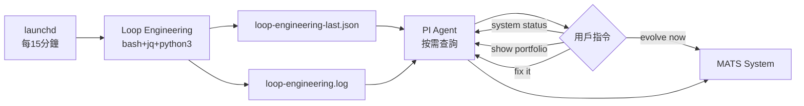

# {MATS} — Multi Agent Trading System

> **作者**: YC Wong
> **版本**: 2.0.3-dev  
> **核心哲學**: 資本保存為絕對第一優先，但必須在安全前提下持續創造盈利  
> **總代碼量**: ~17,200+ 行 TypeScript（嚴格模式，零類型錯誤，`noPropertyAccessFromIndexSignature`） + React UI (pantha_mats design system)

---

## 📑 目錄

1. [概述](#概述)
2. [三層架構](#三層架構)
3. [專案結構](#專案結構)
4. [八智能體系統](#八智能體系統)
5. [HACP 高速認知協議](#hacp-高速認知協議)
6. [倉位大小自動 Clamp](#55-倉位大小自動-clamp)
7. [風險管理引擎](#風險管理引擎)
8. [Paper Trading 模擬層](#paper-trading-模擬層)
9. [LLM 抽象層](#llm-抽象層)
10. [數據管道](#數據管道)
11. [自我演化系統](#自我演化系統)
12. [P0 — 真實成本建模](#p0--真實成本建模transaction-cost-model)
13. [P0 — 執行品質追蹤](#p0--執行品質追蹤execution-tracker)
14. [P0 — 相關性風險預算](#p0--相關性風險預算correlation-budget)
15. [P0 — SNR 支撐阻力區間檢測](#p0--snr-支撐阻力區間檢測supportresistance-zones)
16. [P0 — EM 進化系統](#p0--em-進化系統expectation-maximization-for-cognitive-trading)
17. [P0 — Trade Pattern Classifier](#p0--trade-pattern-classifier)
18. [可觀測性](#可觀測性)
19. [配置與環境變數](#配置與環境變數)
20. [PI Agent 命令](#pi-agent-命令)
21. [啟動指南](#啟動指南)
22. [技術棧](#技術棧)

---

## 概述

**MATS**（Multi Agent Trading System）是一個具備自我演化能力的多智能體量化交易系統。它以 **Hyper-Accelerated Cognition Protocol (HACP)**——一種結構化多 LLM 辯論協議——為核心決策引擎，在 **Binance + Hyperliquid (9 perp DEXs)** 市場上進行機構級 Paper Trading 模擬。

### 核心設計原則

| 原則 | 說明 |
|:-----|:-----|
| **資本保存第一** | 所有決策以生存為前提，利潤為次要目標 |
| **自我演化** | 策略自動評估、淘汰、突變、進化 |
| **多智能體共識** | 7+ 智能體（含 Skeptics 跨 Agent 邏輯審查）+ 結構化辯論 |
| **風險審計否決權** | 獨立風險審計員擁有絕對否決權 |
| **優雅降級** | 任何錯誤預設 HOLD，永遠不倒 |
| **生產級標準** | 完整型別、結構化日誌、優雅關閉、指數退避重連 |

---

## 三層架構

```
┌──────────────────────────────────────────────────────────────┐
│                                                              │
│   Layer 1: 戰略層 (PI Agent + SKILL.md)                      │
│   ┌────────────────────────────────────────────────────────┐ │
│   │ • 啟動 / 停止系統                                       │ │
│   │ • 績效審查 & 參數調整                                   │ │
│   │ • 人工干預入口                                          │ │
│   │ • 長期演化方向設定                                       │ │
│   └────────────────────────────────────────────────────────┘ │
│                           │                                   │
│                           ▼                                   │
│   Layer 2: 認知層 (TypeScript + NVIDIA NIM)                   │
│   ┌────────────────────────────────────────────────────────┐ │
│   │ • HACP 高速認知協議（多模型平行推理）                    │ │
│   │ • 9 智能體系統（5 sub-agents + On-Chain + News + Risk + Skeptics）+ Meta-Agent 仲裁       │ │
│   │ • 結構化辯論 & 加權投票共識                              │ │
│   │ • Meta-Evolution 自我演化                                │ │
│   │ • Position Reconciliation (Skeptics)                     │ │
│   │ • 僅在關鍵決策點觸發 LLM                                 │ │
│   └────────────────────────────────────────────────────────┘ │
│                           │                                   │
│                           ▼                                   │
│   Layer 3: 執行層 (TypeScript Runtime)                        │
│   ┌────────────────────────────────────────────────────────┐ │
│   │ • Binance Mainnet WebSocket 即時數據流 (24/7)           │ │
│   │ • Hyperliquid REST (9 perp DEXs, allDexsAssetCtxs)     │ │
│   │ • 風險引擎（毫秒級，無需 LLM）                           │ │
│   │ • Paper Trading 模擬引擎 (槓桿感知 P&L)                 │ │
│   │ • Real Trading Manager (exchange 下單 + 本地 mirror)    │ │
│   │ • 倉位追蹤 & 止損止盈                                   │ │
│   │ • Position Reconciliation (自動偵測人手平倉)            │ │
│   │ • 數據管道 & 持久化                                      │ │
│   │ • 可觀測性 & 健康檢查                                    │ │
│   └────────────────────────────────────────────────────────┘ │
│                                                              │
└──────────────────────────────────────────────────────────────┘
```

---

## 專案結構

```
/Users/y.c./Downloads/amacrf/
│
├── .env                          # API Keys & 環境變數
├── package.json                  # 依賴 & 腳本
├── tsconfig.json                 # 嚴格 TypeScript 配置 (noPropertyAccessFromIndexSignature)
├── SKILL.md                      # PI Agent 操作手冊
│
├── src/
│   ├── index.ts                  # 🚀 主入口點 (~1166 行)
│   │   ├── MATSSystem 類       # 系統生命週期管理
│   │   ├── 決策循環排程          # 定時觸發 HACP 週期
│   │   ├── 價格輪詢 (REST)       # 30s 間隔，HLRateLimiter 保護
│   │   ├── Position Reconciliation # 偵測人手平倉
│   │   ├── 心跳監控              # 30s 狀態輸出
│   │   └── main() 引導函數       # 啟動 & 保持活躍
│   │
│   ├── config/
│   │   └── index.ts              # 配置管理 (113 行)
│   │       ├── Zod schema 驗證   # 所有環境變數驗證
│   │       ├── 類型安全配置對象  # 不可變 config 物件
│   │       └── 預設值 & 邊界     # 所有參數的合理預設
│   │
│   ├── types/
│   │   └── index.ts              # 領域類型定義 (~668 行, v1.9.3 AgentOutcome + Skeptics + 多交易對)
│   │       ├── MarketData        # Ticker, Kline, OrderBook
│   │       ├── Agent Types       # Identity, Thought, Status
│   │       ├── HACP Types        # Consensus, Debate, Vote
│   │       ├── Trading Types     # Order, Position, Portfolio
│   │       ├── Risk Types        # Limits, Assessment, Concerns
│   │       ├── Evolution Types   # Memory, Strategy, Fitness
│   │       ├── CycleProgress     # 即時進度追蹤
│   │       ├── PositionAdjustment # 動態 TP/SL 調整
│   │       ├── RealTradingConfig  # 真實交易引擎介面
│   │       └── RealTradingEngine  # 真實交易引擎抽象
│   │
│   ├── llm/
│   │   ├── provider.ts           # LLM 抽象介面 (57 行)
│   │   │   ├── LLMMessage        # System/User/Assistant
│   │   │   ├── LLMRequest        # 通用請求格式
│   │   │   ├── LLMResponse       # 通用響應格式
│   │   │   └── LLMProvider       # 抽象介面
│   │   │
│   │   ├── nim-provider.ts       # NVIDIA NIM 實現 (128 行)
│   │   │   ├── OpenAI-compat API # /v1/chat/completions
│   │   │   ├── 可用性檢查        # /v1/models
│   │   │   ├── 超時控制          # AbortController
│   │   │   └── Token 用量追蹤    # prompt/completion tokens
│   │   │
│   │   ├── ollama-provider.ts    # Ollama 備援實現 (139 行)
│   │   │   ├── 本地 API          # /api/chat
│   │   │   ├── 溫度模型映射      # 自動選擇最佳模型
│   │   │   ├── 超時控制          # AbortController
│   │   │   └── Token 用量追蹤    # eval_count
│   │   │
│   │   └── index.ts              # Provider 工廠 (65 行)
│   │       ├── 自動檢測          # NIM → Ollama → Error
│   │       ├── 供應商選擇        # preferred provider
│   │       └── 單例管理          # 全域 active provider
│   │
│   ├── data/
│   │   └── binance-websocket.ts  # Binance 數據管道 (~400 行)
│   │
│   ├── hyperliquid-websocket.ts # HL WebSocket (NEW v2.0.0, ~400 行)
│   ├── multi-exchange-ws.ts    # Multi-Exchange 統一層 (NEW v2.0.0, ~250 行)
│   │       ├── BinanceWebSocketManager
│   │       │   ├── USDⓈ-M Futures WS  # fstream.binance.com
│   │       │   ├── markPrice@1s       # Perp mark price (每秒更新)
│   │       │   ├── depth20@100ms      # Top 20 order book
│   │       │   ├── 自動重連           # 指數退避 (1s → 60s)
│   │       │   ├── 回調系統           # Price + Connection + Depth
│   │       │   └── getOrderBookImbalance() # 訂單簿不平衡度
│   │       │
│   │       └── MarketStateAggregator
│   │           ├── 波動率計算         # 滑動窗口標準差
│   │           ├── 趨勢檢測           # bullish/bearish/sideways
│   │           ├── 制度分類           # 10 種市場制度
│   │           ├── 價格歷史           # 100 tick 緩衝區
│   │           └── orderBookImbalance # 即時訂單簿不平衡
│   │
│   ├── analysis/
│   │   ├── sigmoid-ga.ts         # Sigmoid·GA 情緒感知引擎 (v2.0.0)
│   │   │   ├── sigmoid()         # sigmoid 函數
│   │   │   ├── computeSentiment() # 從原始訊號計算情緒分數
│   │   │   └── SigmoidGA class   # GA 演化引擎
│   │   │
│   │   ├── support-resistance.ts # P0: SNR 支撐阻力區間檢測 (v2.0.2)
│   │   │   ├── getSRZones()      # 主入口：async，取 candle + 計算 zones
│   │   │   ├── detectPivots()    # rolling window pivot high/low 檢測
│   │   │   ├── clusterPivots()   # 鄰近 pivot 合併成 zone
│   │   │   ├── findRoundNumberZones() # 心理整數位檢測
│   │   │   ├── setHLFetchFn()    # 外部注入 rate-limited HL fetch
│   │   │   └── clearSRCache()    # 清除快取（測試/手動）
│   │   │
│   │   └── sentiment-engine.ts   # 情緒引擎 (v2.0.0)
│   │       ├── PriceBuffer       # 20 tick 價格緩衝
│   │       ├── VolumeBuffer      # 10 tick 成交量緩衝
│   │       ├── SentimentEngine   # compute() → formatForAgentContext()
│   │       └── GA 整合
│   │
│   ├── agents/
│   │   ├── base-agent.ts         # 基礎 Agent 類 (~417 行, v1.9.3 多交易對決策)
│   │   ├── agents.ts             # 六個子智能體 (~1720 行, v1.9.3)
│   │   │   ├── Fractal Momentum Sentinel (multi-symbol)
│   │   │   ├── On-Chain Whisperer (multi-symbol on-chain + macro)
│   │   │   ├── Regime Risk Guardian (multi-symbol + Fear & Greed)
│   │   │   ├── News Reporter (multi-symbol RSS + API)
│   │   │   ├── Independent Risk Auditor (per-position veto)
│   │   │   └── Skeptics (logic auditor, cross-references agents + track records)
│   │   ├── meta-agent.ts         # 元智能體 (80 行, v1.9.3 多交易對仲裁)
│   │   └── agent-models.ts       # Per-agent model config (126 行)
│   │
│   ├── market-agent/
│   │   └── index.ts              # Market Agent (~480 行)
│   │       ├── autoSelectTopPair # 每次 HACP 週期前自動選 pair
│   │       ├── fetchBinanceTopPairs  # /api/v3/ticker/24hr (USDT, 無穩定幣)
│   │       ├── fetchHyperliquidTopPairs # allPerpMetas + perpCategories + l2Book (9 DEXs)
│   │       ├── filterHyperliquidPairs # perpCategories 分類過濾
│   │       ├── fetchPriceForSymbol # Binance REST / HL l2Book
│   │       ├── setExchange/setTradeMode/setHyperliquidAssetType
│   │       ├── getLastFetchTime       # 供 SystemGuard 數據新鮮度檢查
│   │       └── getMarketDescription # 注入 Agent 上下文
│   │
│   ├── system-guard/
│   │   ├── types.ts              # GuardResult, GuardReport, GuardParams
│   │   └── index.ts              # SystemGuard (~400 行) — 5 層系統級保護
│   │       ├── Guard A: Economic Calendar (FOMC/NFP 黑名單)
│   │       ├── Guard B: Drawdown Circuit Breaker (5/7/10/15% 閾值)
│   │       ├── Guard C: Data Freshness Scoring (WS+REST 滯後偵測)
│   │       ├── Guard D: Agent Track Record (session 勝率 <30% 預警)
│   │       └── Guard E: Liquidity Check (order book depth vs 倉位大小)
│   │
│   ├── cognition/
│   │   └── hacp.ts               # HACP 認知協議 (~907 行, v1.9.3)
│   │       ├── Phase 1-5         # 平行思考 → Skeptics審查 → Meta仲裁 → 辯論 → 共識 → 否決 → 倉位調整
│   │       ├── Phase 1.5         # Skeptics 邏輯審查 (跨 Agent 交叉對比)
│   │       ├── Phase 1.75        # Meta-Agent 在 Skeptics 之後思考 (接收審查結果)
│   │       ├── Progress callback # 即時進度推送
│   │       └── adjustPositions() # Meta-Agent 動態 TP/SL 調整
│   │
│   ├── risk/
│   │   ├── engine.ts             # 風險管理引擎 (201 行)
│   │   └── correlation-budget.ts # P0: 相關性風險預算 (correlation-adjusted exposure)
│   │       ├── 交易評估          # 6 種風險關注點
│   │       ├── 倉位計算          # 波動率調整固定比例
│   │       ├── 止損驗證          # 多空方向驗證
│   │       ├── 風險評分          # 0-1 綜合評分
│   │       └── 倉位調整          # 自動減倉建議
│   │
│   ├── trading/
│   │   ├── cost-model.ts         # P0: HL 交易成本模型 (taker fee 0.04%, funding rate)
│   │   ├── execution-tracker.ts  # P0: 執行品質追蹤 (slippage, fees)
│   │   ├── portfolio.ts          # 投資組合追蹤 (340 行, v1.9.4)
│   │   │   ├── 餘額 & 權益       # balance + unrealized PnL (槓桿感知)
│   │   │   ├── 倉位管理          # 開倉/更新/平倉 (槓桿放大 P&L)
│   │   │   ├── 回撤追蹤          # 峰值權益 vs 當前權益
│   │   │   ├── 止損止盈          # 自動觸發檢查
│   │   │   ├── 日虧損限制        # 每日重置
│   │   │   ├── recalculateEquity() # equity = balance + unrealizedPnl + lockedMargin
│   │   │   ├── softUpdatePosition() # 不觸發 SL/TP 的價格更新（用於 exchange sync）
│   │   │   ├── reconcilePositions() # 比對外部持倉，自動清理已平倉但本地未同步的 mirror
│   │   │   └── adjustPosition()  # Meta-Agent 動態 TP/SL 調整
│   │   │
│   │   ├── paper-engine.ts       # Paper Trading 引擎 (220 行, v1.9.4)
│   │   │   ├── 訂單生命週期      # pending → filled/rejected
│   │   │   ├── 成交模擬          # 市價單即時成交（槓桿傳遞至 portfolio）
│   │   │   ├── 風險閘門          # 交易前風險檢查（含 cumulative margin 20% 限制，基於 margin 而非 notional）
│   │   │   ├── 倉位調整          # 風險評估後自動調倉
│   │   │   └── 投資組合摘要      # 格式化輸出
│   │   │
│   │   ├── decision-utils.ts     # 決策正規化 (v1.9.4)
│   │   │   ├── normalizeDecision() # 保留 leverage 欄位 (clamp 1-10x)
│   │   │   ├── normalizePerSymbolDecision() # 保留每個 symbol 的 leverage
│   │   │   └── MAX_POSITION_PCT = 0.20
│   │   │
│   │   ├── real-trading-manager.ts # 真實交易管理器 (v1.9.4)
│   │   │   ├── executeDecision()  # 下單到 exchange + mirror 到 paper engine
│   │   │   ├── syncExchangePositions() # 定期同步 exchange 持倉到本地
│   │   │   ├── getOpenPositionSymbols() # 取得 exchange 上真正 open 的 symbols
│   │   │   └── getBalance()/getPositions()/getMarkPrice() # exchange API 封裝
│   │   │
│   │   ├── binance-real-engine.ts # Binance 真實交易引擎 (位置風險 API)
│   │   ├── hyperliquid-real-engine.ts # Hyperliquid 真實交易引擎 (~730 行, clearinghouse API, EIP-712 secp256k1 signing)
│   │   │   ├── @noble/curves/secp256k1.js import (需加 .js 副檔名)
│   │   │   ├── @noble/hashes/sha3.js (同上，moduleResolution: bundler)
│   │   │   ├── secp256k1.sign() type cast (runtime Signature object vs TS Uint8Array)
│   │   │   ├── getBalance() returns ExchangeAccountInfo {free, locked, total, unrealizedPnl, marginUsed}
│   │   │   └── 全部 index signature 使用 bracket notation (o['a'], not o.a)
│   │   └── portfolio.ts          # (合併如上)
│   │
│   ├── evolution/
│   │   ├── cycle-summary.ts     # 🧬 EM 進化系統 — CycleSummary 管理 (v2.0.2)
│   │   │   ├── CycleSummaryManager  # summary chain, context, convergence
│   │   │   ├── buildSummary()       # E-step: Meta-Agent → CycleSummary
│   │   │   ├── formatForContext()   # M-step immediate: inject into agents
│   │   │   ├── updateConvergence()  # M-step: 比對 insight vs 價格方向
│   │   │   └── buildConvergenceAuditContext() # Skeptics 跨 cycle 審計
│   │   │
│   │   ├── trade-pattern-classifier.ts # 🧬 Trade Pattern Classifier (v2.0.4 — Shared BUY/SELL + Wilson Score)
│   │   │   ├── snapshotContext()       # Trade open → 記錄 entry context
│   │   │   ├── backfillOutcome()       # Trade close → 補上 exit context
│   │   │   ├── queryEntry()            # 冇持倉 → 查 entry pattern win rate
│   │   │   ├── queryPosition()         # 有持倉 → 查 transition win rate
│   │   │   ├── formatEntryContext()    # → agent context injection
│   │   │   └── formatPositionContext() # → agent context injection
│   │   │
│   │   ├── agent-outcomes.ts     # 🧬 Per-Agent Outcome Tracking (v1.9.3)
│   │   │   ├── 記錄每個 Agent 對每個 Symbol 的 recommendation
│   │   │   ├── 平倉時 backfill win/loss outcome
│   │   │   ├── getContextSummary() → Agent context 注入 track record
│   │   │   ├── getAgentPerformance() → Agent+Symbol+Regime 效能查詢
│   │   │   └── getAllAgentWinRates() → SystemGuard Agent Track 輸入
│   │   │
│   │   ├── index.ts              # 演化系統 (~420 行, v1.9.3)
│   │   │   ├── AgentOutcomeTracker 整合
│   │   │   ├── getContextForAgent() 輸出 per-agent 歷史 track record
│   │   │   ├── DualMemory (short/long term with consolidation)
│   │   │   ├── SurvivalFitnessCalculator (capital preservation 35%)
│   │   │   ├── EvolutionaryPressureEngine (mutate ±10%, auto-retire <0.2)
│   │   │   └── EvolutionOrchestrator (整合 + persistState)
│   │   │
│   │   ├── trade-history.ts       # 📊 Trade History Ledger (v1.9.4)
│   │   │   ├── Append-only ledger  # 每個 cycle 記錄一條 entry
│   │   │   ├── updateLastExit()    # 修改上一個 cycle 的 exit (非自己!)
│   │   │   ├── 模擬 PnL 計算       # HOLD 時自動模擬買/賣結果
│   │   │   ├── computePerformance() # 使用 realisedPnl 優先, simulatedPnl 備用
│   │   │   └── getSummary()        # Agent 可參考的近期表現摘要
│   │   │
│   │   └── persistence.ts         # 💾 永續儲存層 (~522 行, v2.0.1 lockedWrite)
│   │       ├── saveEvolution()     # TradeHistory + Memory + Strategies
│   │       ├── loadEvolution()     # 啟動時自動恢復
│   │       ├── savePortfolio()     # Balance + Equity + Positions
│   │       ├── loadPortfolio()     # 啟動時自動恢復
│   │       ├── saveDebateHistory() # Consensus + DebateRounds + Thoughts
│   │       └── loadDebateHistory() # 啟動時自動恢復
│   │
│   ├── backtest/
│   │   └── index.ts               # 📜 歷史回測引擎 (v2 — 真 HACP)
│   │       ├── fetchHistoricalData() # Binance klines API
│   │       ├── detectRegime()        # 規則型制度檢測 (interval-aware)
│   │       ├── 真 HACP 決策          # 使用獨立 HACPEngine + 5 agents
│   │       ├── 每步 HACP 即時演化    # 每個 HACP run 後 mutate strategy
│   │       ├── 暫停/繼續/停止        # pause() / resume() / stop()
│   │       ├── 逆向回測              # reverse mode (newest → oldest)
│   │       ├── 1yr/5m 支援           # 最短 1yr, 最細 5m interval
│   │       ├── 機構級指標計算        # Sharpe/Sortino/Calmar from equity curve
│   │       └── getBacktestSummary()  # Agent 上下文注入
│   │
│   ├── observability/
│   │   └── logger.ts             # 結構化日誌 (78 行)
│   │       ├── Winston 整合      # 控制台 + 文件
│   │       ├── 上下文注入        # agent, phase, symbol
│   │       ├── 開發格式          # 彩色人類可讀
│   │       ├── 生產格式          # JSON 機器可讀
│   │       └── 文件輪轉          # 10MB/50MB 限制
│
├── data/
│   └── evolution/                # 💾 永續儲存目錄 (NEW)
│       ├── evolution-state.json   # TradeHistory + Memory + Strategies
│       ├── portfolio-state.json   # Balance + Equity + Positions
│       └── debate-history.json    # Consensus + DebateRounds
│
├── scripts/
│   ├── loop-engineering.sh       # 每 15 分鐘自我維護掃描 (bash + jq + python3, 零 LLM 成本)
│   ├── loop-engineering-deep.sh  # 深度交易系統分析 (bash + jq, 被 loop-engineering.sh 調用)
│   └── loop-engineering-memory.md # 📖 永續記憶 (已知錯誤 + 常見陷阱 + checklist)
│
├── logs/                         # 運行日誌 + loop-engineering.log（auto rotate @ 5MB）
│
└── tests/                        # 測試目錄（預留）
```

---

## 八智能體系統

### Agent 角色矩陣

| # | Agent | 溫度 | 權重 | 槓桿 | 角色描述 |
|:-:|:------|:----:|:----:|:----:|:---------|
| 1 | **Market Agent** | — | — | — | 自動從 Binance/Hyperliquid 選取最高 24h 交易量 pair。支援 9 個 Hyperliquid DEX，416 個資產，按類別過濾（Indices/Stocks/Commodities/FX）。HACP 週期前執行，阻塞其餘 Agent 直到選定。|
| 2 | **Fractal Momentum Sentinel** | 0.85 | 0.25 | 2-5x | 碎形數學家轉量化交易員。多時間框架自相似模式檢測。趨勢加速早期信號。極端逆向，中間趨勢追隨。 |
| 3 | **On-Chain Whisperer** | 0.50 | 0.25 | 2-4x | 類別感知鏈上分析師 (v1.9.3, multi-symbol)。Crypto 資產: BTC mempool(算力/手續費), ETH CoinGecko, 所有代幣 CoinGecko 交易所流量/供應量。TradFi 資產: DXY代理, FX匯率, 商品現貨, COT持倉, 網絡搜索回退。未知代幣自動搜索區塊鏈資源管理器。5分鐘緩存。每個 cycle 為所有持倉一次性 fetch on-chain 數據。|
| 4 | **Regime Risk Guardian** | 0.25 | 0.25 | 2-8x | 制度檢測專家 + **恐慌指數 (F&G)** + 逐倉制度驗證 (v1.9.3)。0-25 Extreme Fear→BEARISH, 75-100 Extreme Greed→BULLISH。每個持倉獨立評估是否應在當前制度下持有/平倉。|
| 5 | **News Reporter** | 0.40 | 0.20 | 1-3x | 多源類別感知新聞分析師 (v1.9.3, multi-symbol)。Crypto: NewsData.io + CoinDesk RSS + The Block RSS + Google News (監管+宏觀+地緣政治)。TradFi: NewsData.io + Google News RSS (宏觀→世界→行業) + CNBC RSS + Bing RSS。5層回退鏈。每個 cycle 為所有持倉一次性 fetch 新聞。無新聞時自動NEUTRAL。|
| 6 | **Independent Risk Auditor** | 0.10 | 0.25 | — | 🚨 **最終守門人。絕對否決權。** 逐倉風險審計 (v1.9.3)。每個持倉獨立評估風險，可個別建議平倉。|
| 7 | **Skeptics** | 0.30 | 0.00 | — | 🤔 **邏輯審計員 (v1.9.3)。** Phase 1.5 執行，在 Meta-Agent 思考前質疑 5 個 sub-agent 的決策。檢查數據一致性、跨 Agent 交叉對比、**參考每個 Agent 的歷史 track record (AgentOutcomeTracker)**。有無計算遺漏。default 模型: deepseek-v4-flash:cloud。不干預 Meta-Agent 和 Market Agent。|
| 8 | **Meta-Agent** | 0.45 | 0.35 | 2-10x | 戰略協調者。HACP 辯論主席。**在 Skeptics 審查後思考**，接收審查結果。根據風險/信心設定槓桿，動態調整 TP/SL。 |

### Agent System Prompt 強化（v2.0.2）

所有 sub-agent 的 system prompt 已加入兩個新 section：

**`=== PATTERN DATA ===`**
- 如果 context 包含 `=== TRADE PATTERN INSIGHTS ===` 或 `=== POSITION PATTERN INSIGHTS ===`，agents 必須優先參考歷史 win rate
- Pattern data 高於 first-principles reasoning
- 例如：*"Low_vol sideways entries have 13% win rate → strong bias against HOLD"*

**`=== CONCISE REASONING ===`**
- 用 round number（`~1.5% range` 而非 `1.52% 24h band`）
- 每個 assessment 最多 3 句
- 如果 unanimous HOLD expected → 直接 short HOLD

| Agent | Prompt 強化重點 |
|:------|:----------------|
| Fractal Momentum | 「Use historical win rate as PRIMARY reference」 |
| On-Chain Whisperer | 「Do NOT override clear historical data with speculative reasoning」 |
| Regime Risk Guardian | 「Regime rules are BASELINE; pattern data OVERRIDES」 |
| News Reporter | 「News is TACTICAL; pattern data is STRATEGIC」 |
| Meta-Agent | 「Pattern data is MOST IMPORTANT signal — override sub-agents」 |

### Agent 思考輸出範例（強化後）

```
Fractal Momentum Sentinel
72%
ASSESS: Range ~$65K-$66K compression, no fractal break → HOLD.
Pattern: Low_vol sideways entries 13% win rate historically.

On-Chain Whisperer
55%
ASSESS: Fees 2/1/1, flows balanced, no whale divergence → HOLD.
Pattern: Balanced flows in low_vol → 80% continuation, no edge.

→ 2/2 HOLD unanimous → skip attack/synthesis → direct consensus ✅
```

### Agent 否決條件（Risk Auditor）

Risk Auditor 專注於**災難性風險預防**，不再審查倉位大小和槓桿（由 Market Agent UI slider 控制）：

| 條件 | 說明 |
|:-----|:-----|
| 冇 set Stop Loss | 裸倉 = 災難性風險 |
| 制度 = 混沌 | 市場處於不可預測狀態 |
| 冇可用價格數據 | 無法估值，唔可以交易 |
| 單一持倉 unrealized loss > 5% | 虧損過大，強制平倉 |
| 回撤 > 15% | 平所有倉位 |
| 日虧損 > 4% | 停止當日交易 |
| 倉位 > 20% | 超過絕對硬上限（`MAX_POSITION_PCT`，與 `normalizeDecision()` 一致） |

**唔再審查：**
- 倉位大小（由 Market Agent 控制）
- 槓桿倍數（由 Market Agent 控制）
- 止損虧損 > 2%（由 Market Agent 決定風險承受度）

---

### 🆕 Multi-Symbol 架構 (v1.9.2)

每個 Agent 在單一 HACP cycle 中同時評估 **所有交易對**：

```
輸入: 市場上下文 + Sigmoid·GA 情緒分數 + 投資組合摘要 + 持倉列表
                                            │
                    ┌───────────────────────┴───────────────────────┐
                    │               每個 Agent 輸出:                  │
                    │         MultiSymbolDecision                    │
                    └───────────────────────┬───────────────────────┘
                                            │
          ┌─────────────────────────────────┼─────────────────────────────────┐
          │                                 │                                 │
          ▼                                 ▼                                 ▼
┌───────────────────┐       ┌─────────────────────────┐       ┌─────────────────────┐
│   marketTicker    │       │   positions[0]           │       │   positions[N]       │
│   (當前選中 ticker)│       │   (持倉 #1)              │       │   (持倉 #N)          │
├───────────────────┤       ├─────────────────────────┤       ├─────────────────────┤
│ action: buy/sell  │       │ action: hold/close       │       │ action: hold/close   │
│   /hold           │       │ closePosition: bool      │       │ closePosition: bool  │
│ positionSizePct   │       │ closeUrgency             │       │ closeUrgency         │
│ leverage          │       │ suggestedStopLoss        │       │ suggestedStopLoss    │
│ rationale         │       │ suggestedTakeProfit      │       │ suggestedTakeProfit  │
└───────────────────┘       │ rationale                │       │ rationale            │
                            └─────────────────────────┘       └─────────────────────┘
```

#### Agent 決策範圍

| Agent | 市場 Ticker | 持倉 #1 (BTCUSDT) | 持倉 #2 (xyz:GOLD) | 持倉 #N |
|:------|:-----------:|:-----------------:|:------------------:|:-------:|
| Fractal Momentum | 碎形趨勢判斷 | SL/TP調整/平倉 | SL/TP調整/平倉 | ... |
| On-Chain Whisperer | 鏈上/宏觀判斷 | 持倉方向驗證 | 持倉方向驗證 | ... |
| Regime Guardian | 制度+FnG判斷 | 制度驗證持倉 | 制度驗證持倉 | ... |
| News Reporter | 新聞情緒判斷 | 新聞驗證持倉 | 新聞驗證持倉 | ... |
| Risk Auditor | 風險否決 | 逐倉風險審計 | 逐倉風險審計 | ... |
| **Skeptics** | **邏輯審計 (Phase 1.5)** | **跨 Agent 交叉對比** | **跨 Agent 交叉對比** | **...** |
| **Meta-Agent** | **最終仲裁 (Phase 1.75)** | **逐倉仲裁** | **逐倉仲裁** | **...** |

### 🟢 On-Chain Whisperer — 類別感知數據管道 (v1.9.2, multi-symbol)

```
資產符號 + 市場上下文
    │
    ▼
┌──────────────────────────────────────────────────────┐
│ detectAssetCategory()                                 │
│ • KNOWN_CRYPTO 映射表 (BTC, ETH, SOL, XRP, ADA ...) │
│ • 冒號前綴檢測 (xyz: → TradFi, flx: → TradFi)      │
│ • 市場上下文 "Asset Filter:" 字串                    │
│ • 已知 TradFi 符號啟發式 (SP500, NVDA, XAU, EUR...) │
└──────────────────┬───────────────────────────────────┘
                   │
        ┌──────────┴──────────┐
        ▼                      ▼
  ┌─────────────┐     ┌──────────────────┐
  │   CRYPTO    │     │ TradFi (Indices/  │
  │             │     │ Stocks/Commodities│
  │             │     │ /FX/preIPO)       │
  └──────┬──────┘     └────────┬─────────┘
         │                     │
         ▼                     ▼
┌─────────────────┐  ┌────────────────────────┐
│ BTC: mempool    │  │ Indices: DXY proxy     │
│   • /hashrate   │  │   (inverse EUR/USD)    │
│   • /block      │  │   + web search COT     │
│   • /fees       │  │                        │
│                 │  │ Stocks: web search     │
│ ETH: CoinGecko  │  │   ETF flows & inst.   │
│   • price/vol   │  │                        │
│   • mcap/supply │  │ Commodities:          │
│                 │  │   CoinGecko XAU/XAG    │
│ ALL crypto:     │  │   + web search oil     │
│ CoinGecko       │  │                        │
│   • exchange    │  │ FX: exchangerate-api   │
│     flow proxy  │  │   12 major pairs       │
│   • ATH/supply  │  │                        │
│   • CEX tickers │  │ preIPO: web search     │
│                 │  │                        │
│ Unknown token:  │  │ Fallback: web search   │
│ web search 🔍   │  │   (DDG HTML)           │
└─────────────────┘  └────────────────────────┘
         │                     │
         └──────────┬──────────┘
                    ▼
         ┌──────────────────┐
         │ 5-min cache      │
         │ key: symbol│cat  │
         └──────────────────┘
```

#### 已驗證數據來源

| 類別 | 來源 | 端點 | 狀態 |
|:-----|:-----|:------|:----:|
| **BTC** | mempool.space | `/api/v1/mining/hashrate/1w` (922 EH/s) ✅ | ✅ |
| | | `/api/blocks/tip/height` (952,059) ✅ | |
| | | `/api/v1/fees/recommended` (fast=1 sat/vB) ✅ | |
| **ETH** | CoinGecko | `coins/ethereum` ($1,984, $17B vol) ✅ | ✅ 取代死掉的 Etherscan free tier |
| **SOL/XRP/ALL** | CoinGecko | `coins/{id}?tickers=true` (100+ tickers) ✅ | ✅ |
| **DXY Proxy** | exchangerate-api | `/v4/latest/USD` (EUR inverse, 1.1628) ✅ | ✅ |
| **FX Rates** | exchangerate-api | 12 主要貨幣對 ✅ | ✅ |
| **Gold/Silver** | CoinGecko | `the-gold-token`, `silver-token` ✅ + web search fallback | ✅ 取代死掉的 metals.live |
| **未知代幣** | DuckDuckGo HTML | `html.duckduckgo.com/html/` + User-Agent | ✅ 10 筆結果 |
| **Web Search** | Google News RSS | `news.google.com/rss/search?q=...` | ✅ 最終回退 |

---

### 📰 News Reporter — 多源新聞策略 (v1.9.2, multi-symbol)

```
資產符號 + 市場上下文
    │
    ▼
┌──────────────────────────────────────────────────────┐
│ detectNewsCategory()                                  │
│ • 冒號前綴 + 資產過濾器上下文 + 已知符號列表          │
│ • 分類: crypto / tradfi_indices / stocks /            │
│         commodities / fx / other / unknown            │
└──────────────────┬───────────────────────────────────┘
                   │
        ┌──────────┴──────────┐
        ▼                      ▼
  ┌─────────────┐     ┌──────────────────┐
  │   CRYPTO    │     │     TRADFI       │
  └──────┬──────┘     └────────┬─────────┘
         │                     │
         ▼                     ▼
┌──────────────────┐  ┌────────────────────────────┐
│ TIER 0: API      │  │ TIER 0: NewsData.io API    │
│ NewsData.io      │  │ ① ticker-specific query    │
│ /api/1/crypto   │  │ ② category-level query      │
│         │        │  │ ③ no-keyword catch-all      │
│         ▼        │  │              │              │
│ TIER 1: RSS     │  │              ▼              │
│ CoinDesk RSS  ✅│  │ TIER 1: Google News RSS     │
│ The Block RSS ✅│  │ (100+ 篇文章/查詢)           │
│         │        │  │ ① 宏觀: Fed/CPI/GDP/利率   │
│         ▼        │  │ ② 世界: 關稅/地緣政治/風險 │
│ TIER 2: Google  │  │ ③ 行業: 科技AI/能源/醫療   │
│ News RSS        │  │              │              │
│ ① 監管/政治    │  │              ▼              │
│ ② 宏觀經濟    │  │ TIER 2: RSS supplements      │
│ ③ 地緣政治    │  │ CNBC RSS ✅                  │
│         │        │  │ Bing News RSS ✅            │
│         ▼        │  │              │              │
│ TIER 3: 搜索    │  │              ▼              │
│ web_search 🔍   │  │ TIER 3: 搜索回退            │
│         │        │  │ web_search (DDG HTML +     │
│         ▼        │  │  Google News RSS fallback)  │
│ ⚠️ 無新聞?     │  │              │              │
│ → NEUTRAL/HOLD  │  │              ▼              │
│   confidence 0.1 │  │ ⚠️ 無新聞? → NEUTRAL/HOLD  │
└──────────────────┘  └────────────────────────────┘
```

#### 新聞來源矩陣

| 來源 | 類型 | API Key | Crypto | TradFi | 穩定性 |
|:-----|:-----|:-------:|:------:|:------:|:------:|
| NewsData.io `/api/1/crypto` | REST | ✅ | ✅ (10 篇) | ❌ | ✅ |
| NewsData.io `/api/1/news` | REST | ✅ | ❌ | ✅ (3+ 篇) | ✅ |
| Google News RSS | RSS/XML | 免鑰匙 | ✅ (100+ 篇) | ✅ (100+ 篇) | ✅ |
| CNBC RSS | RSS/XML | 免鑰匙 | ❌ | ✅ (4 篇) | ✅ |
| CoinDesk RSS | RSS/XML | 免鑰匙 | ✅ (3+ 篇) | ❌ | ✅ |
| The Block RSS | RSS/XML | 免鑰匙 | ✅ (4 篇) | ❌ | ✅ |
| Bing News RSS | RSS/XML | 免鑰匙 | ✅ | ✅ (13 篇) | ✅ |
| DDG HTML Search | HTML scrape | 免鑰匙 | ✅ (10 結果) | ✅ | ✅ (with UA) |

#### 每類別查詢策略

| 類別 | 宏觀查詢 | 世界查詢 | 行業查詢 |
|:-----|:---------|:---------|:---------|
| **Crypto** | 利率/通脹/貨幣政策 | SEC監管/ETF/地緣政治 | DeFi/L2/挖礦 |
| **Indices** | Fed利率/FOMC/CPI/NFP | 關稅/中美/能源 | 科技AI/能源/金融/醫療 |
| **Stocks** | 利率/經濟數據/行業輪動 | 貿易政策/風險情緒 | 科技AI/零售/工業 |
| **Commodities** | 美元指數/利率/供應鏈 | OPEC/關稅/天氣 | 貴金屬/能源轉型/工業金屬 |
| **FX** | Fed/ECB/BOJ利差/通脹 | 避險/貿易順差/去美元化 | EURUSD/JPY/GBP |
| **Other** | 全球市場/經濟展望 | 地緣政治/貿易政策 | 跨資產關聯 |

#### 無新聞處理

```
所有來源返回空或不可用
    → Agent 收到 "[No News] No X news found."
    → AI 被指示: 保持 NEUTRAL, confidence 0.1-0.3
    → 絕不憑空創造信號
```

---

## 🔗 A2A 協議 — Agent 間通信

### 目標

傳統 Agent 辯論使用完整句子，造成 Token 浪費。**A2A (Agent-to-Agent) 協議** 使用精簡的**關鍵字 + 形容詞 + 數據**格式，將 Token 使用量減少 **60-70%**，同時保持語義清晰。

### 核心概念

| 格式 | 用途 | 例子 | Tokens |
|:-----|:-----|:-----|:------:|
| `OBS:` | 觀察信號 | `OBS: HMM_TRANSITION P=0.76, ARCH_vol=1.8%` | 12 |
| `ASSESS:` | 評估判斷 | `ASSESS: regime trending_bull conf=0.82` | 8 |
| `PROP:` | 提案行動 | `PROP: BUY 5% immediate \| vol_normalized` | 10 |
| `CONCERN:` | 風險警告 | `CONCERN: earning_vol 🟡 adds_noise_to_fractal` | 10 |
| `AGR/DIS:` | 同意/反對 | `DIS: PARTIAL regime_timing \| HMM_unreliable_here` | 10 |

**總辯論成本：50-80 tokens/round**（vs 200+ 自然語言）

### A2A 關鍵詞集合

| 類別 | 關鍵詞 |
|:-----|:------|
| **制度** | `HMM_STATE`, `HMM_TRANSITION`, `PERSISTENCE`, `TRENDING`, `RANGING`, `CHAOTIC` |
| **波動** | `ARCH_VOL`, `VOL_FORECAST`, `VOL_SPIKE`, `EARNING_VOL`, `IV_SPIKE`, `DECAY` |
| **動能** | `MOMENTUM`, `EXHAUSTION`, `FRACTAL`, `ACCELERATION`, `BREAKOUT` |
| **數據** | `ORDERBOOK`, `VOLUME`, `WHALE`, `IMBALANCE`, `FLOW` |
| **風險** | `POSITION`, `VETO`, `CORRELATION`, `DRAWDOWN`, `CONCERN` |

### 代理特定信號格式

#### Regime Risk Guardian (HMM + ARCH)

```
ASSESS: regime trending_bull conf=0.78 | OBS: HMM_S1_persist=0.76, ARCH_forecast=1.8%
CONCERN: transition_risk 🟡 HMM_P_to_S3=0.22, vol_may_spike
```

#### Fractal Momentum Sentinel (Earning Vol)

```
OBS: MOMENTUM breakout +3.2% | EARNING_VOL spike IV+22%, beta=0.34
PROP: BUY 4.5% immediate | momentum_strong but reduce_size_for_vol_uncertainty
```

### 文件位置

| 文件 | 內容 |
|:-----|:-----|
| `src/cognition/A2A-PROTOCOL.md` | 完整規範 + 示例 |
| `src/cognition/a2a-utils.ts` | 解析/格式化工具函數 |
| `docs/A2A-INTEGRATION-GUIDE.md` | 集成指南 + 代碼示例 |
| `src/types/index.ts` | A2A 類型定義 (`A2ASignal`, `A2AMessageType`) |

---

## HACP 高速認知協議

### 完整決策流程

```
┌─────────────────────────────────────────────────────────────────┐
│                    HACP Decision Cycle                          │
│                    (每 300 秒觸發一次)                            │
└─────────────────────────────────────────────────────────────────┘
                              │
                              ▼
┌─────────────────────────────────────────────────────────────────┐
│  PHASE 0: MARKET AGENT AUTO-SELECT + RECONCILIATION              │
│                                                                 │
│  • MarketAgent.autoSelectTopPair()                              │
│  • Fetches top 30 volume pairs from Binance or Hyperliquid      │
│  • Picks #1 by 24h volume                                       │
│  • Blocks HACP cycle until symbol is selected                   │
│  • On config change (exchange/asset type): force re-fetch       │
│  • ── Position Reconciliation ──                                │
│  • Real mode: sync exchange positions to local portfolio        │
│  • Paper mode: ground truth = activeSymbol                      │
│  • reconcilePositions(): close local mirrors not on exchange    │
│  • Detects manually-closed positions across sessions            │
└─────────────────────────────────────────────────────────────────┘
                              │
                              ▼
┌─────────────────────────────────────────────────────────────────┐
│  PHASE 1: PARALLEL THINKING (15s timeout)                       │
│                                                                 │
│  ┌──────────┐  ┌──────────┐  ┌──────────┐  ┌──────────┐       │
│  │ Fractal  │  │ OnChain  │  │ Regime   │  │ Risk     │       │
│  │ T=0.85   │  │ T=0.50   │  │ T=0.25   │  │ T=0.10   │       │
│  │ Fast     │  │ Default  │  │ Default  │  │ Default  │       │
│  └────┬─────┘  └────┬─────┘  └────┬─────┘  └────┬─────┘       │
│       │              │              │              │             │
│       └──────────────┴──────────────┴──────────────┘             │
│                          │                                       │
│                     Promise.all                                  │
│                          │                                       │
│              所有 Agent 思路收集完成                               │
│              • 每個返回: MultiSymbolDecision                      │
│              • 包含 marketTicker + positions[]                    │
└─────────────────────────────────────────────────────────────────┘
                              │
                              ▼
┌─────────────────────────────────────────────────────────────────┐
│  PHASE 1.5: SKEPTICS LOGIC AUDIT (NEW v1.9.3)                   │
│                                                                 │
│  • Skeptics 審查 5 個 sub-agent 的決策                           │
│  • 檢查: 數據一致性、跨 Agent 交叉對比、有無計算遺漏              │
│  • 結果: approved → 繼續 / modified → 覆蓋原決策                 │
│  • 不審查 Meta-Agent 和 Market Agent                             │
│  • Default 模型: deepseek-v4-flash:cloud (快模型)                │
│  • 失敗時 auto-approve，不阻塞流程                               │
└─────────────────────────────────────────────────────────────────┘
                              │
                              ▼
┌─────────────────────────────────────────────────────────────────┐
│  PHASE 1.75: META-AGENT (AFTER Skeptics)                        │
│                                                                 │
│  • Meta-Agent 收到 Skeptics 審查結果                             │
│  • 上下文注入: "=== Skeptics Review Results ==="                 │
│  • 知道哪些 agent 被修改、哪些 approved                          │
│  • 基於修正後的 allThoughts[] 做最終仲裁                         │
└─────────────────────────────────────────────────────────────────┘
                              │
                              ▼
┌─────────────────────────────────────────────────────────────────┐
│  PHASE 2: STRUCTURED RAPID DEBATE (up to 3 rounds, auto-shortcut)  │
│                                                                     │
│  Round 1: ARGUMENTS                                                 │
│  • 每個 Agent 陳述最強論點（1-3 句 + 信心度）                        │
│  • 平行生成，基於 Phase 1 + Skeptics 修正後結果                      │
│  • 如果 Round 1 後所有 agents 同一 action → 跳過 Round 2+3 ✅      │
│  • 跳過後直接 consensus，節省 ~70% token                            │
│  • 如有分歧 → 繼續 Round 2（Attack）和 Round 3（Synthesis）         │
│                                                                     │
│  Round 2 (optional): ATTACK                                         │
│  • 只在 Round 1 有分歧時執行                                        │
│  • 每個 Agent 質疑信心度最低的對手                                  │
│                                                                     │
│  Round 3 (optional): SYNTHESIS                                      │
│  • 只在 Round 2 後仍有分歧時執行                                    │
│  • 綜合各方立場，尋求共識                                            │
│  └───────────────────────────────────────────────────────────────┘  │
│  • 極化檢測（信心方差 > 0.15 → 觸發元智能體仲裁）               │
│  • 總時間限制：120s（超時強制共識）                              │
└─────────────────────────────────────────────────────────────────┘
                              │
                              ▼
┌─────────────────────────────────────────────────────────────────┐
│  PHASE 3: FAST CONSENSUS ENGINE                                 │
│                                                                 │
│  ┌───────────────────────────────────────────────────────────┐  │
│  │ 加權投票                                                    │  │
│  │ • 每個 Agent 權重 × 信心度 × 決策值                         │  │
│  │ • decisionValue: buy=+1, hold=0, sell=-1                    │  │
│  │ • 加權分數 = Σ(weight × |score|) / Σ(weight)                │  │
│  ├───────────────────────────────────────────────────────────┤  │
│  │ 元智能體仲裁（若需要）                                       │  │
│  │ • 觸發條件：極化或無共識                                     │  │
│  │ • Meta-Agent 綜合所有觀點做出最終裁決                         │  │
│  │ • 最高權重 (0.35)，優先於其他 Agent                          │  │
│  └───────────────────────────────────────────────────────────┘  │
│                                                                 │
│  • 結論鎖定：必須在 4 輪內達成決定                               │
│  • 無法達成 → Meta-Agent 最終仲裁                               │
└─────────────────────────────────────────────────────────────────┘
                              │
                              ▼
┌─────────────────────────────────────────────────────────────────┐
│  PHASE 4: RISK AUDITOR FINAL VETO                               │
│                                                                 │
│  ┌───────────────────────────────────────────────────────────┐  │
│  │ 獨立風險審計                                                │  │
│  │ • 風險審計員獨立重新評估最終決策                              │  │
│  │ • 調用 LLM (T=0.05, 極低溫度)                               │  │
│  │ • 檢查所有否決條件                                          │  │
│  ├───────────────────────────────────────────────────────────┤  │
│  │ 硬限制執行（不可覆蓋）                                       │  │
│  │ • 倉位 > 20% → VETO（與 clamp 上限一致）                  │  │
│  │ • 無可用價格 → VETO                                        │  │
│  │ • LLM 不可用 → 保守否決 (>5% 倉位)                          │  │
│  ├───────────────────────────────────────────────────────────┤  │
│  │ 否決發生時：                                                │  │
│  │ • decision.action = 'hold'                                  │  │
│  │ • positionSizePct = 0                                       │  │
│  │ • metaAgentOverridden = true                                │  │
│  │ • confidence = 0.0                                          │  │
│  └───────────────────────────────────────────────────────────┘  │
└─────────────────────────────────────────────────────────────────┘
                              │
                              ▼
┌─────────────────────────────────────────────────────────────────┐
│  PHASE 4.5: MARKET AGENT HARD CONSTRAINTS OVERRIDE              │
│                                                                 │
│  • 在 Risk Auditor 否決之後、執行之前執行                        │
│  • 強制將最終決策的 positionSizePct 設定為 Market Agent 的值    │
│  • 強制將最終決策的 leverage 設定為 Market Agent 的值           │
│  • 如果 Risk Auditor veto 了，跳過此階段（veto 優先）           │
│  • Log 記錄 override 事件                                       │
└─────────────────────────────────────────────────────────────────┘
                              │
                              ▼
┌─────────────────────────────────────────────────────────────────┐
│  PHASE 5: META-AGENT POSITION ADJUSTMENT (TP/SL)               │
│                                                                 │
│  • 每個 cycle 結束後，meta-agent 審視所有持倉                    │
│  • 根據當前市場狀況建議調整 SL/TP                                │
│  • 價格接近 SL → 適度放寬避免 premature stop-out                │
│  • 價格接近 TP → trail upward 捕捉更多利潤                      │
│  • 波動率上升 → 放寬 SL/TP                                     │
│  • 波動率下降 → 收窄 SL/TP                                     │
│  • 永遠唔會移除 SL                                             │
│  • 接口與 RealTradingEngine 一致，日後 real-trading 可直接使用   │
└─────────────────────────────────────────────────────────────────┘
                              │
                              ▼
                    ┌──────────────────┐
                    │  Execution Layer  │
                    │  Paper Trading    │
                    └──────────────────┘
```

### HACP 時間預算（當前配置）

| 階段 | 預算 | 說明 |
|:-----|:----:|:-----|
| REST Price Polling (background) | 每 10s | 按 active symbol 動態輪詢，支援 Binance REST + Hyperliquid allDexsAssetCtxs |
| Position Reconciliation | ~2s | 比對 exchange/paper 持倉 vs local portfolio，清理 ghost positions |
| Parallel Thinking | 15s | 5 個 Agent + Risk Auditor 同時調用 LLM（staggered 6s） |
| Skeptics Review (Phase 1.5) | ~10s | 5 個 sub-agent 逐一邏輯審查 + 跨 Agent 交叉對比 |
| Meta-Agent (Phase 1.75) | ~10s | 接收 Skeptics 結果後做最終仲裁 |
| Debate Round 1 | ~10s | 論點陳述（僅 1 輪，可配置至 3 輪） |
| Consensus + Veto | ~5s | 加權投票 + 風險審計 |
| Position Adjustment | ~5s | Meta-Agent 動態調整持倉 TP/SL（僅調整 primary symbol 的持倉） |
| **總預算** | **120s** | 超時強制共識 → 預設 HOLD |

---

## 5.5 倉位大小自動 Clamp

### 動機

Meta-Agent 使用 LLM 輸出 `positionSizePct`，但 LLM 有時會產生離譜值（如 200%），導致 Risk Auditor 必然否決，浪費整個 HACP 週期。

### 解決方案

兩層機制確保 Market Agent 的設定被嚴格執行：

**Layer 1: HACP Context 注入** — 在 market description 中加入硬限制提示，所有 Agent 在思考時就知道不可逾越的上下限。

**Layer 2: Phase 4.5 強制 Override** — 在 Risk Auditor 否決之後、執行之前，HACP 引擎強制將最終決策的 `positionSizePct` 和 `leverage` 設定為 Market Agent 的值：

```typescript
// Phase 4.5: Enforce Market Agent Hard Constraints
if (marketAgentConstraints && !riskAudit.veto) {
  const targetSize = marketAgentConstraints.positionSizePct;
  const targetLev = marketAgentConstraints.leverage;
  
  // Override position size to Market Agent's target (not just clamp)
  finalConsensus.decision.positionSizePct = targetSize;
  // Override leverage to Market Agent's target
  finalConsensus.decision.leverage = targetLev;
}
```

此外，`normalizeDecision()` 保留 20% 絕對硬上限（`MAX_POSITION_PCT = 0.20`）作為最終安全網，防止任何程式錯誤導致超額倉位。

### 應用範圍

| 觸發點 | 位置 | 說明 |
|:-------|:----:|:-----|
| Market Agent Context 注入 | `executeDecisionCycle()` | 在 market description 中加入硬限制提示 |
| Phase 4.5 強制 Override | `executeDecisionCycle()` | Risk Auditor 否決後、執行前，強制使用 Market Agent 設定值 |
| `normalizeDecision()` 硬上限 | `decision-utils.ts` | 20% 絕對安全網（`MAX_POSITION_PCT`） |
| Risk Auditor 硬限制 | `riskAuditorAudit()` | 硬上限檢查同樣使用 20%（保持一致） |

### 效果

- Market Agent 設定 `positionSizePct: 0.10`（10%）→ 所有決策強制使用 10%
- Market Agent 設定 `leverage: 10`（10x）→ 所有決策強制使用 10x
- `normalizeDecision()` 保留 20% 硬上限作為最終安全網
- Log 記錄 override 事件：`Market Agent constraint: position size overridden 5% → 10%`
- Exploration trade 同樣使用 Market Agent 設定值（不再硬 cap 5%/3x）

---

## 風險管理引擎

### 風險關注點體系

| 關注點 | 嚴重性 | 觸發條件 | 緩解措施 |
|:-------|:------:|:---------|:---------|
| 回撤超限 | 🔴 Critical | 回撤 ≥ 20% | 平倉所有倉位，保持現金 |
| 日虧損超限 | 🔴 Critical | 日虧損 ≥ 5% | 當日禁止新交易 |
| 倉位過大 | 🟠 High | 倉位 > 10% | 降至 10% 上限 |
| 波動率過高 | 🟠 High | 波動率 > 3% | 倉位減半，止損放寬 |
| 相關性曝險 | 🟡 Medium | 方向性曝險 > 30% | 對沖或減倉 |
| 制度不明 | 🟢 Low | Regime = unknown | 降低倉位，密切觀察 |

### 倉位計算公式

```
volatilityFactor = volatility > 3% ? 0.5 : volatility > 2% ? 0.75 : 1.0
confidenceFactor = 0.5 + (confidence × 0.5)
riskPct = baseRiskPct × volatilityFactor × confidenceFactor
riskAmount = equity × riskPct
priceRisk = |entryPrice - stopLossPrice| / entryPrice
quantity = riskAmount / (entryPrice × priceRisk)
```

### 風險參數

| 參數 | 預設值 | 說明 |
|:-----|:------:|:-----|
| 最大倉位 | 20% | 單筆交易佔總權益上限（hard clamp） |
| 最大回撤 | 20% | 超過此值停止所有交易 |
| 日虧損限制 | 5% | 超過此值當日禁止新交易 |
| 最大槓桿 | 10x (Market Agent 設定) | meta-agent 根據風險/信心設定 (1-10x，受 Market Agent 限制) | |
| 止損 | 2% | 每筆交易固定止損（未經槓桿放大） |
| 止盈 | 5% | 每筆交易固定止盈（未經槓桿放大） |
| 移動止損 | 1.5% | 獲利後啟動 |
| 否決閾值 | 85% | 風險評分低於此值觸發否決 |
| **累計 Margin 上限** | **20%** | **所有持倉 margin 總和 ≤ 20% balance（基於 margin 而非 notional，防止槓桿名義值觸發錯誤縮倉）** |

---

## Paper Trading 模擬層

### 交易生命週期

```
Decision (from HACP, includes leverage 1-10x, clamped by Market Agent)
    │
    ▼
┌───────────────────────┐
│ 1. Can Trade?          │ ← 檢查回撤 + 日虧損
└──────┬────────────────┘
       │ ✓
       ▼
┌───────────────────────┐
│ 2. Risk Check          │ ← 倉位大小 + 波動率 + cumulative margin (margin-based, 20% max)
└──────┬────────────────┘
       │ ✓ (or adjusted)
       ▼
┌───────────────────────┐
│ 3. Execute Order       │ ← 模擬市價成交 (槓桿傳遞至 portfolio)
│    • 槓桿 = decision   │    Buy → 開多倉或平空倉
│      .leverage         │    Sell → 平多倉或開空倉
│    •  margin = cost    │
└──────┬────────────────┘
       │
       ▼
┌───────────────────────┐
│ 4. Track Position      │ ← 更新投資組合
│    • 設定止損止盈      │    • leverage 儲存在 Position 上
│    • 未實現損益 =      │    • unrealizedPnl = (mark-entry) × qty × lev
│      priceDiff × qty   │    • equity = balance + unrealizedPnl + lockedMargin
│      × leverage        │
└──────┬────────────────┘
       │
       ▼
┌───────────────────────┐
│ 5. Monitor Exits       │ ← 每次價格更新檢查
│    • 止損觸發 → 自動   │    • recalculateEquity() 每 tick 更新
│      平倉 (槓桿放大    │    • closePosition: realizePnl × leverage
│      realizedPnl)      │
└───────────────────────┘
```

### 槓桿 P&L 計算方式

```
Buy 1 BTC @ $50,000, 5x leverage, quantity=0.02 BTC
  Margin = 0.02 × $50,000 = $1,000
  Price moves to $55,000 (+10%)
  Unrealized PnL = ($55,000 - $50,000) × 0.02 × 5 = $500  ← 槓桿放大
  PnL% = ($55,000 - $50,000) / $50,000 × 5 = 50%          ← 槓桿放大
  Equity = balance + unrealizedPnl + lockedMargin
  
  Close @ $55,000:
    realizedPnl = ($55,000 - $50,000) × 0.02 × 5 = $500
    cashReturned = $1,000(margin) + $500(PnL) = $1,500
    pnlPct = $500 / $1,000 = 50%                          ← ROI on margin
```

### Real Trading Mirror 機制 (v1.9.4)

```
Real Mode:
┌──────────┐    Exchange API    ┌──────────────┐
│ Exchange  │ ───────────────→  │ Place Order   │
│ (Binance/ │                   └──────┬───────┘
│  HL)      │                         │
└──────────┘                         ▼
                           ┌──────────────────┐
                           │ Mirror to Paper  │
                           │ Engine (同步)     │
                           │ leverage + price  │
                           └──────┬───────────┘
                                  │
                                  ▼
                           ┌──────────────────┐
                           │ Local Portfolio  │
                           │ Tracker          │
                           │ • 槓桿感知 P&L   │
                           │ • SL/TP 監控     │
                           │ • Evolution      │
                           │   學習數據       │
                           └──────────────────┘

同步機制:
• syncExchangePositions(): 每 cycle 前 fetch exchange positions
  → softUpdatePosition(): 更新 mark + P&L，不觸發 SL/TP (由 exchange 管理)
• getOpenPositionSymbols(): 取得 exchange 上 open 的 symbols
  → reconcilePositions(): 清理本地已不存在的 mirror
• 紙交模式: activeSymbol 作為 ground truth
  → 其他 symbol 的 position 視為 stale → 自動平倉
```

### 投資組合狀態輸出

```
┌─────────────────────────────────────┐
│ {MATS} System Status                │
├─────────────────────────────────────┤
│ Cycles: 42      Balance: $ 1042     │
│ Equity: $ 1052  PnL: +$52           │
│ Drawdown:  3.2%     Positions: 1    │
│ WS: ✓  Trades: 8 (W:5 L:3)         │
└─────────────────────────────────────┘
```

---

## P0 — 真實成本建模（Transaction Cost Model）

> **目的**: 讓 paper PnL 反映 Hyperliquid 真實交易成本，消除 paper→real 的利潤幻覺。
> **位置**: `src/trading/cost-model.ts`

### 費用結構（硬編碼 — HL Official Fee Schedule）

| 費用 | 費率 | 資料源 |
|:----:|:----:|:-------|
| Taker Fee | 0.04% | HL 官方文件，hardcode |
| Maker Fee | 0.02% | HL 官方文件，hardcode |
| Funding Rate | 每 8h 結算 | HL WS `activeAssetCtx` → `fundingRate` |

### 整合點

| 時機 | 動作 | 位置 |
|:----:|------|------|
| **Trade execution** | 從 trade PnL 扣除 taker fee | `index.ts` — execution result 之後 |
| **每個 cycle** | 計算持倉資金費率成本（informational） | `index.ts` — 使用 `hyperliquidWs.getLatestMarkPrice().fundingRate` |
| **Agent context** | 注入費用摘要 `getFeeSummary()` | 讓 agents 意識到交易成本 |

### 錯誤處理

```typescript
try {
  const fee = calculateTakerFee(notional);
  report.trade.pnl -= fee;
} catch (err) {
  log.error(`[fee-deduction] Failed: ${err}`);  // Fail open — 不讓費用計算阻斷交易
}
```

---

## P0 — 執行品質追蹤（Execution Tracker）

> **目的**: 追蹤每筆交易的預期價格 vs 實際成交價格，量化 slippage + 費用總額。
> **位置**: `src/trading/execution-tracker.ts`

### 記錄每筆執行

```typescript
this.executionTracker.record({
  cycleNumber, symbol, side,
  expectedPrice: combinedState.price,     // 決策時的市場價格
  actualPrice: trade.exitPrice,            // 實際成交價格
  notional,                                 // 名義金額
  decisionAt: cycleStart,
  filledAt: Date.now(),
  mode: 'paper' | 'real',
});
```

### 統計輸出

| 指標 | 計算方式 |
|:----|:---------|
| `avgSlippageBps` | 所有交易的 slippage 平均值 (bps) |
| `maxSlippageBps` | 最大 slippage (bps) |
| `totalFees` | 累計已支付的 taker fee (USD) |
| `tradeCount` | 總交易筆數 |

### 錯誤處理

- `record()` 獨立 try/catch — 執行品質資料遺失不影響交易
- `getStats()` 錯誤時回傳空統計，不 crash pushToAPI

---

## P0 — 相關性風險預算（Correlation Budget）

> **目的**: 計算 correlation-adjusted effective exposure，防止隱性集中度風險。
> **位置**: `src/risk/correlation-budget.ts`

### 核心問題

```
Long BTC $10,000 (10% of portfolio)
Long ETH $10,000 (10% of portfolio)
→ 你以為 exposure 是 10%
→ 實際 effective exposure: sqrt(10000² + 10000² + 2*10000*10000*0.8) ≈ $18,974 (18.97%)
```

### 資料源

| 層級 | 資料源 | 錯誤時 fallback |
|:----:|:-------|:---------------|
| Primary | HL `candleSnapshot` daily 90d → Pearson correlation | 靜默跳過，保留上次計算結果 |
| Fallback | 硬編碼 default correlation matrix (BTC/ETH/SOL) | 永遠可用 |
| Cache TTL | 24h（`CACHE_TTL_MS = 86_400_000`） | — |

### 預算閾值

- **Budget Limit**: `balance × 15%`（`MAX_EFFECTIVE_EXPOSURE = 0.15`）
- **Exceeded**: log warning，不自動平倉

### 整合點

| 時機 | 動作 |
|:----:|------|
| 每個 cycle，執行後 | `correlationBudget.generateReport(positions, balance)` |
| 首次啟動 / 24h 過期 | `correlationBudget.update(symbols, hlFetch)` |
| `pushToAPI()` | 注入 `correlationSummary` |

### 錯誤處理

```typescript
try {
  this.correlationBudget.update(...).catch(() => {});  // 背景，不 block cycle
  const report = this.correlationBudget.generateReport(...);
} catch (err) {
  log.error(`[correlation-budget] Failed: ${err}`);  // Fail open
}
```

---

## 🚦 API Fetching 效率優化（2026-06-13）

> **目標**: 消除所有重複 fetch，WS 能提供的資料絕不 REST，一個 fetch 能拿的資料不分多次拿。

### 審計發現的浪費

| # | 問題 | 影響 | 修復 |
|:-:|------|:----:|:----:|
| 1 | 每個 cycle 都 REST fetch price，但 WS 已在串流 | 2 HL REST calls / cycle | ✅ WS price 為主要來源 |
| 2 | `fetchTopPairs()` 和 `fetchPriceForSymbol()` 各自 call `metaAndAssetCtxs` | 同 cycle 內重複 fetch | ✅ `dex0CtxsCache` 共享 |
| 3 | 5 agents 同時 cache expiry → 同時 fetch 相同 external API | 25 concurrent → burst | ✅ Inflight lock |
| 4 | REST polling 30s + cycle 各自 fetch | 雙倍 timer | ✅ polling 只作為 WS 備援 |

### Fix 1: WS price 優先 (src/index.ts)

```typescript
// BEFORE: REST fetch overrides WS price
const priceData = await fetchPriceForSymbol(activeSymbol);
marketPrice = priceData.price;  // 2 HL REST calls

// AFTER: WS price primary, REST only for volume/change + fallback
const state = marketState.getState(activeSymbol);
marketPrice = state.price;  // WS real-time, 0 REST
const priceData = await fetchPriceForSymbol(activeSymbol);
// Only uses priceData.price if WS stale, else fills volume24h/change24h only
```

### Fix 2: `dex0CtxsCache` — 跨函式共享 (src/market-agent/index.ts)

`fetchHyperliquidTopPairs()` 呼叫 `metaAndAssetCtxs`（回傳**所有 symbol** 的 price/volume/change）→ 存入靜態 cache。

`fetchPriceForSymbol()` **先檢查 cache**，60s TTL：

```
Cache HIT  → return { price, volume24h, change24h }  (0 REST)
Cache MISS → 只 fetch metaAndAssetCtxs (1 call, 以前 2)
```

| 狀態 | 以前 | 現在 | 節省 |
|:----|:----|:----|:----:|
| Cache hit | 2 calls (allPerpMetas + metaAndAssetCtxs) | 0 calls | 2 REST calls |
| Cache miss | 2 calls | 1 call (僅 metaAndAssetCtxs) | 1 REST call |

### Fix 3: Inflight Lock — 防 5 agents 同時 fetch (src/agents/agents.ts)

```typescript
const onChainInflight = new Map<string, Promise<string>>();

async function getOnChainData(symbol, marketContext) {
  const cached = onChainCache.get(key);
  if (cached && fresh) return cached.data;

  // Inflight lock: 如果別的 agent 已在 fetch，等它
  const inflight = onChainInflight.get(key);
  if (inflight) return inflight;

  // 只有第一個 agent 真的 fetch
  const fetchPromise = fetchOnChainData(symbol, marketContext).then(data => {
    onChainCache.set(key, { data, timestamp: Date.now() });
    onChainInflight.delete(key);
    return data;
  }).catch(err => {
    onChainInflight.delete(key);
    throw err;
  });
  onChainInflight.set(key, fetchPromise);
  return fetchPromise;
}
```

同樣 `news` cache 也加了 `newsInflight` lock。

**效果**:
```
BEFORE: 5 agents × 5 external APIs = 25 concurrent requests on cache expiry
AFTER:  1 agent × 5 APIs = 5 requests, 4 agents wait → 同一 data
```

### 最終數據流 per Cycle

```
每一個 Decision Cycle:
├── Step 1: autoSelectTopPair()
│   └── fetchHyperliquidTopPairs → metaAndAssetCtxs (1 REST)
│       └── 存入 dex0CtxsCache (ALL symbols price/volume/change)
├── Step 2: 讀 WS price from marketState (0 REST, real-time)
├── Step 3: fetchPriceForSymbol → dex0CtxsCache HIT (0 REST)
│   └── 只用來補 volume24h/change24h (WS 不提供)
├── Step 4: SystemGuard (0 external calls)
├── Step 5: HACP debate → 5 agents think in parallel
│   ├── OnChainWhisperer → getOnChainData()
│   │   ├── cache fresh → 0 external (5 agents all hit cache)
│   │   └── cache expired → 1 agent fetches, 4 wait (inflight lock)
│   └── NewsReporter → getNews()
│       ├── cache fresh → 0 external
│       └── cache expired → 1 agent fetches, 4 wait
├── Step 6: Execution (cost model) → 0 external
├── Step 7: Liquidity Guard → 0 external (WS l2Book)
└── Step 8: Correlation budget → candleSnapshot (async, 24h TTL)
```

**HL REST calls per cycle: 1 (metaAndAssetCtxs)**
以前 3-4 per cycle → **66-75% 減少**

### Caching 總結

| 資料 | 來源 | Cache TTL | 同步機制 |
|:----|:-----|:--------:|:--------:|
| Price | WS l2Book | Real-time | marketState |
| 24h Volume/Change | REST metaAndAssetCtxs | 60s (`DEX0_CACHE_TTL`) | 跨函式共享 |
| Symbol meta | REST allPerpMetas | 5 min (`META_CACHE_TTL`) | 模組級靜態 |
| On-chain data | mempool.space + DuckDuckGo | 5 min | Inflight lock |
| News | DuckDuckGo + RSS | 5 min | Inflight lock |
| Top pairs | REST | 30s (`FETCH_COOLDOWN`) | Fetch-on-demand |
| Correlation matrix | HL candleSnapshot | 24h | Async background |

---

## LLM 抽象層

### Provider 架構

```
┌──────────────────────────────────────────────┐
│              LLMProvider Interface            │
│  ┌─────────────────────────────────────────┐ │
│  │ chat(request: LLMRequest): LLMResponse   │ │
│  │ isAvailable(): Promise<boolean>          │ │
│  └─────────────────────────────────────────┘ │
│                    ▲                          │
│         ┌─────────┴─────────┐                │
│         │                   │                │
│  ┌──────┴──────┐    ┌──────┴──────┐         │
│  │ NIMProvider │    │OllamaProvider│         │
│  │             │    │             │         │
│  │ NVIDIA NIM  │    │ Ollama Local│         │
│  │ Cloud API   │    │ HTTP API    │         │
│  │             │    │             │         │
│  │ Models:     │    │ Models:     │         │
│  │ • Llama 70B │    │ • Qwen 2.5  │         │
│  │ • Nemotron  │    │ • DeepSeek  │         │
│  │ • DeepSeek  │    │ • Llama     │         │
│  └─────────────┘    └─────────────┘         │
│                                              │
│  Provider Selection:                         │
│  1. Try NIM (cloud, fast)                   │
│  2. Fallback Ollama (local, free)           │
│  3. Error if both unavailable               │
└──────────────────────────────────────────────┘
```

### NIM 模型分配

| Agent | 模型選擇 | NIM 模型 | 用途 |
|:------|:--------:|:---------|:-----|
| Fractal Momentum | Fast | nemotron-8b | 快速動量檢測 |
| On-Chain Whisperer | Default | llama-3.3-70b | 類別感知鏈上/宏觀數據分析 (v1.9.3 multi-symbol) |
| Regime Risk Guardian | Default | llama-3.3-70b | 制度分類 |
| Risk Auditor | Default | llama-3.3-70b | 風險審計 |
| Skeptics | Fast | nemotron-8b | 邏輯審計 (default: deepseek-v4-flash:cloud) |
| Meta-Agent | Strong | deepseek-r1 | 最終仲裁/複雜推理 |

---

## 數據管道

### WebSocket 連接管理 + Hyperliquid REST API

```
┌─────────────────────────────────────────────┐
│     Binance Futures WebSocket Manager        │
│  Endpoint: wss://fstream.binance.com/ws     │
│  Streams: btcusdt@markPrice@1s              │
│           btcusdt@depth20@100ms              │
│  REST Fallback: fapi.binance.com/fapi/v1    │
└─────────────────────────────────────────────┘

┌─────────────────────────────────────────────┐
│     Hyperliquid REST API (9 DEXs)            │
│  Endpoint: api.hyperliquid.xyz/info          │
│  metaAndAssetCtxs  → DEX 0 prices/volumes   │
│  allPerpMetas      → all 9 DEXs universe    │
│  perpCategories    → category labels         │
│  l2Book            → real-time price         │
│  candleSnapshot    → OHLCV (req wrapper)     │
│  perpDexs          → DEX list/addresses      │
└─────────────────────────────────────────────┘

┌─────────────────────────────────────────────┐
│  Hyperliquid WebSocket (NEW v2.0.0)          │
│  Endpoint: wss://api.hyperliquid.xyz/ws      │
│  l2Book       → real-time order book         │
│  trades       → real-time trade feed         │
│  activeAssetCtx → mark price + funding + OI  │
│  Auto-subscribe on Market Agent HL symbol    │
│  Exponential backoff reconnect (1s→60s)     │
└─────────────────────────────────────────────┘

candleSnapshot requires "req" wrapper:
  { type: "candleSnapshot", req: { coin, interval, startTime, endTime } }
  Works for ALL DEXs (xyz:SP500, etc.)
```

### 市場制度分類

| 制度 | 條件 | 策略含義 |
|:-----|:-----|:---------|
| `trending_bull` | 上漲趨勢 + 低波動 | 做多，緊止損 |
| `trending_bear` | 下跌趨勢 + 低波動 | 做空或現金 |
| `high_volatility` | 波動率 > 3% | 減倉，放寬止損 |
| `low_volatility` | 波動率 < 0.3% | 正常倉位，趨勢追隨 |
| `mean_reverting` | 區間震盪 | 反向交易極端值 |
| `breakout` | 突破關鍵位 | 順勢突破 |
| `accumulation` | 低波動 + 量增 | 等待突破 |
| `distribution` | 高量 + 價格停滯 | 減倉觀望 |
| `chaotic` | 極高波動 + 無方向 | 🚨 現金為王 |
| `unknown` | 數據不足 | 保守處理 |

---

## 💾 永續儲存層 (v1.4, lockedWrite v2.0.1)

### 目標

系統重啟後，所有 evolution 數據、投資組合狀態、辯論歷史都會消失，Agent 每次都要重新學習。**永續儲存層** 確保系統 restart 後無縫接軌。

### 儲存架構

```
data/evolution/
├── evolution-state.json     # TradeHistory + DualMemory + Strategies + Generation
├── portfolio-state.json     # Balance + Equity + PnL + Open Positions
└── debate-history.json      # Last cycle consensus + debate rounds + agent thoughts
```

### 儲存觸發

| 時機 | 儲存內容 | 防護 |
|:-----|:---------|:-----|
| 每個 decision cycle 完成後 | evolution-state + portfolio-state + debate-history | lockedWrite promise queue |
| 優雅關閉 (SIGTERM / API) | evolution-state + portfolio-state | lockedWrite promise queue |
| pushToAPI() (HACP progress callback) | — (read-only) | 不會觸發寫入，避免 concurrent write |

### 恢復觸發

| 時機 | 恢復內容 |
|:-----|:---------|
| `EvolutionOrchestrator` constructor | evolution-state.json |
| `PortfolioTracker` constructor | portfolio-state.json |
| `MATSSystem` constructor | debate-history.json |

### 序列化注意事項

- `Portfolio.positions` 係 `Map<string, Position>` — JSON 唔識 serialize Map，需要手動轉 `Record<string, object>`
- `TradingDecision` 嘅 `symbol`、`action`、`positionSizePct` 等欄位可能被 LLM 省略 — `clampPositionSize()` 會補上預設值
- `PortfolioSnapshot` 包含 `version: 1` 字段供 schema 驗證

### 🛡️ 寫入鎖（防 Concurrent Write 損壞）

`lockedWrite()` 用 promise queue 序列化所有檔案寫入，防止 `pushToAPI()`（來自 HACP progress callback）同 decision cycle 嘅 `persistState()` + `savePortfolio()` + `saveDebateHistory()` 同時寫入造成 JSON 損壞：

```typescript
const writeQueue: Promise<void>[] = [];

function lockedWrite(filePath: string, data: string): void {
  const prev = writeQueue.length > 0 ? writeQueue[writeQueue.length - 1]! : Promise.resolve();
  const next = prev.then(() => atomicWriteSync(filePath, data));
  writeQueue.push(next);
  if (writeQueue.length > 20) writeQueue.shift(); // 防 unbounded growth
}
```

**效果**：loop-engineering 每 15 分鐘掃描唔再發現 corrupt JSON。

---

## 📜 歷史回測引擎 (v2 — 真 HACP)

### 目標

將過去 1/3/5/7/10/12 年的歷史市場數據餵給 **真 HACP + 5 agents**，讓 Agent 從歷史中學習。

### 核心流程

```
用戶選擇年份 (1/3/5/7/10/12) + 間隔 (5m/1h/1d/1w) + 逆向模式
  → 從 Binance REST API 獲取 klines 數據
  → 採樣至 maxCandles 以內
  → 對每支蠟燭:
      → detectRegime() 檢測市場制度 (interval-aware lookback)
      → 每 N 支蠟燭 (hacpSampleRate): 執行真 HACP + 5 agents
      → 其他蠟燭: rule-based fallback
      → 每個 HACP run 後立即 evolve() → strategy mutate
      → 追蹤模擬 P&L 和 equity curve
  → 計算機構級績效指標
  → 最終 force evolution + persistState()
```

### 逆向回測 (Reverse Mode)

將 candle 陣列反轉，由最新 → 最舊處理。市場方向反轉，用於測試策略在相反市場條件下的表現。

### 暫停/繼續/停止

| 功能 | API | 說明 |
|:-----|:----|:-----|
| Pause | `POST /api/backtest/pause` | 暫停回測（loop 停響 while 500ms check） |
| Resume | `POST /api/backtest/resume` | 繼續回測 |
| Stop | `POST /api/backtest/stop` | 取消回測（優雅退出 loop） |

### 獨立 HACPEngine

每個 backtest run 建立獨立嘅 `btHACP` engine，唔會影響 live trading 嘅 HACP cycle。

### 每步 HACP 即時演化

```
Candle 5: HACP run → store memory → evolve() → strategy mutated
Candle 10: HACP run (with mutated strategy) → evolve() again
...
Final: force evolution + persistState()
```

### 策略感知模擬

回測使用 **當前 evolution strategy 的參數** 做決策，所以每次回測結果都不同：

| 參數 | 作用 |
|:-----|:-----|
| `regimeWeights` | 每個制度的信心權重，決定出手時機 |
| `riskAversion` | 倉位大小調整係數 |
| `signalThreshold` | 信號門檻，高 threshold = 少 trade |
| `volatilityThreshold` | 波動容忍度 |

### 機構級績效指標

| 指標 | 計算方法 |
|:-----|:---------|
| **Sharpe Ratio** | `mean(log_return) / std(log_return) × √(periods_per_year)` — 從 equity curve 計算年化 Sharpe |
| **Sortino Ratio** | 同上，但只計 downside deviation |
| **Calmar Ratio** | `annualized_return / max_drawdown` |
| **Win Rate** | `wins / (wins + losses)` |
| **Profit Factor** | `total_win / total_loss` |
| **Max Drawdown** | 從 equity curve 追蹤峰值回撤 |

### 回測驅動演化

```
Backtest Run
  → 每個 HACP run 即時 mutate strategy
  → 覆寫 active strategy 的 performance (Sharpe/Return/DD)
  → 重新計算 fitness score
  → force evolution → mutate params → 新世代立即 active
  → 下次 HACP run 用新 params → 結果不同
```

---

## 自我演化系統

### 完整演化數據流

```
每個 Decision Cycle:
  → Agent think (含 evolution context + trade history summary + backtest knowledge)
  → HACP debate/vote
  → 如果 consensus HOLD + cycle % 3 == 0 → exploration trade（Pattern Classifier 決定 BUY/SELL 方向）
  → Execute decision (real or exploration)
  → tradeHistory.record(decision, price, regime)
  → tradeHistory.updateLastExit(price)  ← 補回上個 cycle 的 exit
  → agentOutcomes.recordCycle()  ← 記錄每個 Agent 對每個 Symbol 的 recommendation
  → 如果 position 平倉 → agentOutcomes.backfillOutcome()  ← backfill win/loss
  → pressureEngine.evolve({}, tradeHistory)
      → tradeHistory.computePerformance()  ← 累積 Sharpe/Sortino/WinRate
      → fitness = SurvivalFitnessCalculator(累積 performance)
      → 如果 fitness < 0.2 → 淘汰
      → 如果 fitness > 0.3 → 突變出新世代 (parent retired, child active)
  → persistState()  ← 儲存到 data/evolution/
  → savePortfolio() ← 儲存投資組合
  → saveDebateHistory() ← 儲存辯論結果
  → 下一 cycle Agent 收到更新後的 evolution context (含 per-agent track record)
  → Skeptics 在 Phase 1.5 參考 track record 作更有智慧的審查

Backtest Run:
  → 使用當前 strategy params 模擬歷史交易
  → 計算機構級 Sharpe/Sortino/Calmar
  → 覆寫 active strategy 的 performance
  → 強制 evolution mutate → 新世代策略
  → persistState()
```

### Trade History Ledger (`src/evolution/trade-history.ts`)

每個 cycle 自動記錄一條 entry，包含：

| 字段 | 說明 |
|:-----|:------|
| `cycleNumber` | 週期編號 |
| `decision` | 完整 TradingDecision (action/size/rationale) |
| `entryPrice` | 決策時的價格 |
| `exitPrice` | 下個 cycle 自動補回 |
| `simulatedPnl` | HOLD 時自動模擬的 PnL |
| `regime` | 當時的市場制度 |
| `type` | `real` / `exploration` / `simulated` |

**累積 Performance 計算**：
- **Sharpe Ratio**: `mean(pnl) / std(pnl) * sqrt(N)` — 風險調整後回報
- **Sortino Ratio**: 只計 downside deviation，更適合交易策略
- **Calmar Ratio**: `totalReturn / maxDrawdown` — 回撤調整後回報
- **Win Rate**: 勝率
- **Profit Factor**: `totalWin / totalLoss`
- **Expectancy**: `(winRate × avgWin) - ((1 - winRate) × avgLoss)`

### Dual Memory System

```
┌─────────────────────────────────────────────────────┐
│                  Memory Architecture                 │
│                                                     │
│  ┌───────────────────────┐  ┌─────────────────────┐│
│  │   Short-Term Memory    │  │  Long-Term Memory    ││
│  │   (Episodic, 100 max)  │  │  (Semantic, 1000)   ││
│  │                       │  │                      ││
│  │  • Recent trades      │  │  • Patterns          ││
│  │  • Current regime     │  │  • Strategies        ││
│  │  • Agent thoughts     │  │  • Regime knowledge  ││
│  │  • Last decisions     │  │  • Error lessons     ││
│  │                       │  │                      ││
│  │        ↓              │  │        ↑             ││
│  │    Consolidation ─────┼──┼──→  Promotion        ││
│  │    (top 30% by        │  │    (importance-based)││
│  │     importance)        │  │                      ││
│  └───────────────────────┘  └─────────────────────┘│
│                                                     │
│  Recall: by regime + tag + importance sorting       │
│  Pruning: usage-weighted, oldest lowest first       │
└─────────────────────────────────────────────────────┘
```

### Survival Fitness Function

```
Fitness Score 分解：

資本保存 (35%) ────┐
                  │  1 - |maxDrawdown / 0.3|
回報生成 (20%) ───┤  normalize(sharpe/3 × 0.4 + return × 0.3 + winRate × 0.3)
                  │
適應性 (10%) ─────┤  normalize(min(trades/200, 1))
                  │
一致性 (15%) ─────┤  normalize(winRate × 0.5 + sortino/3 × 0.3 + calmar/2 × 0.2)
                  │
風險管理 (15%) ───┤  normalize(drawdownScore × 0.5 + profitFactor × 0.3 + expectancy × 0.2)
                  │
決策品質 (5%) ────┘  normalize(winRate × 0.4 + avgWin/avgLoss × 0.3 + profitFactor × 0.3)

最終調整：
  × drawdownPenalty (回撤 > 15% → ×0.5)
  = Final Fitness Score [0.0 - 1.0]

淘汰閾值: < 0.2 → retired → mutated → new generation
```

### Evolutionary Pressure Engine

```
Generation 1 (Default) ──── evaluate ──── fitness = 0.XXX
                                               │
                                         if < 0.2: retired
                                               │
                                         mutate (±10% noise):
                                         • momentumWindow
                                         • volatilityThreshold
                                         • riskAversion
                                         • signalThreshold
                                               │
                                               ▼
Generation 2 ──── evaluate ──── fitness = 0.XXX
                                               │
                                          ...继续...
                                               │
Max active strategies: 5
Max total strategies: 15 (auto-prune)
```

---

## Sigmoid·GA 情緒感知引擎 (v2.0.0)

> **核心哲學**: 預測大戶與機構的動作，以市場情緒為準，而非滯後指標。
> 「不是預測價格，而是預測情緒。情緒先於波動。」

### 動機

傳統技術指標（RSI, MACD, Bollinger Bands, ATR）是滯後指標——它們描述過去，難以預測未來。
MATS v2.0.0 引入 **Sigmoid + Genetic Algorithm 情緒感知引擎**，直接建模市場參與者的情緒狀態：

- **鯨魚存在感（Whale Presence）**：訂單簿失衡 + 大額交易 → sigmoid 輸出 0-1
- **機構資金流（Institutional Flow）**：成交量加速度 + 資金費率變化 → sigmoid 輸出 0-1
- **微結構張力（Microstructure Tension）**：價差壓力 + tick 級攻擊性 → sigmoid 輸出 0-1
- **動量脈衝（Momentum Pulse）**：價格加速度 → 雙極 sigmoid -1 至 +1
- **恐懼/貪婪迴聲（Fear/Greed Echo）**：F&G 指數 + 波動率制度 → 雙極 sigmoid -1 至 +1

### 架構

```
Exchange Data (Binance WS + HL REST)
    │
    ├── Raw Data Pipeline ───────────────────────────────┐
    │  • Price, Order Book, Volume, Funding Rate          │
    │  • Spread, Trade Flow, Candle OHLCV                 │
    │  • 價格/成交量緩衝區（20 tick / 10 tick）             │
    └──────────┬──────────────────────────────────────────┘
               │
    ┌──────────▼──────────────────────────────────────────┐
    │  Sigmoid·GA Engine (src/analysis/sigmoid-ga.ts)     │
    │                                                     │
    │  Sigmoid: f(x) = 1 / (1 + e^(-k × (x - x₀)))       │
    │                                                     │
    │  每個訊號通道有獨立 sigmoid 參數：                    │
    │    k (steepness: 0.1-10.0)                          │
    │    x₀ (midpoint: -2.0 to +2.0)                      │
    │    weight (channel weight: 0.0-1.0)                 │
    │                                                     │
    │  GA 每個 HACP cycle 演化一次：                        │
    │    Population: 20 染色體                              │
    │    Selection: Tournament (top 30%)                   │
    │    Crossover: 2-point (70% rate)                     │
    │    Mutation: Gaussian (±5% of range)                 │
    │    Fitness: Sharpe × 0.5 + WinRate × 0.3 + DD × 0.2 │
    └──────────┬──────────────────────────────────────────┘
               │
    ┌──────────▼──────────────────────────────────────────┐
    │  Sentiment Context (injected into ALL agents)        │
    │                                                     │
    │  === SIGMOID·GA SENTIMENT ===                        │
    │  🟢 Overall: +42.3% (conviction: 85%)               │
    │    Whale Presence:     67%                           │
    │    Institutional Flow:  55%                           │
    │    Microstructure:     72%                           │
    │    Momentum Bias:     +23.1%                         │
    │    Fear/Greed Echo:   -12.4%                         │
    │  Raw Signals:                                        │
    │    OB Imbalance: 0.324                                │
    │    Vol Accel:    0.156                                │
    │    Spread Pres:  0.441                                │
    │    Price Accel:  0.089                                │
    └──────────────────────────────────────────────────────┘
```

### 檔案位置

| 檔案 | 用途 |
|:-----|:------|
| `src/analysis/sigmoid-ga.ts` | 核心 Sigmoid 函數 + GA 演算法 |
| `src/analysis/sentiment-engine.ts` | 從市場資料計算原始訊號 + 注入 agent context |
| `src/types/index.ts` | `SentimentSignal`, `SentimentAggregate`, `GAChromosome`, `GAPopulation` 類型 |
| `src/evolution/persistence.ts` | GA population 與 evolution state 一併持久化（version 2） |

### 與 Evolution 的關係

GA 的 fitness 直接來自 evolution 的 trade performance（Sharpe + WinRate + Drawdown）。
GA chromosome 保存在 `evolution-state.json` 中（`gaPopulation` 欄位），隨 evolution 一起存檔與恢復。

---

## P0 — SNR 支撐阻力區間檢測（Support/Resistance Zones）

> **目的**: 從 candle 歷史數據提取 pivot high/low + 心理整數位 + 訂單簿流動性聚類，為 Agent 提供價格水平感知。與 Regime Guardian 聯動——chaotic regime 自動降級 context。
> **位置**: `src/analysis/support-resistance.ts`

### 核心方法論

SNR（Support/Resistance）有效的三層機制：

| 層次 | 機制 | 實證支撐 |
|:----:|:-----|:---------|
| **流動性聚集** | 機構掛單集中在 key price levels → order book 自然形成 liquidity clusters → 價格經過時減速或反轉 | Kavajecz & Odders-White (2004) — S/R 水平 = 訂單簿深度峰 |
| **集體心理** | 交易者集體以 round number + 前高前低作為 reference point → self-fulfilling prophecy | Osler (2000; 2003) — FX S/R 有統計顯著異常回報 |
| **機構獵殺** | 機構故意 push 穿 S/R → 掃止損 → 吸收流動性 → 反方向 | Gradojevic & Gençay (2013) — S/R 規則持續 outperforms |

### 數據源

| 資料 | 來源 | 用途 | TTL |
|:-----|:-----|:-----|:--:|
| 90 日 daily candle | HL candleSnapshot | pivot high/low 長期水平 | 6h |
| 7 日 1h candle | HL candleSnapshot | 短中期水平 | 30min |
| 心理整數位 | 自動生成（step = \(10^{\lfloor\log_{10}(price)\rfloor - 1}\)） | 靜態，一次計算 | 永久 |

### 架構

```
getSRZones(symbol, currentPrice, regime)
  │
  ├── chaotic → return { degradedReason, formatted: "⚠️ CHAOTIC — S/R unreliable" }
  │
  ├── [1] Fetch candle data (parallel daily + hourly, cached)
  │     ├── cache HIT → skip fetch
  │     └── cache MISS → HL candleSnapshot (rate-limited via MarketAgent.hlLimiter)
  │
  ├── [2] detectPivots(candles, window=3)
  │     ├── Each candle: high > left N + right N candles → pivot high
  │     └── Each candle: low < left N + right N candles → pivot low
  │
  ├── [3] clusterPivots(pivots, threshold=10bps)
  │     ├── Merge pivots within 0.1% of same type
  │     └── Weighted average price (recent touches weighted higher)
  │
  ├── [4] findRoundNumberZones(candles, currentPrice)
  │     ├── Step = 10^(log10(price)-1), e.g. BTC ~68k → step=1000
  │     └── Count touches within 0.05% proximity
  │
  ├── [5] mergeAndRankZones(allClusters, regime)
  │     ├── Strength scoring: touchCount × recencyWeight × volumeWeight
  │     ├── strong ≥4 touches, moderate ≥2 touches, weak other
  │     ├── Deduplicate: within 10bps, keep higher-ranked
  │     └── Highlighting: regime-dependent
  │
  └── [6] buildContext → formatted string + currentPosition
```

### Regime 聯動邏輯

| Regime | 行為 | Highlight 邏輯 |
|:-------|:-----|:---------------|
| `chaotic` | **完全降級** — 不回傳 zones，輸出 `⚠️ DEGRADED` | — |
| `high_volatility` | 正常輸出，但 context 加註 `confidence reduced` | 無 highight |
| `trending_bull` | 正常輸出 | Resistance 作為 breakout target ⭐ |
| `trending_bear` | 正常輸出 | Support 作為 breakdown risk ⭐ |
| `mean_reverting` / `accumulation` | 正常輸出 | Strong zones 雙邊 ⭐ |
| `breakout` | 正常輸出 | **所有 zones** 皆 highight |

### Agent Context 注入格式

每個 decision cycle，`marketDesc` 結尾自動追加：

```
=== S/R Zones for BTC ===
📈 Trending — highlighted zones indicate breakout/breakdown levels
🟢 Supply: $68,800 (strong, 3 touches) ⭐
🟢 Supply: $69,500 (moderate, 1 touch)
📍 Current: $68,420
🔵 Demand: $67,500 (strong, 5 touches) ⭐
🔵 Demand: $66,200 (moderate, 2 touches)
📐 Range: $67,500–$68,800 (1.90%)
📏 Position: 13.4bps above S, 5.6bps below R
💡 Regime hint: Breakout resistance → new support. Trending bull — respect demand zones.
---
  ⚡ computed in 34ms
```

### 整合點

| 時機 | 動作 | 位置 |
|:----:|------|:-----|
| **Startup** | `MarketAgent.registerSRModule()` → `setHLFetchFn()` | `index.ts` Step 7.1 |
| **每個 cycle** | `getSRZones(symbol, price, regime)` → append to `marketDesc` | `index.ts` runDecisionCycle() |
| **API push** | `srContext` 欄位注入 `APIData` | `pushToAPI()`，供 UI 顯示 |

### 錯誤處理

```typescript
try {
  const srContext = await getSRZones(symbol, price, regime);
  // Append to marketDesc
} catch (err) {
  log.error(`[sr-zones] Failed: ${err}`);  // Fail open — 不阻止 cycle
}
```

### 預期效益

| 市場制度 | 預期勝率改善 | 主要幫助 |
|:---------|:-----------:|:--------|
| mean_reverting / ranging | **+7-12%** 🟢🟢 | 在 S/R 極端值 fade |
| trending_bull/bear | +3-5% 🟢 | 在 S/R 確認 breakout 後進場 |
| high_volatility | 0% (中性) | 不幫助也不傷害 |
| chaotic | — | 已降級，無影響 |

---

## EM 進化系統 — Expectation-Maximization for Cognitive Trading

> **目的**: 將 Meta-Agent 每 5 分鐘的仲裁結果壓縮為結構化 `CycleSummary`，讓系統從「每次從零思考」進化到「站在上一次的肩膀上思考」。Skeptics 跨 cycle 審計 EM convergence。
> **位置**: `src/evolution/cycle-summary.ts`

### EM → MATS 映射

```
E-step (Meta-Agent):    觀測市場 → 估計隱含狀態 → CycleSummary
                           ↓
M-step immediate:       下次 cycle context 注入 → 參考上個 insight
                           ↓
M-step background:      Evolution 收斂品質 → 調整策略參數
                           ↓
Convergence (Skeptics): 跨 cycle 審計 → keyInsight vs 實際價格
```

### CycleSummary 資料結構

| 欄位 | 用途 | 來源 |
|:-----|:------|:------|
| `keyInsight` | Meta-Agent 一句話結論 | 從仲裁 thought 提取 |
| `primarySignal` | 本 cycle 最重要的 signal + 方向 | 從 thought + decision 提取 |
| `delta` | 同上個 cycle 的變化（metric, from, to, significance） | 自動比對 primarySignal |
| `latentState` | 制度信心 + 趨勢信心 + 數據品質 + anomaly flag | 從 agent agreement + confidence 計算 |
| `convergence` | Agent 同意度 + Skeptics 批准 + meta override | 從結果計算 |

### EM 決策流

```
每個 HACP cycle (300s):

  市場數據 + Agent Thoughts + Skeptics + 上個 CycleSummary
                            │
                            ▼
  ┌──────────────────────────────────────────────┐
  │  E-step: Meta-Agent 仲裁 + 壓縮               │
  │  ├── 輸出 decision（交易決策）                 │
  │  └── 輸出 CycleSummary（壓縮隱含狀態）          │
  └──────────────────────┬───────────────────────┘
                            │
          ┌─────────────────┼─────────────────┐
          │                 │                 │
          ▼                 ▼                 ▼
   M-step immediate   M-step background   Convergence
   (下次 context)     (Evolution 更新)    (Skeptics)
          │                 │                 │
          ▼                 ▼                 ▼
   Agents 收到上個    fitness 加入      Skeptics 審計
   insight 作為     convergence 品質   keyInsight vs
   參考             因子              實際價格方向
```

### Context 注入格式

每次 cycle，Agent context 自動追加：

```
=== EM CYCLE CHAIN (Last 3 cycles) ===
The Meta-Agent's distilled key insights from recent cycles.
Use this to maintain continuity — reference the previous insight when forming your own.

  Cycle #142 [2026-06-13 13:30:00]
    Insight: "Whale flow decreasing + OB imbalance turning bearish — momentum divergence warning"
    Signal: 🔴 whale_flow=-0.3200
    Delta: ⚠️ OB_imbalance: 0.2400 → -0.1100 (high)
    Regime: 72% | Trend: 65% | Agreement: 68% | Quality: 78%

  Cycle #141 [2026-06-13 13:25:00]
    Insight: "Institutional flow diverging from price — caution warranted"
    Signal: 🔴 institutional_flow=-0.1500
    Regime: 65% | Trend: 60% | Agreement: 72% | Quality: 75%

  Convergence accuracy (last 15 checks): 62.3%
---
```

### Skeptics Convergence Audit

Skeptics 在 Phase 1.5 不僅審計當前 cycle 的 agent 邏輯，還參考 EM cycle chain 做跨 cycle 審計：

```
=== EM CONVERGENCE AUDIT ===
Cross-checking Meta-Agent's past keyInsights against actual price movement.

  ✅ Cycle #142: insight="Whale flow decreasing..." predicted=bearish actual=down
  ❌ Cycle #141: insight="Institutional flow diverging..." predicted=bearish actual=up
  ✅ Cycle #140: insight="Momentum breakout confirmed" predicted=bullish actual=up

  Convergence: 2/3 consistent (67%)
---
```

如果 convergence < 30%，Skeptics 會輸出警告：
> ⚠️ Significant divergence detected — Meta-Agent's signal direction has been consistently wrong.
> Recommendation: Skeptics should cross-check all agent signals more aggressively.

### 分層記憶策略（Tiered Memory）

為防止 EM chain 無限增長消耗記憶體與 token，採用 **3-tier 記憶策略**：

```
                    Time
     ◄────────────────────────────────────────────────┤
                      │
  ┌───────────────────┼───────────────────────────────┐
  │    Hot Tier       │   Warm Tier                   │ Cold (Epochs)
  │  最近 12 cycles   │  最近 288 cycles (~24h)       │  >24h
  │  (約 1 小時)      │                               │
  │                   │                               │
  │  完整 CycleSummary│  完整 CycleSummary             │  CompactedEpoch
  │  ← 永不刪除       │  ← 按重要性評分，保留前 288   │  (N summaries → 1 epoch)
  │                   │                                │
  │  Context injection│  被 prune 的會壓入 Cold       │  avg signal + key insights
  │  = 最多 3 條       │                                │
  └───────────────────┴───────────────────────────────┘
```

#### 重要性評分公式

每條 summary 進 chain 時自動計算 importance score，prune 時保留高分者：

| 條件 | 加分 |
|:------|:----:|
| 基礎分 | 10 |
| 異常偵測 (`anomalyDetected=true`) | +30 |
| Skeptics 不同意 (`skepticsApproved=false`) | +20 |
| 高 delta 顯著性 (`delta.significance=high`) | +20 |
| Meta-Agent override (`metaOverride=true`) | +15 |
| 低 agent 同意度 (`agentAgreement < 0.3`) | +10 |
| 高數據品質 | +10 × dataQuality |
| 非中性訊號 | +5 |

#### 壓縮機制

當 warm tier 超過 288 條時，觸發 compaction：
- 取出最舊的 12 條（約 1 小時）→ 壓成 1 個 `CompactedEpoch`
- Epoch 保留：cycle range, avg confidence, dominant signal, top 2 insights
- Cold tier 最多 48 個 epoch（約 48 天）
- 總記憶上限：~288 summaries + ~48 epochs = **~336 個 entry**

#### Token 效率

| 模式 | 消耗 |
|:------|:----:|
| Context injection（每次 cycle） | 永遠只投 last 3 → ~200 tokens |
| Epoch query（Skeptics 審計） | 48 epochs × ~20 tokens = ~960 tokens (optional) |
| 總年化記憶成長 | **Bounded** — 不會隨時間膨脹 |

### 整合點

| 時機 | 動作 | 位置 |
|:----:|:------|:-----|
| **Startup** | `new CycleSummaryManager()` | `index.ts` Step 3.9 |
| **E-step (每 cycle)** | CycleSummaryManager.buildSummary() → .push() | `index.ts` 仲裁後 |
| **M-step immediate** | emManager.formatForContext() → inject into marketDesc | `index.ts` context 建立 |
| **M-step background** | emManager.updateConvergence() — 比對 keyInsight vs 實際價格 | `index.ts` cycle 結束後 |
| **Convergence audit** | buildConvergenceAuditContext() → Skeptics review context | `hacp.ts` Phase 1.5 |
| **API push** | `emState` 欄位注入 `APIData` | `pushToAPI()` |

### 檔案位置

| 檔案 | 用途 |
|:-----|:------|
| `src/evolution/cycle-summary.ts` | `CycleSummaryManager` — 管理 summary chain、context 格式化、convergence 追蹤、靜態 `buildSummary()` 工廠 |
| `src/types/index.ts` | `CycleSummary`, `PrimarySignal`, `CycleDelta`, `LatentStateConfidence`, `CycleConvergence`, `EMState` 類型 |
| `src/cognition/hacp.ts` | E-step 注入、Skeptics convergence audit context |
| `src/index.ts` | E-step 構建、M-step 注入 + convergence 更新、API push |
| `src/api-server.ts` | `emState` API 欄位 |

### 錯誤處理

```typescript
// E-step 失敗 → fail open，不阻塞 cycle
try {
  const cycleSummary = CycleSummaryManager.buildSummary(...);
  this.emManager.push(cycleSummary);
} catch (err) {
  log.warn(`[E-step] CycleSummary build failed: ${err}`);
}

// M-step convergence 失敗 → 不 critical，靜默跳過
try {
  this.emManager.updateConvergence(direction);
} catch { /* non-critical */ }
```

---

## P0 — Trade Pattern Classifier

> **目的**: 記錄每筆 trade 的 entry context + exit context，讓 Agent 可以查詢「呢個 pattern 之前贏幾多次？」。
> **位置**: `src/evolution/trade-pattern-classifier.ts`

### 核心概念

唔係 EM，唔係 HMM，而係一個 **supervised pattern database**。

**BUY/SELL 共用 Pattern Pool（v2.0.4）：**
- 所有 trade 共享同一個 pattern database
- `queryEntry('sell')` 時，BUY trade 嘅 outcome 會 invert：
  - BUY 蝕錢 → SELL 會賺 → 計 win
  - BUY 賺錢 → SELL 會蝕 → 計 loss
  - SELL trade 直接計（方向相同）
- 雙向約束：**|PnL%| < 0.5% 視為 noise，skip** — 手續費震盪唔算 pattern

```
Trade Open  → snapshotContext() → 記錄 entry context + side + price
                                    ↓
Trade Close → backfillOutcome() → 補上 exit context + win/loss label
                                    ↓
Every Cycle → queryEntry() / queryPosition() → 「呢個 setup 之前贏定輸？」
               ↑  BUY/SELL shared pool, outcome inverted for opposite side
                                    ↓
              formatForContext() → inject into agent prompt (next cycle)
```

### 兩種 Query Mode

| Mode | 時機 | 問題 |
|:-----|:------|:------|
| **queryEntry** | 冇持倉 | 「而家開 LONG/SHORT，類似 setup 之前贏幾多次？」 |
| **queryPosition** | 有持倉 | 「我喺條件 X 入咗 LONG，而家條件 Y，類似 transition 之前贏幾多次？」 |

### Context Vector（12 維特徵 + Categorical Regime）

| 特徵 | 權重 | 意義 |
|:-----|:----:|:------|
| `regime` | 40% (categorical) | 制度匹配最關鍵 |
| `volatility` | 18% | 高波動 vs 低波動 |
| `trendStrength` | 12% | 趨勢強度 |
| `srDistanceBps` | 12% | 離 S/R 多遠 |
| `obImbalance` | 12% | 訂單簿傾斜 |
| **`sentiment`** | **12%** | **Sigmoid·GA 整體情緒（-1~+1，forward-looking）** |
| `signalAgreement` | 8% | Agent 共識度 |
| `fundingRate` | 8% | 資金費率 |
| `volumeRatio` | 8% | 成交量異常 |
| `positionSizePct` | 5% | 倉位大小 |
| **`sentimentConviction`** | **5%** | **GA 情緒信心度（0-1）** |

**v2.0.4 改動：**
- 加入 `sentiment`（Sigmoid·GA 情緒，權重 12%）和 `sentimentConviction`（權重 5%）
- `volatility` 由 20% 降至 18%，`trendStrength`/`srDistanceBps`/`obImbalance` 由 15% 降至 12%

### Transition Similarity（Position Query）

Position query 唔係就咁比對 entry context，而係比對 **entry→current 嘅 transition** 同歷史嘅 **entry→exit transition**：

```
similarity = entrySim × 0.40 + exitSim × 0.40 + dirSim × 0.20

entrySim: 你嘅 entry context 同歷史 trade 嘅 entry context 似唔似？
exitSim:  你嘅 current context 同歷史 trade 嘅 exit context 似唔似？
dirSim:   特徵變化方向（vol ↑/↓, S/R ↑/↓）係咪一致？
```

### Agent Context 注入格式

**冇持倉時（Entry Query）：**

```
=== LONG ENTRY PATTERN INSIGHTS ===
Opening LONG in current conditions matches 12 historical trades:
  ✅ 8 wins (67% win rate)
  ❌ 4 losses

Best similar win (85% match):
  trending_bull | Vol 2.1% | S/R +120bps | OB +30%
  → +3.2%
  Insight: "Whale flow supporting breakout"

Worst similar loss (72% match):
  trending_bull | Vol 4.8% | S/R +30bps | OB -10%
  → -1.8%

Win rate by regime:
  🟢 trending_bull: 6/8 (75%)
  🔴 high_volatility: 0/4 (0%)

⚠️ Low win rate (25%) for similar setups — consider skipping
```

**有持倉時（Position Query）：**

```
=== LONG POSITION PATTERN INSIGHTS ===
🟢 LONG @ $68,420 → $69,850 | PnL: +2.1% | Held: 6 cycles

Entry: trending_bull | Vol 2.1% | S/R +120bps | OB +30%
Now:   trending_bull | Vol 4.8% | S/R +30bps | OB -10%
Delta: Vol +2.7% ↑ | S/R -90bps ↓

Similar entry→current transitions: 8 matches
  ✅ 6 held to profit (75% win rate)
  ❌ 2 held to loss

Best similar transition (82% match):
  Entry: trending_bull | Exit: trending_bull
  → +3.2%

  🟢 Regime shift trending_bull → high_volatility: 1/5 (20%)
  🟢 Vol spike >2% after entry: 1/5 (20%)

⚠️ When vol spikes >2% in trending_bull, only 20% win rate
   → Consider reducing size or taking profit
```

### 分層記憶

| 層級 | 容量 | 策略 |
|:-----|:----:|:------|
| In-memory patterns | 1,000 | 最舊先 drop |
| Query cache | ~10 entries | TTL 300s, >1% price move bust |
| Persistence | atomic write | `data/evolution/trade-patterns.json` |

### Wilson Score Confidence（v2.0.4 — 防過擬合）

raw win rate 對小樣本唔可靠：3/5 = 60% 同 30/50 = 60% 可信度完全唔同。

加入 **Wilson score interval lower bound**（95% confidence）取代 raw win rate：

```typescript
function wilsonScore(wins: number, total: number): number {
  if (total === 0) return 0;
  const p = wins / total;
  const z = 1.96; // 95% confidence
  const denominator = 1 + z * z / total;
  const centre = p + z * z / (2 * total);
  const adjusted = (centre - z * Math.sqrt(centre * (1 - centre) / total + z * z / (4 * total * total))) / denominator;
  return Math.max(0, adjusted);
}
```

| Sample | raw winRate | adjustedWinRate | 可信度 |
|:------|:----------:|:---------------:|:------:|
| 3/5 wins | 60% | ~23% | ❌ 樣本太少 |
| 30/50 wins | 60% | ~47% | ✅ 合理 |
| 50/100 wins | 50% | ~40% | ✅ 足夠 |

Circuit Breaker threshold 更新為 `adjustedWinRate < 0.4`（對應約 60%+ raw rate + 足夠樣本）。

### 錯誤處理

```typescript
// 每個 public method 獨立 try/catch → fail-open
snapshotContext() fail:  trade still opens (no pattern recorded)
backfillOutcome() fail:  trade still closes (outcome lost)
queryEntry() fail:       agents work without pattern insights
queryPosition() fail:    agents work without pattern insights
formatForContext() fail:  empty string injected
persist() fail:          in-memory patterns preserved
load() fail:             start fresh, no crash
```

### 整合點

| 時機 | 動作 | 位置 |
|:----:|:------|:-----|
| **Startup** | `patternClassifier.load()` | `index.ts` Step 3.10 |
| **Trade Open** | `patternClassifier.snapshotContext(id, symbol, side, price, ctx, insight, decisions)` | `index.ts` 執行後 |
| **Trade Close** | `patternClassifier.backfillOutcome(id, exitPrice, exitCtx, pnl, duration)` | `index.ts` backfill 流程 |
| **Post-cycle** | `patternClassifier.queryEntry/Position()` → store `lastPatternContext` | `index.ts` HACP 完成後 |
| **Next cycle** | `lastPatternContext` inject into `marketDesc` | `index.ts` context 建立 |
| **Periodic** | `patternClassifier.persist()` | `index.ts` alongside evolution persist |
| **API** | `patternStats` field in `APIData` | `api-server.ts` |

---

## Hyperliquid WebSocket (v2.0.0 — Phase C)

> **目的**: 消除 HL pair 的 5-10 秒 REST 輪詢延遲，提供 real-time order book + trades + mark price。

### 端點

- **Mainnet**: `wss://api.hyperliquid.xyz/ws`
- **Testnet**: `wss://api.hyperliquid-testnet.xyz/ws`

### 訂閱頻道

| 頻道 | 用途 | 更新頻率 |
|:-----|:-----|:-----|
| `l2Book` | 即時 L2 訂單簿（bids + asks） | 每 block（~0.5s） |
| `trades` | 即時成交記錄（price, size, side, users） | 每筆成交 |
| `activeAssetCtx` | mark price, funding rate, open interest, 24h volume | 每 block |

### 架構

```
HyperliquidWebSocketManager (src/data/hyperliquid-websocket.ts)
    │
    ├── connect(symbol) → wss://api.hyperliquid.xyz/ws
    │   ├── subscribe: l2Book, trades, activeAssetCtx
    │   ├── 指數退避重連 (1s → 60s, max 50 attempts)
    │   └── 30s heartbeat ping
    │
    ├── Local Order Book (bids/asks Map)
    │   ├── getOrderBookImbalance() → -1 to +1
    │   ├── getSpread() → best bid/ask spread
    │   ├── getBestBid() / getBestAsk()
    │   └── 增量更新 (sz=0 → 刪除該 level)
    │
    ├── Large Trade Detection
    │   ├── 單筆 ≥ $50,000 notional → 記錄
    │   ├── getLargeTradeCount(sinceMs) → whale activity proxy
    │   └── 保留最近 200 筆大額交易
    │
    └── Callbacks → SentimentEngine + PaperEngine
        ├── onPrice → markPrice + fundingRate
        ├── onOrderBook → imbalance + spread
        └── onTrade → large trade count
```

### 與 Market Agent 的整合

當 Market Agent 選中 HL symbol 時（含 `:` 前缀如 `xyz:GOLD`，或 exchange 設為 `hyperliquid`），
`autoSubscribeHL()` 自動觸發 HL WS 訂閱。Symbol 變更時自動 unsubscribe 舊 + subscribe 新。

### 檔案位置

| 檔案 | 用途 |
|:-----|:------|
| `src/data/hyperliquid-websocket.ts` | HL WebSocket 管理器（~400 行） |
| `src/data/multi-exchange-ws.ts` | Multi-Exchange 統一抽象層（NEW v2.0.0, ~250 行） |
| `src/index.ts` | `multiWs.connect()` 自動路由（HL-only，binanceWs=null） |

---

## Multi-Exchange WebSocket 統一層 (v2.0.0 — Phase D)

> **目的**: 將 Binance WS + Hyperliquid WS 統一為單一接口，根據 symbol 自動路由。
> **當前狀態**: Binance WebSocket 已停用（HL-only 模式），`MultiExchangeWebSocketManager` 接收 `null` 作為 binanceWs 參數。
> 所有 `this.binance` 調用已加上 `?.` null-safe 操作符。

### Symbol 路由規則

| Symbol 格式 | 路由至 |
|:------------|:------|
| 含 `:` (xyz:GOLD, flx:NVDA) | Hyperliquid WebSocket |
| 以 USDT/USD 結尾 (BTCUSDT, ETHUSDT) | Binance Futures WebSocket |
| 裸 symbol (BTC, ETH, SOL) | Hyperliquid WebSocket |

### 統一接口

```typescript
interface UnifiedPrice {
  symbol: string;
  price: number;
  markPrice?: number;      // HL only
  fundingRate?: number;    // HL only
  openInterest?: number;   // HL only
  exchange: 'binance' | 'hyperliquid';
}

interface UnifiedOrderBook {
  symbol: string;
  bids: Array<{ price: number; size: number }>;
  asks: Array<{ price: number; size: number }>;
  imbalance: number;       // -1 to +1 (pre-computed)
  spread: number;           // best bid/ask spread
  exchange: 'binance' | 'hyperliquid';
}
```

### 架構

```
MultiExchangeWebSocketManager
    │
    ├── detectExchange(symbol) → 'binance' | 'hyperliquid'
    │
    ├── connect(symbol)
    │   ├── Binance symbol → binanceWs.switchSymbol(symbol)
    │   └── HL symbol     → hyperliquidWs.connect(symbol)
    │
    ├── Unified Callbacks (onPrice, onOrderBook, onTrade, onConnectionChange)
    │   └── Internal wiring from both underlying WS managers
    │
    └── Auto-routing on Market Agent symbol change
```

### 檔案位置

| 檔案 | 用途 |
|:-----|:------|
| `src/data/multi-exchange-ws.ts` | Multi-Exchange 統一管理器 |
| `src/data/binance-websocket.ts` | 新增 `switchSymbol()` + `aggTrade` 大額交易 |
| `src/index.ts` | 使用 `multiWs.connect()` 取代手動路由（HL-only mode） |

---

## v2.0.0 完整升級清單

### 1. 真實 Fear & Greed 指數
- 來源：`https://api.alternative.me/fng/?limit=1`
- 快取：1 小時
- `getLastFearGreedValue()` → 注入 sentiment engine（取代 hardcoded 50）

### 2. Binance aggTrade 大額交易偵測
- 新增 `@aggTrade` stream → 追蹤 ≥$50,000 單筆交易
- `getLargeTradeCount()` 與 HL WS 一致接口
- MultiExchange WS 統一 emit

### 3. GA Chromosome 摘要注入 Agent Context
- 每個 HACP cycle，agents 看到當前情緒模型的參數：
  ```
  === GA CHROMOSOME (Sentiment Model) ===
  Gen 1156 | Fitness: 64.2%
    Whale: k=2.00 x0=0.30 w=25%
    Inst:  k=1.50 x0=0.00 w=20%
    ...
  ```

### 4. Backtest Proxy Sentiment
- 從 candle OHLCV 估算情緒輸入：
  - Order book proxy：body ratio + wick analysis
  - Volume acceleration proxy：vs previous candle
  - Large trade proxy：volume > 2x average
- `computeProxySentiment()` → 注入 backtest marketDesc

---

## 可觀測性

### UI 字體

| 字體 | 用途 | 來源 |
|:-----|:-----|:-----|
| **Unbounded Variable** | 全 UI 主要字體 (sans-serif) | `ui/public/fonts/Unbounded-Variable.woff2` + `.ttf` (自託管) |
| **JetBrains Mono** | 數字/代碼 (monospace) | Google Fonts CDN |

Unbounded 是一款幾何風格可變字體，支援 `font-weight: 200`–`900`，透過 `@font-face` 在 `index.css` 中載入，`font-display: swap` 確保文字在字體加載完成前即可顯示。

---

### 日誌層級

| 層級 | 用途 | 範例 |
|:-----|:-----|:-----|
| `error` | 系統錯誤、LLM 失敗、斷線 | `Agent think() failed: timeout` |
| `warn` | 風險否決、止損觸發、重連 | `🚨 RISK VETO: Position too large` |
| `info` | 決策週期、交易執行、狀態 | `✓ Cycle complete (2340ms)` |
| `debug` | Agent 思考、辯論語句 | `Agent thought: BUY (0.73)` |

### 日誌格式

**開發環境**（彩色、人類可讀）：
```
14:32:05.123 info [hacp] 🚀 HACP cycle started agents=5 maxRounds=3
14:32:08.456 debug [fractal_momentum_sentinel|thinking] Agent thought generated confidence=0.73 decision=buy latency=2340ms
14:32:15.789 info [hacp] ✓ Consensus reached at round 2 (weighted: 0.682)
14:32:16.012 info [system] ✓ Cycle complete (12890ms) decision=BUY confidence=0.68
```

**生產環境**（JSON，機器可讀）：
```json
{"timestamp":"2026-05-26T14:32:05.123Z","level":"info","message":"HACP cycle started","context":{"phase":"hacp"},"agents":5,"maxRounds":3}
```

### 文件輸出（生產模式）

| 文件 | 內容 | 限制 |
|:-----|:-----|:-----|
| `logs/error.log` | 錯誤級別 | 10MB, 保留 5 個 |
| `logs/combined.log` | 所有級別 | 50MB, 保留 3 個 |

---

## 配置與環境變數

### `.env` 完整配置（實際運行）

```bash
# ─── Binance ───
BINANCE_API_KEY=your_binance_api_key_here
BINANCE_WS_URL=wss://stream.binance.com:9443/ws
BINANCE_REST_URL=https://api.binance.com

# ─── NVIDIA NIM (Optional — leave empty to use Ollama) ───
NIM_API_KEY=
NIM_BASE_URL=https://integrate.api.nvidia.com/v1
NIM_MODEL_DEFAULT=meta/llama-3.3-70b-instruct
NIM_MODEL_FAST=nvidia/llama-3.1-nemotron-8b-instruct
NIM_MODEL_STRONG=deepseek-ai/deepseek-r1

# ─── Ollama (Primary — used when NIM is unavailable) ───
OLLAMA_BASE_URL=http://localhost:11434
OLLAMA_MODEL_DEFAULT=deepseek-v4-flash:cloud

# ─── Paper Trading ───
PAPER_INITIAL_BALANCE=1000
PAPER_MAX_POSITION_SIZE_PCT=0.20     # 20% hard cap (aligned with HACP clamp)
PAPER_MAX_DRAWDOWN_PCT=0.20
PAPER_DAILY_LOSS_LIMIT_PCT=0.05

# ─── Risk ───
RISK_MAX_LEVERAGE=1.0
RISK_STOP_LOSS_PCT=0.02
RISK_TAKE_PROFIT_PCT=0.05
RISK_TRAILING_STOP_PCT=0.015
RISK_VETO_THRESHOLD=0.85

# ─── HACP ───
HACP_PARALLEL_THINKING_TIMEOUT_MS=15000   # Staggered delay: 6000ms between agent calls
HACP_MAX_DEBATE_ROUNDS=1                   # Reduced from 3 (Ollama load, configurable)
HACP_CONSENSUS_THRESHOLD=0.60
HACP_TOTAL_TIMEOUT_MS=120000
HACP_STAGGER_DELAY_MS=6000                 # Avoid Ollama overload from parallel calls

# ─── System ───
LOG_LEVEL=info                             # debug for verbose output
NODE_ENV=development
HEARTBEAT_INTERVAL_MS=30000
DECISION_INTERVAL_MS=300000                 # 5 min between cycles (not 60s)
NIM_CALL_TIMEOUT_MS=120000
API_PORT=3456                               # React UI + REST API
```

### 配置驗證

所有環境變數在啟動時通過 **Zod schema** 驗證：

```typescript
const envSchema = z.object({
  BINANCE_API_KEY: z.string().min(1),
  NIM_API_KEY: z.string().min(1),
  PAPER_INITIAL_BALANCE: z.coerce.number().positive().default(1000),
  HACP_CONSENSUS_THRESHOLD: z.coerce.number().min(0).max(1).default(0.60),
  // ... 所有變數都有型別驗證 + 預設值
});
```

若配置驗證失敗 → **立即退出**，輸出詳細錯誤訊息。

---

## PI Agent 命令

當 PI Agent 載入 `/Users/y.c./Downloads/amacrf/SKILL.md` 後，可使用以下命令：

### 啟動 / 停止

| 命令 | 功能 |
|:-----|:-----|
| `start MATS` | 啟動系統（初始化 LLM → 連接 WS → 開始決策循環） |
| `stop MATS` | 優雅關閉（關閉 WS → 停止定時器 → 清理資源） |
| `restart MATS` | 停止 + 啟動 |

### 監控

| 命令 | 功能 |
|:-----|:-----|
| `system status` | 完整狀態（週期數、餘額、權益、損益、回撤、倉位） |
| `show portfolio` | 詳細投資組合（每個倉位的損益、止損止盈） |
| `agent status` | 每個 Agent 的狀態、信心度、決策數量 |
| `show risk limits` | 當前風險參數 |
| `evolution status` | 世代數、最佳適應度、記憶統計 |

### 控制

| 命令 | 功能 |
|:-----|:-----|
| `reset portfolio` | 重置 Paper Trading 至 $1000 |
| `adjust risk maxDrawdown 0.15` | 調整最大回撤至 15% |
| `adjust risk positionSize 0.08` | 調整最大倉位至 8% |
| `set interval 120` | 將決策週期間隔改為 120 秒 |

### 演化

| 命令 | 功能 |
|:-----|:-----|
| `evolve now` | 強制觸發演化週期 |
| `show strategies` | 顯示活躍/已淘汰策略及其適應度 |
| `show lineage` | 顯示策略演化鏈 |

### 緊急

| 命令 | 功能 |
|:-----|:-----|
| `EMERGENCY STOP` | 🚨 立即停止所有操作，平倉所有倉位 |
| `flatten all` | 平倉所有倉位至現金 |
| `override: HOLD` | 強制 HOLD 所有後續決策，直至解除 |
| `override: RESUME` | 解除 HOLD 覆蓋 |

---

## 啟動指南

### 前置條件

- **Node.js** >= 18
- **Binance API Key**（已配置於 `.env`，僅用於公開數據讀取）
- **Ollama**（主要 LLM 提供商，安裝並運行）
- **NVIDIA NIM API Key**（可選，配置後自動切換）

### 快速啟動

```bash
# 1. 進入專案目錄
cd /Users/y.c./Downloads/amacrf

# 2. 安裝依賴
npm install && cd ui && npm install && cd ..

# 3. 複製配置
cp .env.example .env  # 編輯 API key

# 4. 類型檢查（確認零錯誤）
npx tsc --noEmit

# 5. 啟動系統（build UI + 啟動 backend）
npm start

# 6. 開發模式（backend + UI hot reload）
npm run dev
```

打開瀏覽器 → `http://localhost:3456`

> **LLM 提供商檢測**：啟動時自動檢測 NIM → Ollama → Error。若 NIM API key 為空或不可用，自動 fallback 至 Ollama。

### 首次啟動預期輸出

```
╔═╗╔═╗╔╗╔╔═╗╔═╗╗  ╗
║  ║ ║║║║║╣ ║ ║║  ║
╚═╝╚═╝╝╚╝╚═╝╚═╝╚═╝╚═╝
Adaptive Multi-Agent Chaotic Regime Framework
─────────────────────────────────────────
HACP Protocol · Ollama · Binance Mainnet
Paper Trading · Self-Evolution · Capital Preservation

[system] 🏛️  MATS System Initializing...
[system] ✓ LLM: OLLAMA
[system] ✓ Agents created [Fractal Momentum Sentinel, On-Chain Whisperer, Regime Risk Guardian, Independent Risk Auditor, Meta-Agent]
[system] ✓ Trading systems ready
[system] ✓ Evolution systems ready
[system] ✓ HACP engine ready
[system] ✓ API Server on http://localhost:3456
[system] ✓ Binance WebSocket connected.
[system] 🚀 MATS System is LIVE — paper trading on Binance Mainnet data

┌─────────────────────────────────────┐
│ 🏛️  MATS System Status              │
├─────────────────────────────────────┤
│ Cycles: 0       Balance: $ 1000     │
│ Equity: $ 1000  PnL: +$0            │
│ Drawdown:  0.0%     Positions: 0    │
│ REST: ✓  Trades: 0 (W:0 L:0)        │
└─────────────────────────────────────┘

[system] 🔄 Decision Cycle #1
[hacp] 🚀 HACP cycle started agents=5 maxRounds=1
[hacp] Phase 1: Parallel Thinking — all agents analyzing market...
[hacp] Phase 1 complete — 5 thoughts generated.
[hacp] Phase 2 — Debate Round 1/1
...
[system] ✓ Cycle complete (12890ms)
```

> ⚠️ **WebSocket vs REST**：Binance WebSocket 連線但數據幀可能被防火牆封鎖。系統自動啟用 REST API 10s polling 作為 fallback。UI 顯示 `REST: ✓` 而非 `WS: ✓`。

---

## Loop Engineering 自我維護系統 (v2.0.1 — PI Agent 持續發展引擎)

> **目的**: 每 15 分鐘自動掃描系統健康、偵測問題、自動修復、深度分析交易表現。
> **重要**: Loop Engineering **不是**用 Ollama/LLM 運行的——它是純 **bash + jq + python3** 腳本，透過 macOS `launchd` 排程，零 LLM 成本，即使 MATS 系統未運行也能獨立執行。

### 設計哲學

Loop Engineering 是 PI Agent 的「第二對眼睛」——一個永不疲倦、零成本的自我維護守護進程：

```
┌──────────────────────────────────────────────────────────────┐
│  PI Agent (macOS launchd, 每 15 分鐘)                        │
│  ┌────────────────────────────────────────────────────────┐  │
│  │  loop-engineering.sh (~230 行 bash)                     │  │
│  │  • Phase 1: Evolution JSON 完整性驗證 + 自動修復        │  │
│  │  • Phase 2: tsc --noEmit 類型檢查 (60s timeout via perl)│  │
│  │  • Phase 3: .env 參數審計 + evolution fitness 趨勢     │  │
│  │  • Phase 4: 磁碟用量 / 重複行程 / Ollama 連線          │  │
│  │  • Phase 5: 自動修復 (prune trade history, 清 .tmp)    │  │
│  │  • Phase 6: 狀態持久化 (loop-engineering-last.json)    │  │
│  └────────────────────┬───────────────────────────────────┘  │
│                       │ 呼叫                                   │
│                       ▼                                        │
│  ┌────────────────────────────────────────────────────────┐  │
│  │  loop-engineering-deep.sh (~210 行 bash)                │  │
│  │  • 數據管道覆蓋率分析 (Binance WS / HL WS)              │  │
│  │  • Agent 決策品質 (trade rate, win rate, sharpe)       │  │
│  │  • 技術指標基礎設施檢查                                  │  │
│  │  • 風險參數優化建議                                      │  │
│  │  • Evolution 系統狀態 (generation, strategies, params) │  │
│  │  • 6 項優化建議 (leverage/stagger/HL WS/indicators)    │  │
│  └────────────────────────────────────────────────────────┘  │
│                                                              │
│  技術棧: bash + jq (JSON 解析) + python3 (JSON 修復)        │
│          + perl (timeout) + bc (浮點運算)                    │
│          + curl (Ollama 健康檢查)                            │
│          → 零 LLM 成本，零外部依賴                            │
└──────────────────────────────────────────────────────────────┘
```

### 與 MATS 的關係

Loop Engineering 並非 MATS 系統的一部分，而是 **PI Agent 對 MATS 的持續監控層**：

| 層級 | 工具 | 排程 | 用途 |
|:-----|:-----|:----:|:-----|
| **Layer 0: MATS** | `tsx src/index.ts` | 手動 / `npm start` | 交易系統本身 |
| **Layer 1: Loop Engineering** | bash + jq + python3 | 每 15 分鐘 (launchd) | 自動修復、健康檢查、參數建議 |
| **Layer 2: PI Agent** | Claude Code / 其他 AI | 按需 | 深度分析、新功能開發、重大維修 |

### 📖 Loop Engineering 永續記憶

> **問題**: Loop Engineering 每次 run 都係 stateless，唔記得之前犯過咩錯，結果同一 bug 可以 detect 完又 detect（例如 multiWs init order、timeZone as any、bracket notation）。
>
> **解決**: `scripts/loop-engineering-memory.md` — 一個由 Loop Engineering 自動讀取/更新嘅 Markdown 記憶檔，記錄所有已知錯誤、修復方法、同常見陷阱。

#### 記憶架構

```
scripts/loop-engineering-memory.md
├── ## 系統總覽          ← MATS 架構速覽（助理agent快速上手）
├── ## 已知錯誤與修復記錄 ← 每次 fix 後人手/自動追加
│   ├── ### 1. multiWs 初始化順序（已修復 — 2024-06-13）
│   │   ├── **根因**: `index.ts` Step 5.5 初始化 MarketAgent + onSymbolChanged 時，
│   │   │   `this.multiWs` 尚未建立（Step 7 才創建）→ callback 內 `multiWs.connect()` 崩潰
│   │   ├── **修復**: 移除 Step 5.5 的 MarketAgent 初始化，將 MarketAgent 移至
│   │   │   **Step 7.1**（multiWs 建立之後）。同時新增 `this.marketState` 初始化（Step 3.6）。
│   │   ├── **檔案**: `src/index.ts` — startup 順序重排
│   │   └── **驗證**: `npx tsc --noEmit` ✅ 零錯誤
│   ├── ### 2. SystemGuard 實作（新增 — 2024-06-13）
│   │   ├── **新增**: `src/system-guard/` — 5 層系統級保護閘門
│   │   │   - Guard A: Economic Calendar (FOMC/NFP blackout)
│   │   │   - Guard B: Drawdown Circuit Breaker (5/7/10/15%)
│   │   │   - Guard C: Data Freshness Scoring (WS+REST staleness)
│   │   │   - Guard D: Agent Track Record (session win rate <30%)
│   │   │   - Guard E: Liquidity Check (depth vs position size)
│   │   ├── **整合**: `src/index.ts` — Step 3.7 init + runDecisionCycle 調用
│   │   ├── **新方法**: `MarketAgent.getLastFetchTime()`, `HLWS.getLastBookTimestamp()/getOrderBookLevels()`, `AgentOutcomeTracker.getAllAgentWinRates()`
│   │   ├── **新類型**: `src/system-guard/types.ts` (GuardResult, GuardReport, GuardParams)
│   │   ├── **錯誤處理**: 每個 guard 獨立 try/catch，錯誤不 cascade，fail open for unexpected errors
│   │   └── **驗證**: `npx tsc --noEmit` ✅ 零錯誤
│   ├── ### 3. P0 真實成本 + 執行追蹤 + 相關性預算（新增 — 2024-06-13）
│   │   ├── **新增**: `src/trading/cost-model.ts` — HL taker fee (0.04%) + funding rate 成本模型
│   │   ├── **新增**: `src/trading/execution-tracker.ts` — 預期 vs 實際成交價格追蹤, slippage bps
│   │   ├── **新增**: `src/risk/correlation-budget.ts` — 90d rolling Pearson correlation matrix
│   │   │   - Primary data: HL candleSnapshot daily candles
│   │   │   - Fallback: hardcoded default matrix (BTC/ETH/SOL pair correlations)
│   │   │   - Cache: 24h refresh
│   │   ├── **整合**: `index.ts` — execution result 後扣 taker fee + 記錄執行品質 + 計算 effective exposure
│   │   ├── **API**: `APIData.executionStats` + `APIData.correlationSummary` 供 UI 顯示
│   │   ├── **錯誤處理**: 每個整合點獨立 try/catch，費用計算不 block 交易
│   │   └── **驗證**: `npx tsc --noEmit` ✅ 零錯誤
│   ├── ### 5. timeZone TypeScript 錯誤
│   ├── ### 6. 21 個 TS errors in hyperliquid-real-engine.ts
│   ├── ### 7. JSON corruption (lockedWrite)
│   └── ...
├── ## 常見陷阱           ← 重複犯錯的 pattern
└── ## 要 check 嘅嘢     ← 每次修正前 checklist
```

#### 讀取機制

| 腳本 | 時機 | 讀取 |
|:-----|:-----|:-----|
| `loop-engineering.sh` | Phase 0（任何檢查之前） | 印出記憶版本 + 已知 bug count |
| `loop-engineering-deep.sh` | 開始分析前 | 印出記憶檔案參考 |
| PI Agent（Claude Code） | 按需 | 直接讀取 markdown 做 context |

#### 寫入機制

- **自動**: Loop Engineering 發現新 warning（唔喺記憶入面）→ 自動 append 到記憶檔
- **人手**: PI Agent 修復 bug 後更新對應 entry 嘅修復細節 + 驗證方法

#### 效果

- 唔會重複犯同一錯誤（multiWs init order、timeZone cast、bracket notation 等）
- 新 PI Agent session 可以快速 catch up 系統狀態
- Checklist 確保每次修正前做晒必要檢查（`tsc --noEmit`、`tsc -b`、`npm start`）

### 排程

- **排程器**: macOS `launchd`（`~/Library/LaunchAgents/com.amacrf.loop-engineering.plist`）
- **間隔**: 900 秒（15 分鐘）
- **腳本位置**:
  - `scripts/loop-engineering.sh` — 主掃描腳本
  - `scripts/loop-engineering-deep.sh` — 深度分析腳本（由主腳本調用）
  - `~/.pi/agent/scripts/loop-engineering.sh` — launchd 實際指向（複本）

### 掃描階段詳解

| 階段 | 內容 | 技術 | 修復能力 |
|:-----|:-----|:----:|:--------:|
| **Phase 1** | Evolution state JSON 完整性驗證 + 損壞修復 + .tmp 清理 | `jq` + `python3` 逐步截斷重試 | ✅ 自動修復 corrupt JSON |
| **Phase 2** | TypeScript 編譯檢查（60s timeout，backend + UI 分開 check） | `perl alarm` + `tsc --noEmit` + `cd ui && tsc -b` | ❌ 只報 warn |
| **Phase 3** | .env 參數審計、evolution fitness 趨勢、cycle 計時 | `grep` + `jq` + `bc` | ❌ 只報 warn + info |
| **Phase 4** | 系統健康（node_modules、磁碟用量、重複行程、Ollama 連線） | `du` + `pgrep` + `curl` | ✅ 重建 logs directory |
| **Phase 5** | 自動修復（prune >50k trades、清理舊 log、深度分析） | `jq` + `python3` + `find` | ✅ Prune trade history |
| **Phase 6** | 狀態持久化（`loop-engineering-last.json`） | `jq` + `cat` | — |

### 自動修復能力

| 問題 | 偵測方式 | 修復 |
|:-----|:---------|:-----|
| **Corrupt JSON**（concurrent write 損壞） | `jq . file → error` | python3 逐步截斷至有效 JSON，備份原檔 |
| **Stale .tmp 文件** | `find -mmin +5` | 自動刪除 |
| **Orphaned portfolio copy** | `-f portfolio-state copy.json` | 改名為 `.backup.json` |
| **Evolution state >50k trades** | `jq '.tradeHistory \| length'` | Prune 至 20k |
| **Log >5MB** | `stat -f%z` | Rotate 至 `.old` |
| **Old log files >7 days** | `find -mtime +7` | 自動刪除 |
| **Missing logs directory** | `! -d "$LOG_DIR"` | 重建 |

### 深度分析輸出（Phase 5 調用）

```json
│   📈 Trade History: 28 total
│   │   Real: 2 | Exploration: 0 | Simulated: 26
│   │   Buy: 2 | Sell: 0 | Hold: 26
│   │   Risk Auditor Vetoes: 0
│   │   Trade Rate: 7.14%
│   ⚠️  Trade rate <10% — agents are too conservative
│   │   Win Rate: 64.23% | Sharpe: 0.00
│   📋 Current Risk Config:
│   │   RISK_MAX_LEVERAGE=10.0 (configured via Market Agent UI slider)
│   │   RISK_STOP_LOSS_PCT=0.02 (for scalping: 0.5-1% recommended)
│   📊 Evolution: Gen 1156 | 12 strategies (A:5 R:7 E:0)
│   │   Best Params: momentumWindow=16 | riskAversion=0.35
│   │                 signalThreshold=0.48 | volatilityThreshold=0.15
│   � Market Agent: positionSizePct=10% leverage=10x (configurable via UI sliders)
│   🟡 No Hyperliquid WebSocket — HL trading has 5-10s data latency
│   🟡 No structured technical indicators — agents lack RSI/MACD/Bollinger
```

### 架構圖

```
PI Agent (macOS launchd, 每 15 分鐘)
    │
    ├── loop-engineering.sh
    │   ├── Phase 1: JSON Integrity ──── jq + python3 corrupt repair
    │   ├── Phase 2: tsc --noEmit ────── perl alarm + npx tsc
    │   ├── Phase 3: Trading Opt ─────── grep .env + jq evolution
    │   ├── Phase 4: System Health ───── du + pgrep + curl → Ollama check
    │   ├── Phase 5: Auto-Fix ────────── python3 prune + find clean
    │   └── Phase 6: Status JSON ─────── jq serialize
    │
    └── loop-engineering-deep.sh
        ├── 1. Data Pipeline ─────────── grep file coverage
        ├── 2. Agent Decision Quality ── jq trade history stats
        ├── 3. Technical Analysis ────── grep RSI/MACD/Bollinger
        ├── 4. Risk Parameters ───────── .env values audit
        ├── 5. Evolution Status ──────── jq strategy params
        └── 6. Recommendations ───────── bash conditionals
```

### 記錄位置

| 檔案 | 路徑 | 用途 |
|:-----|:-----|:-----|
| 主掃描 log | `logs/loop-engineering.log` | 每次掃描的完整輸出（auto rotate @ 5MB） |
| 深度分析 log | `logs/loop-engineering-deep.log` | 深度交易系統分析 |
| 最新狀態 JSON | `logs/loop-engineering-last.json` | 機器可讀狀態快照（PI Agent 查詢用） |
| launchd stdout | `~/.pi/agent/logs/loop-engineering/launchd-stdout.log` | launchd 原始輸出 |
| 舊 log | `logs/loop-engineering.log.{$timestamp}.old` | 自動 rotate 備份（保留 7 天） |

### 與 PI Agent 的關係

PI Agent（Claude Code）當收到用戶指令時，可以直接讀取 `loop-engineering-last.json` 取得系統最新狀態，無需重新執行分析。這讓 PI Agent 能夠：

1. **即時回答**「系統狀態如何？」— 讀取 JSON
2. **趨勢分析**「fitness 有冇進步？」— 對比多個 JSON 快照
3. **智能修復**「evolution state 損壞咗」— 引用修復記錄
4. **參數建議**「建議將 leverage 由 1x 改為 3x」— 基於深度分析的 🔴 建議



---

## 技術棧

| 類別 | 技術 | 用途 |
|:-----|:-----|:-----|
| **語言** | TypeScript 5.6 (Strict Mode) | 全專案 |
| **運行時** | Node.js 18+ / tsx | 執行 TypeScript 無需編譯 |
| **LLM (主要)** | Ollama (本地) | 多智能體認知層 — `deepseek-v4-flash:cloud` |
| **LLM (備用)** | NVIDIA NIM (OpenAI-compat) | NIM API key 配置時自動切換 |
| **市場數據** | Binance WebSocket (Mainnet) | 即時價格/成交量 |
| **WebSocket** | ws | 持久連接管理 |
| **簽名** | @noble/curves + @noble/hashes | Hyperliquid EIP-712 secp256k1 signing (import 需 .js 副檔名) |
| **驗證** | Zod | 配置 & 數據驗證 |
| **日誌** | Winston | 結構化日誌 + 文件輪轉 |
| **唯一 ID** | uuid | 訂單/倉位/交易/記憶 ID |
| **配置** | dotenv | 環境變數加載 |
| **類型檢查** | tsc --noEmit | 零錯誤保證 |
| **🔗 A2A 通信** | 📄 已定義 (未整合) | **工具函數已實作，debate prompt 引用關鍵字，但未接入 HACP 主流程** |
| **🎨 React UI** | ✅ | **Liquid Glass 設計 · 星空背景 · 即時 Agent 思考** |
| **🎨 API Server** | ✅ | **REST + SSE · Model Config · Cycle Trigger · Shutdown** |
| **📊 Market Agent** | ✅ 1.8.0 | **Binance + Hyperliquid 9 DEXs · allPerpMetas + perpCategories + l2Book · 416 assets · Indices/Stocks/Commodities/FX 過濾 · TradingView 動態 symbol** |
| **🎨 Agent Model Selector** | ✅ | **每個 Agent card 內建 model dropdown** |
| **🎨 Live Progress** | ✅ | **即時顯示 Agent 思考過程 (Phase 1-4)** |
| **🎨 TradingView Chart** | ✅ 1.8.0 | **Binance fapi / HL candleSnapshot (req wrapper) · 5m/1h/4h/1d/1w · Buy/Sell/SL/TP 標記 · 所有 DEX 資產即時 candles** |
| **🔤 Unbounded Font** | ✅ 1.5.0 | **全 UI 使用 Unbounded Variable 字體 · woff2 + ttf 自託管** |
| **🔍 On-Chain Whisperer Agent** | ✅ 1.9.3 | **類別感知鏈上/宏觀流動數據 + multi-symbol: 每個 cycle 為所有持倉一次 fetch。BTC mempool(算力/手續費), ETH CoinGecko, 所有代幣 CoinGecko(交易所流量/供應量), TradFi DXY代理/FX匯率/商品現貨, DDG HTML搜索回退, 5分鐘緩存** |
| **📰 News Reporter Agent** | ✅ 1.9.3 | **多源類別感知新聞分析 + multi-symbol: 每個 cycle 為所有持倉一次 fetch。NewsData.io API + Google News RSS (100+篇) + CNBC RSS + CoinDesk RSS + The Block RSS + Bing RSS · 每類別 4 層宏觀→世界→行業策略 · 5分鐘緩存 · 無新聞→NEUTRAL** |
| **🤔 Skeptics Agent** | ✅ 1.9.3 | **邏輯審計員: Phase 1.5 執行, 跨 Agent 交叉對比 + 歷史 track record 參考, 檢查數據一致性/計算遺漏。default: deepseek-v4-flash:cloud。不干預 Meta-Agent/Market Agent。失敗時 auto-approve。** |
| **🧬 AgentOutcomeTracker** | ✅ 1.9.3 | **Per-Agent Per-Symbol Per-Regime outcome 追蹤: 每個 cycle 記錄所有 agent 的 recommendation, 平倉時 backfill win/loss。getContextSummary() 注入 agent context。Skeptics 參考 track record 做審查。** |
| **😱 Fear & Greed Index** | ✅ 1.7.0 | **alternative.me FNG · Regime Guardian 整合** |
| **🎯 Leverage 2-10x** | ✅ 1.7.0 | **Meta-agent 按風險/信心設定槓桿 · PnL × leverage** |
| **📊 Order Book Imbalance** | ✅ 1.7.0 | **Futures depth20 stream · 即時不平衡度** |
| **⚡ Binance Futures WS** | ✅ 1.7.0 | **Perp mark price · fstream.binance.com** |
| **🔒 Cumulative Position Cap** | ✅ 1.7.0 | **累計持倉 margin ≤ 20% balance（margin-based，非 notional）** |

### npm Scripts

| 命令 | 功能 |
|:-----|:-----|
| `npm start` | Build UI + 啟動系統 (port 3456) |
| `npm run dev` | 開發模式 (backend + UI hot reload) |
| `npm run build` | 編譯至 JS |
| `npm run typecheck` | 僅類型檢查 |
| `npx tsc --noEmit` | 同上 |

---

## 系統特性總結

| 特性 | 狀態 | 說明 |
|:-----|:----:|:-----|
| 多智能體系統 | ✅ | 5 個 Agent，每個獨立 LLM 推理 |
| HACP 協議 | ✅ | 平行思維 + 結構化辯論 + 加權共識 |
| NVIDIA NIM 整合 | ✅ | 3 種模型分配（Fast/Default/Strong） |
| Ollama 備援 | ✅ | 自動檢測 & 切換 |
| Binance WS 即時數據 | ✅ | Mainnet，指數退避重連 |
| 風險引擎 | ✅ | 6 種風險關注點，硬限制執行 |
| 風險審計否決權 | ✅ | 獨立 Agent，絕對否決 |
| Paper Trading | ✅ | 純模擬，$1000 初始資金 |
| 止損止盈 | ✅ | 固定 + 移動止損 |
| Dual Memory | ✅ | 短期 100 + 長期 1000 |
| Survival Fitness | ✅ | 6 維度加權評分 |
| Evolutionary Pressure | ✅ | 突變 + 淘汰 + 修剪 |
| 優雅關閉 | ✅ | 信號處理 + 優先級隊列 |
| 結構化日誌 | ✅ | Winston + 上下文注入 + 文件輪轉 |
| Zod 配置驗證 | ✅ | 所有環境變數啟動時驗證 |
| 完整類型覆蓋 | ✅ | Strict TS + noUncheckedIndexedAccess + noPropertyAccessFromIndexSignature |
| 錯誤降級 | ✅ | 任何錯誤預設 HOLD |
| 資本保存優先 | ✅ | 架構級保證 |
| **🔗 NEW: A2A 通信協議** | ✅ | **關鍵字驅動 Agent 對話，Token 節省 60-70%** |
| **🤔 Skeptics Agent (v1.9.3)** | ✅ | **Phase 1.5 邏輯審計: 跨 Agent 交叉對比 + 參考 AgentOutcomeTracker track record。檢查數據一致性/計算遺漏。default: deepseek-v4-flash:cloud。不干預 Meta-Agent/Market Agent。** |
| **🧬 AgentOutcomeTracker (v1.9.3)** | ✅ | **Per-Agent Per-Symbol Per-Regime outcome 追蹤: 每個 cycle 記錄所有 agent 的 recommendation, 平倉時 backfill win/loss。getContextSummary() 注入 agent context。Skeptics 參考 track record 做審查。** |
| **🆕 Multi-Symbol Agent (v1.9.3)** | ✅ | **每個 Agent 同時評估市場 ticker + N 個持倉 (N+1 pairs) · 每個持倉獨立 close/調整SL/TP決策** |
| **🆕 PerSymbolDecision** | ✅ | **PerSymbolDecision: action/closePosition/closeUrgency/suggestedStopLoss/suggestedTakeProfit · Meta-Agent 逐倉仲裁** |
| **🆕 PositionContext** | ✅ | **Agent 接收即時持倉 state: entry/mark/SL/TP/leverage/exchange** |
| **🔗 NEW: HMM 狀態檢測** | ✅ | **隱馬可夫模型用於制度轉移預測** |
| **🔗 NEW: ARCH 波動預測** | ✅ | **GARCH(1,1) 24h 波動率自動預測** |
| **🔗 NEW: 收益波動分析** | ✅ | **IV spike 檢測 + 收益期間動能衰退** |
| **🎨 NEW: React UI** | ✅ | **Liquid Glass 設計 · 星空背景 · 即時 Agent 思考** |
| **🎨 NEW: API Server** | ✅ | **REST + SSE · Model Config · Cycle Trigger · Shutdown** |
| **🎨 NEW: Agent Model Selector** | ✅ | **每個 Agent 獨立選擇 LLM Model** |
| **🎨 NEW: Live Progress** | ✅ | **即時顯示 Agent 思考過程 (Phase 1-4)** |
| **🧬 Evolution Loop** | ✅ | **每個 cycle 自動演化 + 累積 Trade History** |
| **🧬 Trade History Ledger** | ✅ | **Append-only 交易記錄 · 累積 Sharpe/Sortino** |
| **🧬 Profit-Seeking Prompts** | ✅ | **5 個 Agent 全面改寫為盈利導向** |
| **🧬 Exploration Trade** | ✅ | **每 3 cycle 自動探索（Pattern Classifier 決定 BUY/SELL 方向）** |
| **🧬 Evolution UI Panel** | ✅ | **Debate tab 即時顯示演化指標 + 策略列表** |
| **🔒 Position Size Clamp** | ✅ | **20% 硬上限，三層一致 (HACP / Risk Auditor / Risk Engine)** |
| **📱 Mobile Optimization** | ✅ | **Header 精簡 · Cycle badge 手機隱藏** |
| **💾 永續儲存層** | ✅ | **Evolution + Portfolio + Debate 全自動持久化 (atomic write)** |
| **📜 歷史回測引擎** | ✅ v2 | **1/3/5/7/10/12yr · 5m/1h/1d/1w · 真 HACP + 5 agents** |
| **📊 機構級指標** | ✅ | **Sharpe/Sortino/Calmar 從 equity curve 年化計算** |
| **🧬 回測驅動演化** | ✅ | **每個 HACP run 即時 mutate 策略參數** |
| **🔄 逆向回測** | ✅ 1.6.0 | **Reverse mode: newest → oldest 測試相反市場** |
| **⏸️ Backtest Pause/Stop** | ✅ 1.6.0 | **暫停/繼續/停止回測 (API + UI buttons)** |
| **🖥️ Backtest UI 分頁** | ✅ | **年份/間隔/Model 選擇 · P&L sparkline · 信號分佈** |
| **⏳ Backtest UI Progress** | ✅ 1.6.0 | **即時 progress bar (每 candle 更新)** |
| **🔒 Atomic Write** | ✅ 1.5.0 | **所有持久化寫入使用 atomic write + lockedWrite promise queue 防 concurrent write 損壞** |
| **🛡️ Schema Validation** | ✅ 1.5.0 | **Load 時 Zod-like validation，corrupt file fallback to default** |
| **🐛 Early HOLD Skip** | ✅ 1.5.0 | **Risk Auditor 納入 Phase 1 thinking** |
| **🐛 Per-Agent maxTokens** | ✅ 1.5.0 | **Regime Guardian 2048 tokens 防止 JSON 截斷** |
| **📄 .env.example** | ✅ 1.5.0 | **配置模板文件** |
| **📝 ARCHITECTURE.md 同步** | ✅ 1.5.0 | **實際運行參數、Ollama mapping、UI 架構、lockedWrite 防 concurrent write** |
| **🧠 Meta-Agent TP/SL 調整** | ✅ 1.6.0 | **每個 cycle 動態調整持倉止損止盈** |
| **🔌 RealTrading 介面** | ✅ 1.6.0 | **RealTradingConfig + RealTradingEngine 抽象** |
| **🧬 Backtest 每步演化** | ✅ 1.6.0 | **每個 HACP run 後立即 evolve()** |
| **📊 TradingView 圖表** | ✅ 1.8.0 | **Binance fapi / HL candleSnapshot (req wrapper) · 5m/1h/4h/1d/1w · 所有 DEX 資產即時陰陽燭 + Buy/Sell/SL/TP 標記 · 動態 symbol** |
| **🔄 Loop Engineering** | ✅ 2.0.1 | **每 15 分鐘 bash + jq + python3 自我維護（零 LLM 成本）。JSON 完整性驗證、自動修復 corrupt JSON、tsc check、.env 審計、evolution 趨勢、深度分析。6 階段 PI Agent 持續監控層。** |
| **⏱️ 1yr/5m Backtest** | ✅ 1.6.0 | **最短 1yr, 最細 5m interval** |
| **💡 think:false** | ✅ 1.6.0 | **Ollama cloud model 直接輸出 JSON 唔 thinking** |
| **📈 Volume 數據** | ✅ 1.6.0 | **Agent context 加入 raw volume** |
| **😱 Fear & Greed** | ✅ 1.7.0 | **恐慌指數整合 Regime Guardian** |
| **🎯 Leverage 2-10x** | ✅ 1.7.0 | **TradingDecision.leverage + PnL × leverage** |
| **🔒 Cumulative Position** | ✅ 1.7.0 | **總持倉價值 ≤ 10% balance** |
| **⚡ Futures WS** | ✅ 1.7.0 | **Binance USDⓈ-M Futures · perp mark price** |
| **📊 Order Book** | ✅ 1.7.0 | **depth20 stream · imbalance 計算** |
| **🔄 SL/TP Trailing** | ✅ 1.7.0 | **Leverage-aware · 只收窄唔放寬** |
| **🐛 Backtest Zero Fix** | ✅ 1.7.0 | **槓桿 PnL 計算修正** |
| **🎨 UI 50/50 Layout** | ✅ 1.7.0 | **Desktop 兩欄 · Mobile 四 tab** |

---

## 附錄：實際運行架構補遺

### REST Polling Fallback（WS 數據不足時的核心價格通道）

```
Hyperliquid WS (wss://api.hyperliquid.xyz/ws)
  → 連線後訂閱 l2Book + trades + activeAssetCtx
  → HL WebSocket 已提供即時 mark price + funding rate + order book
  → REST polling 僅作為 fallback（每 30 秒）:
       MarketAgent.fetchPriceForSymbol(activeSymbol)
       → allPerpMetas + metaAndAssetCtxs (DEX 0)
       → l2Book + candleSnapshot (DEX 1-8 colon assets)
  → 使用 HLRateLimiter（8 tokens, 3s refill）控制 API 頻率
  → 全部經由 Hyperliquid REST API (api.hyperliquid.xyz/info)
```

> **注意**：REST polling 間隔已由 10s 調整為 **30s** 以避免 HL API 429 rate limit。
> `fetchPriceForSymbol()` 對 bare symbol（BTC, ETH）使用 `metaAndAssetCtxs`，對 colon asset（xyz:GOLD）使用 `l2Book`。

---

## SystemGuard — 5 層系統級保護閘門

> **目的**: 在 HACP 多 Agent 思考之前，先執行 5 層系統級檢查。防止在錯誤的時間、錯誤的狀態、錯誤的數據下交易。
> **位置**: `src/system-guard/` (types.ts + index.ts)
> **調用點**: `src/index.ts` `runDecisionCycle()` — agent 思考之前 + 決議執行之前

### 架構

```
runDecisionCycle()
  │
  ├── autoSelectTopPair()
  ├── fetchPriceForSymbol()
  │
  ├── SystemGuard.check(guardParams)  ← 同步，5 guards 平行獨立
  │   ├── Guard A: Economic Calendar  (FOMC/CPI/NFP 黑名單)
  │   ├── Guard B: Drawdown Breaker   (5%/7%/10%/15% + daily loss)
  │   ├── Guard C: Data Freshness     (WS >5s stale, REST >60s stale)
  │   ├── Guard D: Agent Track Record (session 勝率 <30% 預警)
  │   └── → 任一 block → log + return (cycle skipped)
  │
  ├── HACP: 6 Agents + Skeptics 思考
  │   (context 已注入 guard 警告行)
  │
  ├── SystemGuard.checkLiquidity()    ← 非同步，取得實際倉位大小後
  │   └── Guard E: order book depth vs position size
  │       → blocked → override decision to HOLD
  │       → warning → reduce to 2%
  │
  └── executeDecision()
```

### 5 層 Guard 詳解

#### Guard A: Economic Calendar（經濟日曆黑名單）

```typescript
// 資料源: 硬編碼 2026 FOMC meeting dates
const FOMC_2026 = [
  { start: '2026-01-27', end: '2026-01-28' },
  { start: '2026-03-17', end: '2026-03-18' },
  // ... 8 meetings total
];
// NFP: 每月第一個星期五 08:30 ET (動態計算)
// 行為: 重大事件前後 ±4h 禁止開新倉
```

- **資料源**: 無 runtime API 調用。FOMC 日期一年 hardcode 一次。NFP 日期動態計算（每月第一個星期五）。
- **錯誤處理**: try/catch 包覆 → fail open（log error，不 block cycle）
- **日曆可擴展**: 可在 `FOMC_2026_DATES` 陣列中追加 CPI、OPEC、選舉等日期

#### Guard B: Drawdown Circuit Breaker（回撤熔斷）

| 閾值 | 行為 | 說明 |
|:----:|------|------|
| >5% | `reduce_leverage` | max leverage 降至 3x |
| >7% | `reduce_size` | position size limit 降至 5% |
| >10% | `block_new_position` | 禁止開新倉，僅管理現有持倉 |
| >15% | `block_cycle` | 整週期停盤 |
| 5% daily loss | `block_new_position` | 當日停止交易 |

- **資料源**: 內部 `portfolio.getPortfolio()` — 零外部調用
- **錯誤處理**: try/catch → fail open

#### Guard C: Data Freshness（數據新鮮度評分）

```typescript
const STALE_WS_MS = 5_000;     // WS book >5s → stale
const STALE_REST_MS = 60_000;  // REST data >60s → stale
```

- 檢查 `hyperliquidWs.getLastBookTimestamp()`（WS order book 最後更新時間）
- 檢查 `marketAgent.getLastFetchTime()`（REST 最後成功呼叫時間）
- **stale**: 注入 context 警告「數據可能過時，請降低 confidence」
- **critical**: block cycle，「數據嚴重滯後，無法做出可靠決策」

#### Guard D: Agent Track Record（Agent 績效記憶）

- 調用 `evolution.agentOutcomes.getAllAgentWinRates()` 取得當前 session 每個 agent 的勝率
- 若任一 agent 勝率 <30%（且有 >0 筆交易），注入 context：
  > `⚠️ NOTE: Some agents have poor session track records. Skeptics should scrutinize them more.`
- 不 block cycle — 僅提供 Skeptics 額外 context

#### Guard E: Liquidity Check（執行可行性審計）

```typescript
hyperliquidWs.getOrderBookLevels(20)
  → 取得最佳 20 層 bid/ask
  → 計算 mid price + 0.2% max slippage 範圍內的可成交名義金額
  → 比較 proposed position USD vs available depth
```

- 在 agents 產出決策後執行（此時才能取得實際 `positionSizePct`）
- **block**: position > depth → override decision to HOLD
- **warning**: position 部分超過 depth → 自動降至 2%
- **資料源**: WS order book（活躍 symbol）— 無額外 REST 調用

### 錯誤處理設計

每個 guard 獨立 try/catch。錯誤永遠不 cascade：

```
Guard A 拋錯 → log.error → { allowed: true, action: 'warn_only' }
Guard B 拋錯 → log.error → { allowed: true, action: 'warn_only' }
...
SystemGuard.check() 本身拋錯 → log.critical → { blocked: false } (fail open)
```

**原則**: 非預期錯誤 fail open（寧可交易也不 crash），已知風險 fail closed（確定有害則 block）。

### 注入 Agent Context

所有 guard 的警告/封鎖資訊會透過 `guardReport.contextLines` 注入 agent prompt：

```
⚠️ SYSTEM GUARD [drawdown]: Drawdown 8.2% ≥ 7% → Max Drawdown >7%
⚠️ SYSTEM GUARD [data_freshness]: Data stale: WS book 12s old
=== SYSTEM-IMPOSED CONSTRAINTS ===
- maxLeverage=3x (reduced due to drawdown)
- maxPositionSize=0.05 (reduced to 5% due to drawdown)
- minConfidenceForTrade=0.60 (raised due to drawdown)
=== END SYSTEM CONSTRAINTS ===
```

---

### React UI + API Server 架構

```
┌──────────────────────────────────────────────────┐
│  Runtime (src/index.ts)                          │
│  ┌────────────────────────────────────────────┐  │
│  │ MATSSystem                               │  │
│  │  ├─ SystemGuard (5-layer gate)            │  │
│  │  ├─ HACPEngine (cognition)                │  │
│  │  ├─ PortfolioTracker                      │  │
│  │  ├─ PaperTradingEngine                    │  │
│  │  ├─ EvolutionOrchestrator                 │  │
│  │  ├─ BacktestEngine                        │  │
│  │  └─ MarketStateAggregator                 │  │
│  └────────────────┬───────────────────────────┘  │
│                   │ pushToAPI() 每 cycle          │
│                   ▼                               │
│  ┌────────────────────────────────────────────┐  │
│  │ APIServer (port 3456)                      │  │
│  │  ├─ REST: /api/status, /api/agents, ...    │  │
│  │  ├─ SSE:  /api/events (即時推送)           │  │
│  │  ├─ POST: /api/cycle/trigger               │  │
│  │  ├─ POST: /api/backtest                    │  │
│  │  └─ Static: ui/dist/ (React SPA)           │  │
│  └────────────────┬───────────────────────────┘  │
│                   │ HTTP                         │
│                   ▼                               │
│  ┌────────────────────────────────────────────┐  │
│  │ React UI (ui/src/)                         │  │
│  │  ├─ SSE EventSource → 即時更新             │  │
│  │  ├─ Tab: Dashboard / Debate / Backtest     │  │
│  │  ├─ Agent progress (Phase 1-4 live)        │  │
│  │  └─ Evolution metrics + strategy list      │  │
│  └───────────────────────────────────────────┘  │
└──────────────────────────────────────────────────┘

**SSE 即時更新機制**：
1. `MATSSystem.pushToAPI()` 收集所有系統狀態
2. 調用 `apiServer.update(data)` 存儲最新快照
3. 廣播至所有 SSE 客戶端 (`/api/events`)
4. React UI 的 `EventSource` 接收後更新 state → re-render
5. 連接斷開時自動重連（useCallback dependency 已修正為 `[]`）

### Exploration Trade 機制

每 3 個決策週期，若 consensus 為 HOLD 且無持倉，系統強制開一個微型倉位以產生 evolution 數據。

**方向由 Pattern Classifier 即時決定**（v2.0.3）：以當前 market context 同時 query `queryEntry('buy')` 和 `queryEntry('sell')`，比較歷史勝率，揀高嗰邊：

```typescript
if (this.patternClassifier) {
  const buyResult = this.patternClassifier.queryEntry(patternCtx, symbol, 'buy', price);
  const sellResult = this.patternClassifier.queryEntry(patternCtx, symbol, 'sell', price);
  const buyWr = buyResult.totalMatches >= 3 ? buyResult.winRate : 0;
  const sellWr = sellResult.totalMatches >= 3 ? sellResult.winRate : 0;
  if (buyWr > 0 || sellWr > 0) {
    direction = sellWr > buyWr ? 'sell' : 'buy';
  }
}
```

- ❌ 已移除 `combinedState.change24h >= 0 ? 'buy' : 'sell'`（24h price change 對短炒無意義）
- ✅ Pattern Classifier BUY vs SELL win rate 比較
- ✅ 兩邊 match < 3 時 fallback 到 buy（極少發生）
- ✅ 每次 exploration 根據當時 pattern 決定方向
  if (p.positions.size === 0) {
    const maConfig = this.marketAgent.getConfig();
    const exploreSize = maConfig.positionSizePct;
    const exploreLev = maConfig.leverage;
    ...
  }
}
```

**目的**：Evolution 系統需要真實交易數據來計算 fitness 和突變。如果永遠 HOLD，fitness 永遠為 0，永不演化。但如果 pattern 顯示低勝率，exploration trade 只會浪費手續費，所以跳過。

### 系統架構圖更新（v2.0.3）

```
┌───────────────────────────────────────────────────────────────────────────┐
│                         MATS v2.0.3                                     │
│                                                                           │
│  ├─ LLM: Ollama (deepseek-v4-flash:cloud) [think:false]                   │
│  ├─ 數據: Hyperliquid WS (l2Book + trades + activeAssetCtx)                │
│  │         + REST polling (30s fallback, HL rate-limiter: 8 tokens/3s)    │
│  ├─ 決策: 300s cycle [Multi-Symbol: 每個 Agent 評估 N+1 交易對]            │
│  ├─ 倉位: Market Agent 設定 positionSizePct + leverage (UI slider 控制)          │
│  │        累計持倉 margin ≤ 20% balance（margin-based check）                                 │
│  ├─ P0 執行品質模組 (v2.0.2):                                            │
│  │   ├─ cost-model.ts        → HL 交易成本 (taker 0.04%, funding)         │
│  │   ├─ execution-tracker.ts → 滑點/費用記錄                              │
│  │   └─ correlation-budget.ts→ 相關性調整曝險                             │
│  ├─ P0 市場分析模組 (v2.0.2):                                            │
│  │   ├─ support-resistance.ts → SNR 支撐/阻力區間檢測 (merge 50bps)       │
│  │   └─ 與 Regime Guardian 聯動 → chaotic 降級                           │
│  ├─ P0 EM 進化系統 (v2.0.2):                                             │
│  │   ├─ cycle-summary.ts → E-step: Meta-Agent → CycleSummary             │
│  │   ├─ M-step immediate → 下個 cycle context 注入 (last 3)              │
│  │   ├─ M-step background → convergence 追蹤 (EMA)                       │
│  │   ├─ Skeptics 跨 cycle 審計 → convergence < 30% 警報                  │
│  │   └─ 分層記憶: hot(12) + warm(288) + cold(48 epochs → ~48天)         │
│  ├─ P0 Trade Pattern Classifier (v2.0.4 — Shared BUY/SELL DB + Wilson Score):                                │
│  │   ├─ trade-pattern-classifier.ts → supervised pattern database         │
│  │   ├─ queryEntry() → 「呢個 entry setup 之前贏幾多次？」               │
│  │   ├─ queryPosition() → 「呢個 entry→current transition 贏幾多次？」   │
│  │   ├─ 10 維 context vector + transition similarity engine               │
│  │   ├─ 分層記憶: 1000 patterns + query cache TTL 300s                  │
│  │   └─ 每個 cycle post-query → inject into next cycle's agent context   │
│  ├─ 認知 Agent (v2.0.2):                                                 │
│  │   ├─ Phase 1: 5 sub-agents 平行思考                                    │
│  │   ├─ Phase 1.5: Skeptics 邏輯審查 + EM convergence audit               │
│  │   ├─ Phase 1.75: Meta-Agent 接收 Skeptics 結果後仲裁                    │
│  │   ├─ Phase 2-5: 辯論→共識→否決→倉位調整                               │
│  │   ├─ On-Chain Whisperer → 類別感知鏈上/宏觀 (所有持倉一次性)           │
│  │   ├─ News Reporter → 多源 RSS+API (所有持倉一次性)                     │
│  │   ├─ Fractal Momentum → 碎形動量 (逐倉)                               │
│  │   ├─ Regime Guardian → 制度+F&G (逐倉驗證 + SNR 聯動)                 │
│  │   ├─ Risk Auditor → 逐倉否決權                                        │
│  │   ├─ Skeptics → 邏輯審計員 (Phase 1.5 + EM convergence)               │
│  │   └─ Meta-Agent → 逐倉仲裁 + TP/SL 調整 + E-step CycleSummary 輸出    │
│  ├─ Market Agent: Binance + HL 9 DEXs (416 assets)                       │
│  │   └─ WS-first 價格 (cache 60s) + inflight lock 防重複                  │
│  ├─ UI: React SPA + REST + SSE (port 3456)                               │
│  │   ├─ Desktop: 50/50 grid (Agents | Market/Portfolio/…)                │
│  │   ├─ Mobile: 4 tabs                                                    │
│  │   ├─ TradingView Chart (5m/1h/4h/1d/1w)                               │
│  │   ├─ API: srContext + emState + executionStats + correlationSummary    │
│  │   └─ Unbounded Variable 字體                                           │
│  ├─ 持久化: atomic write + lockedWrite promise queue + schema validation  │
│  ├─ 演化: Cumulative trade history → fitness → mutate                     │
│  └─ 回測: 真 HACP + 6 agents, 每步演化, 1yr/5m/reverse                   │
└───────────────────────────────────────────────────────────────────────────┘
```

---

> *"In the chaos of markets, only the adaptive survive. But the truly wise preserve capital first, profit second."*
>
> — ** YC Wong **