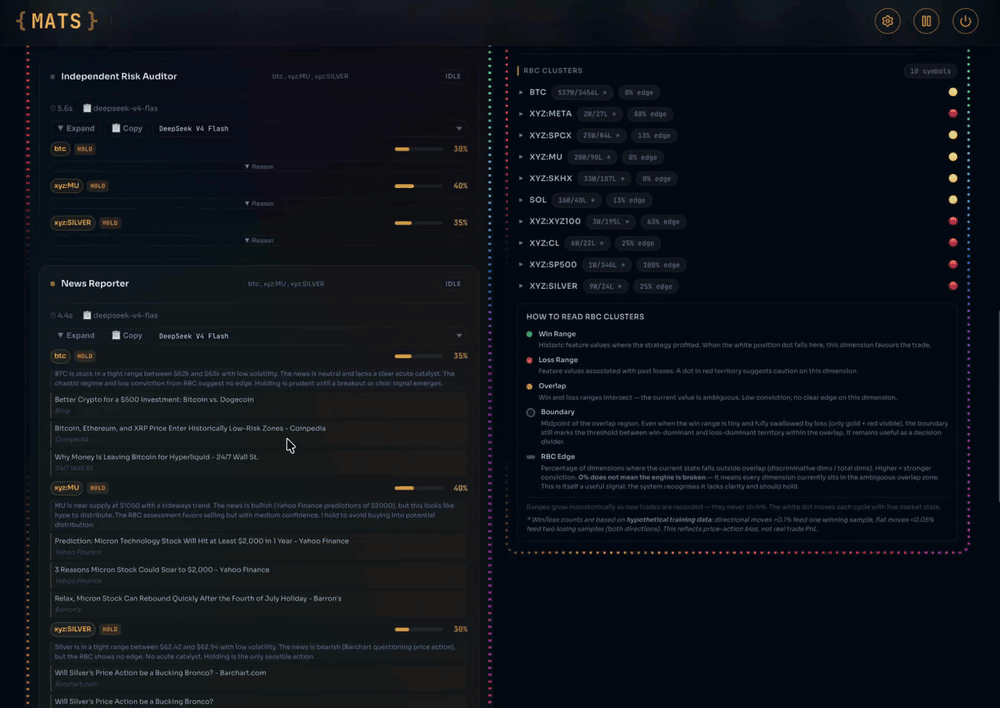

# MATS — The First Self-Evolving AI Trading Brain

**9 AI agents debate every trade. Skeptics stress-tests every thesis. System Engineer fixes its own bugs. A 42-layer cognitive brain learns from every outcome — why it won, why it lost, and how to win next time.**

The **industry-first self-evolving trading brain** — where an LLM **reads the charts** and statistics keep it honest. Highlights:

- 🧠 **LLM World-Model Layer** — the LLM is the *direction source*: reads K-LINE charts (1h×30 + 5m×60, dual-timeframe) + reasons from world events; a **Conviction Calibrator** turns self-reported confidence into a *quantifiable* signal — claim 0.85, get 0.85, only if history backs it.
- ⚡ **Q-RL Alpha Discovery** — *discovers* new alpha (not just measures it) via ε-greedy exploration + a skew-robust expectancy oracle wired straight into the gate.
- 🛡️ **Edge Validation** — an alpha lie detector that refuses to trade where no edge exists.
- 💰 **PAEL Exit-Price Learner** — learns each asset's real MFE/MAE profile (60-day window) → locks profit at the perfect moment. Your stop-loss is never touched.
- 🎯 **Smart SL/TP + MFE calibration** — leverage-aware floors so 10x positions don't get noise-stopped; TP from real price-extension data — stop giving profit back.
- 🔄 **Close-Context Learning** — learns *how* trades close (tight-SL loss ≠ bad entry), so every lesson is accurate.

**33 layers of cognition. Zero manual tuning. It evolves its own strategy — relentlessly.**

[](https://www.typescriptlang.org/)
[](LICENSE)
[](https://nodejs.org/)
[](https://github.com/wyc-dev/MATS)

🌐 [mats.trading](https://mats.trading/) · 💬 [Discord](https://discord.gg/mats) (coming soon) · ⭐ [Star on GitHub](https://github.com/wyc-dev/MATS)

---

## 📸 See It In Action

<a href="https://github.com/wyc-dev/MATS/blob/main/docs/dashboard.mp4" target="_blank" title="Click to play the full 16s demo">
  
</a>

*8-second loop. [Click for the full 16s demo video](https://github.com/wyc-dev/MATS/blob/main/docs/dashboard.mp4) — real-time HACP debate, Skeptics validation, weighted consensus, live TP/SL on TradingView, self-evolution metrics.*

---

## Quick Start (Ollama)

### Prerequisites
- Node.js 22+, npm
- [Ollama](https://ollama.com) running locally (or Pro plan for cloud models)

### 1. Install Ollama
```bash
# macOS: brew install ollama  |  Linux: curl -fsSL https://ollama.com/install.sh | sh
ollama serve
```
Most deployments use **cloud models** (via Ollama Pro) — no local model download needed. If you run fully local, pull a model:
```bash
ollama pull deepseek-v4-flash
```

### 2. Clone & Install
```bash
git clone https://github.com/wyc-dev/MATS.git
cd MATS && npm install
cd ui && npm install && cd ..
```

### 3. Configure Environment
```bash
cp .env.example .env
# Edit .env — key vars:
#   OLLAMA_BASE_URL=http://localhost:11434
#   OLLAMA_MODEL_DEFAULT=deepseek-v4-flash:0731-cloud
#   DECISION_INTERVAL_MS=300000   # 5-min cycles
#   API_PORT=3456
#   HYPERLIQUID_WALLET_ADDRESS=   # optional, for real trading
#   HYPERLIQUID_PRIVATE_KEY=      # optional, RADIOACTIVE — never commit
```

### 4. Launch

Pick the mode that fits your use case:

```bash
npm run engineer   # PRODUCTION — autonomous: System Engineer self-repair + auto-restart on code fix
npm run dev        # DEVELOPMENT — API :3456 + legacy UI :5173 (concurrently)
npm start          # SIMPLE — just the backend, no System Engineer
```
Dashboard: **http://localhost:5173/** · API: **http://localhost:3456/**

`npm run engineer` is the recommended production mode — every 2 cycles the System Engineer examines trade records + source code, detects learning-system bugs, and autonomously fixes them. Each fix is validated via `tsc --noEmit` + `npm test`; on failure it is auto-rolled-back, on success it is committed and the process restarts to load the new code.

---

## Why MATS is Different

- **🤖 Terminal Agent + Root Command Prompt** — users type natural language trading preferences (e.g., "only trade on Monday GMT"). LLM integrates them into a Root Command Prompt. Before each cycle, rules are checked — if a rule fails, the entire cycle is aborted (no token cost). After the Meta-Agent decides, the Terminal Agent verifies that the decision matches user preferences.
- **🧠 Entry Thesis System** — every trade needs a validated `[1h: ...] [1d: ...]` rationale. Meta-Agent generates it; Skeptics stress-test it.  No thesis → no trade.
- **🛡️ Skeptics veto** — an AI stress-tests every position's logic, data consistency, and dark-psychology (whale manipulation?) before execution. Approve-first: rejects only on concrete money-losing flaws. Dark-psychology check escalates from LIGHTWEIGHT to **MANDATORY** when |momentum| > 2% — must articulate a specific reversal catalyst or reject.
- **🧬 Cognitive Evolution Pipeline** — the system doesn't just learn win/loss counts. It learns **which market conditions** precede wins, **which regime patterns** precede stop-outs, **which historical cycles** are most relevant right now — through a **42-layer pipeline** (v2.0.869-P3): OLR → shadow trading → NA → AttnRes → anti-pattern → combo WR → Q-RL Alpha Discovery → Component Attribution → PAEL → LLM World-Model → LLM Direction Verifier → EV Filter → Close-Decision Calibrator → Profitability Analyzer → Entry Quality → MAE Pattern → MFE Lock → LLM Volatility Threshold Judge → Shadow Trade Upgrade. Dead components are actively pruned (v2.0.833/859 removed 6 zero-call-site modules).
- **🔬 Numeric Autoencoder** — a pure-TypeScript MLP (11→16→8 encoder + contrastive loss) learns a non-linear embedding of market conditions. "Similar market conditions" is no longer handcrafted min-max cosine — it's a learned representation where "similar" means "historically led to similar outcomes." Cold-start safe: min-max fallback until 200+ samples + validation pass.
- **🌀 AttnRes Cycle-History Retrieval** — transferred from Kimi K3's Attention Residuals (arXiv 2603.15031). The conditional win-rate candidate is no longer a single current snapshot — it's a **softmax-weighted blend over 80 cycles of history + entry-time state**, with a learned pseudo-query deciding which historical periods matter most right now. Entry-time regime retains persistent weight (K3 embedding persistence). Block AttnRes compresses 80 cycles → 8 blocks for O(Nd) memory.
- **⚔️ Dual Pseudo-Query Specialization** — two learned queries per symbol, inspired by K3's pre-attention vs pre-MLP layer specialization: **wDecision** (broad receptive field, trained on trade PnL) for conditional win-rate + thesis context; **wExecution** (sharp/recent-biased, trained on SL/TP stop-out outcomes) for SL/TP survival context.
- **🎯 Execution-Lens SL/TP** — `computeATRSLTP` uses the execution-mode AttnRes blend as the **PRIMARY** SL/TP signal. wExecution has learned which regime patterns precede stop-outs — when the current regime matches, SL widens automatically (up to 6%), with volatility scaling + entropy confidence damping. Falls back to ATR + raw momentum when wExecution is untrained (cold-start).
- **🚨 Anti-Pattern Memory** — failed trade lessons are clustered (cosine 0.78) into anti-pattern classes. When a new candidate matches a known failure cluster, Skeptics sees: "Anti-pattern #3 [78% match]: counter-momentum SELL stop-out — 6 losses, avg -7.2%." Repeating a known failure pattern is worse than a novel loss.
- **🔒 Conditional WR Soft Gate** — code-level conviction penalty: if the conditional win-rate (learned embedding + AttnRes blend) is < 20%, conviction is penalized +35%. This runs even if the LLM ignores the prompt — **the code enforces what the prompt suggests**.
- **🎯 Combo WR Gate** (v2.0.221) — tracks (symbol × side × regime) win rate with Wilson score lower bound. Injects PRE-thesis warning into Meta-Agent. WR<25% → +50% conviction penalty. Stacks with conditional WR + loss-streak gates.
- **🔢 OLR P(win) × Consensus Discount** (v2.0.224) — multiplicative confidence discount: `effectiveConfidence = consensus × (0.3 + 0.7 × P(win))`. P(win)=29% × 90% consensus = 45% → HOLD. Fixes the gap where overconfident agents bypassed the additive threshold raise. Cold-start safe (no OLR data → no discount).
- **🎯 Plan G Dynamic Threshold** (v2.0.227) — the conviction gate's threshold dynamically adjusts [45-55%] based on 5 objective performance factors (rolling WR, idle cycles, drawdown, rolling Sharpe, regime) with hysteresis. Penalties are **multiplicative** (not additive to threshold) with automatic idle-based decay over 30 cycles. Fixes the death spiral where additive penalties (+30%) stacked with P(win) discount to make trading mathematically impossible (44.5% vs 80%). 6 fairness guarantees: multi-factor balance, symmetric design, sample-size requirement, hysteresis, hard cap, fact-driven.
- **⭐ Edge Validation Layer** (v2.0.833) — the system's first **alpha "lie detector"**. For the first time, MATS can quantitatively answer "do we have edge?". A 5-component regime-weighted edgeScore (directionalEdge from shadow WR + learnedEdge from OLR + comboEdge from Wilson LB + pathEdge from First-Passage + realizedEdge from rolling WR×Sharpe) per (symbol × regime), with perturbation + cross-time stability gating. Risk-profile-conditional edge via MiniLM vector DB. Industry-standard backtest validation: Sharpe, Sortino, Calmar, Profit Factor, bootstrap p-value (Politis & Romano 1994), Deflated Sharpe Ratio (Bailey & López de Prado 2014), walk-forward IS/OOS split, Information Ratio vs buy-and-hold. Cold-start safe: zero trades → `caution` (never `skip` — the system must be able to trade to accumulate samples).
- **🧠 Direction-aware learning** — all learning systems filter by direction: SELL candidates only match SELL history, BUY only matches BUY. Per-direction win rates tracked everywhere. Counter-momentum trades require a specific named catalyst — "could reverse" is not enough.
- **🎯 Smart SL/TP + MFE calibration** (v2.0.852) — institutional SL/TP placement (S/R zones → 50-candle high/low → ATR floor) with a **leverage-aware SL floor** (a 10x position gets a wider minimum SL so normal volatility doesn't stop it out) and a **MFE calibrator** that derives the TP target/cap + SL floor from real 1h/5m candle price-extension distributions. Direction-aware for BUY vs SELL. This directly targets the "profit given back" failure — positions reaching +5% MFE then reversing to SL because TP was set too far.
- **🔒 closeReason integrity + close exit correctness** (v2.0.851-853) — TradeRecord.closeReason is populated end-to-end so close-context learning weights are accurate (a tight-SL loss is weighted 0.3×, not treated as a full market loss). The `closeTrade` dual-mode guard was fixed so position exits are never silently skipped in production (`ANALYSIS_MODE=dual`), and `closePosition` now uses the actual HL fill price rather than a stale WS tick so exit PnL + learning labels are correct.
- **⚡ HACP protocol** — Terminal Agent checks rules → 5 sub-agents think in parallel (staggered, 60s deadline race), Skeptics audits, Meta-Agent arbitrates, weighted voting consensus, Terminal Agent verifies. 120s hard timeout → HOLD.
- **💰 Capital preservation first** — every error path defaults to HOLD. SystemGuard (5 layers). Notional-based fees. SL/TP hard safety layers. Configurable max portion + drawdown + daily-loss limits.
- **⚙️ Trading Setup** — UI config panel for trade mode, cycle period (1-10m), position size, max portion, leverage, asset type, and market selection. Separate from Root Command Prompt (behavioral rules only).

---

## Architecture Overview

### How the System Fits Together

```text
┌──────────────────────────────────────────────────────────────────────────────┐
│                                                                              │
│                      MATS — MULTI-AGENT TRADING SYSTEM                       │
│               Strategic → Cognitive → Execution (closed loop)                │
│                                                                              │
├──────────────────────────────────────────────────────────────────────────────┤
│LAYER 1 · STRATEGIC                                                           │
│  ┌────────────────────────────────────────────────────────────────────────┐  │
│  │ Terminal Agent  ·  user prefs → rules                                  │  │
│  │ pre-cycle rule check + post-cycle decision verification                │  │
│  └────────────────────────────────────────────────────────────────────────┘  │
│      │                                                                       │
│      ▼  preferences / rules                                                  │
├──────────────────────────────────────────────────────────────────────────────┤
│LAYER 2 · COGNITIVE  (TypeScript + LLM)                                       │
│  ┌────────────────────────────────────────────────────────────────────────┐  │
│  │ HACP Protocol + Evolution Pipeline (self-evolving)                     │  │
│  │ • parallel multi-model inference                                       │  │
│  │ • 5 Sub-Agents → Skeptics → Meta-Agent                                 │  │
│  │ • entry thesis + dark psychology + weighted voting                     │  │
│  │ • Self-evolution (33 layers: OLR → NA → AttnRes → Q-RL → Attribution → │  │
│  │  LLM World-Model, v2.0.863)                                            │  │
│  │ • Numeric Autoencoder (learned market-condition embedding)             │  │
│  │ • AttnRes cycle-history retrieval (K3 dual pseudo-query)               │  │
│  │ • Anti-pattern memory (failure lesson clustering)                      │  │
│  │ • Conditional WR soft gate (code-level enforcement)                    │  │
│  │ • Combo WR gate (symbol×side×regime Wilson LB, v2.0.221)               │  │
│  │ • OLR P(win)×consensus discount (multiplicative, v2.0.224)             │  │
│  │ • Execution-lens SL/TP (stop-out-trained direct control)               │  │
│  │ • Replay buffer (PER mini-batch retrain, v2.0.219)                     │  │
│  │ • Close-Context Learning (closeReason+slNarrowed, v2.0.226)            │  │
│  │ • Plan G dynamic threshold (5-factor [45-55%] + penalty decay)         │  │
│  │ • Edge Validation (v2.0.833): edge-calculator + execution-tracker +    │  │
│  │ stability-monitor + backtest validation (Sharpe / DSR / walk-forward)  │  │
│  │ • Q-RL Alpha Discovery (v2.0.835): 270-cell Q-table + ε-greedy +       │  │
│  │ Wilson LB + BH-FDR + Factor-Tagged Aligned Shadow                      │  │
│  │ • Q-RL Direction Signal (v2.0.861): expectancy oracle + shadow A/B arm │  │
│  │ + shadow-pool priority eviction                                        │  │
│  │ • PAEL Exit-Price Learner (v2.0.862): MFE/MAE percentile → lock-profit │  │
│  │ • LLM World-Model Layer (v2.0.863): K-LINE 1h×30+5m×60 chart reading + │  │
│  │ data-reliability + chart-aware conviction + Candle Cache + LLM         │  │
│  │ Conviction Calibrator (self-reported confidence 5-bin calibrated)      │  │
│  │ • ANN Index (v2.0.843): IVF + spherical k-means — EXP vector memory    │  │
│  │ scales to 10k records at ~12% scan rate                                │  │
│  │ • Asset-Aware Meta-Learner (v2.0.843): symbol → category → global      │  │
│  │ hierarchy — each asset learns its own pattern                          │  │
│  │ • Component Attribution (v2.0.844-848): proxy credit assignment        │  │
│  │ • Smart SL/TP (v2.0.852): S/R → 50-candle → ATR floor, leverage-aware  │  │
│  │ SL floor, MFE-calibrated TP target/cap + SL floor                      │  │
│  │ • closeReason integrity + closeTrade dual-mode guard                   │  │
│  │ (v2.0.851-853): exit closes never silently skipped                     │  │
│  │ • Self-Aware Evolution (v2.0.843): Meta-Cognitive Calibrator +         │  │
│  │ Self-Improver + Causal Reasoner + Meta-Learner                         │  │
│  │ • RIL Reason Intelligence (pattern clustering + similar trade          │  │
│  │ retrieval + subtle diff LLM analysis)                                  │  │
│  │ • Trade Incident Panel (MAE/MFE + exitThesis + post-review)            │  │
│  ├────────────────────────────────────────────────────────────────────────┤  │
│  │ ▼  conviction + thesis  ·  Meta-Agent scores edge + sets SL/TP         │  │
│  └────────────────────────────────────────────────────────────────────────┘  │
│      │  execute                                                              │
│      ▼                                                                       │
├──────────────────────────────────────────────────────────────────────────────┤
│LAYER 3 · EXECUTION  (TypeScript Runtime)                                     │
│  ┌────────────────────────────────────────────────────────────────────────┐  │
│  │ Trading Manager → Risk Engine → Position Tracking · SL/TP              │  │
│  │ • Hyperliquid WebSocket + REST (9 perpetual DEXs)                      │  │
│  │ • Risk engine (millisecond, no LLM)                                    │  │
│  │ • Paper/Real trading with unified execute/close routing                │  │
│  │ • Position tracking & SL/TP · persistence · observability              │  │
│  └────────────────────────────────────────────────────────────────────────┘  │
│      │  fills + PnL (learn)                                                  │
│      ▼                                                                       │
│  ┌────────────────────────────────────────────────────────────────────────┐  │
│  │ Supabase → mats_app Client (theses persisted)                          │  │
│  └────────────────────────────────────────────────────────────────────────┘  │
└──────────────────────────────────────────────────────────────────────────────┘
```

**Data flow:** user prefs → Terminal Agent → HACP agents → evolution gates (weighted by statistical/learned/memory + edge validation + Q-RL expectancy + chart-aware conviction + LLM calibration) → Meta-Agent scores edge + sets SL/TP → 1×3 matrix (moderate profile, v2.0.857) written to Supabase → client (mats_app / mats_frontend) or backend in dual mode executes → fills/PnL feed back into memory → learning improves the next decision.

→ Full architecture in [ARCHITECTURE.md](ARCHITECTURE.md)

---

## System Components

### Agent System

| # | Agent | Role |
|:-:|:------|:-----|
| 0 | **Terminal Agent** | User natural language preferences → Root Command Prompt. Pre-cycle rule check (abort if rule fails) + post-cycle decision verification. |
| — | **Trading Setup** | UI config panel (not an LLM agent). Trade mode, cycle period, position size, leverage, asset type, market selection. |
| 1 | **Fractal Momentum Sentinel** | Multi-timeframe fractal breakout detection. Early trend acceleration signals. |
| 2 | **On-Chain Whisperer** | Category-aware on-chain analysis: crypto (mempool, flows, supply) + TradFi (DXY, COT, commodities). |
| 3 | **OLR & Sentiment Analyst** | OLR P(win) per side + First-Passage path-risk + Fear & Greed sentiment. RR-aware edge vs breakeven. |
| 4 | **News Reporter** | Institutional Narrative Decoder. 5-part framework: information-asymmetry, price-news timing, motive taxonomy, power-map, net institutional signal. |
| 5 | **Independent Risk Auditor** | Advisory-only (no veto). TP/SL/size suggestions + hard-coded loss-streak/choppy-market limits. |
| 6 | **Skeptics** | Logic auditor + thesis stress-tester. Approve-first; rejects only on concrete flaws. Validates entryThesis + re-validates held positions each cycle. |
| 7 | **Meta-Agent** | Arbitration chairman. Detective mode. Generates entryThesis. Uses Confidence Calibration Framework. Weight 0.00 (thesis system controls, not voting). |
| 8 | **System Engineer** | Autonomous code engineer. Every 2 cycles: audits trade records + source code, detects learning system bugs, auto-fixes with tsc+test safety net. Reads SystemEngineer.md + ARCHITECTURE.md + CHANGELOG.md. Can modify src/evolution/ + src/cognition/ + src/analysis/ + src/agents/ + tests/. Forbidden: src/trading/ + src/config/. Default DeepSeek V4 Flash 0731 (all agents unified since v2.0.850). |

> All agents have user-selectable model dropdowns in the UI.

### Decision-Layer Calibration(v2.0.868-P1P2 → v2.0.869-P4)

Beyond the 9-agent debate, MATS layers multiple decision calibrations — all soft (conviction multipliers, never hard blocks):

- **Entry Quality System**(v2.0.868-P1P2): P1 Confirmation Gate (3 signals: price position / momentum / noise — "bounce already started, not expected to bounce") + P2 Entry MAE Profile (rolling 30-day, conservative EV with Wilson LB) + Skew Analyzer (negative-skew trap detection avgLoss/avgWin > 1.49).
- **MAE Pattern**(v2.0.869): MAE/MFE ratio classification (good/neutral/bad entry) — reopen suppression ×0.5/0.85/1.0 — backtest-verified 55pp win-rate gap (bad 27% vs good 82%, n=131).
- **MFE Lock**(v2.0.869): lock-profit when MFE ≥ 1.5-2×ATR and retraced 30-50% — overrides Profit Guard (applies to thesis-invalidation closes too).
- **Macro Gate**(v2.0.869): time-weighted loss rate (τ=6h, per symbol×side) — ×0.45-0.85.
- **LLM Volatility Threshold Judge**(v2.0.869-P2): LLM world-model judges per-symbol volLow/volHigh — precious metals/indices no longer misclassified as low_volatility — statistical calibration (volLow < p25) — 5min candle analysis (24 recent OHLCV) — judgeBatch (multi-asset one-shot, token savings).
- **Shadow Trade Upgrade**(v2.0.869-P3): recentResults + exitReason + pnlPct + cap 100 — getRecentPerformance(100) bySide/byExitReason — learn which side/exit-reason has edge — Shadow keeps opening BUY+SELL every cycle (exploration).
- **Trade Record Reconciliation**(v2.0.869-P4): onFills close path now calls recordTrade — all close paths write to Supabase; recordTrade retry 3× exponential backoff; scripts/reconcile-trades.ts — local realTrades vs Supabase reconciliation, missing trades backfilled with full data including entryThesis/exitThesis.

### HACP Protocol

Each cycle (1-10 min, user-configurable): Terminal Agent checks rules → 5 sub-agents think in parallel (60s deadline) → Skeptics audits → Meta-Agent arbitrates with RIL reference data → Skeptics validates entryThesis → structured debate → weighted voting consensus → Terminal Agent verifies. 120s hard timeout → HOLD.

### Self-Evolution System

| Component | File | What it does |
|:----------|:-----|:-------------|
| **OLR** | `olr-engine.ts` | Per-symbol, per-side online logistic regression. Learns P(win) from shadow + paper + real outcomes. Source-weighted SGD, confidence penalty for low-sample models. |
| **Shadow Trading** | `shadow-trade-engine.ts` | Simulated LONG + SHORT every cycle with S/R-aligned SL/TP. Tracks TP-before-SL + MAE/MFE path-risk; feeds OLR. |
| **First-Passage** | `first-passage.ts` | Instant P(TP before SL) from volatility + drift + SL/TP distances (GBM). RR-aware vs breakeven. |
| **Numeric Autoencoder** | `numeric-autoencoder.ts` | Pure-TypeScript MLP learning a non-linear market-condition embedding. Contrastive + reconstruction loss with anti-collapse. Cold-start falls back to min-max cosine. |
| **AttnRes Cycle-History** | `cycle-history-retrieval.ts` | Kimi K3 attention-residual transfer: conditional WR = softmax blend over cycle history + entry state. Per-feature z-score + RMSNorm keys. |
| **Dual Pseudo-Query** | `cycle-history-retrieval.ts` | **wDecision** (PnL-trained, conditional WR) + **wExecution** (stop-out-trained, SL/TP survival). |
| **Execution-Lens SL/TP** | `analysis/atr.ts` | `computeATRSLTP` uses the wExecution blend as primary SL/TP signal, with volatility scaling + entropy damping. Falls back to ATR when untrained. |
| **Anti-Pattern Tracker** | `anti-pattern-tracker.ts` | Clusters failed-trade lessons (cosine 0.78). Skeptics sees "you've lost this way N times before." |
| **Conditional WR Gate** | `index.ts` | Code-level conviction penalty when learned conditional win-rate is low — enforces what the prompt suggests. |
| **Combo WR Gate** | `combo-win-rate-tracker.ts` | (symbol × side × regime) win rate with Wilson LB. Injects PRE-thesis warnings; soft-gate penalty. |
| **OLR P(win) × Consensus Discount** | `index.ts` | Multiplicative confidence discount: `consensus × (0.3 + 0.7 × P(win))`. Blocks overconfident agents. |
| **EM Cycle Chain** | `cycle-summary.ts` | Distills each cycle into an insight; previous insights feed next cycle. Dual-channel retrieval + tiered memory. |
| **GA + Pattern DB** | `sigmoid-ga.ts` + `trade-pattern-classifier.ts` | GA-evolved sentiment sigmoid + KNN pattern DB with Wilson-score confidence. |
| **EXP** | `thesis-experience.ts` | Vector thesis memory, direction-filtered. Stores market conditions + predictions + distilled lessons. |
| **Experience Digester** | `experience-digester.ts` | LLM distills each trade into a lesson (root cause + lesson + categories). |
| **Trade Audit** | `direction-audit.ts` | LLM audit of trade records every 2 cycles; known-fixed list prevents repeat diagnosis. |
| **System Engineer** | `system-engineer.ts` | Autonomous code engineer. Every 2 cycles: diagnoses + fixes learning bugs, validated by tsc+test, auto-rollback/commit. |
| **Replay Buffer** | `replay-buffer.ts` | Prioritized Experience Replay — mini-batch retrain to break temporal correlation. |
| **Close-Context Learning** | `index.ts` + `portfolio.ts` | `computeLearningWeight(closeReason, slNarrowed, isWin)` scales learning by how the trade closed (tight-SL ≠ bad entry). `exit_price_lock` (PAEL) closeReason weight 0.5. |
| **Plan G Dynamic Threshold** | `analysis/dynamic-threshold.ts` | Dynamic conviction threshold [45-55%] driven by 5 performance factors with multiplicative penalty decay — self-recovers, never deadlocks. |
| **Edge Validation** | `edge/*.ts` | Alpha "lie detector": 5-component regime-weighted edgeScore + stability + backtest validation (Sharpe/DSR/walk-forward). Cold-start `caution`, never `skip`. |
| **Q-RL Alpha Discovery** | `evolution/q-rl-table.ts` | First component that can *discover* new alpha — 270-cell Q-table with ε-greedy exploration, Wilson LB, bootstrap p-value, BH-FDR. Factor-Tagged Aligned Shadow. |
| **Q-RL Direction Signal** | `evolution/q-rl-table.ts` | Regime-conditioned expectancy oracle (median / 10% trimmed-mean / t-stat / Wilson, skew-robust) wired into the conviction gate; independent `qrl` shadow A/B arm; shadow-pool priority eviction (blind cold-start priors evicted for aligned/statistical/qrl arms). |
| **PAEL Exit-Price Learner** | `analysis/exit-price-learner.ts` | Per-asset × per-direction MFE/MAE percentile profiles (p50/p75/p90, 60-day window) from real-trade position-value extremes → deterministic TP-side ONE-VOTE lock-profit gate (MFE ≥ p75×0.8, trending → p90). **SL never touched** (owner directive). Size-agnostic: threshold + measured slippage bps. |
| **LLM World-Model Layer** | `analysis/kline-structure.ts` + `data-quality.ts` + `chart-conviction.ts` + `thesis-catalyst.ts` + `data/candle-cache.ts` | K-LINE structure reading (1h×30 + 5m×60, dual timeframe): EMA+consistency trend, HH/LL structure, 3-candle breakout, volume anomaly; data-reliability σ scoring (funding/volume/spread/staleness). CHART-AWARE conviction gate: opposite K-LINE ×0.75, 1h/5m divergence ×0.85, unreliable data ×0.85, catalyst can override ×1.0. Candle Cache shared pool (4-5 duplicate fetches → 1, rate-limit safe). |
| **LLM Conviction Calibrator** | `analysis/llm-conviction-calibrator.ts` | Constraint #1 — 5-bin historical calibration of LLM self-reported confidence — "LLM 0.85 but bin actual 40% → 40%" — kills overconfident entries; cold-start (<20 samples) neutral. Constraint #2 — K-LINE read-quality tracking (thesis claim vs statistical trend consistency) injected into Meta-Agent. |
| **ANN Index** | `evolution/ann-index.ts` | IVF + spherical k-means over 384-d embeddings — EXP memory scales to 10k records at ~12% scan rate. |
| **Asset-Aware Meta-Learner** | `evolution/meta-learner.ts` | 3-level feature-weight hierarchy (symbol → category → global) — each asset learns its own pattern; low volume ≠ unreliable. |
| **Component Attribution** | `evolution/component-attribution.ts` | Measures which component actually adds edge via proxy credit assignment + label cleanliness. |
| **Smart SL/TP + MFE** | `analysis/smart-sltp.ts` + `analysis/mfe-calibrator.ts` | Institutional SL/TP (S/R → 50-candle → ATR) with leverage-aware floor + MFE-derived TP targets, direction-aware. |
| **Self-Aware Evolution** | `evolution/meta-calibrator.ts` + `self-improver.ts` + `causal-reasoner.ts` + `meta-learner.ts` | Knows its own accuracy (Brier/ECE), auto-tunes hyperparameters (Thompson bandit), distinguishes causation from correlation (paired-shadow uplift). |


**Key design principles:**
- **Cold-start safe everywhere**: every learned path has a deterministic fallback (NA → min-max, AttnRes → current snapshot, anti-pattern → no block, wExecution → ATR). The system never degrades below baseline on first deploy.
- **Selectivity is EARNED**: zero-init pseudo-queries start as uniform/recency-weighted. The system must trade and observe outcomes to learn which historical patterns matter. No unearned assumptions.
- **Code enforces what prompt suggests**: the conditional WR soft gate runs at code level — even if the LLM completely ignores the DEEP LEARNING CONTEXT prompt, conviction is still penalized. Belt and suspenders.
- **Outcome-driven, not gradient-driven**: MATS has no backprop loop. All learning is from trade outcomes (win/loss + PnL + closeReason). The reward-weighted key direction update (Peters & Schaal 2008) is the correct rule for deterministic attention — REINFORCE is identically zero.
- **Close-context-aware learning (v2.0.226)**: How a position is closed is an important factor in the loss. `computeLearningWeight(closeReason, slNarrowed, isWin)` scales learning by close context: wins = 1.0, real SL hit = 1.0, tight-SL loss (SL narrowed post-entry) = 0.3, thesis invalidation = 0.3, manual close = 0.5, consensus close = 0.5. OLR `feedTrade` receives `slNarrowed` + `weightMultiplier` to scale gradient updates. Combo WR skips execution-caused losses (weight < 0.5). This prevents tight-SL losses from contaminating the learning systems with "these market conditions → loss" when the entry was actually fine.
- **Dynamic threshold with fairness (v2.0.227)**: The conviction gate threshold is dynamic [45-55%], driven by 5 objective performance factors (Rolling WR, Idle cycles, Drawdown, Rolling Sharpe, Regime) with hysteresis. Penalties are multiplicative (not additive to threshold) with idle-based decay over 30 cycles. 6 fairness guarantees ensure the calculation is fair: multi-factor balance (no single factor dominates), symmetric design (good = bad influence), sample-size requirement (≥10 trades), hysteresis (no boundary oscillation), hard cap (mathematical [45-55%] guarantee), fact-driven (all inputs are measured, settled outcomes — not predictions).
- **Edge validation as lie detector (v2.0.833)**: The Edge Validation layer is the system's first quantitative answer to "do we have edge?". It measures 5 independent evidence streams (shadow WR, OLR P(win), combo WR, first-passage, realized WR×Sharpe), blends them per-regime, and produces a recommendation (trade/caution/skip). `skip` forces the matrix cell to `hold` — the client never acts on a no-edge signal. Cold-start returns `caution` (never `skip`) so a brand-new system can bootstrap. Backtest validation uses industry-standard metrics (Sharpe, Sortino, Calmar, Profit Factor, bootstrap p-value, Deflated Sharpe Ratio, walk-forward, Information Ratio vs buy-and-hold). This is NOT an alpha generator — it is an alpha *measurer* that stops the system from trading where no edge exists.
- **Q-RL Alpha Discovery (v2.0.835)**: The first component that can DISCOVER new alpha — not just measure it. A 270-cell Q-table (5 regime × 3 vol × 3 momentum × 3 funding × 2 action) uses ε-greedy exploration to try actions the LLM wouldn't, learning from Aligned Shadow rewards. Discovery levels: Candidate (Q > 0.2%, n ≥ 10) → Probable (Q > 0.3%, Wilson LB > 50%, n ≥ 20) → Confirmed (Q > 0.5%, Wilson LB > 55%, BH-FDR pass, n ≥ 30). Confirmed discoveries inject into the Meta-Agent prompt with conviction +5%. Factor-Tagged Aligned Shadow follows LLM consensus direction with agent vote metadata — solving the OLR distribution-shift problem where blind shadow learns on ALL market conditions but real trades only execute on LLM-selected conditions. Blind shadow is downweighted 10× in OLR source weights. Cold-start safe: all Q=0 → follow LLM (identical to current behavior). No GPU, no backprop — pure TypeScript EWMA + Wilson score + stationary bootstrap.
- **ANN-indexed memory at 10k records (v2.0.843)**: EXP vector memory now scales to 10,000 records via a lightweight IVF (Inverted File) with spherical k-means — 10k records scan only ~12% of vectors per query at >95% recall@10, up from brute-force O(N). `EXP_MAX_RECORDS` lifted 1000 → 10,000. Cold-start (<500 records) falls back to exact brute-force, identical to prior behavior.
- **Asset-aware cross-transfer learning (v2.0.843)**: The Meta-Learner's feature weights follow a 3-level hierarchy — **symbol (finest) → category (transfer) → global (fallback)**. Each asset learns its own pattern independently, so SILVER's "OB imbalance works for me" isn't drowned out by BTC's different microstructure. Low volume ≠ unreliable — a thin-book asset has its own edge, and the weight is earned from its own data, not assumed from a volume tier. New assets bootstrap from their category's learned prior (transfer learning) then adapt.

→ Full evolution map in [NA.md](NA.md) · AttnRes design in [K.md](K.md) · Pipeline in [CHANGELOG.md](CHANGELOG.md)

### RIL — Reason Intelligence Layer

| Component | What it does |
|:----------|:-------------|
| **PatternClusterManager** | Greedy cosine clustering of entry rationale texts (MiniLM 384-d). Shows per-pattern win rate + PnL. Incrementally updated on every trade close. |
| **CloseReasonAggregator** | Groups closed trades by exit type (SL/TP, consensus, manual, thesis invalidation) × decision origin. Shows per-close-reason win rate + avg PnL. |
| **SimilarTradeRetriever** | Finds top-N most similar historical trades to a candidate thesis using cosine similarity on rationale vectors. **Direction-filtered** (v2.0.176) — SELL candidates only match SELL history. Injected before Skeptics validation. |
| **SubtleDiffAnalyzer** | 1 LLM call per cycle. Compares candidate trade vs similar historical winners/losers. Identifies subtle differences (volume, RSI, regime, S/R proximity). |
| **EXP checkThesisHistory** | Candidate thesis → extract rationales → embed → cosine similarity vs **same-direction** historical records → similarity-weighted P(win) → PASS/REJECT/REVERSE verdict. Dual-Channel Fusion with OLR + shadow win rate. Direction-filtered (v2.0.175). |
| **Experience Digester** | LLM digests each trade into a lesson statement → embed → cluster into lesson classes. Classifies candidates against winning/losing lesson classes using **per-direction winRate** (v2.0.176). |

### Trade Incident Panel

Replaces the old Positions table + Trade Records with a unified card-based view. Each trade (paper + real, open + closed) is a card showing:

- **Summary**: Symbol, side, status, PAPER/REAL tag, PnL
- **Entry/Exit Price**: With SL/TP levels
- **Min/Max Value Reached**: MAE/MFE — position value (margin + unrealized PnL) at its worst/best
- **Entry Thesis**: Meta-Agent's frozen rationale at open
- **Exit Thesis**: Close rationale (v2.0.225: SL/TP no longer narrowed post-entry — exit thesis records close reason only, no narrowing analysis)
- **Post-Review**: LLM auto-generated post-trade review analysing how more profit could have been made or less loss incurred

### Risk Management

| Parameter | Default | Description |
|:----------|:-------:|:------------|
| Max position | 20% | Single trade cap of equity (hard clamp) |
| Max drawdown | 20% | Halt all trading above this |
| Daily loss limit | 5% | No new trades rest of day |
| Max leverage | 10x | Market Agent sets per-asset; Meta-Agent tunes 1-10x |
| Stop loss | 2% | Per trade (un-leveraged) |
| Take profit | 5% | Per trade (un-leveraged) |
| Cumulative margin | 20% | All positions' margin ≤ 20% balance |

SL/TP set at entry via **Smart SL/TP** (`computeSmartSLTP`, v2.0.832): institutional priority chain — S/R zones → 50-candle high/low → ATR floor → config default. **Never modified post-entry** (v2.0.225: trailing stop + MFE giveback + TP narrowing + per-symbol consensus SL/TP all DISABLED — post-entry narrowing caused premature stop-outs + UI/exchange SL desync). **Leverage-aware SL floor** (v2.0.852): high-leverage positions get a wider minimum SL so normal volatility doesn't stop them out. **MFE calibration** (v2.0.852): TP target/cap + SL floor derived from real 1h/5m candle price-extension distributions, direction-aware for BUY vs SELL. **PAEL lock-profit** (v2.0.862): deterministic TP-side ONE-VOTE close at MFE ≥ p75×0.8 — **SL is never touched** (owner directive; the stop keeps its noise room). Three-layer exit protection: (1) initial SL/TP at exchange level, (2) LLM thesis invalidation (Skeptics Phase 0.5 force-close), (3) PAEL lock-profit close. Portfolio safety layer: no-widen + not-too-tight (SL ≥ 1%, TP ≥ 1.5%) + min-gap 2%. Original SL/TP recorded at open for exit-thesis analysis. `closePosition` uses the actual HL fill price (v2.0.853), not a stale WS tick, so exit PnL + learning labels are accurate.

**Multi-signal conviction gate** (v2.0.224-863): entry is gated by a multiplicative chain — `effectiveConfidence = calibratedConsensus × OLR P(win) blend × causal uplift × Q-RL expectancy × chart-aware multiplier × calibration trust`. LLM self-reported conviction is first calibrated by historical bin (Constraint #1); chart-aware multiplier penalizes K-LINE-opposite / data-unreliable entries; catalysts can override statistical dampening (LLM world-model is the direction source, stats calibrate).

---

## Configuration

```bash
# .env essentials (validated by Zod schema on startup)
OLLAMA_BASE_URL=http://localhost:11434
OLLAMA_MODEL_DEFAULT=deepseek-v4-flash:0731-cloud
# ═══ ANALYSIS MODE — signal backend vs full execution (v2.0.822+) ═══
# 'true'  — signal-only: write analysis matrix to Supabase, no orders
# 'dual'  — signal + execution: write matrix AND trade (paper/real) ← production default
# 'false' — execution-only legacy mode
ANALYSIS_MODE=dual
DECISION_INTERVAL_MS=300000          # 5-min cycles
API_PORT=3456
PAPER_INITIAL_BALANCE=1000
PAPER_MAX_POSITION_SIZE_PCT=0.20
PAPER_MAX_DRAWDOWN_PCT=0.20
RISK_STOP_LOSS_PCT=0.02
RISK_TAKE_PROFIT_PCT=0.05
HACP_CONSENSUS_THRESHOLD=0.60
HACP_TOTAL_TIMEOUT_MS=120000
# Active exploration (UCB) — PAUSED by default until Edge Report proves edge
ACTIVE_EXPLORATION_ENABLED=false
# Real trading (optional):
HYPERLIQUID_WALLET_ADDRESS=
HYPERLIQUID_PRIVATE_KEY=             # RADIOACTIVE — never commit
# RIL:
RIL_ENABLED=true
RIL_SIMILAR_TRADE_COUNT=5
RIL_SUBTLE_DIFF_ENABLED=true
# LLM World-Model Layer (v2.0.863):
KLINE_BLOCK_ENABLED=true        # K-LINE structure block (LLM chart reading)
DATA_QUALITY_BLOCK_ENABLED=true # data-reliability block (σ anomaly detection)
CHART_AWARE_CONVICTION=true     # chart-aware conviction (opposite/divergent/unreliable ×0.75-0.85)
LLM_CONVICTION_CALIBRATION=true # Constraint #1: LLM self-reported conviction 5-bin historical calibration
# PAEL (v2.0.862):
EXIT_PRICE_CLOSE_ENABLED=true   # MFE ≥ p75×0.8 lock-profit close (TP-side one-vote; SL never touched)
EXIT_PRICE_LOCK_MIN_HOLD_MIN=15
```

### Per-Symbol Direction Restrictions
Restrict a symbol to BUY-only or SELL-only via API or `data/evolution/market-agent-config.json`.

---

## Client Ecosystem (v2.0.822+)

MATS is a **signal-computation backend + multi-client execution** architecture:

| Client | Stack | Role |
|:-------|:-----|:-----|
| **mats_app** | Expo React Native (iOS/Android) | Primary mobile client — AuthGate passkey, SignalMatrix, PositionsPanel, AgentMonitor, paper-engine |
| **mats_frontend** | React + Vite | Web dashboard (formerly MATS_Frontend) — self-custody wallet, paper persistence, TradingView integration |

- **Analysis Matrix**: each cycle, the backend expands HACP consensus into a **1×3 matrix** (`{ moderate: Record<PositionState, MatrixCell> }` — v2.0.857 moderate-only; aggressive/conservative removed — uncalibrated placeholders were false sense of control) written to Supabase `asset_analyses`.
- The matrix is **per-asset + universal** (not per-user) — all users read the same moderate row; actual position sizing is controlled by the client's own sliders, not the matrix.
- **ANALYSIS_MODE**: `true` = signal-only (write DB, no orders) / `dual` = signal + execution (production default) / `false` = execution-only legacy.

## Tech Stack

| Category | Technology |
|:---------|:-----------|
| **Language** | TypeScript 5.6 (strict mode, zero type errors) |
| **Runtime** | Node.js 22+ |
| **LLM** | Ollama (local + Pro cloud) / OpenAI-compatible |
| **Market Data** | Hyperliquid WebSocket (l2Book + trades + userFills) + REST fallback |
| **Frontend** | mats_app (Expo React Native) + mats_frontend (React 18 + Vite + TradingView Chart) |
| **Config** | Zod schema validation |
| **Logging** | Winston (structured + file rotation) |
| **Testing** | vitest — **2,050+ tests / 86 suites** (gitignored; every version attack-hardened: NaN propagation, Chinese regex boundary, cache starvation, poisoned state, side guards, dual-mode, calibration shrinkage...) |
| **Crypto** | `@noble/curves` (HL phantom agent signing) |
| **Vector Embedding** | Transformers.js MiniLM L6 v2 (384-dim, in-process, CPU) |

---

## Changelog

See [CHANGELOG.md](CHANGELOG.md) for the full version history.

---

## Community

- 🌐 **Homepage**: [mats.trading](https://mats.trading/)
- 💬 **Discord**: [coming soon — star + watch to be notified](https://github.com/wyc-dev/MATS)
- 🤝 **Contributing**: PRs welcome! Fork → branch → PR. See [ARCHITECTURE.md](ARCHITECTURE.md) for the full system overview.

## Roadmap

- **Backtest visualization** — equity curve + trade markers in the dashboard UI
- **More exchanges** — Binance Futures, OKX, additional perp DEXs
- **Decision audit UI** — gate-by-gate HACP decision flow visualization
- **Multi-model ensemble** — per-agent model routing across Ollama / cloud providers

---

## Commercial Licensing

** MATS is open source under **Apache License 2.0**. Contact YC Wong for commercial licensing.

## License

[Apache License 2.0](LICENSE) · Copyright (c) 2026 YC Wong
