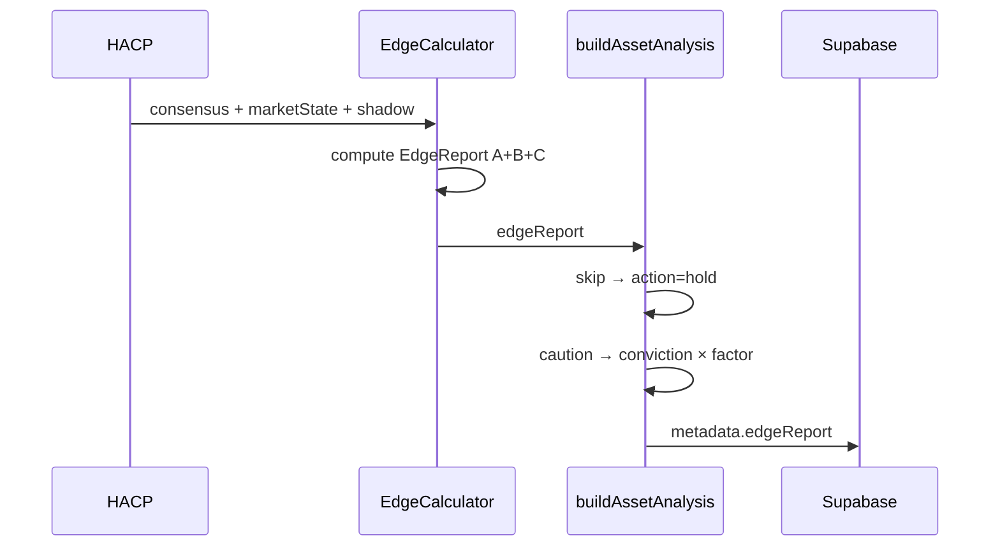
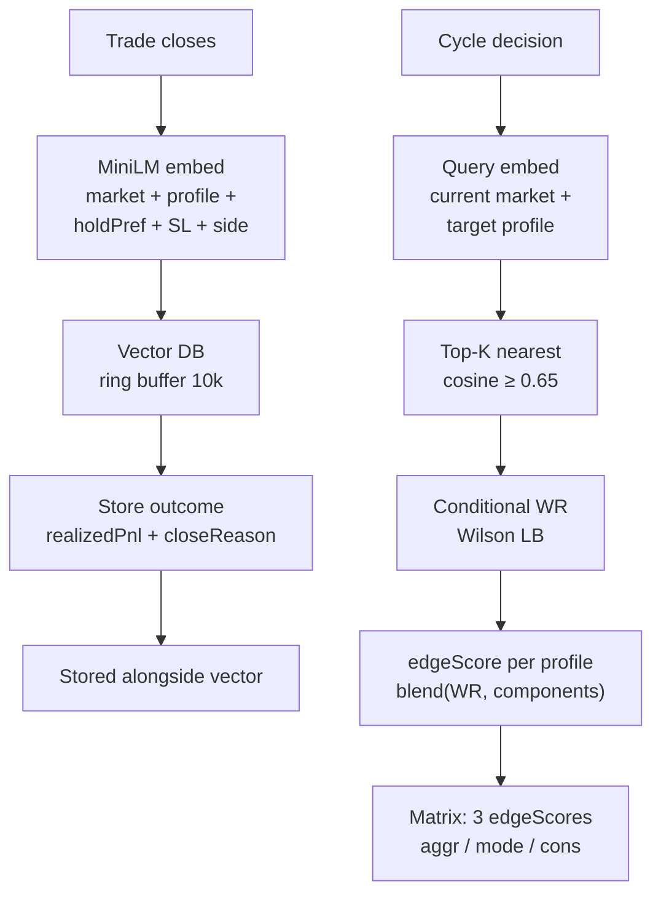

# MATS 升級計劃 — Edge 驗證 + 組件瘦身（修訂版）

> **作者**: GitHub Copilot · **日期**: 2026-07-30（修訂：同日）
> **範圍**: Task 1（Edge 驗證運算系統）+ Task 2（組件移除方案）
> **後續**: Task 3（Aggr/Cons/一般 區別化）+ Task 4（用戶數據學習模組）— 待討論後另文

---

## 0. 誠實修正聲明

第一版 plan 喺事實層面有兩處唔夠嚴謹，修訂：

1. **「0 個 call site」嘅精確含義**：4 個被建議移除嘅組件（world-model / reward-shaping / cross-symbol / temporal-attention）**有 training wired**（`feedAdvancedLearning()` line 4660-4730 持續 feed 佢哋），但 **inference 完全冇接入決策路徑**（`shape()` / `query()` / `retrieve()` / `predict/rollout()` 喺 `index.ts` 決策路徑 0 call site，只有 load/save/stats）。即係「喺度訓練但唔用 output」。呢個唔係設計無用，係 **wiring 未完成 / 半成品**。
2. **「增加盈利機會」嘅措辭過強**：Task 1 嘅 Edge 系統唔保證盈利——佢嘅作用係 **停止長期輸錢 + 令「有冇 edge」可量化**。如果系統本身冇 alpha，Edge 系統會誠實話你知「skip 呢個 asset」，而唔係製造盈利。盈利來自 alpha，Edge 系統係 alpha 嘅測謊機，唔係 alpha 嘅來源。

## 1. 前設：真相核對（基於實際 codebase grep，客觀證據）

| 事實 | 證據 |
|:-----|:-----|
| Backtest engine 已存在 | `src/backtest/index.ts` — 用 Binance OHLCV + 真 HACP/LLM，但 **用 proxy sentiment（candle-derived），非真實市場微結構數據** |
| 4 個進階系統 training wired 但 inference 斷線 | `feedAdvancedLearning()` (line 4660-4730) feed 4 個組件；但 `rewardShaper.shape()` / `crossSymbolBackbone.query()` / `temporalAttention.retrieve()` / `worldModel.predict/rollout()` 喺決策路徑 **0 call site**（僅 load/save/stats）。grep 確認。即係 burn CPU + disk 訓練模型，output 從未被讀取 |
| Replay buffer 係例外 | `replayEpoch()` line 9385 有週期性 call → 重新 feed OLR。係唯一 inference 真正接通嘅 v2.0.219 組件 |
| Aggr/Cons 係 placeholder | `analysis-matrix.ts` line 8-12 + 70-84：`calibrated: false`，action 同 moderate，conviction ×1.3/×0.7 |
| Plan G multiplier 只影響 backend 自執行 | `ANALYSIS_MODE=true` 下唔交易 → ×0.85/×1.15 **唔影響矩陣內容** |

---

# Task 1：即時「Edge 驗證 + 執行 + 穩定性」運算系統

## 1.1 設計目標（North Star，修訂：誠實定位）

```
🌍 ROOT INTENT: 每個 cycle 為每個 asset 計算一個「可信、可執行、穩定」嘅訊號，
                並能量化「我哋幾肯定有 edge」
🎯 SUCCESS: 30 日內可量化回答「呢個系統有冇 statistical edge」——
           純隨機 baseline vs MATS 訊號，PnL distribution 有顯著差異（p<0.05）。
           ⚠️ 誠實定位：若結果係「無顯著 edge」，Task 1 嘅成功 = 誠實揭露,
           唔係製造盈利。Edge 系統係 alpha 嘅測謊機，唔係 alpha 來源。
🚫 FAILURE: 再加更多 evolution layer / 再寫更多 heuristic gate / 自欺欺人
⏳ TIME BOUNDARY: 4 週內跑通第一版 edge report
🔒 NON-NEGOTIABLES: 不改 src/trading/（執行層）、不改 .env、不改 src/config/（風險設定）
```

### 點解「唔保證盈利」但要做

而家系統嘅狀態：**唔知自己有冇 edge**。23 層 evolution 不停學習，但冇人問過
「學完之後，實際 PnL 同 random entry 有冇分別？」。呢個盲點比冇 edge 更危險——
因為你會繼續投入資源去優化一個可能根本冇 alpha 嘅系統。

Task 1 嘅價值唔係「令你賺錢」，而係 **「令你知道值唔值得繼續」**：
- 有 edge → 值得繼續優化，Edge Report 指出邊個 (symbol × regime) 組合最有 alpha
- 冇 edge → 停止優化，換策略（例如轉做 market-making、改 time frame、換 model）
- 部分有 edge → 只保留有 edge 嘅組合，skip 其餘（少而精 > 多而散）

**呢個先係真正「提升盈利機會」嘅前提**——你唔可以優化你度唔到嘅嘢。

## 1.2 為乜而家冇「edge 驗證」

| 缺口 | 影響 |
|:-----|:-----|
| 無 random-baseline 對照 | 唔知 PnL 係 alpha 定係 beta 定係運氣 |
| 無 slippage/funding 真實成本計入 PnL label | OLR 學嘅係「理論 P(win)」，唔係「可實現 P(win)」 |
| 無 walk-forward 驗證 | OLR/AttnRes 用同一批 data 訓練 + 預測 = in-sample，過拟合風險高 |
| 無 regime-conditional edge breakdown | 唔知邊個 regime 有 edge、邊個 regime 冇 |
| 無 per-symbol edge threshold | 唔知邊個 asset 值得交易、邊個應該永久 skip |
| 無 stability metric | 唔知訊號係咪對 noise 敏感（改一條 candle 就 flip 決策 = 唔穩定） |

## 1.3 系統架構（修訂：加入計量金融標準驗證層）

```
┌──────────────────────────────────────────────────────────────────┐
│  Edge Validation & Execution & Stability Layer (新, src/edge/)    │
│                                                                  │
│  ┌─ A. Edge Calculator ──────────────────────────────────────┐   │
│  │  每 cycle 計算 per-asset edge score，唔係另一個 LLM gate   │   │
│  │  純數學，毫秒級，決定「呢個 asset 值唔值得入矩陣」          │   │
│  └────────────────────────────────────────────────────────────┘   │
│        ↓ edge score 進入 matrix metadata                          │
│  ┌─ B. Execution Quality Tracker ────────────────────────────┐   │
│  │  記錄真實成交：slippage / fill latency / funding cost      │   │
│  │  回饋 OLR PnL label，令佢學「可實現 P(win)」               │   │
│  └────────────────────────────────────────────────────────────┘   │
│        ↓ calibrated PnL label                                     │
│  ┌─ C. Stability Monitor ────────────────────────────────────┐   │
│  │  訊號穩定性：perturbation test + cross-time consistency    │   │
│  │ 唔穩定嘅訊號降權，唔入矩陣                                 │   │
│  └────────────────────────────────────────────────────────────┘   │
└──────────────────────────────────────────────────────────────────┘
        ↓ 三者結果寫入 asset_analyses.metadata.edgeReport
```

## 1.4 組件 A — Edge Calculator（`src/edge/edge-calculator.ts`）

### 輸入（已有，唔使新 data source）

| 輸入 | 來源 | 用途 |
|:-----|:-----|:-----|
| `combinedState.regime` | marketState | regime-conditional edge |
| `shadowEngine.getStats(sym)` | 已有 | **同 regime 下嘅 shadow WR = 純方向 edge 嘅 proxy** |
| `olrEngine.query(sym, feats, side)` | 已有 | 學習嘅 P(win)（但要校準，見 B） |
| `comboTracker.getComboBlock(sym, side, regime)` | 已有 | (symbol×side×regime) WR，Wilson LB |
| `tradeHistory.getRecent(100)` | 已有 | rolling 實際 WR + Sharpe |
| `firstPassage.calculateFirstPassage(...)` | 已有 | path-risk（P(TP before SL) from σ） |

### Edge Score 公式（純數學，5 component，每個 [0,1]）

```typescript
interface EdgeReport {
  symbol: string;
  edgeScore: number;        // 加權 [0,1]，>= 0.5 先值得入矩陣
  components: {
    directionalEdge: number; // shadow WR × regime match（純方向 alpha）
    learnedEdge: number;    // OLR P(win) 校準後（見 B）
    comboEdge: number;       // (sym×side×regime) Wilson LB
    pathEdge: number;        // First-Passage P(TP|SL distances)
    realizedEdge: number;   // rolling 實際 WR × Sharpe
  };
  confidence: 'high' | 'medium' | 'low';  // 樣本數決定
  recommendation: 'trade' | 'caution' | 'skip';
  regime: string;
}
```

**加權（regime-aware，初始化保守）**：

```
trending  : directionalEdge 0.35 + learnedEdge 0.20 + comboEdge 0.20 + pathEdge 0.10 + realizedEdge 0.15
mean_rev  : directionalEdge 0.20 + learnedEdge 0.25 + comboEdge 0.25 + pathEdge 0.15 + realizedEdge 0.15
chaotic   : directionalEdge 0.10 + learnedEdge 0.15 + comboEdge 0.15 + pathEdge 0.10 + realizedEdge 0.50
unknown   : 均勻 0.20 各
```

**confidence gate**：
- `high`：每個 component 嘅樣本都 ≥ 30 → edgeScore 直接用
- `medium`：部分 ≥ 10 → edgeScore × 0.8
- `low`：多數 < 10 → edgeScore × 0.5 + 0.25（拉向中性）

**recommendation**：
- `edgeScore ≥ 0.55 AND confidence ≠ low` → `trade`
- `0.45 ≤ edgeScore < 0.55` → `caution`（入矩陣但 conviction 降權）
- `edgeScore < 0.45` → `skip`（矩陣格 action 強制 hold，唔浪費 client 執行）

### 為乜用 shadow WR 做 directionalEdge

Shadow trade 係 **同 regime 下純方向賭注**——S/R-aligned SL/TP，冇 LLM bias，冇執行摩擦。佢嘅 WR = 「呢個 regime 下呢個方向有冇純 directional alpha」。如果 shadow WR ≤ 50%，OLR 學幾高都冇用，因為入場 label 本身冇 edge。呢個係而家 OLR 嘅盲點——佢學嘅 label 係 shadow outcome，但從來冇用 shadow WR 做 sanity check。

## 1.5 組件 B — Execution Quality Tracker（`src/edge/execution-tracker.ts`）

### 核心洞察

OLR 而家用 idealized PnL label（entry→SL/TP 觸發）。真實執行有摩擦：
- Slippage：signal price vs fill price
- Funding cost：hold 期間累積
- Rejection / partial fill

**呢個就係 Task 4（用戶數據）嘅基礎**——出咗 app 之後，用戶真實 fill 數據會校準呢個 tracker。而家先用 backend 自己嘅 real trade 數據（dual mode）做 v1。

### 設計

```typescript
interface ExecutionSample {
  symbol: string;
  signalPrice: number;     // HACP 決策時嘅 price
  fillPrice: number;       // 真實成交價
  slippageBps: number;     // (fill - signal) / signal × 10000，正數 = 入場貴咗
  fundingCostPct: number;  // hold 期間累積 funding
  holdMinutes: number;
  realizedPnlPct: number;  // 已扣 slippage + funding
  theoreticalPnlPct: number;// 未扣摩擦
}
```

### 校準 OLR label

```typescript
// 而家：OLR feedTrade(outcome = win/loss from theoretical PnL)
// 改：OLR feedTrade(outcome = win/loss from realized PnL)
// + 記錄 realization gap = theoretical - realized

function calibratePnlLabel(theoreticalPnlPct: number, symbol: string, side: string): number {
  const stats = executionTracker.getStats(symbol, side);
  if (stats.samples < 20) return theoreticalPnlPct; // cold-start 唔校準
  const expectedFriction = stats.avgSlippagePct + stats.avgFundingPctPerHour * (holdMinutes / 60);
  return theoreticalPnlPct - expectedFriction;
}
// 校準後 win/loss threshold 可能 flip：+0.3% theoretical → -0.1% realized = loss
```

### 為乜唔直接改 OLR

校準喺 **label layer**，唔係改 OLR 內部。OLR 學嘅 features → realized P(win) mapping，自然會反映「高 slippage 情況下 P(win) 更低」。呢個係正確嘅 Bayesian update，唔係 hack。

## 1.6 組件 C — Stability Monitor（`src/edge/stability-monitor.ts`）

### 兩個 metric

**1. Perturbation Test（決策對 noise 嘅敏感度）**

```typescript
// 對最近 N 個 cycle 嘅決策，微調 market features ±5%，睇決策 flip 唔 flip
function perturbationStability(symbol: string, recentDecisions: Decision[]): number {
  let flips = 0;
  for (const d of recentDecisions) {
    const perturbed = perturbFeatures(d.entryMarketFeatures, 0.05);
    const rerunAction = quickRecomputeAction(d, perturbed); // 唔跑 LLM，純 feature→action mapping
    if (rerunAction !== d.action) flips++;
  }
  return 1 - (flips / recentDecisions.length); // 1 = 完全穩定
}
```

**2. Cross-Time Consistency（同方向信號嘅持續性）**

```typescript
// 連續 N 個 cycle 同方向 = 穩定；頻繁 flip = 唔穩定
function crossTimeConsistency(symbol: string, recentSignals: Signal[]): number {
  const flips = countDirectionFlips(recentSignals);
  const maxFlips = recentSignals.length - 1;
  return maxFlips > 0 ? 1 - (flips / maxFlips) : 1;
}
```

**降權邏輯**：
- stability ≥ 0.8 → conviction 唔變
- 0.5–0.8 → conviction × 0.85
- < 0.5 → recommendation 降級（trade → caution，caution → skip）

### 為乜重要

CHANGELOG 顯示 SKHX 出現「buy→SL→buy→SL」loop——呢個就係唔穩定信號嘅典型。如果 stability monitor 早存在，會喺第二個 buy 之前降權。

## 1.7 整合點（minimal change）



**改動範圍**（尊重 non-negotiables）：
- 新增 `src/edge/` 三個文件（純計算，唔入 trading/config）
- `src/services/analysis-matrix.ts`：`buildAssetAnalysis()` 加 `edgeReport` 參數 → 寫入 `metadata`
- `src/index.ts`：cycle 末、`buildAssetAnalysis` 前，call `edgeCalculator.compute(...)`
- `src/evolution/olr-engine.ts`：`feedTrade()` 接受 `realizedPnl` 而非只用 `theoreticalPnl`（label 校準）
- **唔改** `src/trading/`、`src/config/`、`src/agents/`、`.env`

## 1.8 Edge Report 輸出（寫入 `asset_analyses.metadata`）

```json
{
  "edgeReport": {
    "edgeScore": 0.62,
    "components": {
      "directionalEdge": 0.58,
      "learnedEdge": 0.71,
      "comboEdge": 0.65,
      "pathEdge": 0.52,
      "realizedEdge": 0.61
    },
    "confidence": "medium",
    "recommendation": "trade",
    "stability": {
      "perturbation": 0.82,
      "crossTime": 0.75,
      "factor": 1.0
    },
    "executionGap": {
      "avgSlippageBps": 3.2,
      "avgFundingPctPerHour": 0.008,
      "samples": 47
    },
    "regime": "trending_bull",
    "computedAt": "2026-07-30T12:00:00Z"
  }
}
```

Client 可讀 `edgeReport.recommendation` 決定係咪顯示「⚠️ 低 edge」徽章。

### 1.8.1 Edge 系統會做齊嘅四件事（確認）

你問嘅四個缺口，Task 1 對應點解決：

| 缺口 | Task 1 點解決 | 交付於哪個 component | 時間軸 |
|:-----|:-------------|:--------------------|:--------|
| 1. 冇 random baseline 對照 | Backtest track 跑 random entry vs MATS 訊號，bootstrap p-value | `src/edge/backtest-validation.ts`（新） | Day 1-2 計算 |
| 2. 冇 buy-and-hold 對照 | 計 Information Ratio vs buy-and-hold（唔係淨係 random，係被動 baseline） | `src/edge/backtest-validation.ts`（新） | Day 1-2 計算 |
| 3. 冇 walk-forward | 70/30 in-sample/out-of-sample split，禁止同 batch 訓練+預測 | `src/edge/backtest-validation.ts`（新） | Day 1-2 計算 |
| 4. OLR PnL label 係理論值 | Execution Tracker B 校準 label：`realizedPnl = theoretical − slippage − funding` | `src/edge/execution-tracker.ts`（Task 1 B） | Day 1-2 live |

**四件事全部會做**。前三件集中喺新嘅 `backtest-validation.ts`（唔係改現有 `src/backtest/index.ts`，係新寫一個專門做 statistical validation 嘅 module），第四件係 Task 1 B Execution Tracker。

## 1.9 Sample size 限制解除方案（全部提升到 10000）

### 1.9.1 現狀：邊度 cap 緊你

| 組件 | 限制值 | 位置 | 影響 |
|:-----|:------|:-----|:-----|
| `trade-history.ts` | `maxEntries = 5000` | line 48 | rolling trade record 無法超過 5000 |
| EXP `trades.jsonl` | `EXP_MAX_RECORDS = 1000`（env default） | `config/index.ts` line 73 | thesis experience 只保留 1000 筆 |
| OLR `recentTrades` | `slice(-20)` | `olr-engine.ts` line 364 | agent 只見最近 20 筆 recentTrades |
| Shadow `recentResults` | `slice(-50)` | `shadow-trade-engine.ts` line 672 | shadow outcome 只保留 50 |
| `agent-outcomes.ts` | `maxRecords = 10_000` | line 14 | ✅ 已經係 10000 |
| `pattern-tag-tracker.ts` | `maxRecords = 500` | line 21 | pattern tag 只 500 |
| `replay-buffer.ts` | `capacity = 5000` | line 11 | PER buffer 5000 |
| `direction-audit.ts` | `slice(-20)` / `slice(-15)` | line 153/250 | audit 只睇最近 20 |
| `cycle-summary.ts` | `insightVectors.slice(-500)` | line 480 | EM insight 向量 500 |

### 1.9.2 解除方案（提升到 10000）

**改動原則**：只用 env var + config，唔 hardcoded。所有新 limit 走 Zod schema。

| 改動 | 文件 | 新值 | 方式 |
|:-----|:-----|:----|:-----|
| `maxEntries` | `src/evolution/trade-history.ts` line 48 | 10000 | 改成 `config.tradeHistory.maxEntries`，新增 env `TRADE_HISTORY_MAX_ENTRIES=10000` |
| `EXP_MAX_RECORDS` | `src/config/index.ts` line 73 + `.env` | 10000 | `.env` 改 `EXP_MAX_RECORDS=10000`（已係 env，淨係改值） |
| OLR `recentTrades` | `src/evolution/olr-engine.ts` line 364 | 100 | `slice(-20)` → `slice(-config.olr.recentTradesDisplay)`，新增 env `OLR_RECENT_TRADES_DISPLAY=100`（呢個係 agent 顯示用，唔係訓練 sample——訓練用 nSamples 已經無限） |
| Shadow `recentResults` | `src/evolution/shadow-trade-engine.ts` line 672 | 200 | `slice(-50)` → `slice(-config.shadow.recentResultsDisplay)`，新增 env `SHADOW_RECENT_RESULTS=200` |
| `pattern-tag-tracker.ts` | line 21 | 5000 | `maxRecords: 500` → `config.patternTag.maxRecords`，新增 env `PATTERN_TAG_MAX_RECORDS=5000` |
| `replay-buffer.ts` | line 11 | 10000 | `capacity = 5000` → `config.replayBuffer.capacity`，新增 env `REPLAY_BUFFER_CAPACITY=10000` |
| `direction-audit.ts` | line 153/250 | 100 | `slice(-20)` → `slice(-config.audit.recentForAudit)`，新增 env `AUDIT_RECENT_FOR_AUDIT=100` |
| `cycle-summary.ts` | line 480 | 5000 | `slice(-500)` → `slice(-config.em.insightVectorsCap)`，新增 env `EM_INSIGHT_VECTORS_CAP=5000` |

**唔改嘅**：
- `agent-outcomes.ts` 已經係 10000 ✅
- OLR `nSamples`（訓練 sample 數）本來就冇 cap——佢只受 `maxEntries`（trade-history）限制，提升 maxEntries 就自動提升
- `recentTrades`（line 995 `slice(-10)`）係 agent context 顯示用，唔係訓練上限。但都提升到 100 令 agent 見更多近期 trade

### 1.9.3 記憶體影響（誠實評估）

| 組件 | 現在 → 10000 | 記憶體影響 | 風險 |
|:-----|:-----------|:-----------|:-----|
| trade-history | 5000 → 10000 | ~1-2MB | 低 |
| EXP trades.jsonl | 1000 → 10000 | 文件從 ~1MB → ~10MB | 低，但 MiniLM embed 所有 record 會慢——需加 incremental embed |
| replay-buffer | 5000 → 10000 | ring buffer，~2MB | 低 |
| 其他 | 20-500 → 100-5000 | 微量 | 低 |

**唯一需要小心嘅**：EXP `trades.jsonl` 10000 record 做 MiniLM embedding（384-d 向量）。現有 `rebuildClasses()` 係同步 embed 所有 record——10000 record × ~50ms/embed = 500 秒。需要改成 **incremental embed**（新 record 加時 embed + 加入，唔 rebuild 全部）。呢個係必要嘅配套改動。

## 1.10 Risk-Profile-Conditional Edge（用 MiniLM 向量數據庫）

### 1.10.1 你嘅洞察係啱嘅

你話「根據用戶嘅風險選擇來判定 edge」——呢個係 deep insight。

而家 edge 係 **風險等級中性**嘅：一個 (symbol × regime) 嘅 edgeScore 對 Aggr / Cons / 一般 都係同一個數字。但呢個唔啱——**edge 係風險等級相關嘅**：

| 例子 | Aggressive | Conservative |
|:-----|:-----------|:------------|
| 高波動 regime，short-term mean revert signal | 持倉 5min，SL 1% — 可能 +2% MFE，edge 強 | 持倉 5min 太短，Cons 會 panic close → edge 弱 |
| 低波動 regime，trending signal | SL 太闊令 Cons 舒適但 Aggr 覺得悶 | Cons 細 SL 舒適，但 trend 可能未走完就 stop |
| Funding 極正嘅 asset | Aggr 容許短持過 funding，係 cost | Cons 想快平倉避 funding |

**同一個 market condition，唔同風險等級嘅「可實現 edge」唔同**。所以要做 **risk-profile-conditional edge**：`edgeScore(profile, symbol, regime)`。

### 1.10.2 點解要用 MiniLM 向量數據庫（唔係 rule-based）

如果用 rule-based：「Aggressive 就 SL ×1.5」——呢個係而家 placeholder 嘅做法，太粗糙。

真正嘅 risk-profile-conditional edge 需要搵出 **「呢個 market condition + 呢個風險偏好 → 歷史上類似組合嘅 realized WR」**。呢個係多維度相似度查詢：

```
Query vector = [
  marketFeatures (volatility, regime, srDistance, funding, obImbalance, momentum, ...),  // 市場狀態
  riskProfile (aggressive=1.0, moderate=0.5, conservative=0.0),                           // 用戶風險選擇
  holdTimePreference (Aggr 短, Cons 長),                                                  // 持倉時間傾向
  slTolerance (Aggr 闊, Cons 窄),                                                       // SL 容忍度
]
→ MiniLM embedding → 向量數據庫 → 最近鄰歷史 trade → 佢哋嘅 realized WR = conditional edge
```

呢個唔係 LLM，係 **向量相似度 + 歷史 outcome**——MiniLM 將「market condition + risk profile」encode 成向量，搵出歷史上最相似嘅 trade，睇佢哋贏定輸。呢個係 conditional WR 嘅推廣——而家 `computeVectorConditionalWinRate` 只用 market features，我哋加入 risk profile 維度。

### 1.10.3 架構設計：`src/edge/risk-profile-edge-store.ts`



### 1.10.4 向量構造

每個歷史 trade 存一個 384-d MiniLM 向量 + metadata：

```typescript
interface RiskProfileEdgeRecord {
  embedding: number[384];        // MiniLM embedding of combined text
  symbol: string;
  side: 'buy' | 'sell';
  riskProfile: RiskProfile;      // 用戶選擇嘅風險等級（或 backend account 嘅）
  regime: string;
  realizedPnlPct: number;        // 已扣 slippage + funding
  outcome: 0 | 1;
  closeReason: string;
  holdMinutes: number;
  slTolerancePct: number;       // 入場時 SL 闊度
  ts: number;
}
```

**Embedding input text**（MiniLM 嘅 input 係 text，所以將數值轉成結構化描述）：

```
Symbol: BTC, Category: crypto_major
Regime: trending_bull, Volatility: 0.0234, S/R distance: 150bps
Funding: 0.00012, OB imbalance: 0.15, Momentum short: 0.8, Momentum long: 0.6
Risk profile: aggressive, Hold preference: short, SL tolerance: 2.0%
Side: buy
```

**為九用 text 而唔係 raw vector**：MiniLM 係 sentence embedding model，訓練喺自然語言上。直接俾數字 vector 佢，效果唔好。結構化 text 描述俾 MiniLM 提取語義結構（例如「trending_bull + aggressive」同「trending_bull + moderate」嘅語義距離近，同「chaotic + conservative」嘅語義距離遠）。

### 1.10.5 查詢 + edge 計算

```typescript
function computeRiskProfileEdge(
  currentMarketFeatures: Record<string, number>,
  riskProfile: RiskProfile,
  symbol: string,
  side: 'buy' | 'sell'
): { edgeScore: number; confidence: 'high'|'medium'|'low'; samples: number } {
  const queryText = buildEdgeQueryText(currentMarketFeatures, riskProfile, symbol, side);
  const queryVec = await embedProvider.embed(queryText);
  const matches = vectorDB.search(queryVec, {
    topK: 50,
    minSimilarity: 0.65,
    filterSymbol: symbol,
    filterSide: side,
  });
  if (matches.length < 5) {
    return { edgeScore: 0.5, confidence: 'low', samples: matches.length }; // cold-start
  }
  const wins = matches.filter(m => m.outcome === 1).length;
  const wilsonLB = wilsonScore(wins, matches.length);
  // 加權：近嘅權重高（time decay）
  const weightedWR = softmaxWeightedWR(matches, halfLifeDays = 30);
  const edgeScore = 0.5 * wilsonLB + 0.5 * weightedWR; // [0, 1]
  const confidence = matches.length >= 30 ? 'high' : matches.length >= 10 ? 'medium' : 'low';
  return { edgeScore, confidence, samples: matches.length };
}
```

### 1.10.6 三個風險等級各自計 edge

每個 cycle，對每個 asset 計 **3 個 edgeScore**：

```typescript
for (const profile of ['aggressive', 'moderate', 'conservative']) {
  const edge = computeRiskProfileEdge(currentMarketFeatures, profile, symbol, side);
  matrix[profile][posState].edgeScore = edge.edgeScore;
  matrix[profile][posState].edgeConfidence = edge.confidence;
}
```

**矩陣變化**：`asset_analyses.matrix[profile][state]` 加 `edgeScore` + `edgeConfidence` 欄位。
Client 讀到對應自己風險等級嘅 edgeScore → 顯示「呢個訊號對你呢個風險偏好嘅 edge 係幾多」。

### 1.10.7 Cold-start 同維護

- **Cold-start**（< 5 matches）：edgeScore = 0.5（中性），confidence = low。唔 hard-block。
- **Incremental embed**：新 trade close 時 embed 一次 + append。唔 rebuild 全部。
- **Ring buffer**：最多 10000 record（同 §1.9 解除限制配合）。舊嘅自動淘汰。
- **Time decay**：30 日 half-life。舊 trade 權重低。
- **Wilson LB**：避免小 sample overreaction。
- **唔 hard-block**：risk-profile edge 只影響 `recommendation` 同 `conviction`，唔會令 action 變 hold（除非 `edgeScore < 0.45`，同 Task 1 A 一致）。

### 1.10.8 同 Task 1 A/B/C 嘅關係

- Task 1 A（Edge Calculator）計 **風險中性** edgeScore（而家嘅 5 component）
- **本節（1.10）係 Task 1 A 嘅風險條件化版本**——用同一個 `recommendation` 邏輯，但 edgeScore 變成 `edgeScore(profile)`
- Task 1 B（Execution Tracker）嘅 realizedPnl **直接餵入** risk-profile edge store（每筆 close 嘅 realizedPnlPct 就係 store 嘅 outcome label）
- Task 1 C（Stability Monitor）唔變——穩定性係風險中性嘅

**整合**：`edgeScore_final(profile) = 0.6 × edgeScore_neutral + 0.4 × edgeScore_profileSpecific`。等 risk-profile store 有足夠 sample（≥30）先提高 profileSpecific 嘅權重，cold-start 時主要靠 neutral。

## 1.11 驗證計劃（修訂：並行加速，唔係 sequential 6 週）

### 1.9.0 點解唔使 6 週——重新計 sample economics

你嘅 cycle 係 5 分鐘一次 = 一日 288 cycle。我之前 6 週 sequential 係設計錯誤
（每週做一個 component，其實可以並行）。真正嘅瓶頸唔係「等 data」，係
「statistical power 需要 sample size」——但呢個可以用 **歷史 backfill 數據**
同時跑，唔使純等。

| 驗證項目 | 需要幾多 sample | 你而家已有 | live 累積速度 | 實際所需時間 |
|:---|:---|:---|:---|:---|
| Edge Calculator 每 cycle 計分 | 0（即時計） | — | 288/日 | **即時** |
| Execution Tracker 校準 OLR | ~20 trade/symbol | dual mode 已有 real trades | 活躍 asset 5-15 trade/日 | **2-3 日**（live）|
| Stability Monitor perturbation | 最近 20-30 cycle 決策 | 歷史 cycle 已有 | 288/日 | **即時**（用歷史）|
| Sharpe ratio | ≥30 closed trades | `trades.jsonl` 191 records + backfill 186 candles | 視交易頻率 | **backtest 1-2 日計算** |
| Bootstrap p-value | ≥100 closed trades | 歷史數據夠 | — | **backtest 1-2 日計算** |
| Walk-forward (IS/OOS split) | 200+ trades | 歷史 6 個月 HL M5 + trades.jsonl | — | **backtest 1-2 日計算** |

**關鍵加速**：統計驗證唔使純等 live 交易累積。用 `src/backtest/` + 已有嘅
`data/exp/trades.jsonl` + 6 個月 HL 歷史 M5 candle 跑 walk-forward，1-2 日
計算時間就出 statistical report。Live Edge Calculator 同時即時運作。

### 1.9.1 用乜 metric（唔係自己作，用行業標準）

### 1.9.1 用乜 metric（唔係自己作，用行業標準）

| Metric | 點解 | 點計 | 來源 |
|:-------|:-----|:-----|:-----|
| **Sharpe Ratio** | 風險調整回報，行業標準 | mean(excess returns) / std(excess returns) × √(periods/yr) | Sharpe 1966 |
| **Sortino Ratio** | 只計下行風險（上行波動係好事） | mean(excess) / std(negative returns only) | Sortino 1994 |
| **Calmar Ratio** | 回報 / 最大回撤 | annualized return / max drawdown | Young 1991 |
| **Profit Factor** | 贏/輸比，要 > 1.5 先算有 edge | gross profit / gross loss | 行業標準 |
| **Maximum Drawdown** | 最大回撤，資本保存指標 | peak-to-trough decline | 行業標準 |
| **Expectancy** | 每筆交易期望值 | (winRate × avgWin) - (lossRate × avgLoss) | 行業標準 |
| **Bootstrap p-value** | 唔假設 normal distribution，用 resampling | 對 MATS returns 做 10000 次 bootstrap，同 random 對比 | Politis & Romano 1994 |
| **Deflated Sharpe Ratio (DSR)** | 修正 multiple-testing bias（你試咗多個 symbol/regime） | 調整 Sharpe 因應試驗次數 | Bailey & López de Prado 2014 |
| **Information Ratio vs buy-and-hold** | 對比被動 baseline（唔係 random） | (MATS return - B&H return) / tracking error | 行業標準 |

### 1.9.2 唔用乜（同埋點解）

| 唔用 | 原因 |
|:-----|:-----|
| 淨係睇 win rate | 60% WR 但 avg loss 3× avg win = 輸錢。WR 唔夠。 |
| 淨係睇總 PnL | 可能係 beta（跟大市升），唔係 alpha |
| 單一 p-value | Multiple testing：你試咗 10 個 symbol × 3 regime = 30 個 test，p<0.05 會有 ~1.5 個假陽性。要 DSR |
| 單一 time frame | 5 分鐘 cycle 嘅 edge 可能喺 1h 冇。要 walk-forward。 |

### 1.9.3 並行計劃（1 週內出第一版完整 Edge Report）

| 時間軸 | Live track（即時到 3 日） | Backtest track（並行，1-2 日計算） |
|:---|:---|:---|
| **Day 0-1** | Edge Calculator（A）整合 matrix metadata，log 可見 edgeScore | 跑 walk-forward backtest：70/30 split，用 6 個月 HL M5 + trades.jsonl |
| **Day 1-2** | Execution Tracker（B）+ OLR label 校準（dual mode real trades 即時校準） | 計量金融 metrics 計算（Sharpe/Sortino/Calmar/PF/Expectancy/MaxDD）每 (symbol×regime) |
| **Day 2-3** | Stability Monitor（C）+ 降權邏輯，stability < 0.5 自動降級 | Bootstrap p-value + DSR + Information Ratio vs buy-and-hold |
| **Day 3-5** | Live Edge Report 累積，對比 backtest 結果做 sanity check | 交叉驗證：live edgeScore trend vs backtest out-of-sample 表現一致？ |
| **Day 5-7** | **第一版完整 Edge Report**：backtest statistical proof + live 即時 edgeScore + 穩定性 | |

**兩條 track 並行**，唔係 sequential。Live 3 日內全部上線運作；
backtest 1-2 日計算出 statistical report。Day 5-7 結合兩者交叉驗證。

### 1.9.4 用戶數據進來之後點加速（接 Task 4）

等你 app 出咗，用戶交易數據進來之後：
- Execution Tracker 從 dual mode 20 trades/symbol → 1000+ users × N trades/symbol
  = **校準速度 ×100**
- 統計驗證從「6 個月 backtest 200 trades」→ 「一日 1000 users × 5 trades = 5000 trades」
  = **statistical power 即日達標**
- 唔需要再等 6 週——用戶數據係 statistical power 嘅乘數

但 **第一版唔使等用戶**——backtest 歷史數據 + dual mode live 已經夠出
第一版 Edge Report。用戶數據係後續加速，唔係前置條件。

### 1.9.4 Walk-forward 嘅重要性（比 random baseline 更重要）

```
┌──────────────────────────────────────────────┐
│  Random baseline 只證明「唔係純運氣」          │
│  Walk-forward 證明「學習冇過擬合」            │
│  Information Ratio vs B&H 證明「有 alpha 唔係 beta」 │
└──────────────────────────────────────────────┘
```

Walk-forward：用 70% 歷史數據訓練 OLR/AttnRes/Combo，再用 30% 嘅 **未見過**
數據測試。若 in-sample Sharpe = 2.0 但 out-of-sample = 0.3 → 過擬合，假 edge。
呢個係而家系統完全冇做嘅驗證——23 層 evolution 全部用同一批 data 訓練 + 預測。

### 1.9.5 三個 outcome 同對應行動

| Week 6 結果 | 行動 |
|:-----------|:-----|
| 有 edge（p<0.05, DSR 通過, out-of-sample Sharpe > 0.5, PF > 1.5） | 繼續優化。Edge Report 指出最有 alpha 嘅組合，集中資源。Task 3 用 Edge Report 定義 Aggr/Cons。 |
| 部分有 edge（某啲 symbol/regime 有，某啲冇） | 縮細交易範圍：只保留有 edge 組合，skip 其餘。矩陣對 skip 組合強制 hold。 |
| 冇 edge（全部唔顯著） | **停止優化呢個策略**。誠實評估：LLM + 5min cycle + perps 呢個組合可能根本冇 alpha。考慮：換 time frame（1h/4h）、換策略（market-making / arbitrage）、換 model（fine-tuned RL）。唔好再加 evolution layer。 |

---

# Task 2：組件移除方案

## 2.1 評估準則

每個組件用 3 條問題：

1. **有冱 wire 入決策路徑？**（唔係 load/save，係真係影響 action/conviction/threshold）
2. **提供嘅 signal 有冇被另一個組件重複？**（冗餘）
3. **維護成本 vs 信号價值？**（CHANGELOG bug 次數 + code 行數）

評分：
- 🟢 保留（核心，wire 入決策，唔重複）
- 🟡 降級（保留但唔再投入，等 data 驗證）
- 🔴 移除（無決策影響 / 重複 / 純維護負擔）

## 2.2 逐個組件評估

### 核心層 — 🟢 全部保留

| 組件 | 角色 | 決策影響 | 判斷 |
|:-----|:-----|:---------|:-----|
| `olr-engine.ts` | P(win) 主模型 | Plan G `pwinBlendFactor`、agent context | 🟢 保留，但 label 校準（Task 1B） |
| `shadow-trade-engine.ts` | 純方向 edge proxy | OLR label source、`directionalEdge`（Task 1A） | 🟢 保留，Task 1 嘅基礎 |
| `thesis-experience.ts` (EXP) | 語義 thesis 記憶 | EXP gate、direction-filtered pWin | 🟢 保留 |
| `combo-win-rate-tracker.ts` | (sym×side×regime) WR | Plan G `comboBlendFactor`、conviction penalty | 🟢 保留，Task 1A `comboEdge` |
| `first-passage.ts` | Path-risk P(TP\|SL) | Agent context、Task 1A `pathEdge` | 🟢 保留 |
| `cycle-history-retrieval.ts` (AttnRes) | 80-cycle 歷史 attention | Skeptics context、conditional WR soft gate | 🟢 保留，但**簡化**（見 2.3） |

### 中間層 — 🟡 降級（保留唔投入，等 Edge Report 驗證）

| 組件 | 問題 | 判斷 |
|:-----|:-----|:-----|
| `numeric-autoencoder.ts` (NA) | 11→8 MLP，自實現 Adam。`isReady()` 需 ≥200 samples + MSE<1.5。**玩具級 representation**——真正 deep representation 要 transformer/attention，唔係 3 層 MLP。同 `computeVectorConditionalWinRate` min-max cosine 重疊（NA ready 時取代 min-max，但 min-max 已夠用） | 🟡 降級：保留 cold-start fallback，**唔再投入改進**。等 Edge Report 證明 conditional WR 有 edge 先決定係咪值得保留 learned embedding。若 6 個月內 `isReady()` 仍唔穩定 → 移除 |
| `anti-pattern-tracker.ts` | 聚類失敗 lesson。僅 inject 做 warning，**never hard-block**。同 `combo-win-rate-tracker` 重疊（都係追蹤失敗 pattern） | 🟡 降級：合併入 combo tracker 嘅「losing combo」訊號。唔再獨立維護 LLM-digested lesson。 |
| `trade-pattern-classifier.ts` | KNN pattern DB，Wilson score。**同 combo WR + OLR 重疊**（都係條件 WR） | 🟡 降級：若 Edge Report 嘅 `comboEdge` + `learnedEdge` 已涵蓋 → 6 個月後移除 |
| `reason-analytics.ts` (RIL) | PatternCluster + SimilarTrade + SubtleDiff。**SubtleDiff 每 cycle 1 LLM call**——成本高，收益未驗證 | 🟡 降級：PatternCluster + SimilarTrade 保留（reference data），**SubtleDiff 暫停**（慳 LLM cost），等 Edge Report 驗證 RIL 有貢獻先重啟 |
| `cycle-summary.ts` (EM Cycle Chain) | Meta-Agent 蒸餾 CycleSummary，注入下 cycle。tiered memory hot/warm/cold。**同 AttnRes cycle-history 重疊**（都係 cycle 級歷史） | 🟡 降級：同 AttnRes 合併——AttnRes 已經做 cycle-history attention，EM 係 LLM 蒸餾版。保留一個就得。傾向保留 AttnRes（數學化、可驗證），EM 降為 optional context 補充 |

### 進階層 v2.0.219 — 🔴 雙軌處理（移除 OR 完成 wiring，唔係一刀切）

⚠️ **誠實修正**：呢層唔係「設計無用」。佢哋每個都有 sound 嘅 ML 理論基礎，
問題係 **wiring 只做咗一半**（training 接通，inference 未接）。
有兩條路：(a) 完成 inference wiring 令佢哋真係影響決策；(b) 移除。

我用 3 個準則決定走邊條路：
1. **inference 有冇明確嘅決策點**可以注入？（唔係強加，係問「呢個 output 應該去邊」）
2. **同現有組件嘅訊號重疊度**？（重疊高 → 移除，留功能強嘅嗰個）
3. **冷啟動時間同維護成本 vs 可驗證增量收益**？

---

#### `world-model.ts`（~372 行）— 🔴 移除

**原意**：Dreamer-style world model，學習 latent market dynamics，
用「latent imagination」rollout N 步預測未來，令系統可以「what-if」規劃——
即係「唔使真係落場，先喺腦中模擬呢個 entry 會點」。

**設計缺陷（非 wiring 問題）**：
- `addSample` 用 **close-time features 同時做 current 同 next state**
  （代碼 line 4725: `this.worldModel?.addSample(params.features, action, params.features, params.outcome)`）。
  呢個 transition model 學嘅係 **identity mapping**（current = next），
  即係學緊「下一個 state 等於呢個 state」——完全冇預測能力。代碼 comment
  自己都承認：「The transition model learns a degenerate (identity-ish) mapping」。
- 14→8 線性 encoder + tanh，冇 attention，冇 sequence modeling。
  真正嘅 world model（Dreamer V3）用 RSSM + transformer，呢個係玩具。
- `predict` / `rollout` 從未被調用 → 就算訓練好都冇人用。

**點解移除而唔完成 wiring**：
- inference 點係 `rollout() → predicted P(win)`，但 identity transition model
  嘅 rollout = 永遠預測同一個 state → P(win) 唔會變 → 等於冇用。
- 要令佢真係有用，要重新設計：分開 entry-time 同 close-time features、
  加 sequence model、加真正的 next-state target。呢個係 **一個新組件嘅工作量**，
  唔係「完成 wiring」。
- **優先級**：Task 1 Edge Report 先。若證明有 edge，再投資真 RL world model。
  喺冇 edge 驗證下投資 world model = 盲目。

---

#### `reward-shaping.ts`（~208 行）— 🔴 移除

**原意**：用 5-component risk-adjusted reward（PnL + drawdown + Sharpe +
hold-time + recovery）取代 binary `sign(pnl)`，令 AttnRes / temporal-attention
嘅 reward-weighted regression 學到更豐富嘅信號——唔係淨係「贏/輸」，而係「點樣贏、點樣輸」。

**設計缺陷**：
- `shape()` 從未被調用。AttnRes / temporal-attention 仍用 `sign(pnl)`
  （`updateOnOutcome(params.pnl)` 內部用 `sign`）。
- 即係 reward shaper 計算咗精緻嘅 5-component reward，但 **從來冇人讀取**。
- 同時 `feedAdvancedLearning` 嘅 `learningWeight`（v2.0.226 close-context）已經
  部分覆蓋咗 reward shaping 嘅意圖——「tight-SL loss 降權」就係 reward shaping 嘅一種。

**點解移除而唔完成 wiring**：
- 完成 wiring = 將 `sign(pnl)` 改成 `rewardShaper.shape(...).reward`。
  但 reward shaping 嘅 5 component 係 **手工設計 heuristic**（邊個 component
  權重幾多係作者拍心口），唔係 learned。真正嘅 reward shaping 應該係 RL
  嘅 reward function optimization（learned），唔係 hand-tuned。
- `learningWeight`（v2.0.226）已經做咗最關鍵嘅一部分（執行損失降權）。
  reward shaper 係重複但更複雜嘅版本，收益唔明顯。
- **移除風險低**：從未被讀取，移除唔影響任何行為。

---

#### `cross-symbol-backbone.ts`（~315 行）— 🔴 移除

**原意**：multi-task learning——`w_symbol = w_shared + δ_symbol`。
  共享 backbone 學「所有 symbol 共通嘅 market→outcome mapping」(transfer learning)，
  per-symbol residual 學「呢個 symbol 獨有嘅特徵」。新 symbol cold-start 時用 shared
  backbone 預測，唔使由零學起。

**設計缺陷**：
- `feedTrade()` 接通（line 4716），但 `query()` **從未被調用**。
  即係學咗 shared backbone 但冇人問佢預測。
- 同 per-symbol OLR 重疊：你已經有 per-symbol OLR model。cross-symbol 嘅價值
  在於 cold-start，但 OLR 已經有 cold-start backfill（186 candles）+ `backfillFromExpRecords`
  （191 records）。cold-start 問題已經被其他機制解決。

**點解移除而唔完成 wiring**：
- 完成 wiring = 喺 OLR query 路徑加 `crossSymbolBackbone.query()` 做 fallback / ensemble。
  但 OLR 已經有自己嘅 cold-start 機制。加多層 ensemble = 更複雜、更難調、
  更多 cold-start edge case。
- **簡單原則**：若 per-symbol OLR 夠用，唔好加 cross-symbol。等 Edge Report
  證明 cold-start 係實際問題先加。

---

#### `temporal-attention.ts`（~342 行）— 🔴 移除

**原意**：cross-trade regime learning——pseudo-query w attend **跨交易**
（唔係跨 cycle），學習「上一筆 BTC buy 喺 trending regime 贏 → 下一筆類似情況
  嘅 confidence 提升」。同 AttnRes cycle-history（跨 cycle）係 **唔同維度**
  ——cycle-history 係 macro 時間尺度，temporal-attention 係 micro（trade-to-trade）。

**設計缺陷**：
- `addTrade()` + `updateOnOutcome()` 接通（line 4707-4711），但 `retrieveBlend()`
  **從未被調用**。學咗 regime transition pattern 但冇注入決策。
- 50-trade ring buffer = 約一日交易量。要學 regime transition，50 筆太少。
- 同 AttnRes cycle-history 功能重疊：兩者都學「歷史 → 當前」嘅 attention。
  AttnRes 有 80-cycle history + 8-block 結構，更豐富。

**點解移除而唔完成 wiring**：
- 完成 wiring = 喺 HACP 注入 `temporalAttention.retrieveBlend()` 做 Skeptics context。
  但 AttnRes cycle-history 已經做緊類似嘅事（cycle 級）。兩個 attention 系統
  疊加 = 雙重計算 + 雙重 cold-start + 雙重 anti-collapse 維護。
- **簡單原則**：一個 attention 系統夠。保留 AttnRes（更成熟、更多 test coverage）。
  若 trade-to-trade 維度真係有獨立信號，Edge Report 會揭露（移除後 edgeScore 跌），
  到時再加返。

---

#### `active-exploration.ts` + `bayesian-olr.ts` — 🔴 暫停（唔移除）

**原意**：UCB exploration——系統主動探索 under-sampled symbol，
  鼓勵「試吓未試過嘅嘢」去收齊數據。Bayesian OLR 提供不確定性量化，
  UCB 用呢個不確定性計 exploration bonus。

**設計缺陷**：
- 有 wire（exploration thesis builder line 2284-2301 call `activeExploration.compute()`
  + `bayesianOLR.query()` 取 uncertainty）。
- 但 **盲目探索喺冇 edge 驗證下係危險嘅**——你唔知自己嘅 baseline 有冇 alpha，
  就去探索新 symbol = 可能擴大虧損面。
- 而且 UCB exploration 嘅前提係「你有一個 policy，想改善 data coverage」。
  而家連 policy 有冇 edge 都未確認。

**點解暫停而唔移除**：
- 代碼健全、有 wire、有理論基礎。一旦 Task 1 證明有 edge，
  exploration 可以幫你搵出新嘅 alpha source（under-sampled 但有潛力嘅 symbol）。
- config `enabled: false` 就好，唔刪代碼。
- **重啟條件**：Edge Report 證明 baseline 有 edge（out-of-sample Sharpe > 0.5），
  先重啟有目的嘅 exploration。

### 基礎層 — 🟢 保留

| 組件 | 判斷 |
|:-----|:-----|
| `embeddings.ts` (MiniLM singleton) | 🟢 保留 — EXP、AttnRes、PatternCluster 都用 |
| `evolution-utils.ts` (wilsonScore, safeNum, computeVectorConditionalWinRate) | 🟢 保留 — 全系統共用 |
| `persistence.ts` | 🟢 保留 — 原子寫盤 |
| `direction-audit.ts` | 🟢 保留 — LLM 審計有實際 gate（audit gate） |
| `system-engineer.ts` | 🟢 保留 — 但**限制 scope**（見 2.4） |
| `agent-evolution.ts` + `agent-outcomes.ts` | 🟢 保留 — agent 權重演化 |
| `trade-history.ts` | 🟢 保留 — rolling stats |
| `experience-digester.ts` | 🟢 保留 — A2A lesson extraction |
| `pattern-tag-tracker.ts` | 🟡 降級 — 僅 UI stats + backfill，唔入決策。可移除若 UI 唔依賴 |
| `em-clustering.ts` | 🟡 查證 — 若 cycle-summary 降級，em-clustering 跟隨 |

## 2.3 AttnRes 簡化建議

AttnRes 保留但建議簡化 dual pseudo-query：

- `wDecision`（PnL reward）→ 🟢 保留（decision 路徑用）
- `wExecution`（SL/TP stop-out reward）→ 🟡 暫停（execution lens SL/TP 注入 Skeptics，但 `src/analysis/atr.ts` 已被 v2.0.832 `computeSmartSLTP` 取代——execution lens 可能已經 dead path）。**需查證 `computeATRSLTP` call site 仲有冇用**

## 2.4 System Engineer 限制

System Engineer 自 v2.0.733-734 證明會破壞自己（加 hard block → revert → 再加）。建議：

- **保留** tsc + test safety net + git commit + restart loop
- **限制** scope：只可改 `src/evolution/`（已經係），但 **block list 加入**：
  - 不可改任何 conviction gate threshold（Plan G）
  - 不可加 hard block / veto（只能 soft penalty）
  - 不可改 `src/edge/`（Task 1 新組件）
  - 不可改 `src/services/`（matrix builder）
- **加入 Edge Report 反饋**：SE 每次跑之前，睇 Edge Report——若 `edgeScore` 下降，SE 嘅 fix 可能有害，暫停一輪

## 2.5 降級組件嘅驗證機制（A/B test，唔係拍心口）

### 2.5.1 驗證原則

唔係「我話佢重複就移除」。係用 **A/B test + Edge Report 對比**：

```
Baseline（而家 23 層全部開）跑 N cycle → Edge Report metrics
  ↓
移除/降級某組件 → 跑同樣 N cycle → Edge Report metrics
  ↓
對比：edgeScore / Sharpe / PF / out-of-sample 表現有冇跌？
  ↓
跌咗 → 恢復（組件有貢獻，之前嘅 wiring bug 修復咗）
唔跌 → 確認移除（組件真係冗餘）
```

### 2.5.2 逐個降級組件嘅驗證方法

#### NA（Numeric Autoencoder）— 驗證：embedding quality ablation

**驗證問題**：NA learned embedding 比 min-max cosine 更好嘅 conditional WR？

```
Group A（NA ready，用 learned embedding）→ computeVectorConditionalWinRate 用 NA
Group B（強制 NA isReady=false，用 min-max cosine）→ 同一個函數用 min-max
  ↓
對比兩組嘅 conditional WR 預測準確度：
  predicted WR vs actual WR 嘅 MAE（mean absolute error）
  ↓
若 Group A MAE < Group B MAE 超過 5pp → NA 有貢獻，保留
否則 → min-max 夠用，NA 降級（唔刪，停用 learned path）
```

**時機**：需要 ≥200 samples 先有 NA ready，預計 2-3 個月先夠 data。
所以 NA 嘅驗證唔急，等 data 累積。

---

#### anti-pattern-tracker — 驗證：併入 combo 後嘅信息量

**驗證問題**：anti-pattern 嘅 LLM-digested lesson 比 combo WR 嘅純統計多咗乜？

```
Combo WR 追蹤 (sym×side×regime) WR + Wilson LB → 純統計，有 confidence interval
Anti-pattern 追蹤 cosine 聚類嘅失敗 thesis + LLM lesson → 語義 + 統計
  ↓
驗證：搵 N 個 anti-pattern cluster，睇佢哋覆蓋嘅 trade 同 combo WR 嘅
  losing combo 有幾多重疊。
  ↓
若 >80% 重疊 → anti-pattern 冇提供 combo 之外嘅信息 → 合併
若 <50% 重疊 → anti-pattern 捕捉到 combo 捕捉唔到嘅失敗模式 → 保留獨立
```

**合併方式**（若決定合併）：唔係刪 anti-pattern，而係將佢嘅 `matchCandidate(thesis)`
結果 **作為 combo WR 嘅 supplemental signal**——combo WR block 加一行
「⚠️ anti-pattern match: N clusters, avg -X%」。一個數據結構，兩個 view。

---

#### trade-pattern-classifier — 驗證：同 OLR + combo 嘅重疊

**驗證問題**：KNN pattern DB 嘅 conditional WR 比 OLR + combo 提供多咗乜？

```
三個都計「given features → WR」：
  OLR：logistic regression（連續 features）
  Combo WR：(sym×side×regime) 離散 bucket
  Pattern classifier：KNN（feature space 鄰域）
  ↓
驗證：對同一批 trade，三個系統嘅預測 WR 計 Pearson correlation。
  ↓
若 pattern classifier 同 OLR r > 0.85 → 高度重疊，移除（留 OLR，更輕量）
若 r < 0.7 → 有獨特信息，保留
```

**時機**：需要足夠 trade 先計相關性。等 100+ trade。

---

#### SubtleDiff (RIL) — 驗證：LLM call 嘅 ROI

**驗證問題**：每 cycle 1 個 LLM call（成本 + 延遲）換嚟嘅 subtle diff 分析有内令決策更好？

```
呢個最難驗證，因為 LLM call 係黑盒。用代理 metric：
  1. SubtleDiff 開緊時 vs 暫停時，Meta-Agent entryThesis 嘅 "quality score"
     （用 isThesisPlaceholder rate + thesis length + specific-term count）
  2. SubtleDiff 注入後 vs 唔注入，Skeptics Phase 1.8 嘅 reject rate
  ↓
若 placeholder rate / reject rate 無顯著差異 → SubtleDiff 冇影響決策 → 暫停
若有差異 → 保留（但要量化 LLM cost vs 收益）
```

**即時行動**：config flag 暫停，唔刪代碼。等 Edge Report 有 baseline 先做 ablation。

---

#### EM cycle-summary — 驗證：同 AttnRes 嘅信息重疊

**驗證問題**：EM Cycle Chain（LLM 蒸餾嘅 CycleSummary）同 AttnRes cycle-history（數學 attention）有幾多重疊？

```
EM CycleSummary：Meta-Agent 每循環蒸餾結構化總結 → LLM 語義
AttnRes cycle-history：80-cycle rolling + 8-block attention → 數學
  ↓
呢個係 apples-to-oranges（LLM vs math）。唔可以直接計 correlation。
用功能重疊評估：
  兩者都注入 Skeptics context。若移除 EM，Skeptics 嘅 decision quality
  （用 reject rate + thesis validation accuracy 做 proxy）有冇跌？
  ↓
A/B test：EM 開 vs EM 暫停，各跑 N cycle，比較 Skeptics reject rate +
  最終 trade WR。
```

**初步判斷**：AttnRes 更可驗證（純數學，有 test coverage），EM 依賴 LLM 質素。
傾向保留 AttnRes 為主，EM 降為 optional。但 **唔刪，config flag 暫停**。

### 2.5.3 驗證唔係「完全專業」嘅地方（誠實聲明）

我嘅驗證機制有以下局限：

1. **A/B test 需要足夠 sample**：crypto 5min cycle，一日 ~288 cycle，
   但唔係每個 cycle 都交易。要有意義嘅 A/B test 可能要 2-4 週。
   呢個時間成本真實存在。
2. **LLM 非確定性**：HACP 用 LLM，同一 inputs 唔一定同一 output。
   A/B test 嘅 noise 部分來自 LLM 本身，唔完全係組件影響。
   緩解：temperature 0.3-0.45 固定 + 多次跑取平均。
3. **Market regime drift**：A/B test 期間市況可能變，
   Group A 嘅好表現可能係市況好唔係組件好。
   緩解：同時跑（唔係 sequential），或者用 walk-forward。
4. **「提升盈利機會」嘅措辭**：呢啲驗證提升嘅係 **「知道邊個組件有用」嘅能力**，
   唔直接提升盈利。盈利 = alpha × 執行 × 穩定性。驗證提升嘅係「唔浪費資源喺
   冇用嘅組件上」，令你可以集中資源喺有用嘅部分。間接幫助盈利。

**我唔會話「完全專業並能夠提升瘋狂盈利機會」——呢個係過度推銷。**
我話嘅係：呢個機制 **係行業標準做法（A/B test + ablation study）**，比
「拍心口移除」專業，比「全部保留」有效率，但唔保證盈利。

```
### 2.6 移除執行計劃（順序，每步可 rollback + A/B 驗證）

```
Phase 1（低風險，純 dead code — inference 從未被調用）
  ├─ 移除 world-model.ts + world-model.json
  │   理由：identity transition model + 0 inference call，移除零行為變化
  ├─ 移除 reward-shaping.ts + reward-shaper.json
  │   理由：shape() 0 call，從未被讀取
  ├─ 移除 cross-symbol-backbone.ts + cross-symbol.json
  │   理由：query() 0 call，cold-start 已被 OLR backfill 解決
  ├─ 移除 temporal-attention.ts + temporal-attention.json
  │   理由：retrieve() 0 call，AttnRes cycle-history 已覆蓋時間維度
  └─ 移除 index.ts 對應 import + constructor + load/save + feedAdvancedLearning 調用
     ↓ gate: tsc --noEmit + npm test 通過 + 跑 3 cycle 確認決策唔崩潰
     ↓ A/B: 對比移除前後 Edge Report edgeScore（預期無變化，因為 inference 本來就斷線）

Phase 2（中風險，config flag 暫停）
  ├─ active-exploration: config enabled=false（唔刪代碼）
  │   理由：盲目探索喺冇 edge 驗證下危險；重啟條件 = Edge Report 證明有 edge
  ├─ bayesian-olr: 若 active-exploration 暫停後無其他 call site → 刪除 + state file
  │   若有其他 call site → 保留
  ├─ SubtleDiff (RIL): config subtleDiffEnabled=false
  │   理由：每 cycle 1 LLM call，ROI 未驗證。等 Edge Report baseline 先做 ablation
  └─ EM cycle-summary: 保留 load 但 config flag 停止注入 Skeptics（降為 optional）
     ↓ gate: 跑 3 個 cycle，確認決策唔崩潰 + A/B Skeptics reject rate

Phase 3（需驗證，合併重複 — 等 100+ trade / 2-3 個月 data）
  ├─ anti-pattern-tracker → 驗證同 combo 重疊度（§2.5.2）→ 決定合併 or 保留
  ├─ trade-pattern-classifier → 驗證同 OLR 相關性（§2.5.2）→ 決定移除 or 保留
  └─ NA → 等 200 samples + isReady → ablation test（§2.5.2）→ 決定降級 or 保留
     ↓ gate: Edge Report 對比移除前後 out-of-sample Sharpe / PF
```

### 2.7 移除後嘅 evolution pipeline（簡化版）

```
Layer 1: OLR Engine（label 校準 by Execution Tracker）
Layer 2: Shadow Trade Engine（directionalEdge source）
Layer 3: EXP（thesis 語義記憶）
Layer 4: Experience Digester（A2A lesson）
Layer 5: Combo WR Tracker（sym×side×regime）
Layer 6: First-Passage（path-risk）
Layer 7: AttnRes Cycle-History（wDecision only）
Layer 8: Anti-Pattern（合併入 combo） 
Layer 9: RIL PatternCluster + SimilarTrade（SubtleDiff 暫停）
Layer 10: Edge Calculator（Task 1，新）
Layer 11: Execution Tracker（Task 1，新）
Layer 12: Stability Monitor（Task 1，新）
Layer 13: System Engineer（受限 scope）
```

**23 層 → 13 層**。移除嘅都係「wire 咗但唔影響決策」或「同另一個組件重複」。保留嘅每層都有明確決策影響。

## 2.8 風險與 rollback

| 風險 | 緩解 |
|:-----|:-----|
| 移除 world-model 後某隱蔽路徑依賴佢 | Phase 1 每步 tsc + test；跑 3 cycle 觀察 |
| AttnRes execution lens 原來仲用緊 | 移除前 grep `computeATRSLTP` call site 確認 |
| 用戶數據模組（Task 4）將來需要 reward shaping | 保留 git history，需要時 cherry-pick |
| SE 嘗試改 Task 1 新組件 | block list 更新（2.4） |

---

# 後續（Task 3 + 4，待討論）

- **Task 3**：Aggr / Cons / 一般 區別化——而家三者 action 一樣。用 Edge Report + 用戶真實 drawdown tolerance 定義三套唔同嘅 `recommendation` threshold + position sizing + SL/TP 闊度。
- **Task 4**：用戶交易數據學習模組——以 Execution Tracker（Task 1B）為基礎，加入用戶 fill 數據校準 slippage/funding model，再加 aggregate 用戶持倉做 sentiment signal。